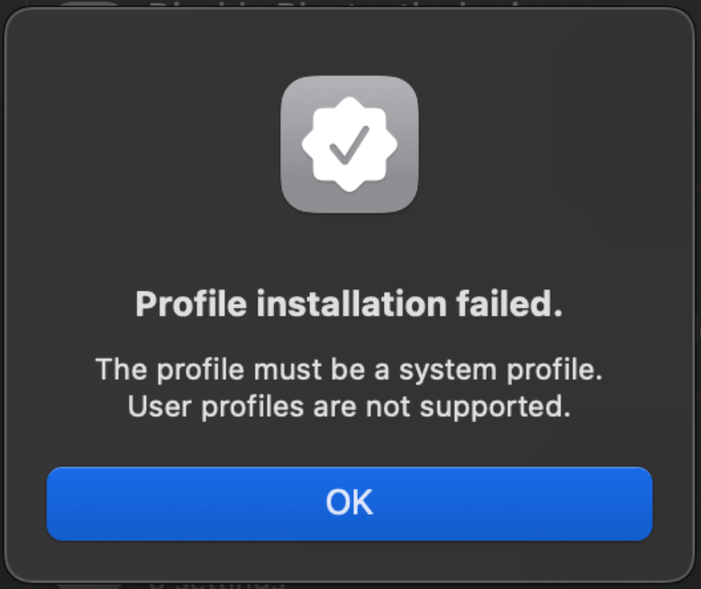

# Prevent tampering of Fleet agent and other login items

## Introduction

macOS Ventura saw a whole new suite of security tools and provided more visibility about what is actually running on your machine. The Login Items section in System Settings shows all programs that start on boot (including LaunchAgents and LaunchDaemons for both the user and the system). In previous versions of macOS, the Login Items list in the "Users & Groups" pane only showed programs that registered themselves to be displayed. This provided a security blindspot because most malware would not have exposed itself.

Since the release of Ventura, users can now manage Login Items, LaunchAgents and LaunchDaemons all from a single place in System Settings. Before this change, the only visibility into items that execute when the device starts up or the user logs in required finding hidden directories in the Finder, using the Terminal, or relying on 3rd party software. This has always been problematic, particularly with LaunchAgents, since any process can add a persistent item without authorization from or notification to the user.

Now in macOS, not only can users see which apps are set up for persistence, they can also control them from a single place in System Settings. Importantly, when apps add a LaunchAgent, LaunchDaemon, or Login Item, the system now displays a banner. 


## Login items in the enterprise

While transparency and openness to see what is running on your machine is a [key tenant of Fleet](https://fleetdm.com/handbook/company#openness), there is a valid use case to be able to manage these as an admin and prevent your users from being able to tamper with or disable certain applications and LaunchAgents. You don’t want your users to be able to disable security or other management tools deployed to your endpoints.

To properly manage these “Login Items”, admins need to use an MDM to deploy a profile with the new `com.apple.servicemanagement` payload. This profile cannot be manually installed and it must be deployed from an MDM to a device. 



## The anatomy of the payload

The payload is fairly easy to craft. It’s comprised of the object `ServiceManagementManagedLoginItems.Rule` which has 4 parts: 

- **Comment** - *string* - Description of the rule (Optional)
- **RuleType** - *string* - The type of comparison to make (Required) 
    - Possible Values: BundleIdentifier, BundleIdentifierPrefix, Label, LabelPrefix, TeamIdentifier
- **RuleValue** - *string* - The value to compare with each login item’s value, to determine if this rule is a match (Required) 
- **TeamIdentifier** - *string* - An additional constraint to limit the scope of the rule that the system tests after matching the RuleType and RuleValue (Optional)

Together, these values give you a plist file that looks something like this:

```
<key>Rules</key>
        <array>
            <dict>
                <key>RuleType</key>
                <string>BundleIdentifier</string>
                <key>RuleValue</key>
                <string>com.example.myapp</string>
                <key>Comment</key>
                <string>My Example App</string>
            </dict>
        </array>
```

Apple provides some extensive documentation in their [platform deployment guides](https://support.apple.com/en-euro/guide/deployment/depdca572563/web) about this topic. They also have a good primer on the [management of these](https://support.apple.com/en-euro/guide/deployment/dep07b92494/1/web/1.0) through MDM.


## Building for Fleet Login Items

To get started, we need to grab some information from a device about what we are looking to lock down. This is where `sudo sfltool dumpbtm` will come in handy. This tool prints the current status of login and background items, including loaded servicemanagement payload UUIDs.

On my device that is running Fleet, this is the example output:

```
UUID: 341C8C1E-1FA5-4788-A05B-D13560C2AEDD
Name: Fleet Device Management Inc
Developer Name: Fleet Device Management Inc
Type: developer (0x20)
Flags: [  ] (0)
Disposition: [disabled, allowed, visible, notified] (0xa)
Identifier: Fleet Device Management Inc
URL: (null)
Generation: 3
Embedded Item Identifiers:
    #1: 16.com.fleetdm.orbit
```

For this payload, we will use the RuleType of LabelPrefix with the RuleValue of `com.fleetdm.orbit`—that’s all you need!

```
<array>
	<dict>
	<key>Comment</key>
	<string>Profile to prevent Fleet agent from being disabled</string>
	<key>RuleType</key>
	<string>LabelPrefix</string>
	<key>RuleValue</key>
	<string>com.fleetdm.orbit</string>
	</dict>
</array>
```

We suggest using a profile builder such as iMazing to build these in order to easily include the other metadata that your MDM is looking for. You’re going to want to look for the payload type `Service Management - Managed Login Items`.

For a complete `.mobileconfig` example, check out [this repo.](https://github.com/harrisonravazzolo/Bluth-Company-GitOps/blob/main/lib/macos/configuration-profiles-traditional/managed-login-items.mobileconfig)

> Note that this profile can include many different entries for other Login Items and other rule types can be added to make a comprehensive array of items you want to target. 

Upload this .mobileconfig to your MDM and once it’s deployed to your endpoints, you will see something like such in the Login Items section of the System Settings:


And that’s it!

## Conclusion

macOS Ventura has introduced significant improvements in system security and transparency, giving users and administrators more visibility and control over Login Items, LaunchAgents, and LaunchDaemons. By leveraging the new Service Management payload through MDM, admins can now effectively prevent users from disabling critical management and security tools.

The ability to use specific rule types like LabelPrefix provides administrators with a granular approach to protecting essential system components. By deploying a carefully crafted .mobileconfig profile, admins can ensure that key applications like the Fleet Device Management agent remain active and cannot be tampered with by end-users. Other items that we recommend including in your payload are applications such as SentinelOne or other EDR tools, Nudge, Data Loss Prevention (DLP) agents, or remote management tools.

Want to know more about Fleet's comprehensive MDM platform? Visit fleetdm.com and use the 'Talk to an engineer' [link.](https://fleetdm.com/contact)

<meta name="articleTitle" value="Prevent Tampering of Fleet Agent and other Login Items">
<meta name="authorFullName" value="Harrison Ravazzolo">
<meta name="authorGitHubUsername" value="harrisonravazzolo">
<meta name="category" value="guides">
<meta name="publishedOn" value="2025-01-28">
<meta name="description" value="Learn how to build a mobileconfig to prevent users from tampering with Login Items.">
