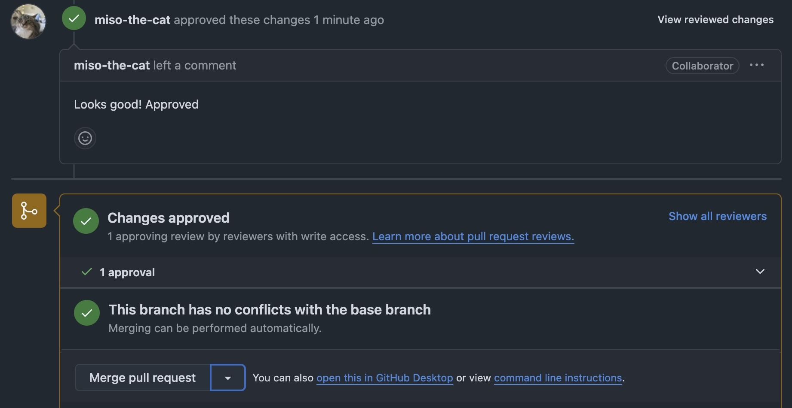
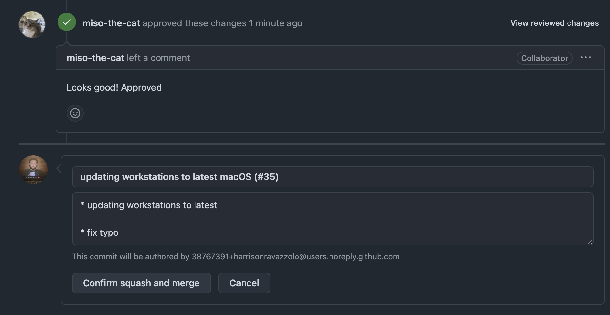

## Introduction

All SysAdmins have been there - it’s Friday afternoon and you make a few wrong clicks in your MDM and all the sudden, devices that were in that specific team that granted your users access to your internal network get a configuration profile revoked and just as you’re ready to sign off for the weekend, you start getting some Slack message and you realize your mistake 😳

It’s always a tough lesson to learn, but what if there was a way, through GitOps and change management best practices you could avoid all this? Typically a methodology reserved for your developers has arrived to your IT team. 

## What is “GitOps”?

GitOps is an operational framework that takes DevOps best practices used for application development such as version control, collaboration, compliance, and CI/CD, and applies them to infrastructure automation. Some key points include:

Declarative infrastructure defined in a repo, such as GitHub
A single source of truth for system state
Automated synchronization between git and live infrastructure
Continuous reconciliation to maintain desired state
Immutable infrastructure managed through pull requests and code reviews

The ultimate goal is to improve reliability, reduce error, and enable more consistent and auditable management of your device infrastructure.

## Getting Started 

Fleet publishes a starter template that we recommend checking out - available for both GitHub and GitLab. In this article we will be using GitHub but the general principles are the same. 

Clone the starter repo: https://github.com/fleetdm/fleet-gitops and create your own repo which you will push this code to. In a prod environment, I would recommend protecting the ‘main’ branch and only allow merging after a code review is conducted. It can be modified if needed, but by default the apply action will run whenever code is committed to main.

Another benefit of GitOps is the ability to store all your environment secrets in GitHub, obfuscated from view and with the correct configuration, prevents tampering and leaks.

Add FLEET_URL and FLEET_API_TOKEN secrets to your new repository's secrets. If you’re working out of the template, also add FLEET_GLOBAL_ENROLL_SECRET, FLEET_WORKSTATIONS_ENROLL_SECRET and FLEET_WORKSTATIONS_CANARY_ENROLL_SECRET.

This can be adjusted depending on how you want to leverage teams and team names.

## A Typical GitOps Workflow

We will start with a traditional workflow to demonstrate the process used to commit some changes to your Fleet instance. In this example we are adding a passcode policy for our Mac devices by setting the minimum length to 12 characters. 

For all examples in this article I will be using the GitHub Desktop app to do commits to demonstrate the ease, but using traditional git in the terminal will of course also work, whatever you’re most comfortable with.


We finish making our changes to the `passcode.json` file and add it to the Team we are applying this config to, under the macos_settings section.


GitHub Desktop will automatically pick up the changes that were made, at which point you can review each file and make the required commit comments. If all looks good, push your changes to the branch we are working on.


We create a PR to bring this change into the main production branch. In this example, branch protections are off so I can merge right to main but further on in the article this will change. 

## GitOps: The way it was meant to be

One of the main benefits of a GitOps approach is the ability for members of a team to review changes before they are applied in production. This encourages collaboration while ensuring all modifications to a state are following best practices and compliance. In addition, if something breaks, which of course is inevitable, you have a ‘snapshot’ or point in time which you can easily roll back the changes to a known working state.


The newest version of macOS is released and an engineer on your team wants to push a change to require an update of all hosts in the Workstations team. She creates a branch to work from and makes the changes, new target version and deadline.

```
macos_updates:
    deadline: "2025-02-15"
    minimum_version: "15.4.1"
```

As we can see, merging is blocked until a member of the team reviews and approves the changes before a merge to prod. 


Our IT manager is listed as the approver for these changes and they are notified of a pending PR for review. Except, it seems like there might be a problem with some of the changes? Our engineer accidentally put in the wrong version, which would cause a fair bit of issues for our users when trying to update to a version that isn’t yet available.

We tag the engineer with some feedback and request the changes to be made and re-commited. 




After our engineer has updated the code from the review, our manager can do a final review, approve and let the engineer merge this branch into main to trigger the apply workflow that will bring the changes into the prod environment.




<meta name="articleTitle" value="Creating Windows configuration profiles (CSPs)">
<meta name="authorFullName" value="Harrison Ravazzolo">
<meta name="authorGitHubUsername" value="harrisonravazzolo">
<meta name="category" value="guides">
<meta name="publishedOn" value="2024-12-12">
<meta name="description" value="Learn how to deploy Windows configuration profiles (CSPs) with Fleet">
