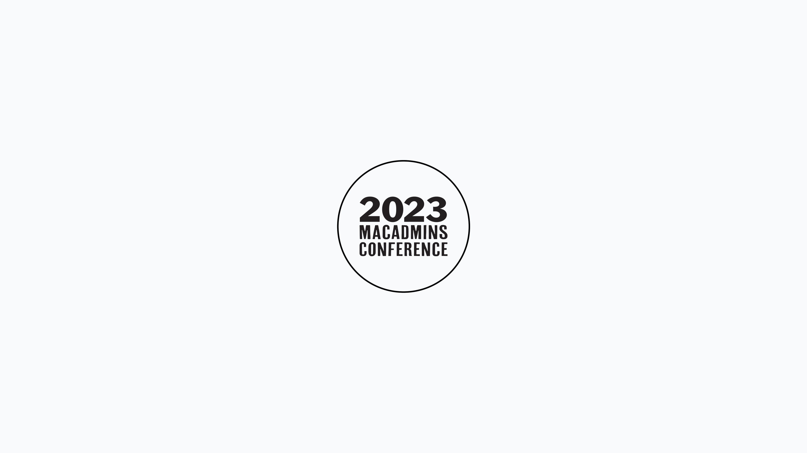

# Mac admins summer camp ⛺ at PSU MacAdmins Conference 2023 

Hello there, macOS admins! Let's talk about the upcoming PSU MacAdmins Conference 2023 (aka Summer Camp for Mac Admins). PSUMAC is July 18-21 at Penn State University. Hope to see you there. 

## What's on the agenda?

PSU MacAdmins is not your typical conference. There are loads of technical sessions diving deep into various aspects of macOS administration. You can get your hands dirty with topics like: 

* system security—(think password management) 
* file encryption
* network security
* macOS deployment
* configuration management
* software delivery

And that's not all. There are sessions on managing macOS systems better, where you can learn about user management, group policies, and troubleshooting. Plus, there's plenty of opportunity to explore the latest macOS tools and technologies—ever wanted to get the scoop on Device Management, Munki, or macOS Deployment? Well, now's your chance!

One unique aspect I'm personally excited about is the _Hallway Track_. The hallway track, aka seeing fellow Mac Admins in passing between sessions 🤣, at meals, and at evening events, is a fantastic opportunity to interact with colleagues from different industries and skill levels. What better way to learn than through conversation and shared experiences, right?

And it's not all work and no play. One of the dinners will be on Penn State's Building Business Meadow. I hear there will be various lawn games to play, but no lawn darts 🎯. Penn State's beautiful Arboretum is just across the street and will be open until dusk. Also, don't forget to stop by the [Berkey Creamery](https://creamery.psu.edu/) for a generous scoop of the highest butterfat ice cream 🍨 you will find (and, yes, you can have ice cream shipped home).  

## Presenter highlight

I'm excited to say that I'll be sharing some of my experiences at Fleet and beyond in a session on Thursday, July 20, at 9:00 am. My talk, "[Cross-platform open-source monitoring and reporting](https://sched.co/1MmXv)", will focus on how combining Fleet and osquery can provide real-time data from endpoints and proactively trigger support tickets or notifications when a computer encounters issues. It's a topic close to my heart, and I'm eager to share what I've learned.

Another must-see is Greg Neagle's talk at 10:45 am the same day, titled "[The Past, Present, and Future of Munki](https://sched.co/1OIYF)." If you don't know, Greg manages macOS devices at Walt Disney Animation Studios and is the primary developer of Munki. He'll be sharing some fantastic insights into Munki's development journey, its current standing, and where it's headed next. I'm told there'll even be an opportunity for attendees to contribute to Munki's future, so make sure not to miss it!

## Come say hi to Fleet (and get some cool swag)

Here at Fleet, we're super excited to be sponsoring this conference. Supporting the MacAdmin community is what we're all about. Not only are we sponsoring the conference, but we're also backing Greg's presentation. Don't forget to swing by our booth—we've got some fun stickers and swag you might like!

In a nutshell, the [PSU MacAdmins Conference 2023](https://macadmins.psu.edu/) is shaping up to be an event packed with valuable insights and networking opportunities. I'm excited to see all of you there, and here's to learning and growing together in our macOS admin journey!

<meta name="category" value="announcements">
<meta name="authorGitHubUsername" value="spokanemac">
<meta name="authorFullName" value="JD Strong">
<meta name="publishedOn" value="2023-07-13">
<meta name="articleTitle" value="Mac admins summer camp ⛺ at PSU MacAdmins Conference 2023">
<meta name="articleImageUrl" value="../website/assets/images/articles/psu-macadmins-conference-2023-1600x900@2x.png">
<meta name="description" value="A look ahead to PSU MacAdmin Conference July 18-21, 2023">