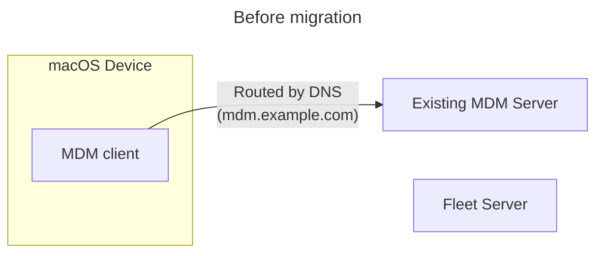
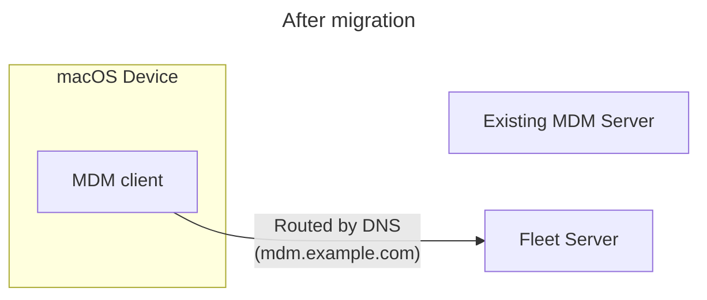

# Seamless MDM migrations to Fleet

Typical MDM migrations on macOS require end-user interaction and result in a window of time in which the device is unmanaged. This has consequences from users being kicked off wifi due to certificate profile removal, compliance issues with unmanaged devices, and incomplete migrations. These concerns leave some organizations stuck on outdated MDM solutions that are no longer meeting their needs. There is a better way.

For customers with eligible MDM deployments, migration to Fleet is possible with no gap in management and without involving the end-user.

## Requirements

Note: Deployments that do not meet these seamless migration requirements can still migrate with the [standard MDM migration process](https://fleetdm.com/docs/using-fleet/mdm-migration-guide).

* Customer controls the DNS used in the MDM server enrollment (eg. devices are enrolled to `*.customerowneddomain.com`, not `*.mdmvendor.com`).
* Customer has access to the Apple Push Notification Service (APNS) certificate/key and SCEP certificate/key, or access to the MDM server database to extract these values.

These requirements are easily met in self-hosted open-source MDM solutions, and may be met with commercial solutions when the customer is self-hosting or otherwise controls the DNS.

Seamless migration may still be possible with control of DNS along with a copy of the original Certificate Signing Request (CSR) for the APNS certificate. If you are in this situation, please reach out to the Fleet team.

### Why?

Apple allows changing most values in profiles delivered by MDM, but the `ServerURL`, `CheckinURL`, and `PushTopic` cannot be changed without re-enrollment (and user actions). Control of DNS and the certificates allows the MDM to be swapped out without changing these.

## High-level process

1. Configure Fleet with the APNS & SCEP certificates/keys, path redirects, and SCEP renewal.
2. Import database records letting Fleet know about the devices to be migrated.
3. Configure controls (profiles, updates, etc.) in Fleet.
4. Install fleetd on the devices (through the existing MDM).
5. Update DNS records to point devices to the Fleet server.

It is recommended to follow the entire process on a staging/test MDM instance and devices, then repeat for the production instance and devices.

### Configure Fleet

The Fleet server must be configured with the APNS & SCEP certificates/keys copied from the existing server. This is done via manual modification of the Fleet database and configurations. The Fleet team will perform this configuration on Fleet Cloud instances, and can advise how to do it on self-hosted Fleet instances.

In most cases, the paths (portion of the URL after the domain name) used in the enrollment profile `ServerURL` and `CheckInURL` and SCEP URL will differ from those used by Fleet. The Fleet Server load balancer must be configured to redirect the MDM client via HTTP 3xx redirects.

[Apple documentation](https://developer.apple.com/documentation/devicemanagement/implementing_device_management/sending_mdm_commands_to_a_device?language=objc) states:

> MDM follows HTTP 3xx redirections without user interaction. However, it doesn’t save the URL given by HTTP 301 (Moved Permanently) redirections. Each transaction begins at the URL the MDM payload specifies.

Therefore, redirects must remain as long as migrated devices are enrolled.

For a typical MicroMDM to Fleet migration, the following redirects are used:

| From (MicroMDM path) | To (Fleet path) |
| -------------------- | --------------- |
| /mdm/checkin         | /mdm/apple/mdm  |
| /mdm/connect         | /mdm/apple/mdm  |
| /scep                | /mdm/apple/scep |

SCEP certificate renewals need special handling for migrated devices. This must be configured (by, or with guidance from the Fleet team) in the server using the [`FLEET_SILENT_MIGRATION_ENROLLMENT_PROFILE` environment variable](https://github.com/fleetdm/fleet/pull/20063). This configuration ensures that migrated devices receive an enrollment profile with matching keys when SCEP renewal comes due (migrated devices would reject the typical profile used because it would include the new server URL).

### Import database records

<meta name="category" value="guides">
<meta name="authorFullName" value="Zach Wasserman">
<meta name="authorGitHubUsername" value="zwass">
<meta name="publishedOn" value="2024-08-08">
<meta name="articleTitle" value="Seamless MDM migrations to Fleet">
<meta name="articleImageUrl" value="../website/assets/images/articles/sysadmin-diaries-1600x900@2x.png">
