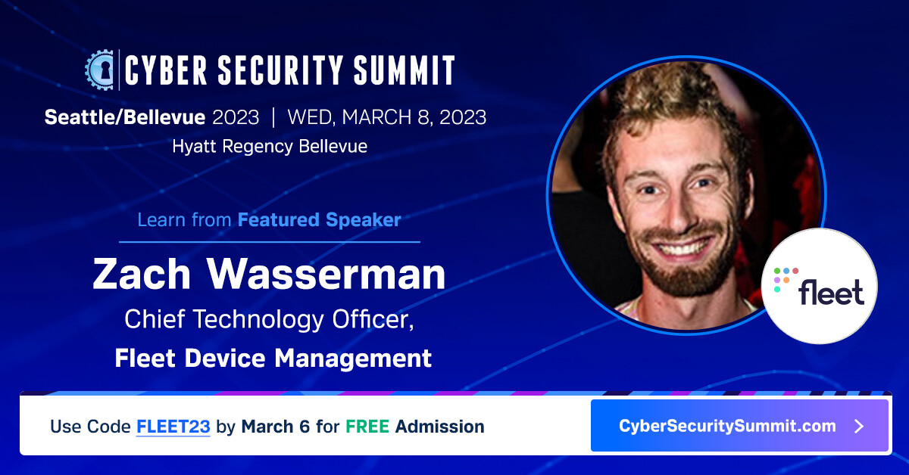

# Join Fleet at Cyber Security Summit Seattle/Bellevue 

Join Fleet on Wednesday, March 8, 2023, in Bellevue, Washington, for the seventh annual Seattle/Bellevue Cyber Security Summit. Zach Wasserman, Fleet Chief Technology Officer, will join a panel of industry experts to discuss the key security measures organizations must take beyond backup, recovery, anti-malware, and anti-virus.

[Cybercrime worldwide cost $8.44 Trillion in 2022](https://www.statista.com/chart/28878/expected-cost-of-cybercrime-until-2027/) and is projected to exceed $11.5 Trillion in 2023. A ransomware attack feels almost inevitable. According to a 2022 CRA Business Intelligence survey, nearly one in four respondents reported their organization experienced at least one ransomware attack in the last 12 months. Attackers succeeded in accessing systems, encrypting files, and demanding a ransom for nearly one in three of these organizations.

Vigilance through constant evaluation, assessment, and fine-tuning of your security approach is key to survival. Industry leaders understand that there’s a lot that goes into a well-rounded security operation. The list goes on from endpoint security, vulnerability management, Active Directory monitoring, credential protection, DNS security tools, SIEM, DLP, and encryption, to cloud security software. Learn from a carefully curated panel that will speak to preparing for, and defending against the threat of ransomware attacks. 

Please join Fleet as our guest at the [2023 Seattle/Bellevue Cyber Security Summit](https://cybersecuritysummit.com/summit/seattle23/), using the code FLEET23, by Monday, March 6, 2023.

<meta name="category" value="announcements">
<meta name="authorGitHubUsername" value="spokanemac">
<meta name="authorFullName" value="JD Strong">
<meta name="publishedOn" value="2023-03-02">
<meta name="articleTitle" value="Join Fleet at Cyber Security Summit Seattle/Bellevue">
<meta name="articleImageUrl" value="../website/assets/images/articles/seattle-bellevue-cyber-security-summit-social-post-1200x628@2x.png">
