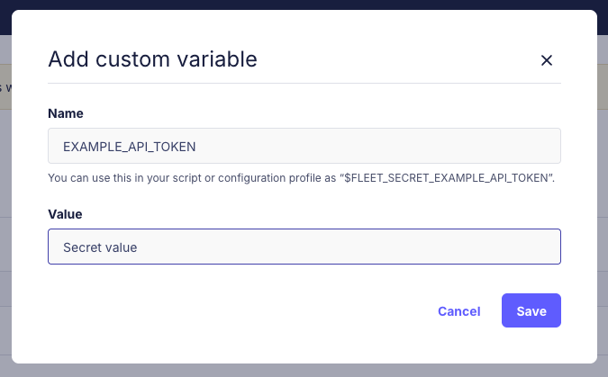

# Variables in scripts and configuration profiles

<div purpose="embedded-content">
   <iframe src="https://www.youtube.com/embed/VRK-3rN7-aY" frameborder="0" allowfullscreen></iframe>
</div>

In Fleet you can add variables, in [scripts](https://fleetdm.com/guides/scripts) and [configuration profiles](https://fleetdm.com/guides/custom-os-settings). Variables are hidden when the script or configuration profile is viewed in the Fleet UI or API.

Variables can be defined using [Fleet's YAML (GitOps)](https://fleetdm.com/docs/configuration/yaml-files) or via the UI under `Controls` > `Variables`.
If you are using GitOps, variables aren't removed on GitOps runs. You can delete them on the `Controls` > `Variables` page.

## Add variables

A variable can be used in a script or configuration profile by specifying a variable in the format `$FLEET_SECRET_MYNAME` or `${FLEET_SECRET_MYNAME}`. When the script or profile is sent to the host, Fleet will replace the variable with the variable's value. The prefix `FLEET_SECRET_` is required to indicate that this is a variable, and Fleet reserves this prefix for variables.

For macOS and Linux scripts, if a variable doesn't have the `$FLEET_SECRET_` prefix, it will be treated as a [local environment variable](https://support.apple.com/en-my/guide/terminal/apd382cc5fa-4f58-4449-b20a-41c53c006f8f/mac).

### UI

To add or delete a variable in the UI, go to `Controls` > `Variables` and click `+ Add custom variable`:



Variables are global, meaning they can be used in scripts and profiles across all teams.

### GitOps

1. You must add the variable to your [GitHub](https://docs.github.com/en/actions/how-tos/write-workflows/choose-what-workflows-do/use-secrets#creating-secrets-for-a-repository) or [GitLab](https://docs.gitlab.com/ci/variables/#define-a-cicd-variable-in-the-ui) repository's secrets to use them in GitOps.

2. For the GitHub GitOps flow, they must also be added to the `env` section of your workflow file, as shown below:

```yaml
    env:
      ###  Variables used by the gitops workflow ###
      FLEET_URL: ${{ secrets.FLEET_URL }}
      FLEET_API_TOKEN: ${{ secrets.FLEET_API_TOKEN }}
      FLEET_WORKSTATIONS_ENROLL_SECRET: ${{ secrets.FLEET_WORKSTATIONS_ENROLL_SECRET }}
      FLEET_WORKSTATIONS_CANARY_ENROLL_SECRET: ${{ secrets.FLEET_WORKSTATIONS_CANARY_ENROLL_SECRET }}
      ### Secrets uploaded to Fleet for use in profiles and scripts ###
      FLEET_SECRET_CERT_PASSWORD: ${{ secrets.FLEET_SECRET_CERT_PASSWORD }}
      FLEET_SECRET_CERT_BASE64: ${{ secrets.FLEET_SECRET_CERT_BASE64 }}
```

When GitOps syncs the configuration, it looks for variables in scripts and profiles, extracts the variable's values from the environment, and uploads them to Fleet.

On subsequent GitOps syncs, if a variable is used by an updated configuration profile, the profile will be resent to the host device(s).

> Profiles with variables are not entirely validated during a GitOps dry run because the required variables may not exist or may be incorrect in the database. As a result, these profiles have a higher chance of failing during a non-dry run. Test them by uploading to a small team first.

## Using the secret on a configuration profile

Here's an example profile with `$FLEET_SECRET_CERT_PASSWORD` and `$FLEET_SECRET_CERT_BASE64` variables:
```xml
<?xml version="1.0" encoding="UTF-8"?>
<!DOCTYPE plist PUBLIC "-//Apple//DTD PLIST 1.0//EN" "http://www.apple.com/DTDs/PropertyList-1.0.dtd">
<plist version="1.0">
<dict>
    <key>PayloadDisplayName</key>
    <!-- Note: Do not use $FLEET_SECRET_ variables in PayloadDisplayName -->
    <string>Certificate PKCS12</string>
    <key>PayloadIdentifier</key>
    <string>com.example.certificate</string>
    <key>PayloadType</key>
    <string>Configuration</string>
    <key>PayloadUUID</key>
    <string>918ee83d-ebd5-4192-bcd4-8b4feb750e4b</string>
    <key>PayloadVersion</key>
    <integer>1</integer>
    <key>PayloadContent</key>
    <array>
      <dict>
            <key>Password</key>
            <string>$FLEET_SECRET_CERT_PASSWORD</string>
            <key>PayloadContent</key>
            <data>${FLEET_SECRET_CERT_BASE64}</data>
            <key>PayloadDisplayName</key>
            <string>Certificate PKCS12</string>
            <key>PayloadIdentifier</key>
            <string>com.example.certificate</string>
            <key>PayloadType</key>
            <string>com.apple.security.pkcs12</string>
            <key>PayloadUUID</key>
            <string>25cdd076-f1e7-4932-aa30-1d4240534fb0</string>
            <key>PayloadVersion</key>
            <integer>1</integer>
        </dict>
    </array>
</dict>
</plist>
```

## Known limitations and issues

- **Apple MDM profiles**: Fleet secret variables (`$FLEET_SECRET_*`) cannot be used in the `PayloadDisplayName` field of Apple configuration profiles. This field becomes the visible name of the profile and using secrets here could expose sensitive information. Place secrets in other fields like `PayloadDescription`, `Password`, or `PayloadContent` instead.
- After changing a variable used by a Windows profile, that profile is currently not re-sent to the device when the GitHub action (or GitLab pipeline) runs: [story #27351](https://github.com/fleetdm/fleet/issues/27351)
- Fleet does not hide the secret in script results. Don't print/echo your secrets to the console output.
- There is no way to explicitly delete a secret variable. Instead, you can overwrite it with any value.
- Do not use deprecated API endpoint(s) to upload profiles containing secret variables. Use endpoints documented in [Fleet's REST API](https://fleetdm.com/docs/rest-api/rest-api).

<meta name="articleTitle" value="Variables in scripts and configuration profiles">
<meta name="authorFullName" value="Victor Lyuboslavsky">
<meta name="authorGitHubUsername" value="getvictor">
<meta name="category" value="guides">
<meta name="publishedOn" value="2025-01-02">
<meta name="description" value="A guide on using variables in scripts and configuration profiles.">
