# SHADOW-EARTH-053: threat brief, kill chain, and validated Fleet queries

## Executive summary

On 30 April 2026, Trend Micro disclosed a previously unattributed China-aligned cyberespionage cluster designated **SHADOW-EARTH-053**, with ProxyLogon-based Exchange compromise activity observed since at least December 2024. The cluster gains initial access through N-day exploitation of internet-facing Microsoft Exchange and IIS servers (primarily the ProxyLogon chain, CVE-2021-26855/26857/26858/27065), drops GODZILLA web shells, then stages ShadowPad implants through DLL sideloading of legitimate signed executables. The encrypted ShadowPad payload is stored in a per-host Windows registry key and executed via `EnumDesktopsA` callback injection, a technique selected to evade behavioural detection at execution time. A separate Linux delivery path (NOODLERAT samples retrieved via exploitation of CVE-2025-55182, React2Shell) was first observed in **December 2025**, a year after the initial Windows activity; Trend Micro attribute these Linux samples to SHADOW-EARTH-053 with **low confidence**.

Observed targeting spans government, defence, critical-infrastructure, and IT-consulting sectors across Pakistan, Thailand, Malaysia, India, Myanmar, Sri Lanka, Taiwan, and one NATO member state (Poland). A companion intrusion set, SHADOW-EARTH-054, shares the same initial-access vector and SHA-256-identical post-exploitation tooling (Evil-CreateDump, IOX) but no observed operational coordination. The two clusters re-exploit the same victims with temporal offsets of up to eight months.

The detection surface is durable: registry-stored shellcode, a fixed Scheduled Task name (`M1onltor`), layered tunneling tools (IOX, GOST, Wstunnel, custom `tunnel-core`), and `ExchangeExport` mailbox theft via the EWS API all produce behavioural artefacts that survive infrastructure rotation. Atomic IOCs (IPs, domain) will burn within weeks; behavioural detections built around process tree, registry placement, and scheduled-task naming are the recommended durable layer.

This brief contains: campaign-wide and per-kill-chain-stage Diamond Models; a consolidated atomic indicator table; a priority-ordered response playbook; and three behavioural detection lenses with 17 validated osquery queries packaged as Fleet-deployable artefacts.

## Cluster profile

| Field | Value |
|---|---|
| **Designation** | SHADOW-EARTH-053 (Trend Micro temporary intrusion set; companion -054 in the same report) |
| **First observed** | December 2024 (ProxyLogon-based Windows activity). Linux NOODLERAT delivery via CVE-2025-55182 first observed December 2025, a separate, lower-confidence component, **not** part of the original Windows campaign window. |
| **Primary report** | [Trend Micro: Lunghi & Silva, 30 Apr 2026](https://www.trendmicro.com/en_us/research/26/d/inside-shadow-earth-053.html) |
| **Attribution** | China-aligned (per Trend Micro). No strong overlap with any publicly reported group. Tom Kellermann (TrendAI) drew an editorial parallel to the Typhoon family in [*The Register*](https://www.theregister.com/2026/04/30/chinese_spies_lurking_networks/), but this is framing, not formal attribution. |
| **Targets, sectors** | Government; defence; IT consultancies holding Ministry-of-Defence contracts; telecoms; transportation |
| **Targets, geography** | Pakistan, Thailand, Malaysia, India, Myanmar, Sri Lanka, Taiwan, Poland (NATO) |
| **Initial access** | ProxyLogon (CVE-2021-26855/26857/26858/27065) against unpatched Exchange + IIS; AnyDesk in one secondary instance; React2Shell (CVE-2025-55182) on Linux with low confidence |
| **Implant** | ShadowPad (32-bit, older builder lacking advanced obfuscation); per-host shellcode stored in `HKCU\Software\<ComputerName>\scode` |
| **Persistence** | Scheduled Task `M1onltor` (5-minute interval, highest privileges); GODZILLA web shells; registry shellcode storage |
| **C2** | Layered redundant tunnels (IOX, GOST, Wstunnel, custom `tunnel-core`) over four named IPs and one domain. See [atomic indicators](#atomic-indicators) below. |
| **Linux side** | NOODLERAT ELF samples via CVE-2025-55182. Trend Micro attributes to -053 with **low confidence**. |

## Strategic context

Two characteristics of this campaign are operationally consequential for security leadership.

**The initial-access vector is a five-year-old patch gap.** SHADOW-EARTH-053 does not depend on novel exploitation. It depends on the long tail of unpatched Microsoft Exchange servers: the legacy boxes that fall outside ordinary patch cadence, the systems with documented exceptions, the deployments that predate the current administrators. Trend Micro state the position directly: *"These older Microsoft Exchange vulnerabilities continue to serve as effective initial access vectors. SHADOW-EARTH-053's successful exploitation of these long-patched issues confirms that organizations still running legacy or unpatched Exchange servers remain at significant risk of mailbox compromise, credential theft, and prolonged attacker access."* The operational implication: a patch-management exception is the campaign's primary attack surface.

**The persistence design is built for durability under detection.** Three independent anchors are layered at every observed victim: GODZILLA web shells in Exchange/IIS web roots, a DLL-sideloaded ShadowPad loader with the encrypted payload stored in a per-host registry key, and a Scheduled Task (`M1onltor`) running the loader every five minutes at highest privileges. Removing any one anchor leaves the others intact. Tom Kellermann's framing in *The Register* (*"What type of C2 on a sleep cycle is still lingering in these environments? Whether or not they have already prepositioned wipers or destructive capabilities."*) captures the load-bearing concern: the access established in late 2024 has had over a year to seed dormant capability.

For policy-level context on related Chinese-nexus telecom-and-infrastructure campaigns, CISA's joint advisory on Salt Typhoon ([AA25-239A](https://www.cisa.gov/news-events/cybersecurity-advisories/aa25-239a), August 2025) is the recommended companion read. Trend Micro itself does *not* attribute SHADOW-EARTH-053 to Salt Typhoon or any other named cluster; the comparison is one of behavioural family, not identity.

## Victimology

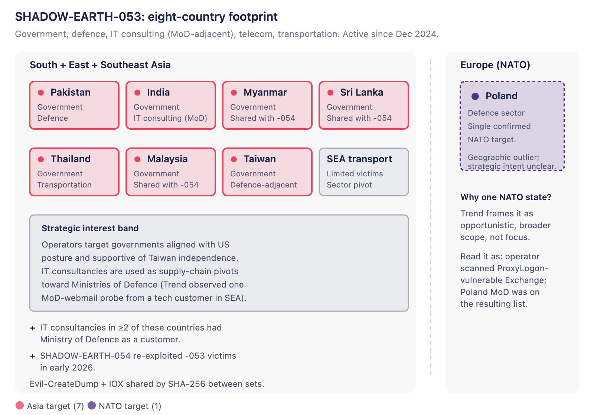

*Eight countries, five sectors. Asia-centred targeting with Poland's defence sector as the geographic outlier.*

Targeting reflects strategic alignment rather than opportunistic scanning. The Asian victim set concentrates on governments aligned with the United States posture, governments supportive of Taiwan's independence, and IT consultancies whose customer lists include Ministries of Defence. Trend Micro documents one instance in which the companion cluster -054 reached for the webmail of a Southeast Asian Ministry of Defence from inside a technology customer's environment: a supply-chain pivot pattern that lets the campaign reach ministries with stronger perimeter hygiene than the consultancies that serve them.

The Polish target is the geographic outlier. Trend Micro frame it as opportunistic broadening rather than focused intent. Poland's defence sector likely surfaced in the ProxyLogon-vulnerable scan set the operator was already working through, not as a strategic pivot.

## Campaign Diamond Model

The Diamond Model below summarises the campaign at the cluster level. Per-stage diamonds in the kill chain section specialise this view.

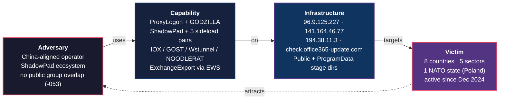

## Lockheed kill chain, stage by stage

Each stage below documents the TTPs reported by Trend Micro, renders a Diamond Model specialised to that stage, lists the relevant ATT&CK technique IDs (derived; Trend Micro do not publish ATT&CK mappings), and where useful includes an inline visual.

### Stage 1: reconnaissance

*External enumeration of unpatched Exchange/IIS surface.*

External reconnaissance for unpatched Exchange and IIS surface. Trend Micro do not publish the scanning infrastructure, but the consistent selection of ProxyLogon-vulnerable hosts across the targeted geographies implies systematic external enumeration. In at least one observed intrusion, AnyDesk appears as a *first-stage* delivery channel: an indicator that credentials sourced from prior breaches or stealer-log marketplaces may seed some target lists rather than scanning alone.

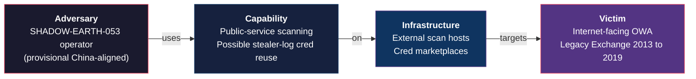

**ATT&CK:** T1595.002 (Active Scanning, Vulnerability Scanning), T1592 (Gather Victim Host Information).

### Stage 2: weaponisation

*DLL-sideload trio: signed binary + malicious DLL + registry shellcode.*

The weaponisation pattern is consistent across every observed intrusion: a legitimate, *signed* executable vulnerable to DLL sideloading, a co-located malicious DLL, and the encrypted ShadowPad payload stored in the registry and deleted after first execution. Four sideload pairs are documented by SHA-256, plus a fifth Toshiba-signed loader that fetches the shellcode from `HKCU\Software\<ComputerName>\scode` and executes it via `EnumDesktopsA` callback injection.


*Each signed binary loads its co-located DLL as the operating system designed it to. Signing-cert verification passes; the trust placement is what fails.*

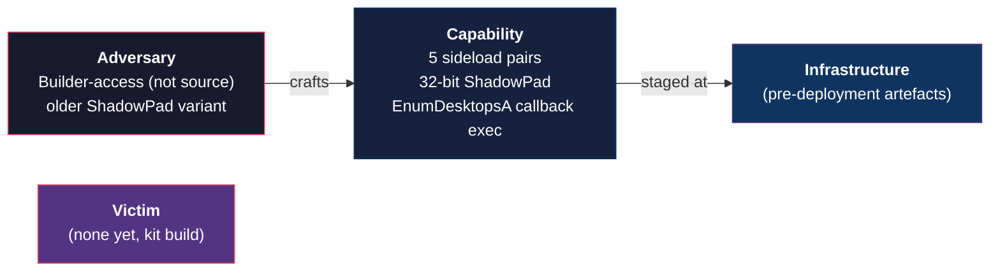

**ATT&CK:** T1027 (Obfuscated Files), T1574.002 (DLL Side-Loading), T1112 (Modify Registry, payload storage).

### Stage 3: delivery

*ProxyLogon RCE, AnyDesk handoff, React2Shell on Linux (low conf.).*

Three observed delivery paths.

**Primary:** ProxyLogon exploitation against unpatched Microsoft Exchange. The chain comprises CVE-2021-26855 (SSRF), CVE-2021-26857 (insecure deserialisation), CVE-2021-26858 and CVE-2021-27065 (post-auth arbitrary file write). Although the chain is five years old, Trend Micro observed SHADOW-EARTH-053 relying on it as the primary entry point.

**Secondary:** AnyDesk used as the delivery channel in at least one intrusion. Trend Micro cannot determine whether this represents an alternative initial-access vector or a handoff from an unobserved prior compromise. The operational signature in either case is the same: a signed, EDR-tolerated remote-access tool used to move ShadowPad onto the target.

**Tertiary, low confidence:** Linux NOODLERAT delivery via CVE-2025-55182 (React2Shell) exploitation, with implants retrieved from `194.38.11.3:1790`. The temporal context matters: Trend Micro first observed this delivery path in **December 2025**, twelve months after the campaign's initial ProxyLogon-based Windows activity began. React2Shell exploitation itself was observed by multiple vendors as part of broader CVE-2025-55182 activity; what Trend Micro hedge with low confidence is the attribution of *these specific Linux samples* to SHADOW-EARTH-053. The link rests on shared staging infrastructure (`194.38.11.3:1790` also hosted ShadowPad samples retrieved by the cluster in mid-December 2025) and registration patterns on the NOODLERAT C2 domain `check.office365-update.com`.

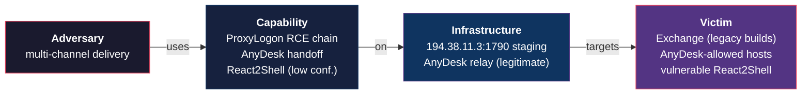

**ATT&CK:** T1190 (Exploit Public-Facing Application), T1219 (Remote Access Software, AnyDesk).

### Stage 4: exploitation

*RCE under w3wp.exe; Active Directory and Exchange reconnaissance via web shell.*

ProxyLogon exploitation gives remote code execution under the IIS worker process `w3wp.exe`. Trend Micro captured the operator running domain-admin enumeration, `nltest /dclist`, `nslookup` against internal Exchange servers, `csvde.exe` for Active Directory CSV export, and PowerView's `Get-DomainUser` cmdlet, all under the web-shell process tree. A 28 KB custom binary, `DomainMachines.exe`, was deployed to enumerate machines over LDAP and probe ports 139/445 (SMB), 80/443/8080/8443 (HTTP), 3389 (RDP), 5985/5986 (WinRM), 3306 (MySQL), 1433 (MSSQL), and 88 (Kerberos).

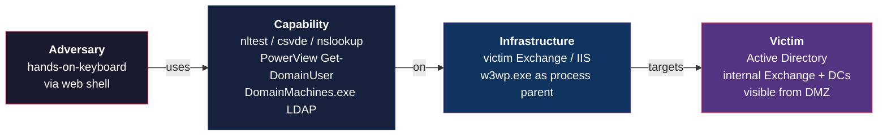

**ATT&CK:** T1190 (continued), T1059 (Command and Scripting Interpreter), T1018 (Remote System Discovery), T1087 (Account Discovery), T1069 (Permission Groups Discovery).

### Stage 5: installation

*GODZILLA web shells, ShadowPad loader, Scheduled Task M1onltor.*

Three persistence anchors are layered at every observed victim.

**Web shells.** GODZILLA dropped under Exchange and IIS web roots: `C:\inetpub\wwwroot\aspnet_client\system_web\` and `C:\Program Files\Microsoft\Exchange Server\V15\FrontEnd\HttpProxy\owa\auth\`. Twelve filenames observed: `error.aspx`, `errorFE.aspx`, `signout.aspx`, `warn.aspx`, `data.aspx`, `page.aspx`, `TimeinLogout.aspx`, `timeout.aspx`, `charcode.aspx`, `tunnel.ashx`, `i.aspx`, `2.aspx`. The `tunnel.ashx` `.ashx` HTTP-handler variant is new to this cluster: `.ashx` files are uncommon in default Exchange/IIS deployments and effectively never appear in `owa/auth/` or `aspnet_client/system_web/` under legitimate circumstances. Treat any `.ashx` file in those paths as a high-fidelity detection signal, independent of the specific filename match list.

**ShadowPad loader.** A legitimate signed binary (see Stage 2) is staged in `C:\Users\Public` or `C:\ProgramData`, sideloads its malicious DLL, and reads the encrypted shellcode from `HKCU\Software\<ComputerName>\scode`.

**Scheduled Task.** The task `M1onltor` runs the sideloaded loader every five minutes at highest privileges. The five-minute interval is operationally consequential: the `scode` registry value is effectively a continuous Fleet policy target. If it is present, it is executing.

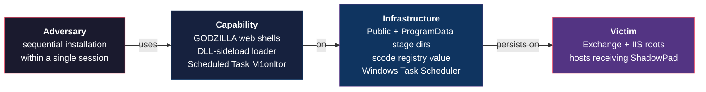

**ATT&CK:** T1505.003 (Server Software Component, Web Shell), T1574.002 (DLL Side-Loading), T1112 (Modify Registry), T1053.005 (Scheduled Task/Job).

### Stage 6: command and control

*Layered redundant tunnels: IOX, GOST, Wstunnel, custom tunnel-core.*

Operational redundancy is the load-bearing C2 design. Multiple tunnel tools are deployed in a single environment, all pointing at the same external infrastructure; detection or blocking of any one tool does not interrupt the channel.

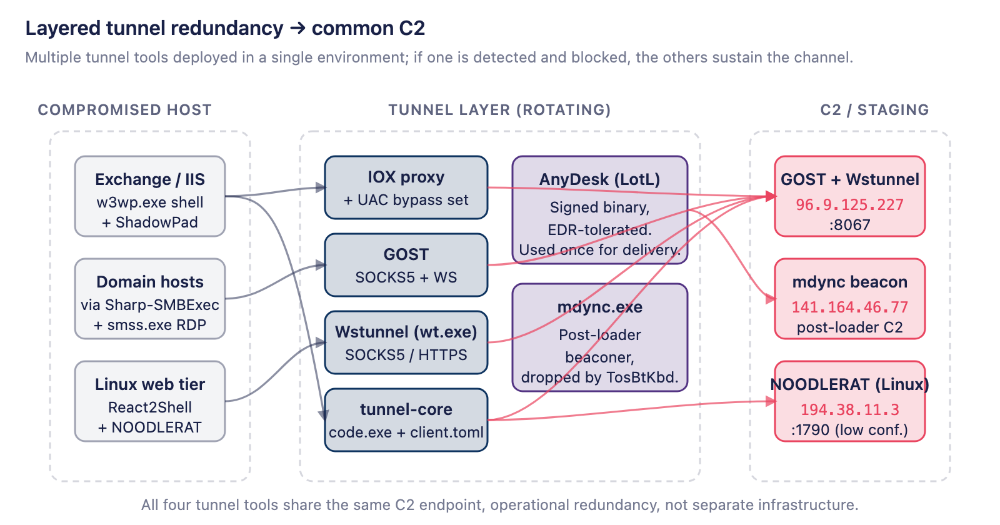

*One C2 endpoint, four tunnel implementations. The redundancy itself is the durable signal; block any one tool and the others sustain the channel.*

- **IOX proxy.** Local accounts created with `LocalAccountTokenFilterPolicy=1` set to enable Pass-the-Hash from any local administrator account. The registry value itself is the generic Microsoft UAC remote-restriction bypass ([KB951016](https://learn.microsoft.com/en-us/troubleshoot/windows-server/windows-security/user-account-control-and-remote-restriction)) and is set by many lateral-movement toolkits. It is *not* an IOX-specific indicator on its own. The IOX-specific detection signal is the **combination** of the registry-set with concurrent execution of an IOX binary (typically named `explorer.exe` or `svchost.exe`) staged in `C:\Users\Public` or `C:\ProgramData`. Either signal alone produces noise; the combination is high-fidelity.
- **GOST** as SOCKS5 + WebSocket tunnels to `96.9.125.227`.
- **Wstunnel** deployed as `wt.exe`, tunnelling SOCKS5 over HTTPS to the same `96.9.125.227`.
- **Renamed `tunnel-core.exe` to `code.exe`** invoked with parameter `client.toml`, communicating with `96.9.125.227:8067`. The tool itself was not recovered for analysis.
- **AnyDesk** as a signed, EDR-tolerated remote access channel.
- **`mdync.exe`** beaconing to `141.164.46.77`, dropped by `TosBtKbd.dll`. Binary not recovered.
- **NOODLERAT (Linux)** with C2 `check.office365-update.com`, domain registered 2025-11-19. Trend Micro attribute this link with low confidence.

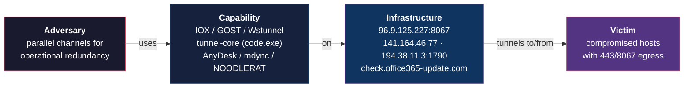

**ATT&CK:** T1071.001 (Application Layer, Web Protocols), T1090.001 (Internal Proxy), T1090.002 (External Proxy), T1219 (AnyDesk), T1071.004 (DNS, NOODLERAT C2).

### Stage 7: actions on objectives

*LSASS theft, DCSync, EWS mailbox export, RingQ defence evasion.*

Three observed objective categories.

**Credential theft.** Mimikatz executed via `rundll32.exe` with `sekurlsa::logonpasswords` and `lsadump::sam`, spawned under the `w3wp.exe` web-shell context. Evil-CreateDump (a modified `create-dump.exe` retargeted at LSASS) used for memory dumps. `newdcsync` deployed for DCSync attacks against domain controllers.

**Lateral movement.** WMIC used to install backdoors on additional hosts. Sharp-SMBExec (a C# SMBExec implementation) for command execution. A custom RDP launcher named `smss.exe`. Web shells propagated to additional internal Exchange servers via administrative shares (`copy charcode.aspx \\<IP>\c$\inetpub\wwwroot\aspnet_client\system_web\`).

**Mailbox and IP exfiltration.** Iterative Exchange PowerShell: initial `Get-Mailbox` calls failed, prompting the operator to load the snap-in (`Add-PSSnapin Microsoft.Exchange.Management.PowerShell.SnapIn`) and refine to `Get-User` with `userAccountControl` and `AccountDisabled` filters to identify high-value active accounts. A custom **`ExchangeExport`** tool then exported high-profile mailboxes via the EWS API; Trend Micro note the operational pattern matches Microsoft's observation of Silk Typhoon (Hafnium). One observed exfiltration produced a password-protected RAR archive containing an executive's PST file.

**Defence evasion.** Two distinct techniques observed.

- **RingQ packer.** An open-source binary packer of Chinese origin, available on GitHub, designed to pack malicious binaries so that they evade signature-based antivirus and EDR detection. Trend Micro detected at least one RingQ-packed sample in a SHADOW-EARTH-053 environment. Detection guidance: scan staging directories (`C:\Users\Public`, `C:\ProgramData`) for unusually small executables with high entropy and Chinese-language string artefacts in the unpacker stub.
- **System-binary masquerading.** `net.exe` and PowerShell binaries copied into `C:\ProgramData` with randomised `.log` suffixes (pattern: `$<RANDOM>.log` filenames, e.g. `$D5PLAA1.log`, `$9XF5WLD.log`, `$C06KCQ2.log`) to defeat process-name-based detection while preserving original signed-binary hashes. This technique specifically targets EDR configurations that rely on filename matching rather than hash verification or behavioural analysis.

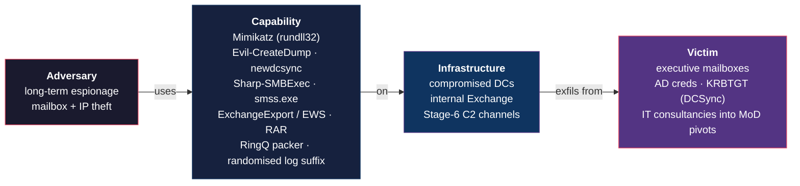

**ATT&CK:** T1003.001 (LSASS Memory), T1003.006 (DCSync), T1218.011 (Rundll32), T1021.001 (RDP), T1021.002 (SMB/Admin Shares), T1560.001 (Archive via Utility), T1114.002 (Remote Email Collection), T1036.005 (Match Legitimate Name).

## SHADOW-EARTH-053 / -054 temporal overlap

Trend Micro's Figure 1 documents a recurring temporal pattern in which the same victim is compromised first by -054 (late 2024 / early 2025), then by -053 (mid-2025 ShadowPad deployment), and re-exploited again by -054 (early 2026), typically with eight months or more between the initial -054 compromise and the subsequent -053 ShadowPad deployment. The two clusters share an SHA-256-identical post-exploitation toolkit (Evil-CreateDump, IOX) and the same ProxyLogon initial-access vector, but no operational coordination was observed.

Trend Micro categorise this relationship as **"Type A collaboration"** (terminology from their *Premier Pass-as-a-Service* model published the previous year): independent exploitation of the same vulnerabilities by separate intrusion sets, with similar initial-access techniques and overlapping post-exploitation tooling, where any apparent coordination is incidental rather than intentional. Trend Micro explicitly considered and rejected the "same group with two TTPs" hypothesis: in three cases, -054 malware appeared at sites already compromised by -053, with no apparent connection between the two malware families, which would be operationally inconsistent for a single actor.

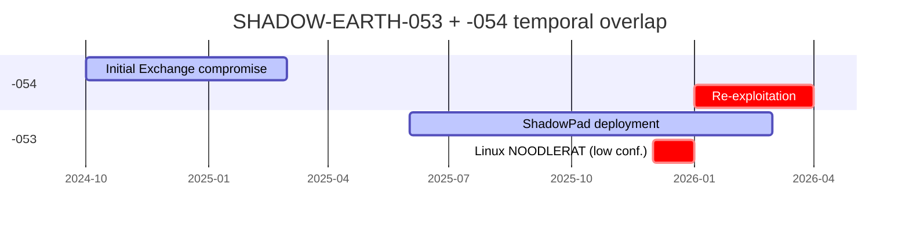

**Operational implication:** detection rules tuned to either cluster's toolkit will partially fire on the other's, and that overlap is intended. Defenders investigating a -053 indicator should assume -054 may also be present at the same victim, and vice versa.

## Atomic indicators

Consolidated atomic indicators from the Trend Micro report. Atomic indicators rotate quickly; treat the IP and domain entries as block-and-alert items for the next two to four weeks, and prioritise the behavioural detections in the [detection guidelines](#detection-guidelines-three-behavioural-lenses) section for durable coverage.

| Type | Value | Context |
|---|---|---|
| IPv4 | `141.164.46.77` | `mdync.exe` beaconing destination |
| IPv4 | `96.9.125.227` | GOST + Wstunnel + `tunnel-core` C2; port `8067` observed |
| IPv4 | `194.38.11.3` | ShadowPad + NOODLERAT staging on port `1790` |
| Domain | `check.office365-update.com` | NOODLERAT C2; registered 2025-11-19 (low confidence link) |
| CVE | CVE-2021-26855, CVE-2021-26857, CVE-2021-26858, CVE-2021-27065 | ProxyLogon chain, primary initial access |
| CVE | CVE-2025-55182 | React2Shell, Linux NOODLERAT delivery (low confidence) |
| Registry | `HKCU\Software\<ComputerName>\scode` | ShadowPad shellcode storage |
| Registry | `HKLM\SOFTWARE\Microsoft\Windows\CurrentVersion\Policies\System\LocalAccountTokenFilterPolicy = 1` | Generic UAC bypass; observed in IOX deployment context |
| Scheduled task | `M1onltor` | 5-minute interval, highest privileges; runs ShadowPad loader |
| File path | `C:\Users\Public\`, `C:\ProgramData\` | Staging directories for loaders, tunnels, and renamed system binaries |
| File path | `C:\inetpub\wwwroot\aspnet_client\system_web\` | GODZILLA web shell drop location |
| File path | `C:\Program Files\Microsoft\Exchange Server\V15\FrontEnd\HttpProxy\owa\auth\` | GODZILLA web shell drop location |
| Web shell filenames | `error.aspx`, `errorFE.aspx`, `signout.aspx`, `warn.aspx`, `data.aspx`, `page.aspx`, `TimeinLogout.aspx`, `timeout.aspx`, `charcode.aspx`, `tunnel.ashx`, `i.aspx`, `2.aspx` | GODZILLA filename set |
| Sideload pair | `GameHook.exe` (ORANGE VIEW LIMITED) + `graphics-hook-filter32.dll`, SHA-256 `4264cfb3…885f5c8` | ShadowPad loader pair |
| Sideload pair | `imecmnt.exe` (Microsoft Corporation) + `imjp14k.dll`, SHA-256 `2e8f9fd8…81c04cd2` | ShadowPad loader pair |
| Sideload pair | `xReport.exe` (Mainline Net Holdings) + `Uxtheme.dll`, SHA-256 `8d9433e9…4de733c78` | ShadowPad loader pair |
| Sideload pair | `LUManager.EXE` (Samsung Electronics) + `MPS.dll`, SHA-256 `d67197bf…65cf429b3` | ShadowPad loader pair |
| Sideload pair | Toshiba-signed renamed `CIATosBtKbd.exe` + `TosBtKbd.dll` | Registry-reading ShadowPad loader |

## Response playbook

Recommended actions, ordered by priority. Each item maps to one or more queries in the detection guidelines below.

### Priority 1: patch posture and atomic blocking (first 24 hours)

1. **Patch-posture review on every internet-facing Exchange and IIS server.** ProxyLogon (CVE-2021-26855/26857/26858/27065) remains the primary entry. Any unpatched host is the campaign's attack surface. Patch programmes with documented exceptions should re-validate those exceptions against current threat reality.
2. **Block-and-alert on the four atomic indicators** at the network perimeter and SIEM: `141.164.46.77`, `96.9.125.227`, `194.38.11.3`, `check.office365-update.com`. These will rotate within weeks; the value is the short window of high-fidelity coverage.
3. **Retro-hunt for GODZILLA web shell filenames** across the Exchange and IIS web roots using Query 1.1 below. Single-row return indicates active web-shell persistence.

### Priority 2: durable behavioural detection (week 1)

4. **Deploy the validated query bundle into Fleet.** Promote the *should-not-exist* queries to Fleet policies (fail-on-any-row). See [policy split](#fleet-policies-vs-scheduled-queries) below. The remaining behavioural queries become scheduled queries feeding the SIEM.
5. **Enable Sysmon and PowerShell Script Block Logging** on every Windows host in scope of the campaign's target profile. Several detection queries depend on these telemetry sources. Without them, the corresponding queries silently return zero rows.
6. **Build SIEM correlation rules** for the high-FP behavioural queries (IIS worker spawning LOLBINs, `rundll32` Mimikatz signatures). Correlation across multiple signals (for example, `w3wp.exe` parent spawning `cmd.exe`, followed by appearance of the `scode` registry value on the same host) substantially raises fidelity over single-query alerting.

### Priority 3: supporting controls (week 2 onward)

7. **AnyDesk inventory across every server-class label.** Hosts where AnyDesk should not exist (Exchange servers, domain controllers, Tier-0 systems) but does are actionable findings.
8. **Audit `LocalAccountTokenFilterPolicy` registry state** across the estate. The value `1` is not by itself an incident (it is the generic Microsoft UAC remote-restriction bypass and is set by many legitimate tools), but it is the cheapest available signal that lateral-movement preparation may be in progress.
9. **Tune the noisy lenses** (`rundll32` patterns, tunnel-binary command-line patterns) based on observed false-positive volume in the first detection week. Promote any correlation rule that survives tuning into the durable policy set.
10. **Document the campaign as a runbook in the SOC wiki.** Detection coverage tied to specific atomic indicators degrades as infrastructure rotates; coverage tied to behavioural patterns (process tree, registry placement, scheduled-task naming) survives.

## Detection guidelines: three behavioural lenses

The TTPs documented in the kill chain collapse into three behavioural lenses for detection engineering:

1. **Web shell and Exchange/IIS abuse** (Stages 3, 4, 5: initial access through `w3wp.exe` LOLBIN spawns).
2. **ShadowPad persistence and layered tunnels** (Stages 5, 6: sideload loader, registry shellcode, Scheduled Task, IOX/GOST/Wstunnel/AnyDesk).
3. **Credential theft and mailbox export** (Stage 7: LSASS, DCSync, EWS PST export).

Every query below has been validated against the current [Fleet table schema](https://fleetdm.com/tables/). Several schema realities cause the generically circulating versions of these queries to fail silently or at runtime; those corrections are noted inline with each query.

### Schema notes that apply throughout

- **`file.sha256` does not exist.** File hashes live on the `hash` table joined to `file` on `path`.
- **`file.directory IN (...)` violates osquery's required-equality constraint** and is rejected at runtime. Use repeated `directory = '...'` clauses joined with `OR`.
- **`file_events` and `socket_events` are macOS and Linux only.** Windows queries pivot to the NTFS publisher, `process_etw_events`, or `windows_events`. A copy-pasted `file_events` query against a Windows host returns zero rows silently.
- **`process_etw_events` exposes `ppid` but not `parent_path` or `parent_name`.** Parent-process correlation must happen downstream of the query, not inside it.

### Lens 1: web shell and Exchange/IIS abuse

#### 1.1 GODZILLA web shell filenames (Windows)

```sql
SELECT f.path, f.filename, f.size, f.mtime, h.sha256
FROM file f
LEFT JOIN hash h ON h.path = f.path
WHERE (f.directory = 'C:\inetpub\wwwroot\aspnet_client\system_web'
    OR f.directory = 'C:\Program Files\Microsoft\Exchange Server\V15\FrontEnd\HttpProxy\owa\auth')
  AND f.filename IN ('error.aspx','errorFE.aspx','signout.aspx','warn.aspx','data.aspx',
                     'page.aspx','TimeinLogout.aspx','timeout.aspx','charcode.aspx',
                     'tunnel.ashx','i.aspx','2.aspx');
```

Schema references: [`file`](https://fleetdm.com/tables/file), [`hash`](https://fleetdm.com/tables/hash). Platform: Windows. Recommended deployment: Fleet policy (fail-on-any-row) across the Exchange and IIS label set.

#### 1.2 FIM for new ASPX/ASHX in Exchange/IIS web roots (macOS + Linux)

```sql
SELECT time, action, target_path, category
FROM file_events
WHERE category IN ('exchange_webroot','iis_webroot')
  AND (target_path LIKE '%.aspx' OR target_path LIKE '%.ashx');
```

`file_events` is macOS and Linux only ([fleetdm.com/tables/file_events](https://fleetdm.com/tables/file_events)). For Windows IIS file-integrity monitoring, enable `enable_ntfs_event_publisher` in agent options and watch the NTFS event stream. The `exchange_webroot` and `iis_webroot` categories must be defined under `file_paths:` in agent configuration. See the Fleet agent options section below.

#### 1.3 IIS worker spawning LOLBINs (Windows, ETW)

```sql
SELECT datetime, username, path, cmdline, ppid, pid, type
FROM process_etw_events
WHERE type = 'ProcessStart'
  AND (path LIKE '%\cmd.exe'
    OR path LIKE '%\powershell.exe'
    OR path LIKE '%\whoami.exe'
    OR path LIKE '%\net.exe'
    OR path LIKE '%\rar.exe'
    OR path LIKE '%\rundll32.exe');
```

`process_etw_events` does not expose parent process name or path ([fleetdm.com/tables/process_etw_events](https://fleetdm.com/tables/process_etw_events)); correlate to `w3wp.exe` parent downstream via `(host_id, ppid)` join against a companion `processes` query, or against the Sysmon EventID 1 stream via `windows_events`. High false-positive rate without correlation; `rundll32` and `cmd.exe` execution are commonplace.

### Lens 2: ShadowPad persistence and layered tunnels

#### 2.1 ShadowPad loader DLLs and binaries on disk (Windows)

```sql
SELECT f.path, f.filename, f.size, f.mtime, h.sha256
FROM file f
LEFT JOIN hash h ON h.path = f.path
WHERE (f.path LIKE 'C:\Users\Public\%' OR f.path LIKE 'C:\ProgramData\%')
  AND (f.filename IN ('CIATosBtKbd.exe','TosBtKbd.dll','graphics-hook-filter32.dll',
                      'imjp14k.dll','Uxtheme.dll','MPS.dll')
       OR f.filename LIKE 'mdync.exe');
```

#### 2.2 ShadowPad shellcode in the registry (Windows)

```sql
SELECT path, key, name, type, mtime
FROM registry
WHERE path LIKE 'HKEY_USERS\%\Software\%\scode';
```

`HKEY_USERS\<SID>\Software\<ComputerName>\scode` is the osquery-visible form of `HKCU\Software\<ComputerName>\scode` across every loaded user hive. Recommended deployment: Fleet policy (fail-on-any-row).

#### 2.3 Scheduled Task `M1onltor` and tasks from publicly-writable directories (Windows)

```sql
SELECT name, action, enabled, state, last_run_time, next_run_time, path
FROM scheduled_tasks
WHERE name = 'M1onltor'
   OR path LIKE 'C:\Users\Public\%'
   OR path LIKE 'C:\ProgramData\%';
```

The literal task name `M1onltor` is a specific IOC. The `path LIKE` clauses generalise the detection to any scheduled task whose executable resides in a publicly writable directory.

#### 2.4 `LocalAccountTokenFilterPolicy` flipped to 1 (Windows)

```sql
SELECT path, name, data, mtime
FROM registry
WHERE path = 'HKEY_LOCAL_MACHINE\SOFTWARE\Microsoft\Windows\CurrentVersion\Policies\System'
  AND name = 'LocalAccountTokenFilterPolicy'
  AND data = '1';
```

This is the generic Microsoft UAC remote-restriction bypass (KB951016). Treat the value `1` as a context-building signal, not a standalone IOC.

#### 2.5 Tunnel binaries by name and command line (Windows)

```sql
SELECT pid, name, path, cmdline, parent
FROM processes
WHERE name IN ('iox.exe','gost.exe')
   OR cmdline LIKE '%--listen socks%'
   OR cmdline LIKE '%client.toml%'
   OR cmdline LIKE '%wstunnel%';
```

`code.exe` and `wt.exe` are intentionally omitted from the `name` predicate to avoid collision with Visual Studio Code and Windows Terminal. The `cmdline LIKE '%client.toml%'` branch catches the renamed `tunnel-core` invocation observed by Trend Micro.

#### 2.6 AnyDesk inventory and unexpected outbound connections

```sql
-- Inventory: AnyDesk installation footprint (Windows + macOS via programs)
SELECT name, version, install_location, publisher
FROM programs
WHERE name LIKE '%AnyDesk%';

-- Outbound activity (macOS + Linux only, socket_events not available on Windows)
SELECT s.time, s.action, s.remote_address, s.remote_port,
       p.pid, p.name, p.path, p.cmdline
FROM socket_events s
JOIN processes p USING (pid)
WHERE p.name LIKE 'AnyDesk%'
  AND s.action = 'connect'
  AND s.remote_address NOT LIKE '10.%'
  AND s.remote_address NOT LIKE '192.168.%'
  AND s.remote_address NOT REGEXP '^172\.(1[6-9]|2[0-9]|3[01])\.'
  AND s.remote_address NOT LIKE '127.%';
```

The full `172.16.0.0/12` private range requires regex; the `LIKE '172.16.%'` form found in many published recipes covers only a `/16`. Scope by Fleet host label (Tier-0, Exchange servers, Domain Controllers) to suppress noise from helpdesk laptops legitimately using AnyDesk. Windows outbound equivalent is Sysmon EventID 3 via `windows_events`.

#### 2.7 Connections to published C2 infrastructure (macOS + Linux)

```sql
SELECT s.time, s.action, s.remote_address, s.remote_port, p.pid, p.name, p.path
FROM socket_events s
JOIN processes p USING (pid)
WHERE s.action = 'connect'
  AND (s.remote_address IN ('141.164.46.77','96.9.125.227','194.38.11.3')
       OR s.remote_port IN (8067, 1790));
```

These three IPs are the campaign atomic indicators published by Trend Micro on 30 April 2026. Atomic indicators rotate; the port-based fallback (`8067`, `1790`) is slightly more stable. The durable detection signal is behavioural (non-browser process initiating long-lived 443/8443 connections from a server-class host), and SIEM correlation should be built around that pattern, with atomic indicators used as enrichment.

### Lens 3: credential theft and mailbox export

#### 3.1 `rundll32` Mimikatz signatures via Sysmon (Windows)

```sql
SELECT datetime, data
FROM windows_events
WHERE source = 'Microsoft-Windows-Sysmon'
  AND eventid = 1
  AND data LIKE '%rundll32.exe%'
  AND (data LIKE '%sekurlsa::logonpasswords%'
    OR data LIKE '%lsadump::sam%'
    OR data LIKE '%lsadump::dcsync%'
    OR data LIKE '%newdcsync%');
```

Requires Sysmon installed on the endpoint and `enable_windows_events_publisher` set in Fleet agent options. Without Sysmon, this query returns zero rows. Mimikatz-via-`rundll32` is the highest-confidence credential-theft signal in the campaign profile.

#### 3.2 Exchange PowerShell enumeration and `ExchangeExport` (Windows)

```sql
SELECT datetime, script_name, script_path, script_text, cosine_similarity
FROM powershell_events
WHERE script_text LIKE '%Add-PSSnapin Microsoft.Exchange.Management.PowerShell.SnapIn%'
   OR script_text LIKE '%Get-Mailbox%'
   OR script_text LIKE '%Get-User%'
   OR script_text LIKE '%New-MailboxExportRequest%'
   OR script_text LIKE '%ExchangeExport%'
   OR script_text LIKE '%userAccountControl%';
```

Requires Windows Script Block Logging enabled via GPO (`HKLM\SOFTWARE\Policies\Microsoft\Windows\PowerShell\ScriptBlockLogging\EnableScriptBlockLogging = 1`) and `enable_powershell_events_subscriber` in agent options. The `cosine_similarity` column ([fleetdm.com/tables/powershell_events](https://fleetdm.com/tables/powershell_events)) is a character-frequency anomaly score against osquery's built-in baseline; a threshold such as `cosine_similarity < 0.25` provides unsupervised coverage for scripts not in the IOC list above.

#### 3.3 PST creation indicating exfiltration preparation

```sql
-- macOS + Linux (file_events unsupported on Windows)
SELECT time, action, target_path, category
FROM file_events
WHERE action IN ('UPDATE','CREATED')
  AND target_path LIKE '%.pst';

-- Windows snapshot equivalent (pin to expected PST root paths in your environment)
SELECT f.path, f.filename, f.size, f.mtime, h.sha256
FROM file f
LEFT JOIN hash h ON h.path = f.path
WHERE f.directory = 'C:\Windows\Temp'
  AND f.filename LIKE '%.pst';
```

A large PST file appearing in `C:\Windows\Temp` co-located with a RAR archive of similar size is a high-confidence exfiltration-prep indicator. Correlate with the PowerShell enumeration queries in 3.2.

#### 3.4 macOS LaunchAgent persistence

```sql
SELECT label, path, program, program_arguments, run_at_load, keep_alive, username
FROM launchd
WHERE (run_at_load = '1' OR run_at_load = 'true')
  AND (keep_alive   = '1' OR keep_alive   = 'true')
  AND (program LIKE '/Users/%/Downloads/%'
    OR program LIKE '/Users/%/Library/%/tmp/%'
    OR program LIKE '/tmp/%'
    OR program LIKE '/private/tmp/%');
```

`launchd.run_at_load` and `launchd.keep_alive` are text columns whose values are not normalised across plists ([fleetdm.com/tables/launchd](https://fleetdm.com/tables/launchd)); the dual predicate covers both `'1'` and `'true'`. Not explicitly observed in the Trend Micro report; included because the macOS LaunchAgent in `/Users/<user>/Library/LaunchAgents` is the platform equivalent of the `M1onltor` Scheduled Task and provides defensive coverage for the pivot-to-admin-laptop scenario.

#### 3.5 Linux unexpected outbound from web-tier hosts

```sql
SELECT s.time, s.remote_address, s.remote_port, p.pid, p.name, p.path, p.cmdline
FROM socket_events s
JOIN processes p USING (pid)
WHERE s.action = 'connect'
  AND (
    (s.remote_address = '194.38.11.3' AND s.remote_port = 1790)
    OR s.remote_port IN (1790, 8080, 8443)
  )
  AND p.name NOT IN ('nginx','httpd','apache2','envoy','haproxy','traefik');
```

Web-tier hosts should not initiate outbound connections from processes other than the web server itself; the `NOT IN (...)` allowlist captures legitimate exceptions and should be tuned per environment.

## Required Fleet agent options

Several queries depend on evented tables and Windows publishers that must be explicitly enabled in Fleet agent options. The following snippet enables the necessary primitives across all three platforms:

```yaml
command_line_flags:
  disable_events: false

  # macOS + Linux: file integrity + process/socket events via the audit framework
  enable_file_events: true
  disable_audit: false
  audit_allow_process_events: true
  audit_allow_socket_events: true

  # Windows: NTFS, ETW, PowerShell, Windows Event Log publishers
  enable_ntfs_event_publisher: true
  enable_process_etw_events: true
  enable_powershell_events_subscriber: true
  enable_windows_events_publisher: true

  # Event retention sized for busy Exchange / DC hosts
  events_max: 50000
  events_expiry: 86400
  events_optimize: true

config:
  file_paths:
    exchange_webroot:
      - 'C:\inetpub\wwwroot\**'
      - 'C:\Program Files\Microsoft\Exchange Server\V15\FrontEnd\HttpProxy\**'
    iis_webroot:
      - 'C:\inetpub\wwwroot\**'
    windows_temp:
      - 'C:\Windows\Temp\**'
      - 'C:\Users\*\AppData\Local\Temp\**'
```

Two prerequisites live outside Fleet:

- **Sysmon** installed on every Windows host in detection scope, with a Mimikatz-aware configuration (SwiftOnSecurity and olafhartong baselines are both suitable).
- **PowerShell Script Block Logging** enabled via Group Policy. Without it, `powershell_events.script_text` is empty.

## Fleet policies vs scheduled queries

The detection set splits cleanly into two operational categories.

**Fleet policies (fail-on-any-row, page on failure).** Queries that detect conditions which should not exist under any legitimate circumstance. A single row constitutes a finding worth immediate human attention.

| Query | Detects |
|---|---|
| 1.1 | GODZILLA web shell filenames in Exchange/IIS roots |
| 2.2 | `scode` registry value under `HKCU\Software\<hostname>\` |
| 2.3 | Scheduled Task named `M1onltor` |
| 2.5 | `iox.exe` / `gost.exe` running, or `--listen socks` / `client.toml` / `wstunnel` in command line |
| 2.6 | AnyDesk installed on a host labelled "Exchange servers" or "Domain Controllers" |

**Scheduled queries (results into SIEM, correlate downstream).** High-volume behavioural queries that require correlation across multiple signals before alerting is justified.

| Query | Detects |
|---|---|
| 1.3 | IIS worker spawning LOLBINs |
| 2.4 | `LocalAccountTokenFilterPolicy = 1` |
| 2.7 | Connections to published C2 infrastructure |
| 3.1 | `rundll32` Mimikatz signatures |
| 3.2 | Exchange PowerShell enumeration |
| 3.5 | Linux web-tier unexpected outbound |

## Limitations and caveats

1. **Atomic indicators rotate quickly.** The IP set (`141.164.46.77`, `96.9.125.227`, `194.38.11.3`) and the C2 domain (`check.office365-update.com`) will be replaced within weeks of the Trend Micro publication. Block-and-alert on the atomic indicators for short-term coverage; build durable detections around the behavioural artefacts (process tree, registry placement, scheduled-task naming, sideload trio).
2. **NOODLERAT attribution is low confidence.** Trend Micro explicitly hedge the link between Linux NOODLERAT samples (delivered via CVE-2025-55182) and SHADOW-EARTH-053. Incident response involving NOODLERAT should proceed as a standalone NOODLERAT investigation; the -053 link is supporting context, not the primary indicator.
3. **No public attribution to a named group exists for -053.** Editorial framings linking the cluster to Salt Typhoon or the broader Typhoon family are commentary, not formal attribution by Trend Micro. CTI assessments should reflect this distinction.
4. **`file_events` and `socket_events` are macOS + Linux only.** Zero-row results on Windows hosts indicate query incompatibility, not absence of threat. Use `process_etw_events`, `windows_events`, and the `file` snapshot table for Windows coverage.
5. **`process_etw_events` parent correlation cannot live inside a single query.** Correlate downstream in the SIEM, in Fleet's results pipeline, or against a companion `processes` snapshot keyed on `(host_id, ppid)`.
6. **`LocalAccountTokenFilterPolicy = 1` is a generic UAC bypass.** Microsoft KB951016 documents the value as a Windows feature; many legitimate lateral-movement and administration tools set it. The value is a context-builder, not a standalone indicator.

## Downloads

Bundled artefacts from the original cross-post are hosted on the author's blog:

| Artefact | Download |
|---|---|
| Windows query bundle | [se053-windows-queries.sql](https://karmine05.github.io/dirtyfrag-blog/code/se053-windows-queries.sql) |
| Linux query bundle | [se053-linux-queries.sql](https://karmine05.github.io/dirtyfrag-blog/code/se053-linux-queries.sql) |
| macOS query bundle | [se053-macos-queries.sql](https://karmine05.github.io/dirtyfrag-blog/code/se053-macos-queries.sql) |
| Fleet agent options snippet | [se053-fleet-agent-options.yml](https://karmine05.github.io/dirtyfrag-blog/code/se053-fleet-agent-options.yml) |

## Sources

| Topic | Reference |
|---|---|
| Primary report | [Trend Micro: *Inside Shadow-Earth-053: A China-Aligned Cyberespionage Campaign Against Government and Defense Sectors in Asia*](https://www.trendmicro.com/en_us/research/26/d/inside-shadow-earth-053.html), Daniel Lunghi + Lucas Silva, 30 Apr 2026 |
| Press coverage + Tom Kellermann interview | [*The Register*: *Chinese spy group caught lurking in Poland, Asia networks*](https://www.theregister.com/2026/04/30/chinese_spies_lurking_networks/), 30 Apr 2026 |
| Secondary summary | [Industrial Cyber: *SHADOW-EARTH-053 targets Asian government, defense, critical infrastructure via Exchange and IIS vulnerabilities*](https://industrialcyber.co/ransomware/shadow-earth-053-targets-asian-government-defense-critical-infrastructure-via-exchange-and-iis-vulnerabilities/) |
| Typhoon family context (companion read) | [CISA: Joint Cybersecurity Advisory AA25-239A](https://www.cisa.gov/news-events/cybersecurity-advisories/aa25-239a), August 2025 |
| ShadowPad background | [Trend Micro: *The Espionage Toolkit of Earth Alux*](https://www.trendmicro.com/en_us/research/25/c/the-espionage-toolkit-of-earth-alux.html) |
| Fleet table reference (used throughout) | [fleetdm.com/tables](https://fleetdm.com/tables/). Every query above is footnoted to its specific table reference page. |
| UAC remote-restriction reference | [Microsoft KB951016: `LocalAccountTokenFilterPolicy`](https://learn.microsoft.com/en-us/troubleshoot/windows-server/windows-security/user-account-control-and-remote-restriction) |

About the author: [Dhruv Majumdar](https://www.linkedin.com/in/neondhruv) is Fleet's VP of Security Solutions. Talk to [Fleet](https://fleetdm.com/device-management) today to find out how to solve your trickiest device management, data orchestration, and security problems. Cross-post: [SHADOW-EARTH-053: Threat Brief, Kill Chain, and Validated Fleet Queries](https://karmine05.github.io/dirtyfrag-blog/posts/shadow-earth-053-fleet-detections/)

<meta name="articleTitle" value="SHADOW-EARTH-053: threat brief, kill chain, and validated Fleet queries">
<meta name="authorFullName" value="Dhruv Majumdar">
<meta name="authorGitHubUsername" value="drvcodenta">
<meta name="category" value="security">
<meta name="publishedOn" value="2026-05-26">
<meta name="description" value="Threat brief and Fleet/osquery detection guide for the SHADOW-EARTH-053 China-aligned cyberespionage campaign exploiting ProxyLogon.">
