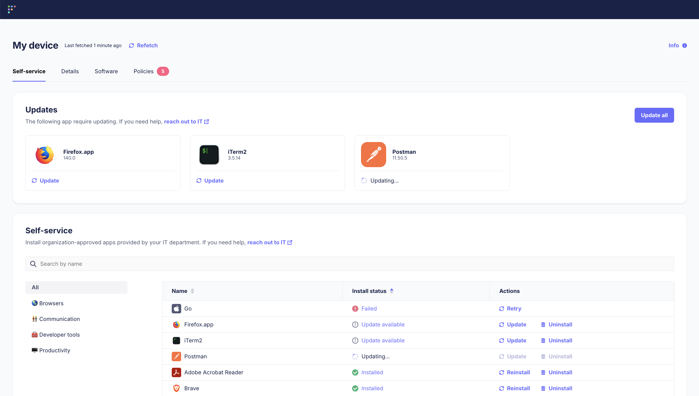

# Software self-service



_Available in Fleet Premium_

Fleet’s self-service software lets end users update and install approved apps from a curated list on the **Fleet Desktop > Self-service** page—no IT ticket required. This reduces overhead for IT and keeps teams productive. This guide covers how to add, install, and update self-service software in Fleet.

## Add software

1. Select the team to which you want to add the software from the dropdown in the upper left corner of the page.
2. Select **Software** in the main navigation menu.
3. Select the **Add software** button in the upper right corner of the page.
4. Pick a [Fleet-maintained app](https://fleetdm.com/guides/fleet-maintained-apps), [App Store (VPP) app](https://fleetdm.com/guides/install-vpp-apps-on-macos-using-fleet#add-the-app-to-fleet), or upload a [custom package](https://fleetdm.com/guides/deploy-software-packages).
5. Check **Self-service** to make it immediately available for self-service.

You can also add the software and later make it available in self-serivce:

1. Select the team to which you added the software from the dropdown in the upper left corner of the page.
2. Select **Software** in the main navigation menu.
3. To make it easier to find your software, select the **All software** dropdown and choose **Available for install.** This filters the results in the table to show only software that can be installed on hosts. If you don’t see your software, page through the results or search for your software's name in the search bar. Once you find the software, select its title.
4. Select the pencil (edit) icon, then check **Self-service** in the **Options** section. You can also assign categories to your software, which will organize the display of software to end users on the **My device > Self-service** page.
5. Select the **Save** button.

If a software item isn't made available in self-service, end users will not see it in **Fleet Desktop > Self-service**. IT admins can still install, update, and uninstall the software from Fleet.

## IT admin experience

How to view, update, install, or uninstall self-service software:

1. Go to **Hosts**.
2. Select a host to go to the Host details page
3. Open the **Software > Library** tab and select **Self-service** in the dropdown.
4. To update, install, or uninstall, select **Update**, **Install**, or **Uninstall**.

**Update** appears for [eligible updates](#how-updates-works), regardless of whether the app is set to self-service.

Tips:

- Use the **Software > Library** table to quickly identify and action pending updates.
- When a software install or uninstall fails, select **Failed** to see error details that can help with troubleshooting.
- To automatically install software, you can use Fleet's policy automations. [Learn how](https://fleetdm.com/guides/automatic-software-install-in-fleet).

## End user experience

How to update, install, or uninstall self-service software:

1. Find the Fleet icon in your menu bar and select **Self-service.** This will open your default web browser to the list of self-service software available to update, install, or uninstall.
2. If updates are available, end users can update one or all available self-service software. They can also can view update progress and error info directly.

## API

Fleet provides a REST API for managing software, including self-service software packages.  Learn more about Fleet's [REST API](https://fleetdm.com/docs/rest-api/rest-api#software).

## GitOps

To manage self-service software using GitOps, check out the `software` key in the [GitOps reference documentation](https://fleetdm.com/docs/using-fleet/gitops#software).

> Note: When managing Fleet via GitOps, software packages uploaded using the web UI will not persist unless they are also added in GitOps using the `hash_sha256` field.

## Advanced

### How updates works

When Fleet shows **Update** instead of **Install**:

- The the software is already detected in Fleet's software inventory (software installed on the host).
- A newer software version was added to Fleet. This version is newer than at least one version of the software in Fleet's software inventory.
- **Update** isn't shown if Fleet can't detect the version info for the added software or the software detected by Fleet in software inventory.

Currently, if host has two versions of the software installed, with each version installed in different locations, Fleet can only upgrade one version. In this scenario, Fleet will still show **Update**. If this happens, the best practice is to run a custom script to uninstall the old version. Here's an example script that removes a copy of Google Chrome present in a macOS host's Downloads/ folder:

```
TODO
```

For more technical detail and edge cases, checkout to the [software self-service diagram](TODO).

### Statuses

When an install, uninstall, or update is triggered by an IT admin or end user in the Fleet UI or by an end user—Fleet continuously monitors (["polls"](https://en.wikipedia.org/wiki/Polling_(computer_science))] and surfaces a loading status (ex. "Installing...").

- If the host is online, Fleet will poll automatically every 5 seconds to check for completion. When the install, uninstall, or update completes or fails, the status will update without the IT admin or end user having to reload the page.
- If the host is offline, IT admins see an pending status. When pending, the action has not started on the host. IT admins can cancel pending actions on **Host details > Acvitity > Upcoming** tab.

<meta name="articleTitle" value="Software self-service">
<meta name="authorFullName" value="Jahziel Villasana-Espinoza">
<meta name="authorGitHubUsername" value="jahzielv">
<meta name="category" value="guides">
<meta name="publishedOn" value="2025-06-20">
<meta name="articleImageUrl" value="../website/assets/images/articles/software-self-service-1600x900@2x.png">
<meta name="description" value="This guide will walk you through adding apps to Fleet for user self-service.">
