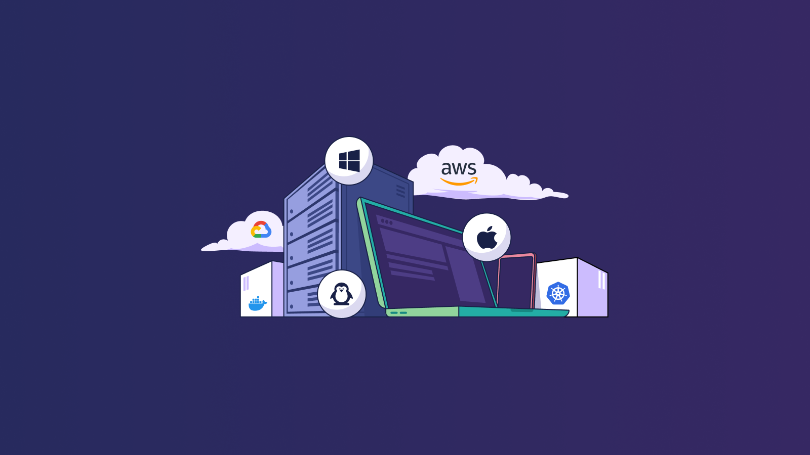

# State of Device Management report 2022.

Businesses are powered by the devices their employees use: laptops, tablets, smartphones, and other mobile technology. Some of these devices are issued by the organization, but many are personal devices on which employees conduct their work — and in today’s remote environment, that work could happen anywhere.

But how does an organization manage those devices? Do they know if their devices are compliant and secure? Do they have ways to query them to learn more about their status in real time? Or are organizations unprepared and overwhelmed with trying to manage thousands or hundreds of thousands of endpoints?

At Fleet, we help security teams, and IT professionals track and secure their organization’s laptops and servers. But outside of the organizations we work with, we wanted to know more about the current state of device management in general, in order to better understand how security teams are managing their endpoints. What we found indicates that organizations may not be managing devices as successfully and thoroughly as they should be in order to keep themselves safe.

We hope you consider these insights and findings as you build your device management strategy in 2022.

[Read the full report](https://fleetdm.com/reports/state-of-device-management)

<meta name="category" value="report">
<meta name="authorFullName" value="Mike McNeil">
<meta name="authorGitHubUsername" value="mikermcneil">
<meta name="publishedOn" value="2022-06-20">
<meta name="articleTitle" value="State of Device Management report 2022">
<meta name="articleImageUrl" value="../website/assets/images/articles/state-of-device-management-report-1600x900@2x.png">