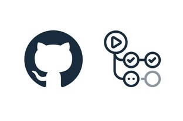
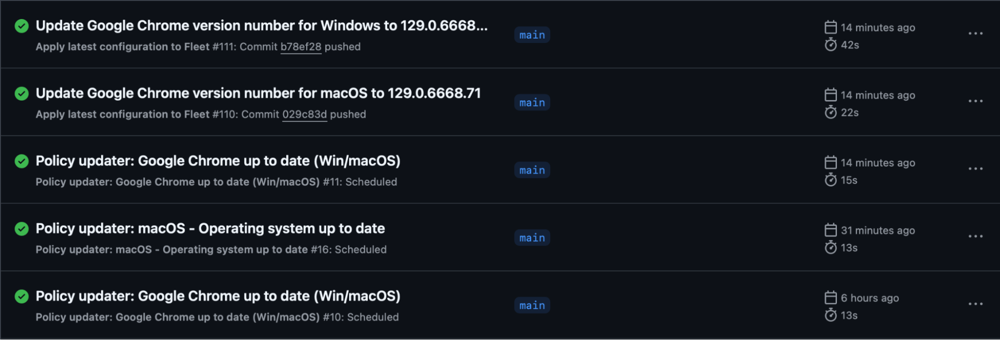
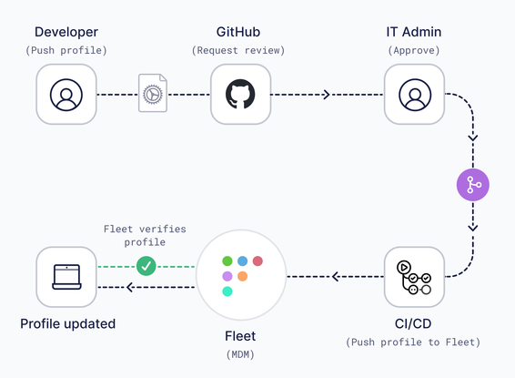

# Sysadmin diaries: GitOps: A strategic advantage for automation, collaboration, and cost savings

_This diary entry was originally published on [Allen's LinkedIn](https://www.linkedin.com/pulse/gitops-strategic-advantage-automation-collaboration-cost-houchins-a4luf/)._

For many IT professionals, the idea of GitOps might seem daunting, if not completely foreign. I can relate to this. I’ve spent over two decades contributing at every level of IT, from individual contributor to executive leadership, and until recently, GitOps was something I had never implemented. It felt like a complex, high-barrier concept that no one adequately explained in terms I could quantify.

As an IT leader, I often prioritized immediate business needs over initiatives that seemed more technical or abstract, especially those I didn’t fully understand. GitOps, at first glance, fell into that category. While the term GitOps might be newer, the principles behind it aren’t. Its roots lie in familiar DevOps and Engineering methodologies. GitOps has helped these groups become efficiency wizards orchestrating complex testing, builds, and deployments through centralized code repositories and automations. 

Imagine applying those same principles to your entire IT infrastructure and applications. GitOps is something you can approach gradually, finding small wins to build upon, even with the smallest steps. But before you invest any time, why should you care?

GitOps is no longer just for DevOps teams. IT professionals, Information Security and compliance experts, people leaders, and Executives alike should consider it a cornerstone of our operations. It’s time to start thinking about GitOps capabilities as a critical factor in decision-making, whether you’re evaluating new tools or renewing existing ones.

## Information technology

According to *[Okta’s Businesses at Work 2024 report](https://www.okta.com/resources/whitepaper-businesses-at-work/)*, IT teams manage an average of 93 apps globally—some more, some fewer. That’s potentially 93 different systems to context-switch between, each with its own UI, change management process, and configuration quirks. To complicate matters, these systems aren’t usually managed by a single IT team. For instance, network systems might be handled by one group and productivity applications by another, while IT support often requires access across the board.

GitOps changes that dynamic. By centralizing configuration management, GitOps offers full visibility, allowing every team to access the information they need to be more effective. Better yet, it standardizes how contributors interact with systems by using a common “code language,” empowering them to collaborate on areas they wouldn’t usually have administrator rights over. This is one of the most effective ways to break down silos and foster collaboration across traditionally separate groups.

GitOps enables IT teams to unlock greater value through automation, allowing them to focus on more engaging, creative challenges that require human ingenuity—while leaving the repetitive, mundane tasks to the machines. For example, I want to ensure my end users’ devices are running the latest version of Google Chrome. Without GitOps, I’d need to manually monitor for updates and adjust compliance criteria whenever a new version is released.

With GitOps, however, I can automate both the monitoring of Chrome updates and the adjustment of compliance criteria, creating a true “set it and forget it” workflow. This not only saves time but also ensures that compliance is maintained seamlessly, without manual intervention.

## Information security & compliance

The best Information Security and Compliance teams aim to protect the company’s assets and customers’ data without negatively impacting user productivity or privacy. However, achieving this balance can be tricky, as security needs often conflict with user autonomy. These teams are also responsible for accessing corporate systems to verify and audit configurations, which can sometimes create friction.

A GitOps-centric environment can help ease this tension by fostering a culture of trust and transparency. Instead of multiple touchpoints, both security teams and end users can access a centralized repository, a single source of truth, for all configuration data. This level of visibility streamlines audits and builds trust, ensuring that security doesn’t feel like “big brother” hovering over end users. It creates an environment where operational teams and users feel empowered, with clear, mutual access to critical information.

Most systems offer little or no change management features. At best, they might say, “An admin made a change to this setting” and display what was updated. At worst, they might just say, “An admin made a change” without further details. Not only that, but information security and compliance teams don’t want to hunt for this data across various systems, which leads to the creation of centralized logging systems. These shortcomings also result in teams creating complex ticketing systems to propose, approve, and track changes, inevitably leading to the dreaded change management meeting—a time-consuming and often uninspiring process. They’re typically boring and take us away from more engaging, skill-appropriate tasks. However, With GitOps, every change across every system is tracked in one centralized location. This allows full visibility into each proposed change and its outcome and space for questions and comments. More importantly, anyone can propose changes or solutions, ensuring that the entire team feels involved and invested in decisions that impact them. GitOps doesn’t just streamline the process; it fosters collaboration and ownership in a way that traditional methods can’t.

## Leadership & executives

Let’s face it: you’re juggling competing priorities with constant pressure to increase efficiency and justify spending. While the pitch for GitOps sounds appealing, you’re a realist and know it will require an investment. It may not be strictly financial, but it will demand time and focus from your team. You’ll need to reprioritize commitments to ensure a meaningful return on the effort spent improving efficiency and meeting business demands. This is why GitOps should be introduced as a core strategy from the top down. It requires a shift in mindset and workflow, which might spark a cultural transformation within your organization.

Beyond the tangible benefits, GitOps offers a host of unrealized gains that could have an even bigger impact on your business. Yes, it may be challenging at first, but you’ll be upskilling your team along the way. Learning something new is rarely easy, but support and investing in training will pay off. As your team implements greater automation, you’ll uncover opportunities to streamline processes and eliminate redundant systems, ultimately driving down costs. While licensing reductions are easy to quantify, it’s just as critical for leaders to communicate the story of time and efficiency savings.

Perhaps most importantly, you’ll see a morale boost. Your teams will engage in more meaningful, stimulating work, and the skills they develop in one system will transfer across many others, multiplying their value to the business. This kind of transformation drives productivity and enables your team to become true force multipliers across the entire organization.

## Where do you go from here?

Some of you may already be well along your GitOps journey. If that’s the case, I encourage you to share your insights through conference presentations or by open-sourcing your solutions. By doing so, you can help others navigate similar challenges and showcase the real-world benefits of GitOps.

For those yet to begin, [Fleet](https://fleetdm.com/) is a great place to start. Not only will you be setting up a system that provides comprehensive visibility and insights into all your devices, Fleet also provides an [easy-to-understand GitOps repository to help you get started](https://github.com/fleetdm/fleet-gitops).

I hope this discussion has piqued your interest and given you the confidence to explore GitOps further. It should be at the top of your decision-making criteria during purchasing and renewal cycles for any software or systems you manage. For IT professionals, imagine becoming the hero of work automation and enhancing the services you provide to your customers. For InfoSec and compliance teams, picture gaining faster and deeper visibility into how devices in your environment are configured, whether on-prem or in the cloud, and having one location to run queries and enforce policies. For executives and leadership, envision a more engaged, motivated, and productive team that consistently helps you meet operational goals while driving down costs.

Good luck on your GitOps journey, and don’t hesitate to [reach out if you have questions or want to learn more](https://fleetdm.com/support)!

<meta name="articleTitle" value="GitOps: A strategic advantage for automation, collaboration, and cost savings">
<meta name="authorFullName" value="Allen Houchins">
<meta name="authorGitHubUsername" value="allenhouchins">
<meta name="category" value="guides">
<meta name="publishedOn" value="2024-09-27">
<meta name="articleImageUrl" value="../website/assets/images/articles/sysadmin-diaries-1600x900@2x.png">
<meta name="description" value="This diary entry explores why GitOps will save time, money and effort.">
