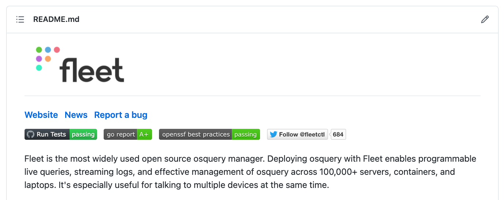

# Tales from Fleet security: GitHub configuration and OpenSSF Scorecards

*The goal of Scorecards is to auto-generate a “security score” for open source projects to help users as they decide the trust, risk, and security posture for their use case. This data can also be used to augment any decision making in an automated fashion when new open source dependencies are introduced inside projects or at organizations.*

At Fleet, we do our work in public. Our code is open source. Customers and open source users use it with [osquery](https://osquery.io/), another great open source project. We want to provide quality software and a method for potential users to assess the maturity of our security.

Security maturity assessments are a complex topic. We felt we could start by providing *some* metrics and information to those looking at using anything from the Fleet [GitHub repository](https://github.com/fleetdm/fleet). Through the process of acquiring the metrics, we would discover things we can improve as well.

While researching how we could achieve this goal, we noticed that the Open Source Security Foundation ([OpenSSF](https://openssf.org/)) [published](https://openssf.org/blog/2020/11/06/security-scorecards-for-open-source-projects/) a project that aims to address this issue at scale.

OpenSSF built Scorecards so that anyone can run it against a repository. It checks that a repository is maintained, that automation is in place to manage dependencies, that automated tests are in place, that code is reviewed, [and more](https://github.com/ossf/scorecard#scorecard-checks). [Public data](https://github.com/ossf/scorecard#public-data) is gathered for popular projects and projects opting to submit results.

You can install Scorecards on Mac (*brew install scorecard*) or Linux, create a GitHub token, and run it in less than 3 minutes.

*scorecard — repo [https://github.com/fleetdm/fleet](https://github.com/fleetdm/fleet)*

You can also run it against packages in *npm*, *PyPI*, or *RubyGems*.

When we started using Scorecards to measure our own repository, our score hovered around 4.9. It now goes from 5.8 to 6.2, and we plan to continue improving it.

### What we changed

At Fleet, we put almost everything we do in the same [repository](https://github.com/fleetdm/fleet). That means that front-end code, back-end code, documentation, and more are stored there, making it harder to set specific policies on the entire repository. The main advantage to this, in this case, is that we also do not have to configure dozens of different GitHub repositories. If we did, we’d certainly look to [OpenSSF Allstar](https://github.com/ossf/allstar) for automation.

### Deployed Scorecards as a GitHub Action

We started by deploying the Scorecards GitHub [Action](https://github.com/fleetdm/fleet/blob/main/.github/workflows/scorecards-analysis.yml). In our configuration, we allow uploading the data back to OpenSSF, which will be leveraged in the future by a Scorecards badge, and we upload artifacts to GitHub as a [SARIF](https://www.oasis-open.org/news/announcements/static-analysis-results-interchange-format-sarif-v2-1-0-is-approved-as-an-oasis-s/) (Static Analysis Results Interchange Format) file.

By doing this, issues found by Scorecards at each execution are uploaded to the *Security* tab of our GitHub project, allowing us to detect new issues quickly.

### Enforced code reviews

We already were doing code reviews on almost everything, but we were not enforcing it in the repository for the main branch. We now do.

One of the challenges this brings when using a *monorepo* is that areas of the repository are not security-relevant and do not benefit from code reviews. For this reason, we have automated code review approvals applied to those directories, leaving us free to enforce code reviews on the repository in general.

### Secured multiple GitHub Actions

We have secured many GitHub Actions/workflows by configuring explicit permissions for jobs. That way, if one of the Actions was compromised, its access to the repository is limited.

We have also eliminated Actions that granted access to important secrets from PRs. PRs should be considered “untrusted input.”

In addition, we pinned actions with hashes to ensure we only run the version we’ve picked and never a version with extras 😅. StepSecurity has a [great tool](https://app.stepsecurity.io/) to speed that process up!

### Configured Dependabot

We now use Dependabot to automatically create PRs when security updates should be applied to dependencies.

As Scorecards cannot read from “admin” APIs on the GitHub side, we have also created a [dependabot.yml](https://github.com/fleetdm/fleet/blob/main/.github/dependabot.yml) to update our GitHub actions. That way, Scorecards knows we are using Dependabot, but in reality, most of the value comes from enabling Dependabot from GitHub security. Automated PRs run for our go and npm dependencies, not just GitHub actions (as described in dependabot.yml).

### Added the CII Best Practices Badge

*Screenshot from README.md on Fleet repository showing the OpenSSF best practices badge as passing.*

We have added the CII Best Practices / OpenSSF Best Practices badge to the Fleet repository, to show that we’re passing that set of tests.

### What we’d like to improve next

In the short term, we’ll continue making improvements to the security of the Fleet repository. Scorecards itself is also getting better with new tests being added and false positives being eliminated.

Specifically, we are planning to:

1. Continue improving the security of our GitHub workflows, especially as OpenSSF keeps improving the detections for risky configurations.
2. Improve how we sign releases, providing a GPG signature on top of the hashes we currently offer.
3. Pin dependencies more consistently across the repository.

Over a longer period, we are also planning to add DAST (Dynamic application security testing) and to evaluate projects such as OSS-Fuzz, to see if Fleet could be one of the projects they perform fuzzing on.

### What you should do

If you have read this far, you’re probably already thinking of ways you can use tools like Scorecards in your daily work.

1. Compare our [GitHub security guide](https://fleetdm.com/handbook/security#github-security) with your current configuration.
2. Set Scorecard up in your repositories, and try to improve your score over time.
3. Add the [CII Best Practices Badge](https://bestpractices.coreinfrastructure.org/) to your public repositories to give everyone a quick way to see the maturity level of the repository.
4. If you use GitHub but for private repositories, try out [OpenSSF Allstar](https://github.com/ossf/allstar) to secure them. You can also use tools like [Peril](https://github.com/JupiterOne/peril) by JupiterOne to evaluate the risk on each pull request.
5. Install the command-line version of Scorecard and start checking the scores of projects you use. When you find critical issues, create an issue for the project, or better, submit a PR to fix it!

### Want to discuss this further?

Feel free to drop in our [#Fleet](https://fleetdm.com/slack) Slack Channel to discuss anything security-related with us!

### What’s next?

Stay tuned for our next article in the Tales from Fleet security series!

<meta name="category" value="security">
<meta name="authorFullName" value="Guillaume Ross">
<meta name="authorGitHubUsername" value="GuillaumeRoss">
<meta name="publishedOn" value="2022-04-15">
<meta name="articleTitle" value="Tales from Fleet security: GitHub configuration and OpenSSF Scorecards">
<meta name="articleImageUrl" value="../website/assets/images/articles/tales-from-fleet-security-github-configuration-and-openssf-scorecards-cover-1600x900@2x.jpg">