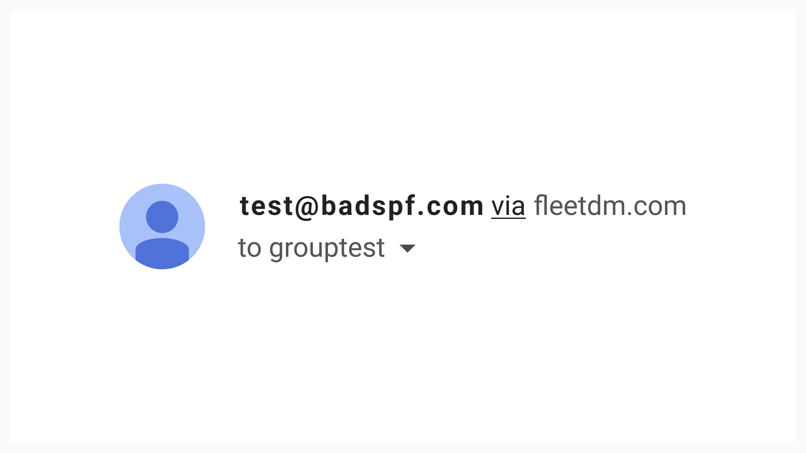
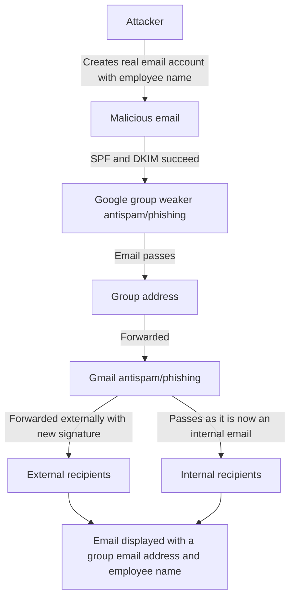

# Tales from Fleet security: scams targeting Google Groups

Our handbook contains detailed information on how we have configured Google Workspace [to block spam and phishing](https://fleetdm.com/handbook/security#email-security). Gmail has some exciting email security features, such as flagging or blocking mail from people with the same name as employees or quarantining it.

These features are great for protecting from business email compromise (BEC) and other types of social engineering attacks.

With this configuration, many of the less targeted, basic attempts at BEC get filtered, which is why an attempt we received a few weeks ago caught our attention. 

Google Groups mailing lists have much weaker protection, and the Gmail security settings could create a false sense of security.

## Attack goal
The attacker(s) seemed interested in obtaining copies of unpaid invoices from Fleet to our customers. 

As this seems to have been attempted by a BEC group, we think they likely wanted to obtain unpaid invoices so they could trick our customers into paying an actual invoice into the wrong bank account. 

Even people well trained against these types of scams could fall to it, especially if the actual invoice they receive is the one they expected all along!

To obtain these invoices, the attacker impersonated a salesperson. Salespeople requesting copies of invoices could make sense, as they are often paid commissions or bonuses on sales and might get in touch with clients to make sure invoices are well received.

## How it got through
As we have employee impersonation protection enabled, we were surprised that such a simple malicious email made it through the Gmail filters.

The attacker sent the message to a _group/mailing list_, not an individual. The email had a valid DKIM signature, as a real email account was used, with only the name spoofed.

Once Google Groups processes the email, it forwards it to internal and external recipients. Since Groups is the one sending the message, with a *from* that is now in the domain used for Google Workspace, the DKIM signature is valid. Internal recipients receive it without additional filtering, as it is a trusted internal email. External recipients receive it with a very high chance of delivery as the message is authenticated correctly and comes from a domain they interact with regularly.

From a UI point of view, the recipient can easily mistake the message for a legitimate one, as the domain name is either replaced with the legitimate domain or gets the mention "via legitimatedomain.com" added.

Our mistake was assuming the message went through the same filters used for regular email. In reality, Google Groups uses different technologies for filtering spam, and the more advanced Gmail features do not apply.

### Email processing

We contacted Google to ask why this message made it through filters. They confirmed that the filters are different on Groups vs Gmail (emphasis ours) in a response to our issue:

<blockquote purpose="large-quote">
Regarding your case, I understand that you see in the header this emails passing the authentication methods when it goes to group, in the message headers for emails sent to a group, you will see two authentication checks, the one done to your Group, because it comes from your group to your domain, that always passes as it is expected due to your domain is fully authenticated with SPF, DKIM and DMARC policy, and there is another authentication check for the original sender below on the message header, still the authentication methods are always checked by the the Groups spam moderation filter, as well by the users spam filter, which are <strong>separate spam filters</strong>.
</blockquote> 

We then asked if any of the advanced spam filter rules from Gmail worked in Google Groups:

<blockquote purpose="large-quote">
Indeed. Currently, the <strong>Advanced Safety phishing and malware protection</strong> feature, which is within the <strong>Admin console' https://admin.google.com > Apps > Google Workspace > Gmail > Safety > Spoofing and authentication ></strong> the option for <strong>Protect against spoofing of employee names</strong> only applies to users as recipients and not the groups, I'm afraid at the moment the only option available for groups in that section is called <strong>Protect your Groups from inbound emails spoofing your domain</strong>.
</blockquote>

In this case, the attacker didn't spoof our domain, so enabling this feature did not help. 

Two weeks after this happened, we saw a [Tweet](https://twitter.com/Centurion/status/1549780307544379392?s=20&t=aehcFzyPfH_56fCLGpRddA) by Chris Long at Material security, who had written a [blog post](https://material.security/blog/identify-google-groups-vulnerable-to-spam-and-spoofing) on this topic.

Chris and Material tested and realized that Google Groups delivered five out of six types of spoofed emails while Gmail blocked all six. They also figured out why the original email was replaced with the mailing list email, as Google Groups replaced it when the DMARC policy caused the delivery to fail. 

We performed the same tests at Fleet, using [emailspooftest](https://emailspooftest.com/). Our results were slightly different, but we successfully sent two very suspicious email messages to a mailing list. When we sent the same type of email to an individual, Gmail blocked each attempt.

## How we noticed and stopped the attack

At Fleet, we have excellent employees and contractors with amazing eyes for detail. We share information about potential scams, including phishing messages, over Slack, so the entire company is always aware of the suspicious stuff we see.

The person who received the email found it, if not necessarily suspicious, at least out of the ordinary. They contacted someone else to ask if that type of request was normal. This second person confirmed that it was not a genuine request and that, in any case, unpaid invoices should never be shared like this, even if the request came from an actual employee.

We communicate internally almost exclusively using Slack. Unlike email, impersonating someone on Slack would require compromising accounts configured with Two-Factor Authentication, making it a much more appropriate channel to discuss anything sensitive.

## Recommendations

1. Warn and train all employees to be even more careful with mail sent to a mailing list, specifically that if an email is sent "via" your domain, it has a high probability of being spoofed.
2. Use a tool like [emailspooftest](https://emailspooftest.com/) as recommended by Material Security to test your filters. Try a regular user, then a group. Adjust your assumptions.
3. Limit the number of Google Groups that can receive external emails.
4. Limit the number of internal users that can send emails "on behalf" of a group, to prevent legitimate emails from being sent "via" the group and makeing people accustomed to seeing them.
4. Avoid using common/obvious names for mailing lists.
5. Apply Material Security's [recommendation](https://material.security/blog/identify-google-groups-vulnerable-to-spam-and-spoofing) to flag unauthenticated emails to groups.
6. Train your accounting teams to never respond to such requests via email but to contact individuals through a safer way, such as Slack.
7. Train your accounting teams to share files using services such as Google Drive, with explicit sharing to other employees within the domain. That way, even if someone agrees to give our fake salesperson access to invoices, the person who will get access is the actual employee.

**Special request**: If you use Google Workspace with Groups for mailing lists, please perform the [emailspooftest](https://emailspooftest.com/) tests and open a support case with Google asking them to get Groups protection on par with Gmail. Without that happening, all the security we apply to individual accounts is moot unless you somehow have an entire company that does not need any mailing lists!

With the BEC cases explosion, we hope Google introduces more advanced spam filtering to Google Groups. We should not have to consider running email through a generic standard Gmail account and forwarding it from there instead of using Google Groups!

### Want to discuss this further?

Feel free to drop in our [#Fleet](https://fleetdm.com/slack) Slack Channel to discuss anything security-related with us!

### What’s next?

Stay tuned for our next article in the Tales from Fleet security series!

<meta name="category" value="security">
<meta name="authorFullName" value="Guillaume Ross">
<meta name="authorGitHubUsername" value="GuillaumeRoss">
<meta name="publishedOn" value="2022-08-05">
<meta name="articleTitle" value="Tales from Fleet security: scams targeting Google Groups">
<meta name="articleImageUrl" value="../website/assets/images/articles/tales-from-fleet-security-google-groups-scams-cover-1600x900@2x.jpg">

