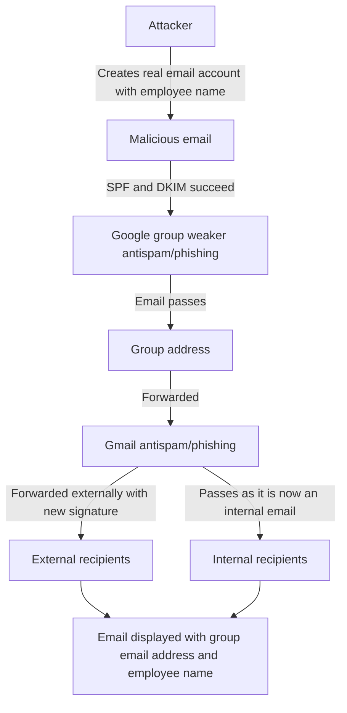

# Tales from Fleet security: spam targeting Google Groups

Our handbook contains detailed information on how our Google Workspace environment is [configured to block spam and phishing](https://fleetdm.com/handbook/security#email-security). Gmail has interesting and useful features, such as the ability to flag mail coming from people with the same name as employees, or even quarantining it.

These features are great to protect from business email compromise (BEC) as well as other types of social engineering attacks.

At Fleet, we had received few "employee/CEO impersonation" type emails that looked real and made it through the filters thanks to these settings, which is why an attempt we received a few weeks ago caught our attention.

## Attack goal
The attacker(s) seemed to be interested in obtaining copies of invoices from Fleet to our customers. This can be used for nefarious purposes, and it certainly would leak who our customers are.

As this seems to have been attempted by a BEC group, we think it is likely they wanted to obtain unpaid invoices so they could trick our customers into paying a real invoice into the wrong bank account. Even people well trained against these types of scam could fall to it, especially if the actual invoice they receive is the one they expected all along!

## Pretext
To obtain these invoices, the attacker impersonated a sales person. Sales people requesting copies of invoices could make sense, as they are often paid commissions or bonuses on sales, and might get in touch with clients to ensure invoices are well received.

## How it got through

Since we flag emails coming from external domains when the name of the sender is the same as an employee (heads up, if your name is Guillaume Ross and you keep trying to send us your resume, hit me up via another channel!), we were surprised that such a simple malicious email made it through the Gmail filters.

Our mistake was assuming that they did go through them. In reality, Google Groups uses a different set of technologies for filtering spam, and the more advanced Gmail features do not apply.

The email was addressed to a *group* and not an individual. The email had valid SPF and DKIM, as it was sent from a real email account and only the *name* was suspicious. Once the email is received by Groups, it is then forwarded to both internal and external recipients, again, with valid DKIM, as it is coming from our own domain this time. This means the internal recipients receive it, and the external recipients have a very high chance of receiving it, as it is coming from a Google Group they frequently receive email for.

The main UI issue making this issue even more dangerous is the name on the final email was the name of a legitimate employee, but the email address was that of the group, so the original malicious email address is not visibile easily anymore.

<meta name="category" value="security">
<meta name="authorFullName" value="Guillaume Ross">
<meta name="authorGitHubUsername" value="GuillaumeRoss">
<meta name="publishedOn" value="2022-08-05">
<meta name="articleTitle" value="Tales from Fleet security: spam targeting Google Groups">
<meta name="articleImageUrl" value="../website/assets/images/articles/tales-from-fleet-security-securing-google-workspace-cover-1600x900@2x.jpg">

## How we prevented it

## Recommendations

Google request