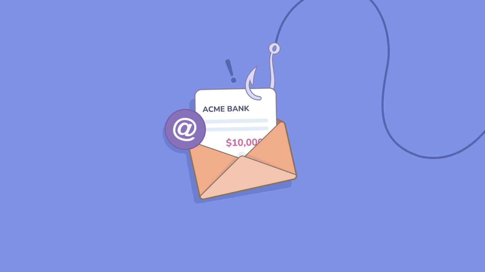

# Tales from Fleet security: securing bank accounts from business email compromise

According to the [FBI](https://www.ic3.gov/Media/Y2022/PSA220504), business email compromise (BEC) attacks are increasing in popularity yearly, costing organizations over 43 billion dollars in losses between 2016 and 2021.

As BEC is a form of social engineering, we often think education is the only way to reduce the odds of getting compromised. 

Security teams often focus on protecting IT assets only, but what could be more damaging to your company than having its bank account emptied fraudulently?

Since BEC typically targets one straightforward thing, money, there are controls we can implement to reduce the risk significantly. The parameters suggested in this post are those we found the most useful through our research. Unlike previous posts in this series, we cannot be as specific about how to enable them as every bank is different.

## Email configuration
While good email hygiene can't stop BEC, it can at least reduce the number of fraudulent emails that make it through and force criminals to work harder.

1. Require secure two-factor authentication (2FA) to access email, such as [FIDO U2F](https://fidoalliance.org/specs/u2f-specs-master/fido-u2f-overview.html) security keys. Using U2F keys makes the credentials phishing-resistant, lowering the risk of malicious access to your email accounts from being used to launch an internal BEC attempt.
2. Configure email security features such as [SPF, DMARC, and DKIM](https://support.google.com/a/answer/2466580?product_name=UnuFlow&hl=en&visit_id=637919491839685136-2075570827&rd=1&src=supportwidget0&hl=en). These help make it harder to impersonate your domain name in an email.
3. Configure spam filters to protect your organization from people impersonating employees from other domain names. On Google Workspace/Gmail, this setting is called **Protect against spoofing of employee names**, and you should enable it along with **Protect against inbound emails spoofing your domain**. 

You can find detailed instructions on configuring Google Workspace in our [handbook](https://fleetdm.com/handbook/security#email-authentication).

## Online banking configuration

The best email configuration ever is not enough to protect from BEC and other types of social engineering attacks. Something will always slip by, and we must assume that even well-trained employees will fall for a good enough attempt. 

If you think you can't fall victim to these emails, you probably have not received one that was sufficiently well-targeted and delivered at precisely the right time.

As defenders, we often say that while we must always be perfect, attackers only need to succeed once. As [Joe Slowik](https://www.dragos.com/blog/industry-news/the-myth-of-the-adversary-advantage/) explained in this excellent blog post a couple of years ago, that is seldom true. We defenders have the high ground, but we often fail to leverage it.

Since we know the attackers are looking for money, instead of trying to train people to be perfect at spotting scams, which is impossible, let's secure the cash!

### Authentication

If someone can break into your bank accounts directly, they won't need to come up with a convincing email or text message to convince you to move money. It is therefore critical to enable the most advanced security features your bank offers. Unfortunately, in North America, many banks fail to offer any 2FA or only offer SMS-based 2FA, which is the weakest form of 2FA but is still better than nothing.

0. Keep the number of people with online banking access as low as possible.
1. If available, enable 2FA. FIDO U2F, although very rare right now with banks, is preferable. Otherwise, use app-based 2FA. As a last resort, use SMS 2FA.
2. If a setting exists to make 2FA prompt either *always* or *when the risk level is high*, set it to *always*. Weaker options leave the doors wide open for someone to bypass 2FA.

Some banks allow organizational-level controls, but most do not. You might have to talk to everyone with access to your online banking and check their 2FA configuration, but if you don't have more than a handful, it's worth doing.

### Dual control for configuration

Many settings we recommend configuring require high privilege access to online banking. We have to assume that a well-informed attacker would be able to trick someone into changing those.

By enabling dual control, one administrator can make a change, but it will not be active until a second one approves it. This makes it much harder for social engineering attacks to succeed and protects these settings if a single account is compromised. 

### Alerting

Alerts are often triggered when something bad has already happened, but sometimes, there might still be time to fix things before they worsen. 

Depending on your bank, you might have various alerts you can configure. For example, [SVB](https://www.svb.com/private-bank/help/resources/digital-banking/managing-digital-banking-alerts) has security alerts as well as transaction alerts. 

If possible, enable at least the following:

1. Alert when a new recipient is added
2. Alert when a wire transfer is created (domestic or international)
3. Alert when an external transfer is created
4. Alert when an address or other contact information is changed
5. Alert on any transaction above a certain threshold, such as $10,000

Banks typically deliver these alerts via email, which is not ideal for rapid awareness. To improve that, create an email address never used anywhere else specifically for these alerts. You'll then be able to integrate that mailbox to other tools, like Slack, by using a [forwarding address](https://slack.com/help/articles/206819278-Send-emails-to-Slack#:~:text=To%20send%20an%20email%20to,see%20your%20email%20in%20Slack.). 
With this configuration, you can deliver these alerts in your administrative or accounting channel, where everyone can see them, create a thread and ask questions.

On top of email alerts, inform your accounting department that they should pay attention to push notifications from your online banking application. If you can keep the amount of "false positives" down and your accounting and finance are all in the same time zone, have a rotation for who will let the app notify them even when in do not disturb mode.

### Dual and triple approval

Most business banks allow customers to set thresholds above which the system will require multiple approvals.
A threshold of $10,000 before a second approval is needed makes sure that if an attacker compromised a single person, they could only send away money in $10,000 batches. Alerting remains essential as the total cost can grow pretty quickly, but it is much safer than allowing a single person to move millions of dollars.

Consider requiring three approvals for substantial transactions, as long as your team is large enough to accommodate this even when people are on vacation or unavailable for any other reason.

### ACH filters

ACH stands for Automated Clearing House, a network used for direct payments, especially in the US. If your company is in the US and deals with US vendors, you probably send most of your payments with ACH.

Many banks offer ACH filters on business accounts. These filters work like many security controls, using one of two main methods:

* In deny list mode, where you provide criteria to deny payments
* In allow list mode, where you give criteria to allow payments

Allow listing is safer but requires more work to implement. Some banks allow combinations of vendors and amounts, while others only allow lists of vendors. 

Before implementing ACH filters, obtain a list of all ACH transfers made in the last 18 months. Identify the vendors you have that are still active, the average amount you pay them, plus a buffer to cover increases, and then provide this list to your bank to enable ACH filtering in allow list mode. Have every other payment generate an **exception** that will require manual intervention.

That way, it will be much harder for a single person to send a large amount of money to an unauthorized vendor, and accidentally sending large transfers to legit vendors will be blocked.

### Training

To protect against BEC, we will always need to train people. No matter what technical controls are in place, by using urgency and well-crafted pretexts, criminals will always find a way to trick people into acting against the company's best interests.

If you require advanced training before implementing these basic controls, you fail your employees by not providing a system and processes with essential protection. Security teams and organizations must design and configure systems where they are reasonably safe before putting the burden of security on the end-users. Of course, security is everyone's responsibility, but how would you feel if your security team reminded you not to type your password on phishing websites before they had implemented 2FA for remote access?

## Checklist

- [ ] Access to email requires 2FA
- [ ] Phishing and spam filters are configured with strict settings to prevent user and domain spoofing
- [ ] Access to online banking requires 2FA
- [ ] Configuration changes require dual control
- [ ] Alerting is enabled
- [ ] Money transfers require a second or third approval with sensible thresholds 
- [ ] ACH filtering is in place in allow list mode
- [ ] All employees with access to online banking have received BEC training

## Next

Stay tuned for more articles in this series, where we describe how we secure Fleet. If you have any comments or questions, feel free to post them in the [#Fleet channel](http://fleetdm.com/slack) of the osquery Slack!

<meta name="category" value="security">
<meta name="authorFullName" value="Guillaume Ross">
<meta name="authorGitHubUsername" value="GuillaumeRoss">
<meta name="publishedOn" value="2022-07-15">
<meta name="articleTitle" value="Tales from Fleet security: securing bank accounts from business email compromise">
<meta name="articleImageUrl" value="../website/assets/images/articles/securing-bank-accounts-from-business-email-compromise-1600x900@2x.jpg">
