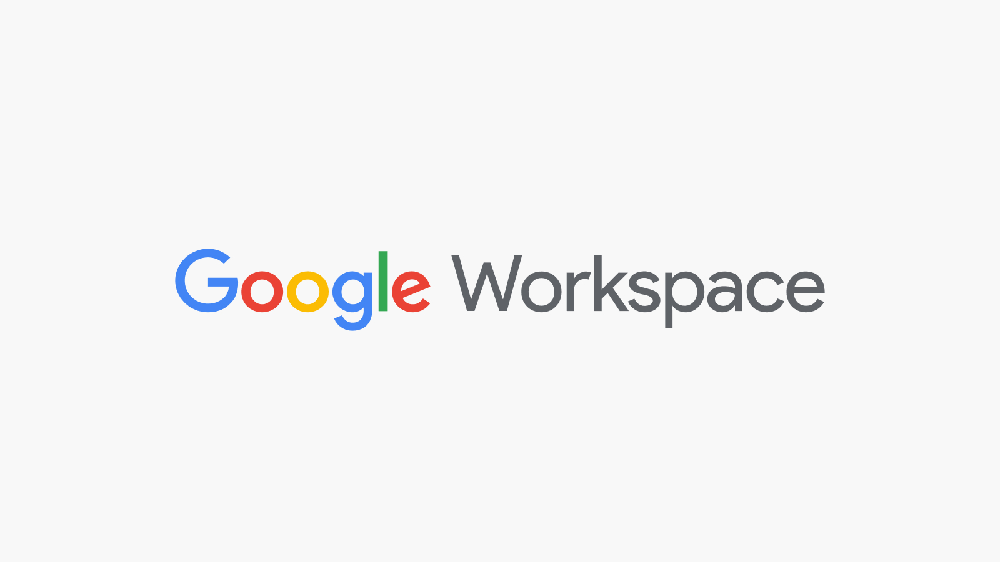
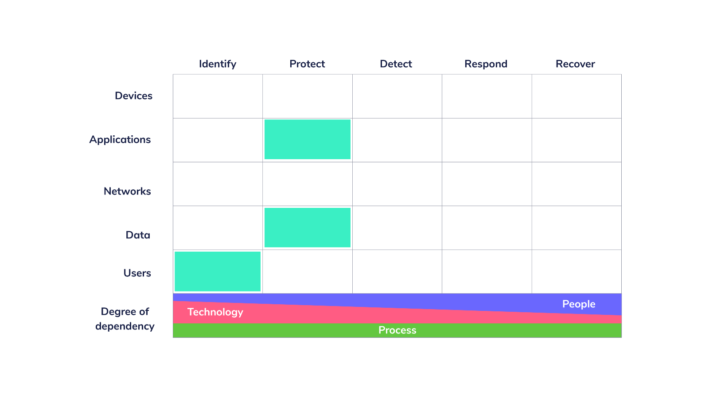

# Tales from Fleet security: Securing Google Workspace

At Fleet, we collaborate using various SaaS tools, from GitHub to Google Workspace and Slack. Since we use our Google identities for many of these, Workspace is the most critical one from a security point of view.

Our high-level goals are to:

- Secure Google Workspace
- Reduce the number of tools used (eliminate those that serve the same purpose)
- Use single sign-on (SSO) where possible or Google Auth where genuine SSO is not available.

Our complete configuration guide is available in the Fleet [handbook](https://fleetdm.com/handbook/security#google-workspace-security).

We focused on strengthening authentication, monitoring, email security, access to data, and Google Workspace from third-party applications.

Expressed on the [Cyber Defense Matrix](https://cyberdefensematrix.com/), we want to identify users correctly, using 2FA, to protect applications, in this case, the applications in Google Workspace. We also want to protect data contained in our Google Workspace environment by implementing access controls to limit third-party applications’ access to it.

## Challenges

Configuring Google Workspace is straightforward, but we did encounter a few challenges.

1. FIDO U2F hardware security keys are not ubiquitous yet, and their support isn’t. For example, macOS MDM enrollment uses a WebView that does not support them, forcing people to use a different computer to generate a code.
2. There is always [one-more-stupid-thing-that-does-not-support-SSO-or-only-does-if-we-pay-millions](https://sso.tax/).
3. Retroactively controlling third-party apps with access to Google Workspace can be challenging, as many workflows are already in place and many apps already have access to data.
4. Third-party email clients do not have good security UX compared to Gmail, which adds handy messages on top of suspicious messages.

## Overcoming those challenges

### 2FA/MFA/Two-step verification

We started by disabling the most unsafe methods (SMS and voice) and promoting the use of hardware security keys and [phones and tablets](https://support.google.com/accounts/answer/9289445?hl=en&co=GENIE.Platform%3DAndroid) as hardware security keys for access to Google. By the end of next week, all privileged access at Fleet will require hardware security keys, thanks to Yubico shipping to an extensive list of countries, making this easy to achieve in an international remote company.

Future Fleet hires will all get their keys as a part of our standard onboarding, and we plan to make our policy stricter until we reach the point where all 2FA requires hardware keys.

To support MDM enrollment, we limit the generation of codes to the user’s local network to mitigate some phishing scenarios. An alternate workaround would be to have a weaker 2FA policy which we could apply to users who need to enroll laptops. A simple oversight could lead to security issues, such as a user using the softer policy for months. It would be much better if every WebView in macOS supported FIDO U2F.

>Note: GitHub supports using your Mac with Touch ID as a key in Chrome. That is awesome.

### SSO and lack of SSO

Where it makes sense, we will upgrade to the tier needed to get proper SSO from other SaaS vendors. The extra spending is an annoyance, but having to disable 17 accounts manually every time someone leaves the company and worrying about password re-use and 2FA settings on all the same applications is not worth it.

There will always be apps that refuse to work with centralized identity. For those, we offer a commercial password manager, so at least people can generate safe passwords for those, and it is a safe avenue for sharing various types of secrets we don’t want to see in Slack.

### Third-party app permissions

Perfect is the enemy of good. First, we controlled the addition of new apps. Then, we reviewed existing ones one by one, based on how many users were using them. Starting with the most rarely used ones, we worked our way up and now have a good list that only includes products that have a legitimate business purpose and for which we understand and accept the risk. By doing this, access controls helped keep things under control while we took extra time to perform the clean-up.

### Effort

Securing Google Workspace in a small to medium organization can be done in a few hours. By enabling better 2FA policies and controlling the access third-party apps have, you can improve security significantly, almost instantly. Then, spend time cleaning up existing applications and getting security keys to everyone. There is too much benefit to be gained in a few hours to wait until you can get everything perfect.

In our case, writing up the guide for the Fleet [handbook](https://fleetdm.com/handbook/security#google-workspace-security) was done as we enabled each feature, which added a few hours to the process.

Even though you can make the changes quickly, communicate the changes in advance with colleagues. Locking out a remote workforce is not a great way to get them to love the security team 😅!

## Want to discuss this further?

Feel free to drop in our [#Fleet](https://fleetdm.com/slack) Slack Channel to discuss anything security-related with us!

## What’s next?

In my next post, I’ll cover how we deployed the [OSSF scorecard](https://github.com/ossf/scorecard) and how we have improved and will improve our score on it.

<meta name="category" value="security">
<meta name="authorFullName" value="Guillaume Ross">
<meta name="authorGitHubUsername" value="GuillaumeRoss">
<meta name="publishedOn" value="2022-03-25">
<meta name="articleTitle" value="Tales from Fleet security: securing Google Workspace">
<meta name="articleImageUrl" value="../website/assets/images/articles/tales-from-fleet-security-securing-google-workspace-cover-1600x900@2x.jpg">

