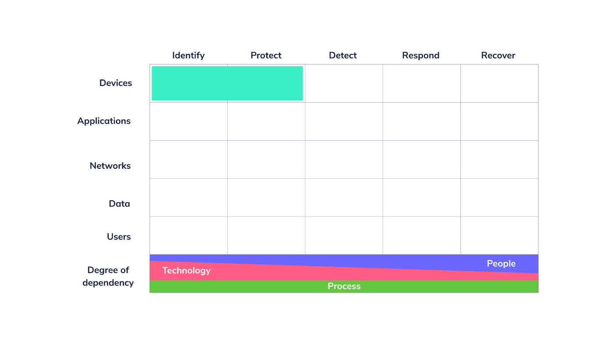
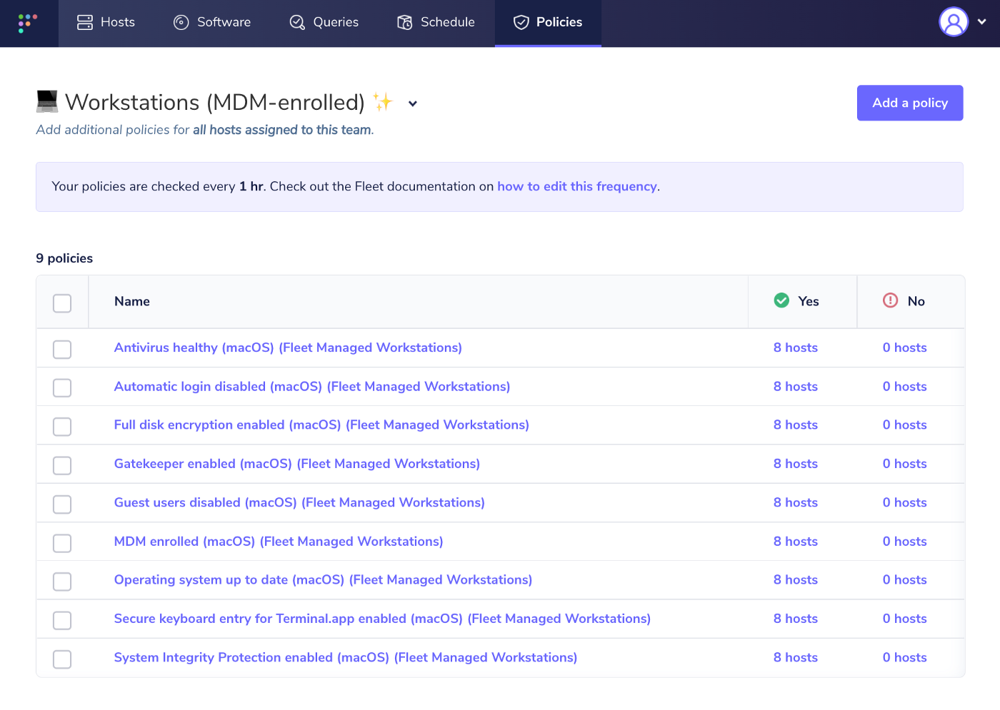

# Tales from Fleet security: securing the startup

Fleet is an all-remote company that makes open-source software. Openness is one of our core [values](https://fleetdm.com/handbook/company#values).

In this blog series, I will explain the process behind security here at Fleet. We document the how and why in our [handbook](https://fleetdm.com/handbook/security), but blogging is a better medium for covering the process that allowed us to reach those conclusions.

These articles will also contain links to different resources that will help you achieve the same goals in your environment.

Fleet has a very different attack surface than a bank, university, or large retail chain.

Like many startups, our environment consists of the standard kit:

- Laptops, all over the world.
- A domain name or two (or 12).
- SaaS Collaboration tools like Google Workspace and Slack.
- A source code management tool, which is GitHub in our case.
- The code itself!

In this first article in the series, I will explain the challenges we faced as well as the thought process we followed to secure our Macs.

## Simple and secure laptops

The old way of doing things when it came to laptops was to buy them, put a standard “[image](https://en.wikipedia.org/wiki/Ghost_(disk_utility))” on them, then hand them out to employees in person in an office.

This “funnel” approach allowed IT to inventory and configure systems before they left their physical grasp on them, but it doesn’t work anymore. First, [imaging has been dead](https://www.youtube.com/watch?v=pStw0zPZr_M) on macOS for a few years. Second, many companies don’t have an office! Finally, who wants a VPN? I know I don’t.

Our goal at Fleet is to make it easy for new hires to pick a Mac model, order it, and receive it. When they receive it, it must be protected by our [macOS security baseline](https://fleetdm.com/handbook) out of the box and report directly to our internal instance of Fleet.

If we express this using the [Cyber Defense Matrix](https://cyberdefensematrix.com/) terms, we want to improve identify and protect on our devices.

*The Cyber Defense Matrix is a great way to map what we are doing to improve security*

In the identify category, we want to ensure the inventory is maintained as high as possible in our supply chain at Apple. That way, every Mac we purchase is inventoried and configured automatically. We also want to identify vulnerabilities and configurations on those computers. We can do this with Fleet.

We then want to automatically protect those same devices by deploying our security baseline using MDM.

## Challenges

I thought using Apple’s Automated Device Enrollment (or Device Enrollment Program/DEP) would make that super easy.

Technically, I was not wrong, but there are non-technical challenges.

1. The requirements to establish an ADE account vary by country. In the US, for example, it requires a [DUNS](https://en.wikipedia.org/wiki/Data_Universal_Numbering_System) number. Getting a DUNS number is simple for US companies, but what is not easy is to fulfill similar requirements in every country where you would like to use ADE. We could not register for ADE in Canada. We have people in many other countries with a similar situation.
2. The delays for obtaining hardware are very long. When planning endpoint deployment strategies, we must consider this, as supply chain issues will not disappear soon.
3. The benchmarks made by the Center for Internet Security (CIS) are excellent but are incredibly long (700+ pages) and written for experts. We wanted to be transparent about why we configured company devices a certain way and explain it so everyone could understand without Googling for hours.

As a bonus, I locked the CEO out of Google Drive features 😅.

Amazingly, Google Drive does not allow downloading files if third-party cookies are blocked. Not a great thing to break when the CEO is trying to download a vital PDF to close a deal!

Google should offer more granularity than on/off for third-party cookies, such as a way to allow-list specific domains in Chrome policies. Until Google does, or we find a workaround, we have to leave third-party cookies as a setting managed by the end-user, which is great, but I would prefer if the default was for them to be disabled.

## Solutions

### ADE in other countries

First, we enrolled in ADE in the US. Once we had our customer numbers and Mobile Device Management (MDM) system linked up, we were ready to buy laptops in the US that would get configured out of the box. Then, we found a workaround for Canada. If you add Apple’s Reseller ID to [Apple Business Manager](https://business.apple.com/), you can order computers over the phone and have them linked to your business account. The Reseller ID part is critical. I learned that the hard way, by receiving a laptop ordered like this to find it not part of ADE. Fortunately, it was easy for me to [add it to ADE manually](https://support.apple.com/en-ca/guide/apple-configurator/welcome/ios).

We will keep trying the same approach in every country where we need Macs, though we know it will not be possible everywhere. We will either obtain equipment from a nearby country or rely on manual MDM enrollment by end-users for those countries.

### Delays

We adapted our onboarding procedures. We ordered laptops as soon as possible in the hiring process, but that was not enough since delays often take 4 to 8 weeks. Nothing would be more depressing for a new Fleetie than starting their new job and not being able to work for a few weeks. As someone who has suffered that pain many times before, I never would inflict it on someone else!

We configured our SaaS tools and developed [a strategy](https://fleetdm.com/securing/apply-byod-to-soothe-supply-chain-pain) that would allow people to work from personal devices while limiting the risk. As we grow and our exposure changes, we will keep rebalancing this strategy so new hires can be productive before receiving a company-owned laptop.

### Secure Configuration

Using the [CIS Benchmark for macOS 12](https://www.cisecurity.org/benchmark/apple_os), my own experience securing endpoints, and much feedback from the team, we defined our minimalist baseline. We then explained why we applied every setting and documented it in our [handbook](https://fleetdm.com/handbook/security#how-we-protect-end-user-devices). We created [policies](https://fleetdm.com/docs/using-fleet/rest-api#policies) to track compliance using Fleet and deployed the baseline via MDM.

*Policies applied to Fleet company-owned computers*

### Effort

Implementing our own security baseline, configuring our MDM and ADE required a couple of days of effort, mostly because I insisted on reviewing all of the CIS Benchmark to be certain I didn’t miss something important. Having everything published in our handbook required additional effort, but if you were to use our baseline, you could get started very quickly. The main thing that will slow you down is getting onboarded to ADE, and receiving your first laptop ordered!

## What's next?

In my next article, I’ll cover how we [secured Google Workspace](https://fleetdm.com/handbook/security#google-workspace-security), including getting those pesky third-party apps under control!

<meta name="category" value="security">
<meta name="authorFullName" value="Guillaume Ross">
<meta name="authorGitHubUsername" value="GuillaumeRoss">
<meta name="publishedOn" value="2022-03-17">
<meta name="articleTitle" value="Tales from Fleet security: securing the startup">
<meta name="articleImageUrl" value="../website/assets/images/articles/tales-from-fleet-security-securing-the-startup-cover-1600x900@2x.jpg">	
