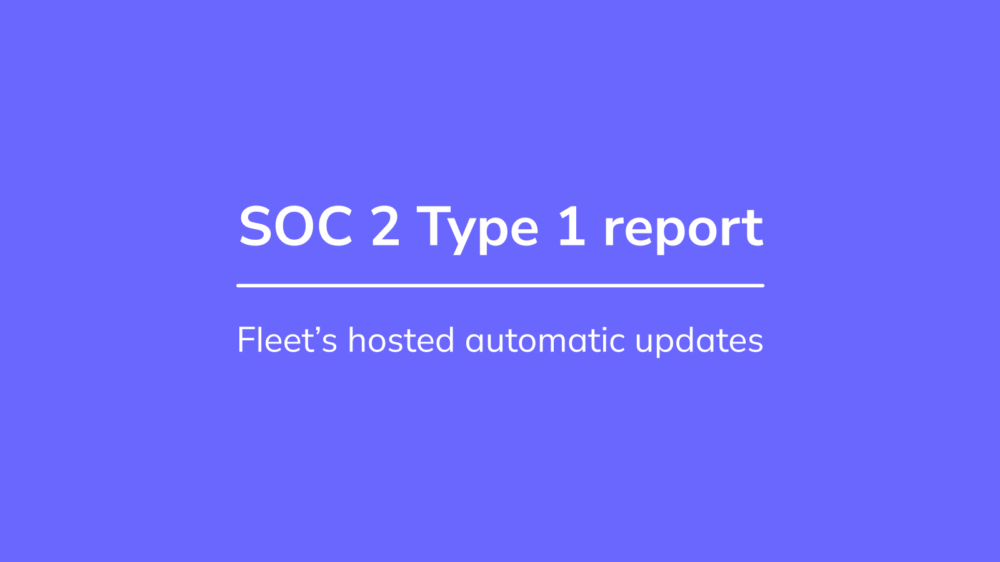

# Tales from Fleet security: how we achieved our SOC 2 type 1 rapidly

At Fleet, we strive to build a security program that answers the needs of everyone using our software. We want to push far beyond any compliance requirement and make as much of what we do available in our [handbook](https://fleetdm.com/handbook). We want to make it as easy as possible for customers to obtain the necessary information to judge Fleet's trustworthiness. 

For some of our customers, life would be easier if Fleet had a SOC 2 report, as that is a standard document they request and evaluate during the acquisition process. This post explains our strategy for getting a SOC 2 report.

We hope this post helps you achieve your own compliance goals!

## What is SOC 2?

Before starting a compliance effort, it's essential to understand what that involves.

SOC (service organizations controls) 2 is a report based on the AICPA's (Association of International Certified Professional Accountants) [trust services criteria](https://us.aicpa.org/content/dam/aicpa/interestareas/frc/assuranceadvisoryservices/downloadabledocuments/trust-services-criteria.pdf). 

Many companies claim to be "SOC 2 compliant" as if it was a simple checklist. In reality, the report is the auditor's opinion, using those trust criteria as a guide. SOC 2 is not a certification, but customers and prospects of a service provider can use a SOC 2 report to understand more about the provider's security program.

### Types

There are two *types* of SOC 2 reports: *type 1* and *type 2*. 

_Type 1_ concerns service provider systems and whether the control design is sufficient to meet the trust criteria effectively.

*Type 2* reports look at the effectiveness of those controls over time. Think of *type 1* as a snapshot and *type 2* as looking at months of evidence.

While we could've gone straight to a type 2, it requires operating the controls for months, so we felt it was more logical to perform the *type 1* first and move to *type 2* next time we have an audit performed.

### Trust criteria principles

SOC 2 criteria are part of one of these categories, called principles:

* Security (required)
* Availability
* Processing integrity
* Confidentiality
* Privacy

Security is by far the biggest category. As the only hosted service we have does not gather customer information and can be down without causing an immediate impact on customers, we decided only to do the security criteria. We may add categories as necessary as we add more features and services and grow our security program.

## Policies
One of the essential things about SOC 2 is having the right security policies. These policies need to cover the criteria, be approved by the right managers, and in some cases, read and agreed upon explicitly by employees.

Writing policies from scratch can seem daunting. Many compliance automation products have templates you can use to get started, but there are excellent free and open resources online.

As you can see, our policies are in our [handbook](https://fleetdm.com/handbook/digital-experience/security-policies#information-security-policy-and-acceptable-use-policy), and we created most of them using this [free set of templates](https://github.com/JupiterOne/security-policy-templates) published by JupiterOne under Creative Commons licensing.

We kept our policies as basic as possible to make sure everything in them is valuable and achievable. Having policies that state you must do the impossible is a surefire way of getting in trouble! The templates we used contained many processes and procedures as well. We used the policies and will eventually document more of our procedures in our handbook.

## Scope

Auditors need a description of the system they are auditing. While a lot of SOC 2 applies to the entire company, such as policies and human resource processes, the more technical aspects of SOC 2 should be used where it makes sense.

Fleet is a self-hosted application we distribute. We also make Orbit, which is an osquery runtime and autoupdater. We host automatic updates for people using Orbit. While this system is simple at a technical level, it is also critical from a security point of view. That's why we picked it as the system for which we wanted to get a SOC 2 report. 

Why is the hosted Fleet automatic update service critical? As it delivers files, an attacker could leverage it to deliver malware to Orbit users. That is something we work hard to prevent and will continuously improve. You can read more about how we handle updates with [The Update Framework](https://fleetdm.com/docs/deploying/fleetctl-agent-updates#securing-updates) in the [Fleet documentation](https://fleetdm.com/docs/deploying/fleetctl-agent-updates#securing-updates).

After picking this system to be audited, it became evident that critical tools such as GitHub, where our code (and much more) is stored, reviewed, and built, would need to be well secured. Thankfully, we had done much of the security work before SOC 2. This allowed us to focus on documentation and policies.

If you want to get your own SOC 2 report, make sure you get it for the systems where your customers are most concerned about security. That way, the information in the report is relevant to their vendor management needs. Requesting a compliance report from a vendor and receiving one with a scope utterly unrelated to what you use is a waste of time!

## Tools

Doing SOC 2 in 2022 is much easier for a small company than it's ever been before. So many tools on the market can help us automate compliance.

If I think of those that end with an _a_, there are [Drata, [Laika](https://heylaika.com/), and [Vanta](https://www.vanta.com/). There's also [secureframe](https://secureframe.com/), [Tugboat Logic](https://tugboatlogic.com/) and [Very Good Security](https://www.verygoodsecurity.com/control), and probably many more.

We picked Vanta because it had integrations for the most critical systems we needed to include in our scope:

* GitHub for code and issues
* AWS
* Google Workspace
* Background check providers

Vanta also has an [API](https://developer.vanta.com/recipes), which we might use in the future to automate more evidence collection and tracking of the status of controls.

If you're working on getting a SOC 2 report for your organization, compare different vendors and see which one integrates with the most tools you currently have and has the flexibility for more integrations in the future.

## Controls

In terms of controls, Vanta (and similar tools) come with a list of controls that it expects. They range from technical controls that can be checked automatically to policy, documentation, and controls for which no automation is available. These controls are derived from the SOC 2 criteria and are a good starting set, which we slightly customized to apply to our environment better.

By integrating GitHub, AWS, our background check provider, and our Google Workspace environment, the system automatically collected evidence for multiple controls. Here's a list of example controls that can be detected as met automatically, with evidence gathered by the system:

* Employee background checks performed (where we require it)
* Unique account authentication enforced
* Production network access restricted
* Password policy enforced
* Remote access MFA enforced

As we already had enabled many security settings in our environment, most of these succeeded automatically. You can check our [handbook](https://fleetdm.com/handbook) for configuration guides for some of these tools.

You can also visit our [trust page](https://fleetdm.com/trust) to get a list of these controls with live updates on their status.

## Audit
We prepared ourselves for the audit by reviewing the criteria, the proposed controls as well as the list of controls we had implemented.

For each control, we ensured that the implementation was correct and that it would be possible to produce evidence either automatically or manually.

Vanta performs many automated checks, which we ensured were passing. For example, it checks for two-factor authentication on every account in our Google Workspace. We've had the policy to enforce this for a long time, but it's great to have a second verification level at the account level. We used approximately 40 automated checks such as this.

By being well prepared, you can make sure the audit will be smooth. Suppose auditors can understand the system and your controls easily, and you have prepared most of the evidence in advance. When that is the case, it allows focusing on the more complicated aspects of the report. 

Our audit has been completed, and our report is currently a draft, to be finalized by July 1st at the latest. 

Our total SOC 2 journey took about two months, from when we started writing policies and ensuring we had controls for every trust criteria to when we received the draft report.

If you would like to discuss compliance, security, how Fleet can help you achieve SOC 2, or how we implemented specific controls, be sure to join the [#Fleet channel](http://fleetdm.com/slack) on the osquery Slack and ask away!

<meta name="category" value="security">
<meta name="authorGitHubUsername" value="GuillaumeRoss">
<meta name="authorFullName" value="Guillaume Ross">
<meta name="publishedOn" value="2022-06-24">
<meta name="articleTitle" value="Tales from Fleet security: how we achieved our SOC 2 type 1 rapidly">
<meta name="articleImageUrl" value="../website/assets/images/articles/tales-from-fleet-soc2-type1-report-cover-1600x900@2x.jpg">
