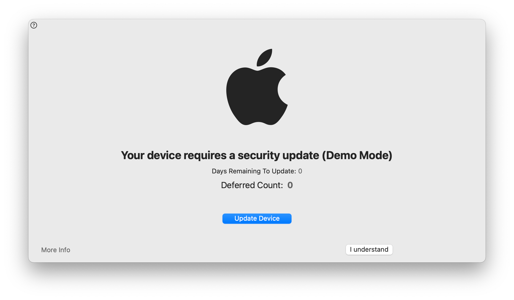

# Tales from Fleet security: speeding up macOS updates with Nudge

To keep Fleet secure, we manage vulnerabilities on all of our company workstations, all of which are laptops. 

We manage vulnerabilities by:

1. Deploying browser updates very rapidly. See our [handbook](https://fleetdm.com/handbook/security#chrome-configuration) for our Chrome configuration, forcing update installation and browser restarts
2. Enforcing automatic updates on all of our Macs. We have also written about this in our [handbook](https://fleetdm.com/handbook/security#how-we-protect-end-user-devices)
3. Making most software we use available via Munki, including updates
4. Identifying vulnerabilities with Fleet

With this strategy, we only have to address a few vulnerabilities manually. Browsers, operating systems, and office productivity software are big targets, so focusing on fixing issues related to that attack surface as quickly as possible makes sense.

One issue with automatic updates on macOS is that a user can click **try tonight** repeatedly, have the installation not occur for whatever reason, and end up using an outdated operating system weeks later.

We can fix this by requiring up-to-date macOS versions before using specific cloud applications, which we will write about in the next quarter. But before that, we need to make people aware that they're missing an update more obviously. The experience of being unable to get work done because your OS is outdated is sub-par, so before we deploy this capability, we want to help people keep their systems up-to-date easily.

Enter [Nudge](https://github.com/macadmins/nudge). Written in Swift, Nudge is an easy-to-deploy application that will display a window over every other window, letting you know if your Mac is outdated. It's all in the name!

We like this approach because it is evident while at the same time not automatically triggering updates while someone might be working. Striking the right balance between annoyance and laissez-faire is critical.

## How we deployed Nudge

### Configuration
Before deploying Nudge, we had to configure it properly. We wanted to make sure we had a configuration in place before deploying Nudge so the risk of unexpected behavior was as low as possible. Imagine deploying it with values that required you to install a new version a week ago, immediately enabling the most aggressive UI!

There are three main ways of configuring Nudge:

* JSON file on the filesystem
* JSON file over HTTPS
* Profile installed locally or pushed via MDM

A JSON file on the filesystem would require deploying that file, which seems like work done for no benefit in our situation. JSON over HTTPS is very interesting because you can point Nudge to a file hosted on GitHub pages and make changing the Nudge configuration a more "GitOps" flavored operation.

In our case, since we didn't need to let anyone edit the Nudge configuration who doesn't already have access to MDM, we went with a profile deployed via MDM, as we had all the infrastructure in place.

We used [this sample profile](https://github.com/macadmins/nudge/blob/main/Example%20Assets/com.github.macadmins.Nudge.mobileconfig) and made a few changes, such as setting `simpleMode` to `true`, `requiredMinimumOSVersion` to `12.4`, which is the current macOS version, and `requiredInstallationDate` to a date in the future so Nudge wouldn't automatically run on its most aggressive setting. We also updated the `aboutUpdateURLs` to point to the latest Apple document explaining the security vulnerabilities resolved by version 12.4, so everyone interested can check why it is an important update.

We enabled `simpleMode` to get a simpler UI when Nudge gets triggered. Based on people's comments and questions, we might go back to the regular mode with custom verbiage when it pops up for them the first time.

We did not tweak the other settings. After gaining experience with the tool, we might tweak parameters related to grace periods and the number of deferrals allowed. Until we have more data, the defaults seem like a good baseline.

### Nudge itself

We deployed the latest version of Nudge and its LaunchAgent from the [releases](https://github.com/macadmins/nudge/releases) page on GitHub.

We deployed both packages via [Munki](https://github.com/munki/munki).

The LaunchAgent is triggered every 30 minutes by default, which we felt no need to customize.

As long as a system runs the `requiredMinimumOSVersion`, Nudge will not run in a manner that is visible to end-users.

## Next steps

When macOS 12.5 gets released, we'll be able to see how fast the update gets deployed to our laptops and tweak our Nudge configuration.

Next, we'll use [BeyondCorp Enterprise](https://cloud.google.com/beyondcorp-enterprise) to require an up-to-date version of macOS to access some cloud applications. Once we have done this, we'll publish configurations in our handbook and a blog post on how we did it.

Feel free to drop in our [#Fleet](https://fleetdm.com/slack) Slack Channel to discuss anything security-related with us!

<meta name="category" value="security">
<meta name="authorFullName" value="Guillaume Ross">
<meta name="authorGitHubUsername" value="GuillaumeRoss">
<meta name="publishedOn" value="2022-07-05">
<meta name="articleTitle" value="Tales from Fleet security: speeding up macOS updates with Nudge">
<meta name="articleImageUrl" value="../website/assets/images/articles/tales-from-fleet-nudge-cover-1600x900@2x.jpg">
