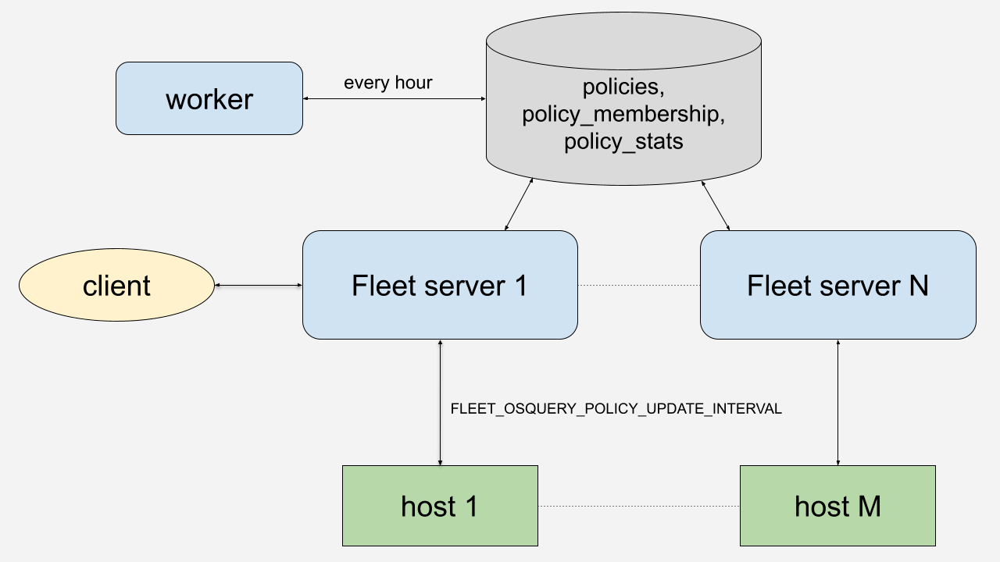
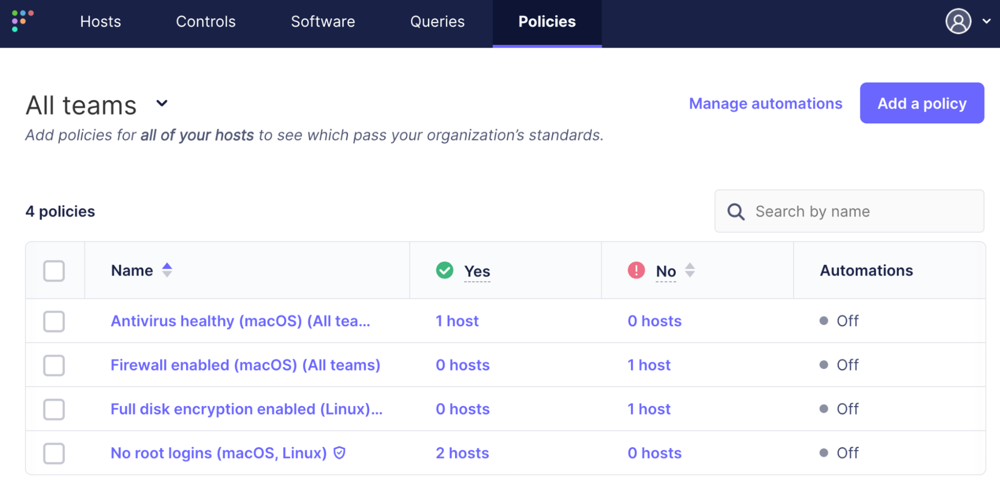

# Understanding the intricacies of Fleet policies

<!--
<div class="video-container" style="position: relative; width: 100%; padding-bottom: 56.25%; margin-top: 24px; margin-bottom: 40px;">
	<iframe class="video" style="position: absolute; top: 0; left: 0; width: 100%; height: 100%; border: 0;" src="https://www.youtube.com/embed/jbkPLQpzPtc?si=k1BUb98QWRT1V8fZ" allowfullscreen></iframe>
</div> // -->

In the ever-evolving landscape of device management and cybersecurity, understanding the mechanics behind tools like Fleet is not just about technical curiosity; it's about empowering IT professionals to safeguard digital assets more effectively. [Fleet](https://fleetdm.com) gathers telemetry from various devices, from laptops to virtual machines, using [osquery](https://www.osquery.io/). At the heart of this system lies a crucial feature: [Fleet policies](https://fleetdm.com/securing/what-are-fleet-policies).

Policies in Fleet are more than just rules; they are the gatekeepers of your device's security, ensuring stringent adherence to security standards. By dissecting how Fleet policies operate "under the hood," IT administrators and security professionals can gain invaluable insights. These insights allow for setting up efficient security protocols and rapid response to potential vulnerabilities, a necessity in a landscape where cyber threats are constantly evolving. This article delves into the inner workings of Fleet policies, providing you with the knowledge to better configure, manage, and leverage these policies for optimal device security and efficiency.


## Policy creation

Policies can be created from the web UI, the command-line interface called `fleetctl` with config files, or the REST API. The user creates a policy and selects which devices need to be checked using that policy. Policies can be global or team-specific.

When a policy is created, a record for it is stored in the **policies** table of the MySQL database. A Fleet deployment consists of several servers behind a load balancer, so storing the record in the DB makes all servers aware of the new policy.





## Policy execution

Policies are executed on the devices, which are called **hosts** in Fleet, according to the [FLEET_OSQUERY_POLICY_UPDATE_INTERVAL](https://fleetdm.com/docs/configuration/fleet-server-configuration#osquery-policy-update-interval), which is set to 1 hour by default. This interval can be adjusted with the environment variable or set from the server’s command line.

Policies are simply SQL queries that return a true or false result, so the flow they use on the hosts is the same as other queries. Hosts check in with Fleet servers every 10 seconds (the default) and access the `/api/v1/osquery/distributed/read` API endpoint. The server checks when the policy was last executed to determine whether it should be executed again. If so, the server adds the policy to its response. For example, this policy in the server response checks if the macOS firewall is enabled:


```
{
    "queries": {
        "fleet_policy_query_9": "SELECT 1 FROM alf WHERE global_state >= 1;"
    },
    "discovery": {
        "fleet_policy_query_9": "SELECT 1"
    }
}
```


Once the host has executed the policy, it writes the result to the server. The server updates the result in the **policy_membership** table of the MySQL database. At this point, the Host Details page on the web UI is updated with the policy result.


## Force policy execution on a device

The user can force the host to execute all of its policies by clicking the **Refetch** link:


## Policy results aggregation

However, the main **Policies** page is not updated. This page shows the counts of all passing and failing hosts for each policy. A worker process on one of the Fleet servers updates it once an hour. The worker calculates the counts and stores them in the **policy_stats** table in the database. This is done for better performance of the UI. For customers with 100,000s of hosts that asynchronously report their policy results, calculating the passing and failing counts in real time was noticeably slow.





## Summary

Understanding the intricacies of Fleet policies is essential for IT professionals managing a fleet of devices. This deep dive into the mechanics of Fleet policies — from creation to execution — provides you with the necessary insights to optimize your cybersecurity strategy effectively. By leveraging these policies, you can ensure stringent security standards across your network, enhancing your organization's digital defense. As the cyber landscape evolves, tools like Fleet remain crucial in maintaining robust and responsive security protocols. We encourage you to apply these insights in your Fleet usage, and as always, we welcome your feedback and experiences in the [Fleet community Slack channels](https://fleetdm.com/support).


<meta name="articleTitle" value="Understanding the intricacies of Fleet policies">
<meta name="authorFullName" value="Victor Lyuboslavsky">
<meta name="authorGitHubUsername" value="getvictor">
<meta name="category" value="guides">
<meta name="publishedOn" value="2023-12-29">
<meta name="description" value="Learn how Fleet policies work behind the scenes.">
