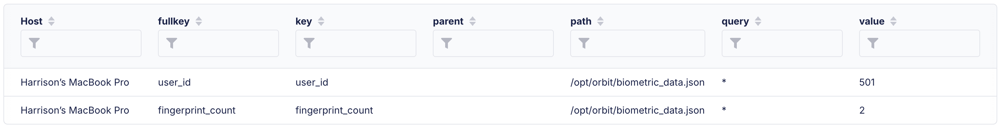

# Using bioutil to verify Touch ID/biometric utilization

## Intro

The `bioutil` command-line utility was introduced in macOS Sierra to manage Touch ID configurations and enrolled fingerprints. This handy tool can provide admins with the flexibility to understand a snapshot of what TouchID configurations exist in their fleet. It is important to note that this command is for verifying Apple services in use and confirming general Touch ID settings. Fingerprint metadata is stored on the secure enclave inside the device and this data is not on Apple servers or iCloud, and is not accessible by Apple or any third parties.

Let's take a look at a few examples of `bioutil`.

`bioutil -r` - useful for reading the current users biometrics settings

```
User Touch ID configuration:
    Biometrics for unlock: 1
    Biometrics for ApplePay: 1
    Effective biometrics for unlock: 1
    Effective biometrics for ApplePay: 1
```

`sudo bioutil -s -d 712` - would be used to delete the biometric settings for UID 712

## Creating a script

Our organization wants to better understand the number of fingerprints that the users of a computer has enrolled, and pull this data into Fleet to use in a policy.

First, we create a basic shell script:

```
#!/bin/sh

# vars
OUTPUT_FILE="/opt/orbit/biometric_config.json"
CURRENT_USER=$(stat -f%Su /dev/console)

# bioutil command as the currently logged-in user
BIOMETRIC_OUTPUT=$(su -l "$CURRENT_USER" -c "bioutil -c")

# user and number of fingerprints from the command output
USER_ID=$(echo "$BIOMETRIC_OUTPUT" | grep -oE 'User [0-9]+' | awk '{print $2}')
FINGERPRINT_COUNT=$(echo "$BIOMETRIC_OUTPUT" | grep -oE '[0-9]+ biometric template' | awk '{print $1}')

# Create JSON
JSON_OUTPUT=$(cat <<EOF
{
  "user_id": "$USER_ID",
  "fingerprint_count": $FINGERPRINT_COUNT
}
EOF
)

# write to file
echo "$JSON_OUTPUT" > "$OUTPUT_FILE"

# output status to fleet ui
echo "JSON written to $OUTPUT_FILE."

```

> This script is printing output to `/opt/orbit`, where other Fleet configs live, but can be placed anywhere on the filesystem.

## Deploying the script via Fleet

In this example, we just want to check a 'snapshot' of our fleet's configuration, but this script could also be added to a crobtab to generate refreshed data on a set interval.

From the Fleet UI, select **Controls** > **Scripts** and upload the script from the previous step.

Now, navigate to **Policies** > **Add policy**. In this example, we want to use [policy automation](https://fleetdm.com/guides/policy-automation-run-script) to look for the existance of the config file - `biometric_config.json` and if this doesn't exist on the host, run the aformentioned script to generate the output. 

Use the following query to build your policy:

`SELECT 1 FROM file WHERE path = '/opt/orbit/biometric_config.json`

Save this policy and select **Manage automations** > **Run script** to bring up the modal where we will tie a failure of this policy (i.e. file does not exist) to script execution.

## Reading the config data

At this point, we know that the file we want to read, `biometric_config.json` exists on all our hosts so now we can write a query, using the powerful `parse_json` table.

`SELECT * FROM parse_json WHERE path = '/opt/orbit/biometric_config.json'`



If you just wanted to return the number of enrolled fingerprints, use a query like such:

`SELECT value FROM parse_json WHERE path = '/opt/orbit/biometric_config.json' AND key = 'fingerprint_count'`

## Writing a policy

Our infosec team wants to know any devices that have more than 1 fingerprint enabled on them, potentially indicating another user having access to the device. We can answer this question easily with a policy.

`SELECT 1 FROM parse_json WHERE path = '/opt/orbit/biometric_config.json' AND key = 'fingerprint_count' AND value = 1`

Any device, where the value of `fingerprint_count` is greater than 1 will result in a failed policy. Your infosec team can quickly export the information on the hosts, or even use the same script execution automation to remediate this with the `bioutil -p` command, for example.

## Conclusion

Using `bioutil` alongside Fleet provides a powerful method for managing and monitoring biometric configurations across your macOS fleet. By automating script deployment and leveraging Fleet's policy capabilities, organizations can gain valuable insights into Touch ID usage, identify potential security risks, and enforce compliance with minimal manual intervention.

For more tips and detailed guides, don’t forget to check out the Fleet 
[documentation.](https://fleetdm.com/docs/get-started/why-fleet)

<meta name="articleTitle" value="Using bioutil to verify Touch ID/biometric utilization">
<meta name="authorFullName" value="Harrison Ravazzolo">
<meta name="authorGitHubUsername" value="harrisonravazzolo">
<meta name="category" value="guides">
<meta name="publishedOn" value="2024-12-29">
<meta name="description" value="Streamline Biometric Security with bioutil and Fleet">