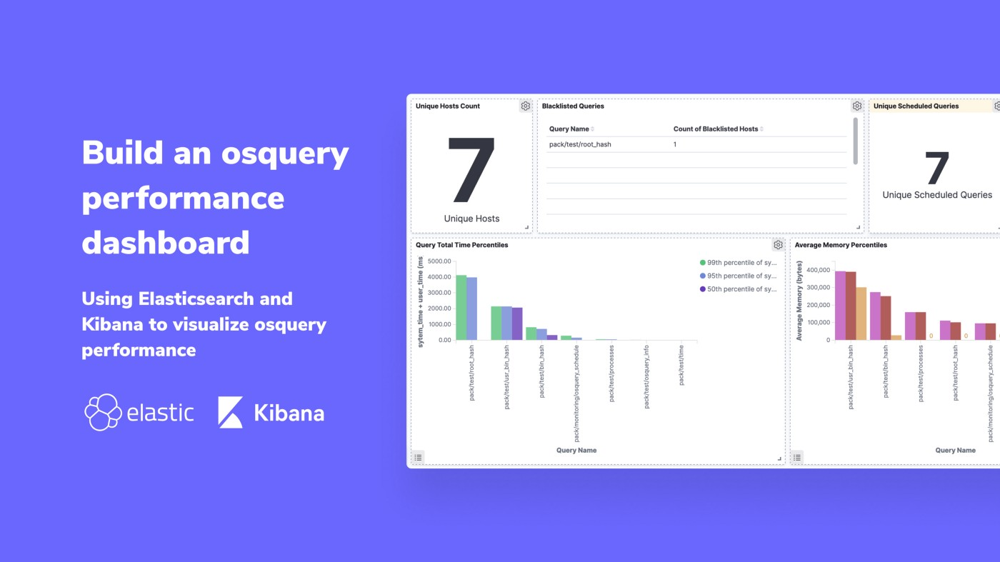
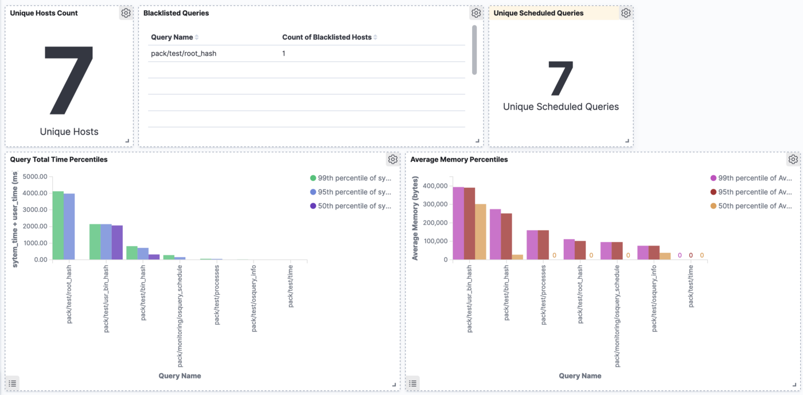

# Using Elasticsearch and Kibana to visualize osquery performance

## Build an osquery performance dashboard




This article serves as a guide to building an osquery performance dashboard with Elasticsearch and Kibana.

Our goal is to build a dashboard like the one pictured below:



- **Unique Hosts Count** — Provides the number of hosts actively logging results.
- **Blacklisted Queries** — Shows any queries that have been blacklisted and the number of hosts on which the query was blacklisted.
- **Unique Scheduled Queries** — Provides a count of the number of different queries scheduled across all hosts.
- **Query Total Time Percentiles** — Shows median and top percentiles of query execution time. This can be useful to find queries that are performance outliers.
- **Average Memory Percentiles** — Shows median and top percentiles of memory usage during query execution. This can be useful to find queries that are performance outliers.

## Set Up Osquery and Logging Pipeline

In an existing osquery deployment, you may already have some mechanism for shipping logs to Elasticsearch. If you do not have an existing deployment to work with, consider using [Osquery In a Box](https://github.com/dactivllc/osquery-in-a-box) to quickly spin up a test environment.

## Configure Index Template

Configuring the index template enables Elasticsearch to store columns with the appropriate datatypes to generate the visualizations we would like to use. We do not need to explicitly set the types of each result column. Instead, we can tell Elasticsearch to automatically detect numeric columns.

We create an index template with the [Put index template API](https://www.elastic.co/guide/en/elasticsearch/reference/current/indices-templates.html), or by using the Kibana management interface. Ensure that the `index_patterns` parameter matches the index used to insert logs into Elasticsearch (the example works with Osquery In a Box configuration).

```
curl -X PUT "localhost:9200/_template/osquery-result?pretty" -H 'Content-Type: application/json' -d'
{
  "index_patterns": ["osquery*"],
  "mappings": {
    "numeric_detection" : true
  }
}
```

If the index already exists, be sure to create a new index (matching the index pattern) and/or delete the old index.

## Configure Osquery Logging

Next, we configure osquery to log the monitoring statistics. These logs will be ingested into the Elasticsearch cluster and used to generate the dashboard in Kibana.

The osquery_schedule table provides useful data, and we can further enhance this data with operations in our query:

```
SELECT *,
    ifnull(system_time / executions, 0) AS average_system_time,
    ifnull(user_time / executions, 0) AS average_user_time,
    ifnull(wall_time / executions, 0) AS average_wall_time
FROM osquery_schedule
```

Schedule this query in a pack named `monitoring` with differential logging and no “removed” results (we only need the new entries).

## YAML for fleetctl configuration

```
apiVersion: v1
kind: pack
spec:
  description: Osquery Monitoring
  name: monitoring
  queries:
  - interval: 60
    name: osquery_schedule_with_averages
    query: osquery_schedule_with_averages
    removed: false
  targets:
    labels:
    - All Hosts
---
apiVersion: v1
kind: query
spec:
  description: Retrieve statistics about scheduled queries.
  name: osquery_schedule_with_averages
  query: SELECT *, ifnull(system_time / executions, 0) AS average_system_time, ifnull(user_time
    / executions, 0) AS average_user_time, ifnull(wall_time / executions, 0) AS average_wall_time
    FROM osquery_schedule
```

## JSON for standard osquery configuration

```
{
  "packs": {
    "monitoring": {
      "queries": {
        "osquery_schedule_with_averages": {
          "query": "SELECT *, ifnull(system_time / executions, 0) AS average_system_time, ifnull(user_time / executions, 0) AS average_user_time, ifnull(wall_time / executions, 0) AS average_wall_time FROM osquery_schedule",
          "interval": 60,
          "removed": false
        }
      }
    }
  }
}

```

## Import Dashboards into Kibana

Now that the data is flowing and being indexed by Elasticsearch, we can create visualizations from the data.

Import the following saved objects into Kibana (`Management > Saved Objects > Import`):

```
{"attributes":{"fieldFormatMap":"{\"avg_system_time\":{\"id\":\"duration\",\"params\":{\"inputFormat\":\"milliseconds\"}},\"avg_user_time\":{\"id\":\"duration\",\"params\":{\"inputFormat\":\"milliseconds\"}},\"avg_wall_time\":{\"id\":\"duration\"},\"avg_total_time\":{\"id\":\"duration\",\"params\":{\"inputFormat\":\"milliseconds\",\"outputFormat\":\"asMilliseconds\"}},\"columns.average_memory\":{\"id\":\"bytes\"},\"snapshot.average_memory\":{\"id\":\"bytes\"}}","fields":"[{\"name\":\"@timestamp\",\"type\":\"date\",\"esTypes\":[\"date\"],\"count\":0,\"scripted\":false,\"searchable\":true,\"aggregatable\":true,\"readFromDocValues\":true},{\"name\":\"@version\",\"type\":\"number\",\"esTypes\":[\"long\"],\"count\":0,\"scripted\":false,\"searchable\":true,\"aggregatable\":true,\"readFromDocValues\":true},{\"name\":\"_id\",\"type\":\"string\",\"esTypes\":[\"_id\"],\"count\":0,\"scripted\":false,\"searchable\":true,\"aggregatable\":true,\"readFromDocValues\":false},{\"name\":\"_index\",\"type\":\"string\",\"esTypes\":[\"_index\"],\"count\":0,\"scripted\":false,\"searchable\":true,\"aggregatable\":true,\"readFromDocValues\":false},{\"name\":\"_score\",\"type\":\"number\",\"count\":0,\"scripted\":false,\"searchable\":false,\"aggregatable\":false,\"readFromDocValues\":false},{\"name\":\"_source\",\"type\":\"_source\",\"esTypes\":[\"_source\"],\"count\":0,\"scripted\":false,\"searchable\":false,\"aggregatable\":false,\"readFromDocValues\":false},{\"name\":\"_type\",\"type\":\"string\",\"esTypes\":[\"_type\"],\"count\":0,\"scripted\":false,\"searchable\":true,\"aggregatable\":true,\"readFromDocValues\":false},{\"name\":\"action\",\"type\":\"string\",\"esTypes\":[\"text\"],\"count\":0,\"scripted\":false,\"searchable\":true,\"aggregatable\":false,\"readFromDocValues\":false},{\"name\":\"action.keyword\",\"type\":\"string\",\"esTypes\":[\"keyword\"],\"count\":0,\"scripted\":false,\"searchable\":true,\"aggregatable\":true,\"readFromDocValues\":true,\"parent\":\"action\",\"subType\":\"multi\"},{\"name\":\"calendarTime\",\"type\":\"string\",\"esTypes\":[\"text\"],\"count\":0,\"scripted\":false,\"searchable\":true,\"aggregatable\":false,\"readFromDocValues\":false},{\"name\":\"calendarTime.keyword\",\"type\":\"string\",\"esTypes\":[\"keyword\"],\"count\":0,\"scripted\":false,\"searchable\":true,\"aggregatable\":true,\"readFromDocValues\":true,\"parent\":\"calendarTime\",\"subType\":\"multi\"},{\"name\":\"columns.average_memory\",\"type\":\"number\",\"esTypes\":[\"long\"],\"count\":0,\"scripted\":false,\"searchable\":true,\"aggregatable\":true,\"readFromDocValues\":true},{\"name\":\"columns.average_system_time\",\"type\":\"number\",\"esTypes\":[\"long\"],\"count\":0,\"scripted\":false,\"searchable\":true,\"aggregatable\":true,\"readFromDocValues\":true},{\"name\":\"columns.average_user_time\",\"type\":\"number\",\"esTypes\":[\"long\"],\"count\":0,\"scripted\":false,\"searchable\":true,\"aggregatable\":true,\"readFromDocValues\":true},{\"name\":\"columns.average_wall_time\",\"type\":\"number\",\"esTypes\":[\"long\"],\"count\":0,\"scripted\":false,\"searchable\":true,\"aggregatable\":true,\"readFromDocValues\":true},{\"name\":\"columns.blacklisted\",\"type\":\"number\",\"esTypes\":[\"long\"],\"count\":0,\"scripted\":false,\"searchable\":true,\"aggregatable\":true,\"readFromDocValues\":true},{\"name\":\"columns.executions\",\"type\":\"number\",\"esTypes\":[\"long\"],\"count\":0,\"scripted\":false,\"searchable\":true,\"aggregatable\":true,\"readFromDocValues\":true},{\"name\":\"columns.interval\",\"type\":\"number\",\"esTypes\":[\"long\"],\"count\":0,\"scripted\":false,\"searchable\":true,\"aggregatable\":true,\"readFromDocValues\":true},{\"name\":\"columns.last_executed\",\"type\":\"number\",\"esTypes\":[\"long\"],\"count\":0,\"scripted\":false,\"searchable\":true,\"aggregatable\":true,\"readFromDocValues\":true},{\"name\":\"columns.name\",\"type\":\"string\",\"esTypes\":[\"text\"],\"count\":0,\"scripted\":false,\"searchable\":true,\"aggregatable\":false,\"readFromDocValues\":false},{\"name\":\"columns.name.keyword\",\"type\":\"string\",\"esTypes\":[\"keyword\"],\"count\":0,\"scripted\":false,\"searchable\":true,\"aggregatable\":true,\"readFromDocValues\":true,\"parent\":\"columns.name\",\"subType\":\"multi\"},{\"name\":\"columns.output_size\",\"type\":\"string\",\"esTypes\":[\"text\"],\"count\":0,\"scripted\":false,\"searchable\":true,\"aggregatable\":false,\"readFromDocValues\":false},{\"name\":\"columns.output_size.keyword\",\"type\":\"string\",\"esTypes\":[\"keyword\"],\"count\":0,\"scripted\":false,\"searchable\":true,\"aggregatable\":true,\"readFromDocValues\":true,\"parent\":\"columns.output_size\",\"subType\":\"multi\"},{\"name\":\"columns.query\",\"type\":\"string\",\"esTypes\":[\"text\"],\"count\":0,\"scripted\":false,\"searchable\":true,\"aggregatable\":false,\"readFromDocValues\":false},{\"name\":\"columns.query.keyword\",\"type\":\"string\",\"esTypes\":[\"keyword\"],\"count\":0,\"scripted\":false,\"searchable\":true,\"aggregatable\":true,\"readFromDocValues\":true,\"parent\":\"columns.query\",\"subType\":\"multi\"},{\"name\":\"columns.system_time\",\"type\":\"number\",\"esTypes\":[\"long\"],\"count\":0,\"scripted\":false,\"searchable\":true,\"aggregatable\":true,\"readFromDocValues\":true},{\"name\":\"columns.user_time\",\"type\":\"number\",\"esTypes\":[\"long\"],\"count\":0,\"scripted\":false,\"searchable\":true,\"aggregatable\":true,\"readFromDocValues\":true},{\"name\":\"columns.wall_time\",\"type\":\"number\",\"esTypes\":[\"long\"],\"count\":0,\"scripted\":false,\"searchable\":true,\"aggregatable\":true,\"readFromDocValues\":true},{\"name\":\"counter\",\"type\":\"number\",\"esTypes\":[\"long\"],\"count\":0,\"scripted\":false,\"searchable\":true,\"aggregatable\":true,\"readFromDocValues\":true},{\"name\":\"decorations.host_uuid\",\"type\":\"string\",\"esTypes\":[\"text\"],\"count\":0,\"scripted\":false,\"searchable\":true,\"aggregatable\":false,\"readFromDocValues\":false},{\"name\":\"decorations.host_uuid.keyword\",\"type\":\"string\",\"esTypes\":[\"keyword\"],\"count\":0,\"scripted\":false,\"searchable\":true,\"aggregatable\":true,\"readFromDocValues\":true,\"parent\":\"decorations.host_uuid\",\"subType\":\"multi\"},{\"name\":\"decorations.hostname\",\"type\":\"string\",\"esTypes\":[\"text\"],\"count\":0,\"scripted\":false,\"searchable\":true,\"aggregatable\":false,\"readFromDocValues\":false},{\"name\":\"decorations.hostname.keyword\",\"type\":\"string\",\"esTypes\":[\"keyword\"],\"count\":0,\"scripted\":false,\"searchable\":true,\"aggregatable\":true,\"readFromDocValues\":true,\"parent\":\"decorations.hostname\",\"subType\":\"multi\"},{\"name\":\"epoch\",\"type\":\"number\",\"esTypes\":[\"long\"],\"count\":0,\"scripted\":false,\"searchable\":true,\"aggregatable\":true,\"readFromDocValues\":true},{\"name\":\"host\",\"type\":\"string\",\"esTypes\":[\"text\"],\"count\":0,\"scripted\":false,\"searchable\":true,\"aggregatable\":false,\"readFromDocValues\":false},{\"name\":\"host.keyword\",\"type\":\"string\",\"esTypes\":[\"keyword\"],\"count\":0,\"scripted\":false,\"searchable\":true,\"aggregatable\":true,\"readFromDocValues\":true,\"parent\":\"host\",\"subType\":\"multi\"},{\"name\":\"hostIdentifier\",\"type\":\"string\",\"esTypes\":[\"text\"],\"count\":0,\"scripted\":false,\"searchable\":true,\"aggregatable\":false,\"readFromDocValues\":false},{\"name\":\"hostIdentifier.keyword\",\"type\":\"string\",\"esTypes\":[\"keyword\"],\"count\":0,\"scripted\":false,\"searchable\":true,\"aggregatable\":true,\"readFromDocValues\":true,\"parent\":\"hostIdentifier\",\"subType\":\"multi\"},{\"name\":\"name\",\"type\":\"string\",\"esTypes\":[\"text\"],\"count\":0,\"scripted\":false,\"searchable\":true,\"aggregatable\":false,\"readFromDocValues\":false},{\"name\":\"name.keyword\",\"type\":\"string\",\"esTypes\":[\"keyword\"],\"count\":0,\"scripted\":false,\"searchable\":true,\"aggregatable\":true,\"readFromDocValues\":true,\"parent\":\"name\",\"subType\":\"multi\"},{\"name\":\"numerics\",\"type\":\"boolean\",\"esTypes\":[\"boolean\"],\"count\":0,\"scripted\":false,\"searchable\":true,\"aggregatable\":true,\"readFromDocValues\":true},{\"name\":\"path\",\"type\":\"string\",\"esTypes\":[\"text\"],\"count\":0,\"scripted\":false,\"searchable\":true,\"aggregatable\":false,\"readFromDocValues\":false},{\"name\":\"path.keyword\",\"type\":\"string\",\"esTypes\":[\"keyword\"],\"count\":0,\"scripted\":false,\"searchable\":true,\"aggregatable\":true,\"readFromDocValues\":true,\"parent\":\"path\",\"subType\":\"multi\"},{\"name\":\"snapshot.datetime\",\"type\":\"date\",\"esTypes\":[\"date\"],\"count\":0,\"scripted\":false,\"searchable\":true,\"aggregatable\":true,\"readFromDocValues\":true},{\"name\":\"snapshot.day\",\"type\":\"number\",\"esTypes\":[\"long\"],\"count\":0,\"scripted\":false,\"searchable\":true,\"aggregatable\":true,\"readFromDocValues\":true},{\"name\":\"snapshot.hour\",\"type\":\"number\",\"esTypes\":[\"long\"],\"count\":0,\"scripted\":false,\"searchable\":true,\"aggregatable\":true,\"readFromDocValues\":true},{\"name\":\"snapshot.iso_8601\",\"type\":\"date\",\"esTypes\":[\"date\"],\"count\":0,\"scripted\":false,\"searchable\":true,\"aggregatable\":true,\"readFromDocValues\":true},{\"name\":\"snapshot.local_time\",\"type\":\"number\",\"esTypes\":[\"long\"],\"count\":0,\"scripted\":false,\"searchable\":true,\"aggregatable\":true,\"readFromDocValues\":true},{\"name\":\"snapshot.local_timezone\",\"type\":\"string\",\"esTypes\":[\"text\"],\"count\":0,\"scripted\":false,\"searchable\":true,\"aggregatable\":false,\"readFromDocValues\":false},{\"name\":\"snapshot.local_timezone.keyword\",\"type\":\"string\",\"esTypes\":[\"keyword\"],\"count\":0,\"scripted\":false,\"searchable\":true,\"aggregatable\":true,\"readFromDocValues\":true,\"parent\":\"snapshot.local_timezone\",\"subType\":\"multi\"},{\"name\":\"snapshot.minutes\",\"type\":\"number\",\"esTypes\":[\"long\"],\"count\":0,\"scripted\":false,\"searchable\":true,\"aggregatable\":true,\"readFromDocValues\":true},{\"name\":\"snapshot.month\",\"type\":\"number\",\"esTypes\":[\"long\"],\"count\":0,\"scripted\":false,\"searchable\":true,\"aggregatable\":true,\"readFromDocValues\":true},{\"name\":\"snapshot.seconds\",\"type\":\"number\",\"esTypes\":[\"long\"],\"count\":0,\"scripted\":false,\"searchable\":true,\"aggregatable\":true,\"readFromDocValues\":true},{\"name\":\"snapshot.timestamp\",\"type\":\"string\",\"esTypes\":[\"text\"],\"count\":0,\"scripted\":false,\"searchable\":true,\"aggregatable\":false,\"readFromDocValues\":false},{\"name\":\"snapshot.timestamp.keyword\",\"type\":\"string\",\"esTypes\":[\"keyword\"],\"count\":0,\"scripted\":false,\"searchable\":true,\"aggregatable\":true,\"readFromDocValues\":true,\"parent\":\"snapshot.timestamp\",\"subType\":\"multi\"},{\"name\":\"snapshot.timezone\",\"type\":\"string\",\"esTypes\":[\"text\"],\"count\":0,\"scripted\":false,\"searchable\":true,\"aggregatable\":false,\"readFromDocValues\":false},{\"name\":\"snapshot.timezone.keyword\",\"type\":\"string\",\"esTypes\":[\"keyword\"],\"count\":0,\"scripted\":false,\"searchable\":true,\"aggregatable\":true,\"readFromDocValues\":true,\"parent\":\"snapshot.timezone\",\"subType\":\"multi\"},{\"name\":\"snapshot.unix_time\",\"type\":\"number\",\"esTypes\":[\"long\"],\"count\":0,\"scripted\":false,\"searchable\":true,\"aggregatable\":true,\"readFromDocValues\":true},{\"name\":\"snapshot.weekday\",\"type\":\"string\",\"esTypes\":[\"text\"],\"count\":0,\"scripted\":false,\"searchable\":true,\"aggregatable\":false,\"readFromDocValues\":false},{\"name\":\"snapshot.weekday.keyword\",\"type\":\"string\",\"esTypes\":[\"keyword\"],\"count\":0,\"scripted\":false,\"searchable\":true,\"aggregatable\":true,\"readFromDocValues\":true,\"parent\":\"snapshot.weekday\",\"subType\":\"multi\"},{\"name\":\"snapshot.year\",\"type\":\"number\",\"esTypes\":[\"long\"],\"count\":0,\"scripted\":false,\"searchable\":true,\"aggregatable\":true,\"readFromDocValues\":true},{\"name\":\"type\",\"type\":\"string\",\"esTypes\":[\"text\"],\"count\":0,\"scripted\":false,\"searchable\":true,\"aggregatable\":false,\"readFromDocValues\":false},{\"name\":\"type.keyword\",\"type\":\"string\",\"esTypes\":[\"keyword\"],\"count\":0,\"scripted\":false,\"searchable\":true,\"aggregatable\":true,\"readFromDocValues\":true,\"parent\":\"type\",\"subType\":\"multi\"},{\"name\":\"unixTime\",\"type\":\"number\",\"esTypes\":[\"long\"],\"count\":0,\"scripted\":false,\"searchable\":true,\"aggregatable\":true,\"readFromDocValues\":true}]","timeFieldName":"@timestamp","title":"osquery-result"},"id":"1b6a8cb0-3bf7-11ea-a966-55935be4eb8b","migrationVersion":{"index-pattern":"6.5.0"},"references":[],"type":"index-pattern","updated_at":"2020-01-31T01:25:26.905Z","version":"WzI2OSwzXQ=="}
{"attributes":{"description":"","kibanaSavedObjectMeta":{"searchSourceJSON":"{\"query\":{\"query\":\"\",\"language\":\"kuery\"},\"filter\":[],\"indexRefName\":\"kibanaSavedObjectMeta.searchSourceJSON.index\"}"},"title":"Unique Hosts Count","uiStateJSON":"{}","version":1,"visState":"{\"title\":\"Unique Hosts Count\",\"type\":\"metric\",\"params\":{\"metric\":{\"percentageMode\":false,\"useRanges\":false,\"colorSchema\":\"Green to Red\",\"metricColorMode\":\"None\",\"colorsRange\":[{\"type\":\"range\",\"from\":0,\"to\":10000}],\"labels\":{\"show\":true},\"invertColors\":false,\"style\":{\"bgFill\":\"#000\",\"bgColor\":false,\"labelColor\":false,\"subText\":\"\",\"fontSize\":120}},\"dimensions\":{\"metrics\":[{\"type\":\"vis_dimension\",\"accessor\":0,\"format\":{\"id\":\"number\",\"params\":{}}}]},\"addTooltip\":true,\"addLegend\":false,\"type\":\"metric\"},\"aggs\":[{\"id\":\"1\",\"enabled\":true,\"type\":\"cardinality\",\"schema\":\"metric\",\"params\":{\"field\":\"hostIdentifier.keyword\",\"customLabel\":\"Unique Hosts\"}}]}"},"id":"abcc7ef0-3bfa-11ea-a966-55935be4eb8b","migrationVersion":{"visualization":"7.4.2"},"references":[{"id":"1b6a8cb0-3bf7-11ea-a966-55935be4eb8b","name":"kibanaSavedObjectMeta.searchSourceJSON.index","type":"index-pattern"}],"type":"visualization","updated_at":"2020-01-21T03:04:14.144Z","version":"WzE0MywyXQ=="}
{"attributes":{"description":"","kibanaSavedObjectMeta":{"searchSourceJSON":"{\"query\":{\"language\":\"kuery\",\"query\":\"\"},\"filter\":[{\"meta\":{\"alias\":null,\"negate\":false,\"disabled\":false,\"type\":\"phrase\",\"key\":\"columns.blacklisted\",\"params\":{\"query\":\"1\"},\"indexRefName\":\"kibanaSavedObjectMeta.searchSourceJSON.filter[0].meta.index\"},\"query\":{\"match\":{\"columns.blacklisted\":{\"query\":\"1\",\"type\":\"phrase\"}}},\"$state\":{\"store\":\"appState\"}}],\"indexRefName\":\"kibanaSavedObjectMeta.searchSourceJSON.index\"}"},"title":"Blacklisted Queries","uiStateJSON":"{\"vis\":{\"params\":{\"sort\":{\"columnIndex\":null,\"direction\":null}}}}","version":1,"visState":"{\"title\":\"Blacklisted Queries\",\"type\":\"table\",\"params\":{\"dimensions\":{\"metrics\":[{\"accessor\":1,\"format\":{\"id\":\"number\"},\"params\":{},\"aggType\":\"cardinality\"}],\"buckets\":[{\"accessor\":0,\"format\":{\"id\":\"terms\",\"params\":{\"id\":\"string\",\"otherBucketLabel\":\"Other\",\"missingBucketLabel\":\"Missing\"}},\"params\":{},\"aggType\":\"terms\"}]},\"perPage\":10,\"percentageCol\":\"\",\"showMetricsAtAllLevels\":false,\"showPartialRows\":false,\"showTotal\":false,\"sort\":{\"columnIndex\":null,\"direction\":null},\"totalFunc\":\"sum\"},\"aggs\":[{\"id\":\"1\",\"enabled\":true,\"type\":\"cardinality\",\"schema\":\"metric\",\"params\":{\"field\":\"hostIdentifier.keyword\",\"customLabel\":\"Count of Blacklisted Hosts\"}},{\"id\":\"2\",\"enabled\":true,\"type\":\"terms\",\"schema\":\"bucket\",\"params\":{\"field\":\"columns.name.keyword\",\"orderBy\":\"1\",\"order\":\"desc\",\"size\":30,\"otherBucket\":false,\"otherBucketLabel\":\"Other\",\"missingBucket\":false,\"missingBucketLabel\":\"Missing\",\"customLabel\":\"Query Name\"}}]}"},"id":"1268c5e0-3be4-11ea-a966-55935be4eb8b","migrationVersion":{"visualization":"7.4.2"},"references":[{"id":"1b6a8cb0-3bf7-11ea-a966-55935be4eb8b","name":"kibanaSavedObjectMeta.searchSourceJSON.index","type":"index-pattern"},{"id":"1b6a8cb0-3bf7-11ea-a966-55935be4eb8b","name":"kibanaSavedObjectMeta.searchSourceJSON.filter[0].meta.index","type":"index-pattern"}],"type":"visualization","updated_at":"2020-01-30T17:59:58.266Z","version":"WzI1MSwzXQ=="}
{"attributes":{"description":"","kibanaSavedObjectMeta":{"searchSourceJSON":"{\"query\":{\"query\":\"\",\"language\":\"kuery\"},\"filter\":[],\"indexRefName\":\"kibanaSavedObjectMeta.searchSourceJSON.index\"}"},"title":"Unique Scheduled Queries","uiStateJSON":"{}","version":1,"visState":"{\"title\":\"Unique Scheduled Queries\",\"type\":\"metric\",\"params\":{\"metric\":{\"percentageMode\":false,\"useRanges\":false,\"colorSchema\":\"Green to Red\",\"metricColorMode\":\"None\",\"colorsRange\":[{\"type\":\"range\",\"from\":0,\"to\":10000}],\"labels\":{\"show\":true},\"invertColors\":false,\"style\":{\"bgFill\":\"#000\",\"bgColor\":false,\"labelColor\":false,\"subText\":\"\",\"fontSize\":60}},\"dimensions\":{\"metrics\":[{\"type\":\"vis_dimension\",\"accessor\":0,\"format\":{\"id\":\"number\",\"params\":{}}}]},\"addTooltip\":true,\"addLegend\":false,\"type\":\"metric\"},\"aggs\":[{\"id\":\"1\",\"enabled\":true,\"type\":\"cardinality\",\"schema\":\"metric\",\"params\":{\"field\":\"columns.name.keyword\",\"customLabel\":\"Unique Scheduled Queries\"}}]}"},"id":"b2699a70-3c10-11ea-a966-55935be4eb8b","migrationVersion":{"visualization":"7.4.2"},"references":[{"id":"1b6a8cb0-3bf7-11ea-a966-55935be4eb8b","name":"kibanaSavedObjectMeta.searchSourceJSON.index","type":"index-pattern"}],"type":"visualization","updated_at":"2020-01-31T01:01:13.526Z","version":"WzI1MiwzXQ=="}
{"attributes":{"description":"","kibanaSavedObjectMeta":{"searchSourceJSON":"{\n  \"query\": {\n    \"language\": \"kuery\",\n    \"query\": \"\"\n  },\n  \"filter\": [\n    {\n      \"meta\": {\n        \"alias\": null,\n        \"negate\": false,\n        \"disabled\": false,\n        \"type\": \"phrase\",\n        \"key\": \"name.keyword\",\n        \"params\": {\n          \"query\": \"pack/monitoring/osquery_schedule_with_averages\"\n        },\n        \"indexRefName\": \"kibanaSavedObjectMeta.searchSourceJSON.filter[0].meta.index\"\n      },\n      \"query\": {\n        \"match\": {\n          \"name.keyword\": {\n            \"query\": \"pack/monitoring/osquery_schedule_with_averages\",\n            \"type\": \"phrase\"\n          }\n        }\n      },\n      \"$state\": {\n        \"store\": \"appState\"\n      }\n    }\n  ],\n  \"indexRefName\": \"kibanaSavedObjectMeta.searchSourceJSON.index\"\n}"},"title":"Query System Time Percentiles","uiStateJSON":"{}","version":1,"visState":"{\n  \"aggs\": [\n    {\n      \"enabled\": true,\n      \"id\": \"1\",\n      \"params\": {\n        \"customLabel\": \"Average system_time (ms)\",\n        \"field\": \"columns.average_system_time\",\n        \"percents\": [\n          99,\n          95,\n          50\n        ]\n      },\n      \"schema\": \"metric\",\n      \"type\": \"percentiles\"\n    },\n    {\n      \"enabled\": true,\n      \"id\": \"2\",\n      \"params\": {\n        \"customLabel\": \"Query Name\",\n        \"field\": \"columns.name.keyword\",\n        \"missingBucket\": false,\n        \"missingBucketLabel\": \"Missing\",\n        \"order\": \"desc\",\n        \"orderAgg\": {\n          \"enabled\": true,\n          \"id\": \"2-orderAgg\",\n          \"params\": {\n            \"field\": \"columns.average_system_time\"\n          },\n          \"schema\": {\n            \"aggFilter\": [\n              \"!top_hits\",\n              \"!percentiles\",\n              \"!median\",\n              \"!std_dev\",\n              \"!derivative\",\n              \"!moving_avg\",\n              \"!serial_diff\",\n              \"!cumulative_sum\",\n              \"!avg_bucket\",\n              \"!max_bucket\",\n              \"!min_bucket\",\n              \"!sum_bucket\"\n            ],\n            \"editor\": false,\n            \"group\": \"none\",\n            \"hideCustomLabel\": true,\n            \"max\": null,\n            \"min\": 0,\n            \"name\": \"orderAgg\",\n            \"params\": [],\n            \"title\": \"Order Agg\"\n          },\n          \"type\": \"max\"\n        },\n        \"orderBy\": \"custom\",\n        \"otherBucket\": false,\n        \"otherBucketLabel\": \"Other\",\n        \"size\": 10\n      },\n      \"schema\": \"segment\",\n      \"type\": \"terms\"\n    }\n  ],\n  \"params\": {\n    \"addLegend\": true,\n    \"addTimeMarker\": false,\n    \"addTooltip\": true,\n    \"categoryAxes\": [\n      {\n        \"id\": \"CategoryAxis-1\",\n        \"labels\": {\n          \"filter\": true,\n          \"rotate\": 0,\n          \"show\": true,\n          \"truncate\": 30\n        },\n        \"position\": \"bottom\",\n        \"scale\": {\n          \"type\": \"linear\"\n        },\n        \"show\": true,\n        \"style\": {},\n        \"title\": {},\n        \"type\": \"category\"\n      }\n    ],\n    \"dimensions\": {\n      \"x\": {\n        \"accessor\": 0,\n        \"aggType\": \"terms\",\n        \"format\": {\n          \"id\": \"terms\",\n          \"params\": {\n            \"id\": \"string\",\n            \"missingBucketLabel\": \"Missing\",\n            \"otherBucketLabel\": \"Other\"\n          }\n        },\n        \"params\": {}\n      },\n      \"y\": [\n        {\n          \"accessor\": 1,\n          \"aggType\": \"percentiles\",\n          \"format\": {\n            \"id\": \"number\"\n          },\n          \"params\": {}\n        },\n        {\n          \"accessor\": 2,\n          \"aggType\": \"percentiles\",\n          \"format\": {\n            \"id\": \"number\"\n          },\n          \"params\": {}\n        },\n        {\n          \"accessor\": 3,\n          \"aggType\": \"percentiles\",\n          \"format\": {\n            \"id\": \"number\"\n          },\n          \"params\": {}\n        }\n      ]\n    },\n    \"grid\": {\n      \"categoryLines\": false\n    },\n    \"labels\": {\n      \"show\": true\n    },\n    \"legendPosition\": \"right\",\n    \"seriesParams\": [\n      {\n        \"data\": {\n          \"id\": \"1\",\n          \"label\": \"Average system_time (ms)\"\n        },\n        \"drawLinesBetweenPoints\": true,\n        \"lineWidth\": 2,\n        \"mode\": \"normal\",\n        \"show\": true,\n        \"showCircles\": true,\n        \"type\": \"histogram\",\n        \"valueAxis\": \"ValueAxis-1\"\n      }\n    ],\n    \"thresholdLine\": {\n      \"color\": \"#34130C\",\n      \"show\": false,\n      \"style\": \"full\",\n      \"value\": 10,\n      \"width\": 1\n    },\n    \"times\": [],\n    \"type\": \"histogram\",\n    \"valueAxes\": [\n      {\n        \"id\": \"ValueAxis-1\",\n        \"labels\": {\n          \"filter\": false,\n          \"rotate\": 0,\n          \"show\": true,\n          \"truncate\": 100\n        },\n        \"name\": \"LeftAxis-1\",\n        \"position\": \"left\",\n        \"scale\": {\n          \"defaultYExtents\": false,\n          \"mode\": \"normal\",\n          \"type\": \"linear\"\n        },\n        \"show\": true,\n        \"style\": {},\n        \"title\": {\n          \"text\": \"Average system_time (ms)\"\n        },\n        \"type\": \"value\"\n      }\n    ]\n  },\n  \"title\": \"Query System Time Percentiles\",\n  \"type\": \"histogram\"\n}"},"id":"9404f920-3bfd-11ea-a966-55935be4eb8b","migrationVersion":{"visualization":"7.4.2"},"references":[{"id":"1b6a8cb0-3bf7-11ea-a966-55935be4eb8b","name":"kibanaSavedObjectMeta.searchSourceJSON.index","type":"index-pattern"},{"id":"1b6a8cb0-3bf7-11ea-a966-55935be4eb8b","name":"kibanaSavedObjectMeta.searchSourceJSON.filter[0].meta.index","type":"index-pattern"}],"type":"visualization","updated_at":"2020-01-31T01:27:06.465Z","version":"WzI3MywzXQ=="}
{"attributes":{"description":"","kibanaSavedObjectMeta":{"searchSourceJSON":"{\"query\":{\"language\":\"kuery\",\"query\":\"\"},\"filter\":[{\"meta\":{\"alias\":null,\"negate\":false,\"disabled\":false,\"type\":\"phrase\",\"key\":\"name.keyword\",\"params\":{\"query\":\"pack/monitoring/osquery_schedule_with_averages\"},\"indexRefName\":\"kibanaSavedObjectMeta.searchSourceJSON.filter[0].meta.index\"},\"query\":{\"match\":{\"name.keyword\":{\"query\":\"pack/monitoring/osquery_schedule_with_averages\",\"type\":\"phrase\"}}},\"$state\":{\"store\":\"appState\"}}],\"indexRefName\":\"kibanaSavedObjectMeta.searchSourceJSON.index\"}"},"title":"Average Memory Percentiles","uiStateJSON":"{}","version":1,"visState":"{\"aggs\":[{\"enabled\":true,\"id\":\"1\",\"params\":{\"customLabel\":\"Average Memory (bytes)\",\"field\":\"columns.average_memory\",\"percents\":[99,95,50]},\"schema\":\"metric\",\"type\":\"percentiles\"},{\"enabled\":true,\"id\":\"2\",\"params\":{\"customLabel\":\"Query Name\",\"field\":\"columns.name.keyword\",\"missingBucket\":false,\"missingBucketLabel\":\"Missing\",\"order\":\"desc\",\"orderAgg\":{\"enabled\":true,\"id\":\"2-orderAgg\",\"params\":{\"field\":\"columns.average_memory\"},\"schema\":{\"aggFilter\":[\"!top_hits\",\"!percentiles\",\"!median\",\"!std_dev\",\"!derivative\",\"!moving_avg\",\"!serial_diff\",\"!cumulative_sum\",\"!avg_bucket\",\"!max_bucket\",\"!min_bucket\",\"!sum_bucket\"],\"editor\":false,\"group\":\"none\",\"hideCustomLabel\":true,\"max\":null,\"min\":0,\"name\":\"orderAgg\",\"params\":[],\"title\":\"Order Agg\"},\"type\":\"max\"},\"orderBy\":\"custom\",\"otherBucket\":false,\"otherBucketLabel\":\"Other\",\"size\":10},\"schema\":\"segment\",\"type\":\"terms\"}],\"params\":{\"addLegend\":true,\"addTimeMarker\":false,\"addTooltip\":true,\"categoryAxes\":[{\"id\":\"CategoryAxis-1\",\"labels\":{\"filter\":true,\"rotate\":0,\"show\":true,\"truncate\":30},\"position\":\"bottom\",\"scale\":{\"type\":\"linear\"},\"show\":true,\"style\":{},\"title\":{},\"type\":\"category\"}],\"dimensions\":{\"x\":{\"accessor\":0,\"aggType\":\"terms\",\"format\":{\"id\":\"terms\",\"params\":{\"id\":\"string\",\"missingBucketLabel\":\"Missing\",\"otherBucketLabel\":\"Other\"}},\"params\":{}},\"y\":[{\"accessor\":1,\"aggType\":\"percentiles\",\"format\":{\"id\":\"bytes\"},\"params\":{}},{\"accessor\":2,\"aggType\":\"percentiles\",\"format\":{\"id\":\"bytes\"},\"params\":{}},{\"accessor\":3,\"aggType\":\"percentiles\",\"format\":{\"id\":\"bytes\"},\"params\":{}}]},\"grid\":{\"categoryLines\":false,\"valueAxis\":\"\"},\"labels\":{\"show\":true},\"legendPosition\":\"right\",\"orderBucketsBySum\":false,\"seriesParams\":[{\"data\":{\"id\":\"1\",\"label\":\"Average Memory (bytes)\"},\"drawLinesBetweenPoints\":true,\"lineWidth\":2,\"mode\":\"normal\",\"show\":true,\"showCircles\":true,\"type\":\"histogram\",\"valueAxis\":\"ValueAxis-1\"}],\"thresholdLine\":{\"color\":\"#34130C\",\"show\":false,\"style\":\"full\",\"value\":10,\"width\":1},\"times\":[],\"type\":\"histogram\",\"valueAxes\":[{\"id\":\"ValueAxis-1\",\"labels\":{\"filter\":false,\"rotate\":0,\"show\":true,\"truncate\":100},\"name\":\"LeftAxis-1\",\"position\":\"left\",\"scale\":{\"mode\":\"normal\",\"type\":\"linear\"},\"show\":true,\"style\":{},\"title\":{\"text\":\"Average Memory (bytes)\"},\"type\":\"value\"}]},\"title\":\"Average Memory Percentiles\",\"type\":\"histogram\"}"},"id":"524a0f30-3c10-11ea-a966-55935be4eb8b","migrationVersion":{"visualization":"7.4.2"},"references":[{"id":"1b6a8cb0-3bf7-11ea-a966-55935be4eb8b","name":"kibanaSavedObjectMeta.searchSourceJSON.index","type":"index-pattern"},{"id":"1b6a8cb0-3bf7-11ea-a966-55935be4eb8b","name":"kibanaSavedObjectMeta.searchSourceJSON.filter[0].meta.index","type":"index-pattern"}],"type":"visualization","updated_at":"2020-01-31T01:15:10.761Z","version":"WzI2MSwzXQ=="}
{"attributes":{"description":"","hits":0,"kibanaSavedObjectMeta":{"searchSourceJSON":"{\"query\":{\"language\":\"kuery\",\"query\":\"\"},\"filter\":[]}"},"optionsJSON":"{\"hidePanelTitles\":false,\"useMargins\":true}","panelsJSON":"[{\"version\":\"7.5.1\",\"gridData\":{\"x\":0,\"y\":0,\"w\":8,\"h\":9,\"i\":\"5c5df122-75c1-4df1-b69e-abe233f98f51\"},\"panelIndex\":\"5c5df122-75c1-4df1-b69e-abe233f98f51\",\"embeddableConfig\":{},\"panelRefName\":\"panel_0\"},{\"version\":\"7.5.1\",\"gridData\":{\"x\":8,\"y\":0,\"w\":21,\"h\":9,\"i\":\"67deeb45-c198-47c4-882a-b120f8da1a4a\"},\"panelIndex\":\"67deeb45-c198-47c4-882a-b120f8da1a4a\",\"embeddableConfig\":{},\"panelRefName\":\"panel_1\"},{\"version\":\"7.5.1\",\"gridData\":{\"x\":29,\"y\":0,\"w\":9,\"h\":9,\"i\":\"1decd682-3793-4761-95a8-a28267baf1b8\"},\"panelIndex\":\"1decd682-3793-4761-95a8-a28267baf1b8\",\"embeddableConfig\":{},\"panelRefName\":\"panel_2\"},{\"version\":\"7.5.1\",\"gridData\":{\"x\":0,\"y\":9,\"w\":24,\"h\":15,\"i\":\"562fb1cb-ca41-453c-a5e0-bf3f9a403ccd\"},\"panelIndex\":\"562fb1cb-ca41-453c-a5e0-bf3f9a403ccd\",\"embeddableConfig\":{},\"panelRefName\":\"panel_3\"},{\"version\":\"7.5.1\",\"gridData\":{\"x\":24,\"y\":9,\"w\":24,\"h\":15,\"i\":\"824ae9dd-0768-46b6-a0fd-87cd8a616537\"},\"panelIndex\":\"824ae9dd-0768-46b6-a0fd-87cd8a616537\",\"embeddableConfig\":{},\"panelRefName\":\"panel_4\"}]","timeRestore":false,"title":"Osquery Performance Monitoring","version":1},"id":"9c031620-3c11-11ea-a966-55935be4eb8b","migrationVersion":{"dashboard":"7.3.0"},"references":[{"id":"abcc7ef0-3bfa-11ea-a966-55935be4eb8b","name":"panel_0","type":"visualization"},{"id":"1268c5e0-3be4-11ea-a966-55935be4eb8b","name":"panel_1","type":"visualization"},{"id":"b2699a70-3c10-11ea-a966-55935be4eb8b","name":"panel_2","type":"visualization"},{"id":"9404f920-3bfd-11ea-a966-55935be4eb8b","name":"panel_3","type":"visualization"},{"id":"524a0f30-3c10-11ea-a966-55935be4eb8b","name":"panel_4","type":"visualization"}],"type":"dashboard","updated_at":"2020-01-31T01:17:54.404Z","version":"WzI2MywzXQ=="}
{"exportedCount":7,"missingRefCount":0,"missingReferences":[]}
```

This will import the Index Pattern that allows Kibana to read the osquery data, along with the visualizations and dashboard.

## Conclusion

The dashboard created in this tutorial serves as a great starting point for monitoring the performance of osquery in your organization. Take the time to determine what your priorities are, and modify the dashboard to suit your needs.

<meta name="category" value="guides">
<meta name="authorFullName" value="Zach Wasserman">
<meta name="authorGitHubUsername" value="zwass">
<meta name="publishedOn" value="2021-05-26">
<meta name="articleTitle" value="Using Elasticsearch and Kibana to visualize osquery performance">
<meta name="articleImageUrl" value="../website/assets/images/articles/using-elasticsearch-and-kibana-to-visualize-osquery-performance-cover-700x393@2x.jpeg">
