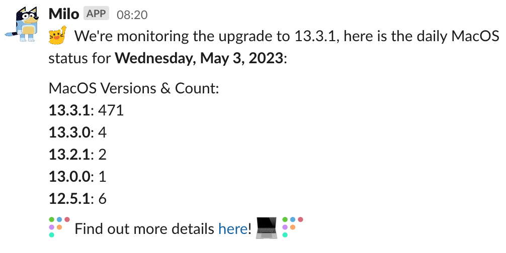
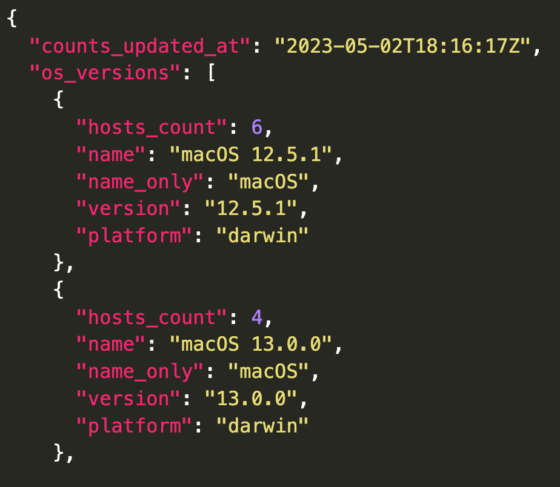
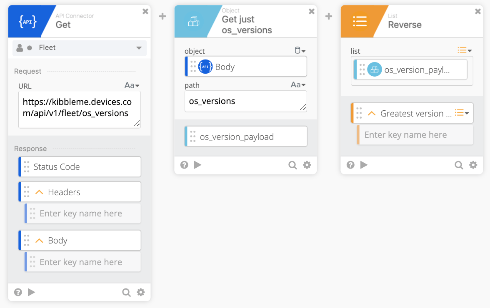
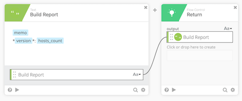
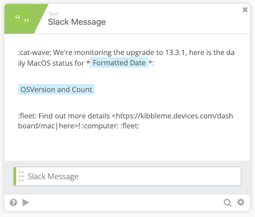

# Using Fleet and Okta Workflows to generate a daily OS report


_Today we wanted to feature [Harrison](https://kitchenstocomputers.com/fleet/), a member of our community. We thought this piece was exceptionally useful and wanted to share it with you all. If you are interested in contributing to the Fleet blog, feel free to [contact us](https://fleetdm.com/company/contact) or reach out to [@jdstrong](https://osquery.slack.com/team/U04MTPBAHQS) on the osquery slack._ 


For us, it's audit season. This project started as we prepared for ISO27001 and needed to better understand where our device's OS stood at any given time.

We use a device telemetry tool called Fleet, which runs on osquery, to ask questions about our devices through SQL queries. It's a great tool to have in your IT/Security toolkit as there is endless flexibility, especially with Fleet. You can read more about that product [here!](https://fleetdm.com/)

One of the best parts of this platform is its API (plus solid documentation of said API, which you cannot say for every vendor. Looking at you, Expensify 😒)

Here is an example of the message we send to various Slack channels. 





## Pulling it Apart

Let's start with the API call we need from Fleet.

Are you ready?
```https://kibbleme.devices.com/api/v1/fleet/os_versions ```
annnnnnd that's it. 😅

This returns a body that looks like such, this is just a snippet.





Once we have this information, the rest is up to the Workflow to handle, which is where we head next.

## Okta Workflow

This is what the flow chart looks like. We utilize both a main and helper flow, which I will explain shortly.


We start by making the API call to Fleet:





The body of the API lists oldest version of the OS first, and I wanted to change that, which we can do with a simple `Reverse` card. 

Next, we pass all the data to the helper flow for processing, which is the `Reduce` card.


The helper flow accepts the list from the previous step, named `osVersion`, which is just the JSON body at this point. The payload has other values, such as platform and name, but we only want the `host_count` and `version.` We extract these keys using a `Get Multiple` card. This card used dot notation to specify the path from which to pull the values. We now have two values as an output of this card which we can use downstream. This looks like such:


This is where the magic of the `Reduce` card comes in. It effectively iterates over a list and does an action we specify, in this case, creating a pair of values and then appending them together, flattening the list, and creating one piece of text however we want to manipulate it. 


Here we see we're dragging the values from the previous step `Get Multiple` card into the `Compose` card. The Memo is just the value we specified in the main flow; think of that as the Title. The version value is enclosed in asterisks because we are sending it to Slack and want that to be bold text.

To visualize this iteration, it looks like such: 

The first run:

MacOS Versions and Counts:

13.3.0: 4

The second run:

MacOS Versions and Counts:

13.3.0: 4

13.2.1: 2

The third run:

MacOS Versions and Counts:

13.3.0: 4

13.2.1: 2

13.2.0: 2

So on and so forth through all items in the list.

Once it reaches the end of the list, it returns the value back to the main flow in a single block of text.





Back in the main flow, we can start to put it all together and build the Slack messages we will post. We first want a date to add, in a human-readable format. Using ISO formats, we manipulate the date to produce the easy-to-read output like **Thursday, May 4, 2023.** The documentation elaborates further on different values you can use to create other formats.  


With all of the parts needed for the post, we use a final `Compose` card to string it all together!





Using one of my favorite cards, the `Construct` we create the key:value pair for our Slack message. So, for example, to post to the Slack API, we need a couple of values like, `channel` and `text`. And since we are using our friendly bot, we throw in the `username` as well. Check out the [Slack API docs](https://api.slack.com/methods/chat.postMessage) for the different keys you can use in the chat.postMessage API method, it's extensive!

```{

  "username": "Milo",

  "channel": "C0467T97NLF",

  "text": ":cat-wave: We're monitoring the upgrade to 13.3.1, here is the daily MacOS status for *Wednesday, May 3, 2023*:\n\nMacOS Versions & Count:\n*13.3.1*: 471\n*13.3.0*: 4\n*13.2.1*: 2\n*13.0.0*: 1\n*12.5.1*: 6\n\n:fleet: Find out more details &lt;https://kibbleme.devices.com/dashboard/mac|here>! :computer: :fleet:\n"

}
```

Lastly, we use a `POST` card to send this to Slack. 


That's really all there is to it! You could send this data almost anywhere, like if you prefer a Jira ticket or even a Google Spreadsheet. We have this running daily for now but will switch to weekly shortly. 

Additionally, you could parse the return values and use the `If Error` card to handle anything other
than a 200, but I have skipped that for now.

<meta name="articleTitle" value="Using Fleet and Okta Workflows to generate a daily OS report">
<meta name="authorFullName" value="Harrison Ravazzolo">
<meta name="authorGitHubUsername" value="harrisonravazzolo">
<meta name="category" value="guides">
<meta name="publishedOn" value="2023-05-09">
<meta name="articleImageUrl" value="../website/assets/images/articles/using-fleet-and-okta-workflows-to-generate-a-daily-os-report@2x.jpg">
<meta name="description" value="Learn how to use Fleet to query device OS information through the Fleet REST API and automate daily Slack notifications using Okta Workflows.">
