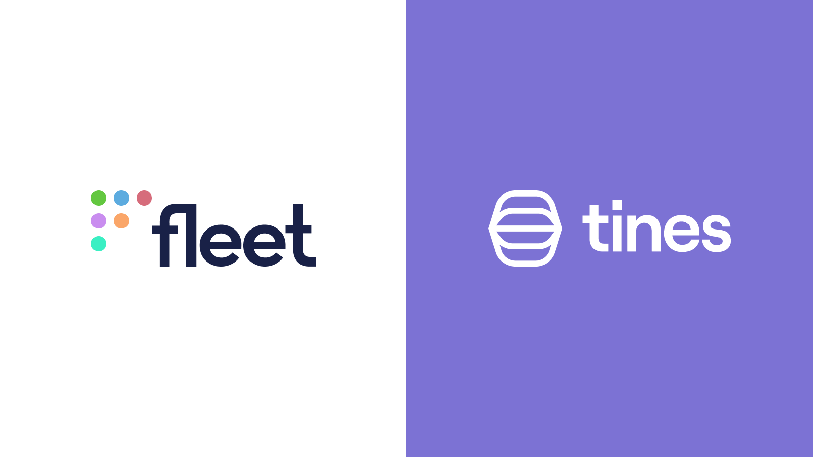
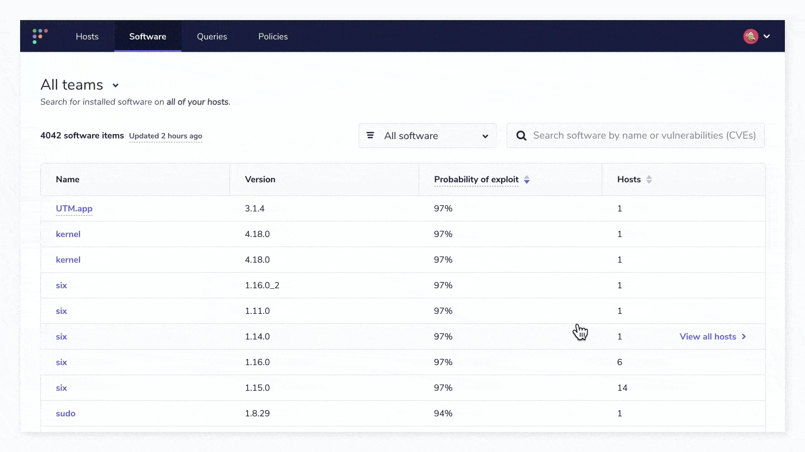
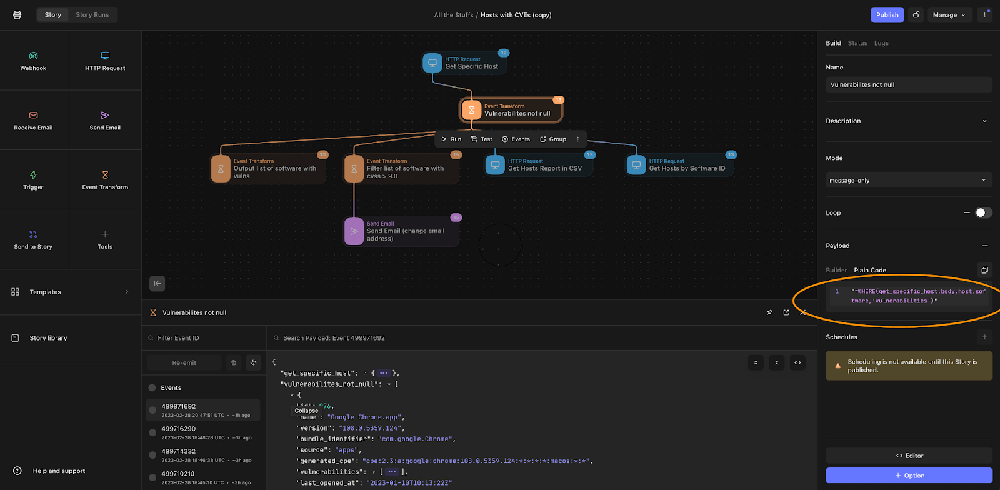
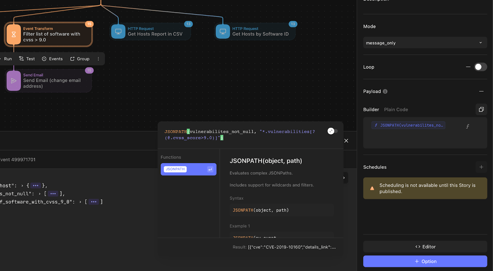
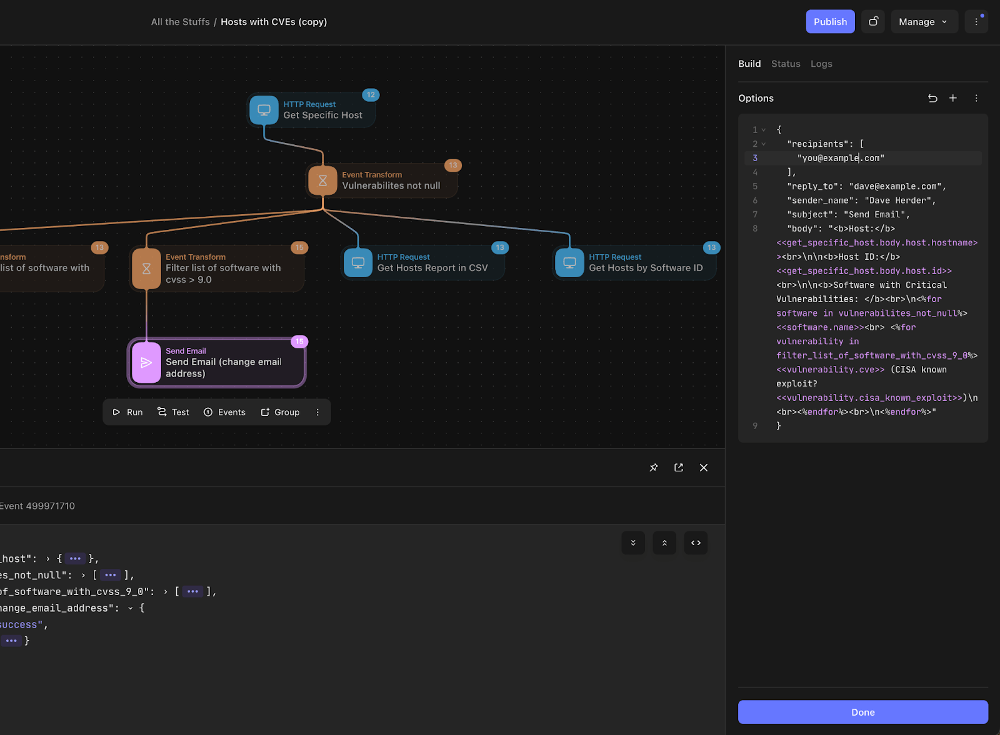

# Using Fleet and Tines together



Not long ago, I had never heard of Tines. I would have happily created custom python scripts to parse data coming from a REST API and have been done with it. Sure, accomplishing a data ingestion and transformation initiative with python is something that many people still do and, in some cases, still needed. The problem that Tines solves for me is the quick connection and data transformation use case when getting data out of the Fleet REST API. With Tines, I can quickly access all of the endpoints available in Fleet and use a simple lo-code solution to solve problems. Plus, the interface is stellar!

Fleet collects a large amount of data, and in many cases, it is not possible (or feasible) to represent that data in the UI in a way that solves all user needs. In the Fleet UI, the relationship between hosts and software installed on those hosts is illustrated in a couple of ways. 

First, by leveraging the “Software” tab, you can add a filter that will display only the software that has detected vulnerabilities.



From the “Hosts” column, you can see the count of hosts in the respective team that have the vulnerable software installed. If you click “View all hosts,” you can get the list of hosts displayed. Additionally, in this view, you can export the list of hosts to take further action toward remediation or compliance reporting.


But what if I wanted that list of hosts (in the above example, there is only one host that has the vulnerable software “UTM.app” installed) as well as the CVSS score, probability of exploit, and CVE numbers associated with the list of hosts? Or, just show me a list of hosts with all vulnerable software and the related CVE?

The good news is that Fleet has all of this information, and it is just a matter of transforming the data returned from its REST API to get it. Normally, this is where I would shift into a PyCharm IDE and start building something with requests. Enter Tines, and a bunch of problems just get solved without having to maintain a bunch of code. 

Out of the box, Tines just knows about Fleet. They have a concept called “Templates,” and if you simply search “fleet” in the Templates list, all of the endpoints that Fleet offers just automagically appear. 


I will use the HTTP Request element to access the “Get Specific Host” information in this example. In order to query all the information about a host, I simply need the Host ID or UUID. The Host ID is accessible by navigating to the host's detail page in Fleet, and the ID will be present in the browser as `https://<fleetserver>/hosts/<host_id>`. Alternatively, you can get the Host UUID from the columns list on the main Hosts page.


Before we can make a query in Tines, we will need to get an API key and user setup in Fleet. Please refer to our [API documentation regarding Authentication](https://fleetdm.com/docs/using-fleet/rest-api#retrieve-your-api-token). Once you have your API token, head over to Tines and add it to the Credentials section. Out of the box, there will be a text-based credential item that is used in the Tines “fleet” Templates called “fleet\_dm\_API\_key”. In the “Credentials” section of Tines, you will need to create this credential to match what the templates are referencing (fleet\_dm\_API\_key).


Enter “Bearer \<your token>” in the “Value” field, where \<your token> is your token from Fleet. The last configuration that needs to be done to get Tines to talk to your Fleet instance is the “fleet\_domain,” which is essentially the domain name of your Fleet instance. To create this resource, navigate to the “Resources” section in Tines and create a new instance called “fleet\_domain” and populate the value with the domain name of your fleet server.


Now that you have Tines configured to pre-populate the Fleet API token and server name, let us build on our example above by adding an “Event Transform” so that we can take the Event Response of the “Get Specific Host” query and remove any software from the list where vulnerabilities do not exist. In order to accomplish this, add the following code to the Payload Builder:

```
WHERE(get_specific_host.body.host.software,'vulnerabilities')
```



Next, I only want to generate alerts or send emails to users where vulnerability CVSS is greater than 9.0 (Critical). To do this, I can use the handy JSONPATH function to traverse the JSON structure and add a filter of sorts.

```
JSONPATH(vulnerabilites_not_null, "*.vulnerabilities[?(@.cvss_score>9.0)]")
```



Lastly, I’m going to use the response from the previous query to build my “Send Email” function. 

In the Tines Editor, the formatting would look something like this:

```
{
  "recipients": [
    "you@example.com"
  ],
  "reply_to": "you@example.com",
  "sender_name": "Dave Herder",
  "subject": "Send Email",
  "body": "<b>Host:</b> <<get_specific_host.body.host.hostname>><br>\n\n<b>Host ID:</b> <<get_specific_host.body.host.id>><br>\n\n<b>Software with Critical Vulnerabilities: </b><br>\n<%for software in vulnerabilites_not_null%><<software.name>><br> <%for vulnerability in filter_list_of_software_with_cvss_9_0%><<vulnerability.cve>> (CISA known exploit?    <<vulnerability.cisa_known_exploit>>)\n<br><%endfor%><br>\n<%endfor%>"
}
```



The final email with the above definition looks like this:


The Fleet API is very flexible, but with the addition of Tines, the options for data transformation are endless. In the above example, we easily connected to the Fleet API and transformed the data response with a single Tines Transform function, and allowed the end user to receive a customized report of vulnerable software on an individual host.

<meta name="category" value="guides">
<meta name="authorFullName" value="Dave Herder">
<meta name="authorGitHubUsername" value="dherder">
<meta name="publishedOn" value="2023-03-08">
<meta name="articleTitle" value="Using Fleet and Tines together">
<meta name="articleImageUrl" value="../website/assets/images/articles/using-fleet-and-tines-together-1600x900@2x.png">
