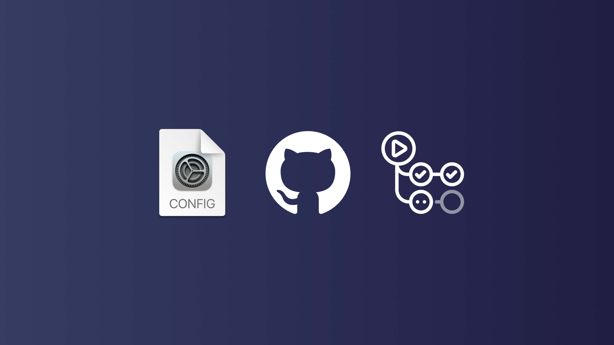
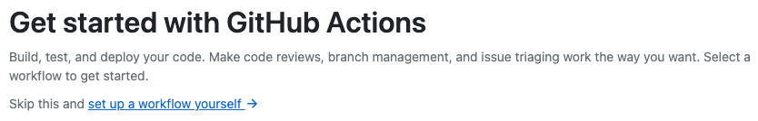
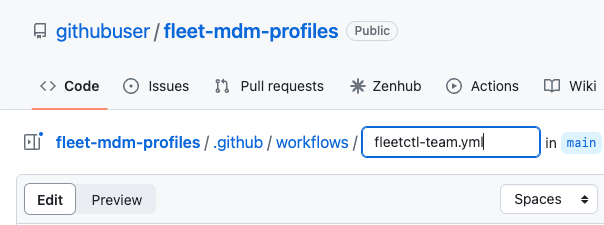
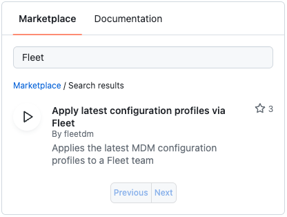
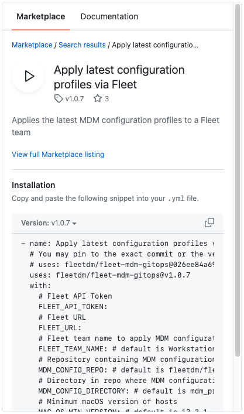
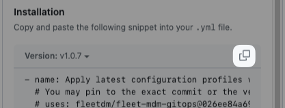

# Using GitHub Actions to apply configuration profiles with Fleet



In the ever-evolving realm of software management, automated workflows are an essential tool in maintaining system efficiency and security. At the heart of this drive towards automation is GitHub Actions, a powerful platform that enables developers to automate, customize, and execute software development workflows directly in their repositories. In this blog post, we focus on utilizing GitHub Actions with Fleet to apply the latest configuration profiles from your repository.

Fleet maintains a GitHub Action for this purpose, allowing you to call the action with parameters specific to your Fleet instance. This lets you maintain your systems with the latest updates, keeping them secure and operational. The process may sound daunting, but it is efficient and straightforward. 

This post will detail two methods to achieve the same result - an automated workflow that applies the latest configuration profiles to your fleet. We will delve into the specifics of setting up an action file in your repository, mapping out the variables, creating encrypted secrets, and configuring your fleet with the Fleet gitops workflow.

By the end of this guide, you'll have a fully operational GitHub action set up within your Fleet instance. This automated system will ensure your fleet remains up-to-date and secure, maximizing efficiency and reliability in your operations. Welcome to a more streamlined approach to fleet management.


## Create a GitHub action

Fleet maintains a GitHub Action for applying the latest configuration profiles in Fleet. You can call this action with parameters specific to your Fleet instance. We will outline two different methods that all lead to the same result.


1. Overview:
    1. Create a `.github/workflows` directory in your repo if it does not already exist.
    2. Inside the `.github/workflows` directory, create a new file named `fleetctl-team.yml`
    3. In the `fleetctl-team.yml`, add the [minimum recommended workflow](https://github.com/fleetdm/fleet/blob/main/.github/workflows/example-workflow.yaml): 


``` 
name: Apply latest configuration profiles (example)
    on:
      push:
        branches:
          - main
        paths:
          - "path/to/**.mobileconfig"
      workflow_dispatch: # Manual

    # This allows a subsequently queued workflow run to interrupt previous runs
    concurrency:
      group: ${ github.workflow }-${ github.head_ref || github.run_id}
      cancel-in-progress: true

    defaults:
      run:
        # fail-fast using bash -eo pipefail. See https://docs.github.com/en/actions/using-workflows/workflow-syntax-for-github-actions#exit-codes-and-error-action-preference
        shell: bash

    permissions:
      contents: read

    env:
      FLEET_API_TOKEN: ${ secrets.FLEET_API_TOKEN }
      FLEET_URL: ${ secrets.FLEET_URL }
      TOKEN_USED_BY_PROFILE: ${ secrets.TOKEN_USED_BY_PROFILE }

    jobs:
      apply-profiles:
        timeout-minutes: 5
        runs-on: ubuntu-latest
        steps:
          - name: Apply configuration profiles and updates
            uses: fleetdm/fleet-mdm-gitops@026ee84a69cb89c869fedbe27c969bf89def418b
            with:
              FLEET_API_TOKEN: $FLEET_API_TOKEN
              FLEET_URL: $FLEET_URL
              FLEET_TEAM_NAME: Workstations
              MDM_CONFIG_REPO: fleetdm/fleet
              MDM_CONFIG_DIRECTORY: mdm_profiles
              MAC_OS_MIN_VERSION: 13.3.2
              MAC_OS_VERSION_DEADLINE: 2023-06-15
              MAC_OS_ENABLE_DISK_ENCRYPTION: true
```

> The example configuration profile action takes advantage of variables on workflow run. Learn more about [Variables in GitHubActions](https://docs.github.com/en/actions/learn-github-actions/variables).

2. Using the GitHub UI:
    1. On GitHub.com, navigate to the main page of the repository.
    2. Under your repository name, click **Actions**.  

      

    3. Create a new Action by either

        1. Following the link to _set up a workflow yourself_ 

        
      
        **Or**

        2. Clicking the add new button.

    7. Name your yaml file `fleetctl-team.yml`
    

    8. Under _Marketplace_ in the right column, search for “Fleet.”  
    

    9. Click on _Apply latest configuration profiles via Fleet_ to expand the listing.  
    

    10. Click the copy icon  
    

    11. Paste into your yaml file, and set the variables  
    

    12. Click **Commit changes…**  
    


## What do these variables do?

  `FLEET_API_TOKEN:` This is your [Fleet API Token](https://fleetdm.com/docs/using-fleet/rest-api#retrieve-your-api-token) or an [API-only user](https://fleetdm.com/docs/using-fleet/fleetctl-cli#create-an-api-only-user).

  `FLEET_URL:` This is the URL of your Fleet instance.

  `FLEET_TEAM_NAME:` Fleet team name to apply MDM configuration profiles to. The default is _Workstations_.

  `MDM_CONFIG_REPO:` Repository containing MDM configuration profiles. The default is _fleetdm/fleet_.

  `MDM_CONFIG_DIRECTORY:` Directory in the repo where MDM configuration files are stored. The default is _mdm_profiles_.

  `MAC_OS_MIN_VERSION:` Minimum macOS version of hosts. The default is _13.3.1_.

  `MAC_OS_VERSION_DEADLINE:` Deadline for macOS version to be enforced. The default is _2023-05-15_.

  `MAC_OS_ENABLE_DISK_ENCRYPTION:` Enable disk encryption, also known as FileVault. The default is _true_.


## Create encrypted secrets

1. On GitHub.com, navigate to the main page of the repository.
2. Under your repository name, click **Settings**.
3. In the "Security" section of the sidebar, select  _Secrets and variables_, then click Actions.
4. Click the Secrets tab.  


5. Click **New repository secret**.
6. In the Name field, enter `FLEET_API_TOKEN` as the name for your secret.
7. In the Secret field, enter your [Fleet API token](https://fleetdm.com/docs/using-fleet/rest-api#retrieve-your-api-token) as the value for your secret.  


8. Click **Add secret**.
9. Repeat this process for the `FLEET_URL` secret.


## Configure your fleet with Fleet gitops workflow

Now we can add configuration profiles to the _mdm_profiles_ directory, create a pull request, and once merged, the Github action implemented above will automatically trigger to spin up and apply the profile using fleetctl based on the push paths defined in the action.

```
on:
  push:
    branches:
      - main
    paths:
      - "path/to/**.mobileconfig"
```

## Conclusion

Setting up a GitHub action with Fleet is an efficient and straightforward process that allows you to apply the latest configuration profiles seamlessly. This method utilizes a yaml file within your repository to set specific parameters and create a robust automated workflow. The three methods we outlined all lead to the same result – an automated system for managing your fleet.

With this in place, you need to trigger your GitHub action by adding configuration profiles to your repo and creating a pull request. It will automatically apply the profile using `fleetctl`, ensuring your Fleet instance remains current and secure. This makes managing your fleet significantly more efficient, taking full advantage of the power of automation. Through the steps outlined above, you can easily set up a streamlined, automated system for maintaining your fleet, with increased visibility and collaboration, improved security and compliance, version control, and ensuring maximum efficiency and reliability in your operations.

<meta name="articleTitle" value="Using GitHub Actions to apply configuration profiles with Fleet">
<meta name="authorFullName" value="JD Strong">
<meta name="authorGitHubUsername" value="spokanemac">
<meta name="category" value="guides">
<meta name="publishedOn" value="2023-05-31">
<meta name="articleImageUrl" value="../website/assets/images/articles/using-github-actions-to-apply-configuration-profiles-with-fleet@2x.jpg">
<meta name="description" value="A guide on using GitHub Actions with Fleet for efficient and automated application of the latest configuration profiles for a GitOps workflow.">
