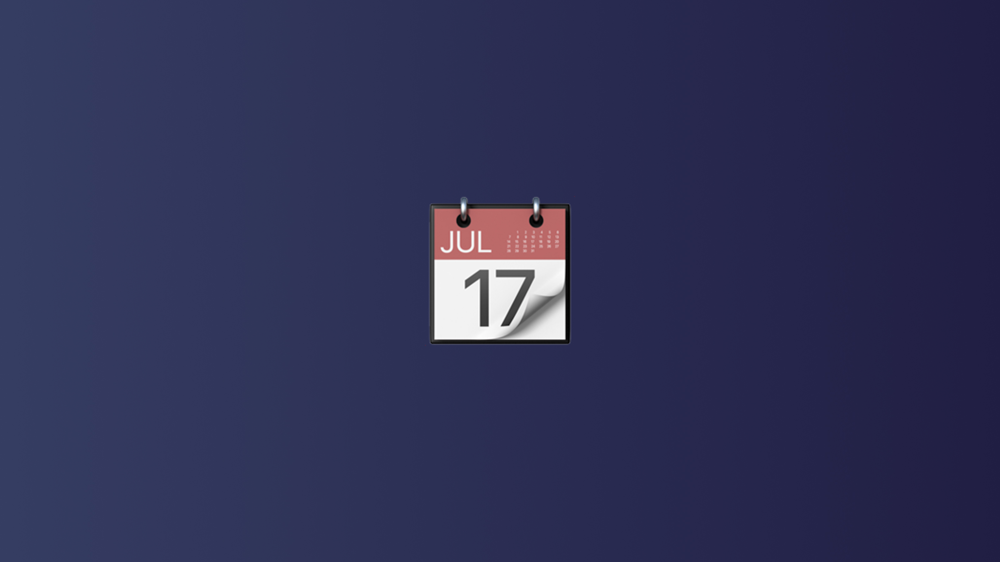

# Using maintenance windows (Fleet in your calendar)

Fleet helps end users fix issues on their own by scheduling a maintenance window directly on their calendar—no IT ticket required.

When a host fails a policy (e.g. MDM enrollment profile expired, disk encryption disabled, outdated software), Fleet can notify the user via a Google Calendar event. The event includes:

* What’s wrong (based on policy description)
* What to do (from the policy resolution field)
* A scheduled time (next available slot on Tuesday, 9–5 local time)

The user can reschedule if needed—Fleet will respect the new time and run the remediation then.

You can customize these flows with a webhook (e.g. Tines) to run scripts, use the Fleet API, or call MDM commands.

> 🔜 Auto-remediation for patching (OS updates, software) is coming soon.

### Setup

1. Connect a Google Workspace service account to Fleet under **Settings > Integrations > Calendars**.
2. Create a webhook to handle the remediation (see [Fleet + Tines guide](https://fleetdm.com/guides/building-webhook-flows-with-fleet-and-tines)).
3. In the **Policies** tab, click **Manage automations > Calendar events**, enable the feature, and paste your webhook URL.

### End user experience

* If a user owns multiple failing hosts, only one host is scheduled at a time. Once it's fixed, Fleet schedules the next.
* If a host has multiple users, Fleet chooses one user to receive the event.
* Users can reschedule the event on their calendar—Fleet will run remediation at the new time.
* If a user moves the event to before the current time, Fleet shifts it to the next day.
* If a user deletes the event, Fleet automatically reschedules it for the next day.
* Fleet monitors calendar changes in real time (reschedules within ~30 seconds), but only for events in the upcoming week. Events further out are updated within 30 minutes.

### What happens when a policy fails?

1. A calendar event is scheduled for the user who owns the host.
2. Fleet waits for the scheduled time, then calls the webhook with host + failure details.

---

For more info:

* [Fleet maintenance windows overview](https://fleetdm.com/announcements/fleet-in-your-calendar-introducing-maintenance-windows)
* [How it works under the hood (video)](https://www.youtube.com/watch?v=Ra47xZwSitQ)

<meta name="articleTitle" value="Using maintenance windows (Fleet in your calendar)">
<meta name="authorFullName" value="Noah Talerman">
<meta name="authorGitHubUsername" value="noahtalerman">
<meta name="category" value="guides">
<meta name="publishedOn" value="2025-05-15">
<meta name="articleImageUrl" value="../website/assets/images/articles/configuring-maintenance-windows-in-fleet-1600x900@2x.jpg">
<meta name="description" value="How to schedule time for self-remediation when your end users are free using Fleet's maintenance windows.">
