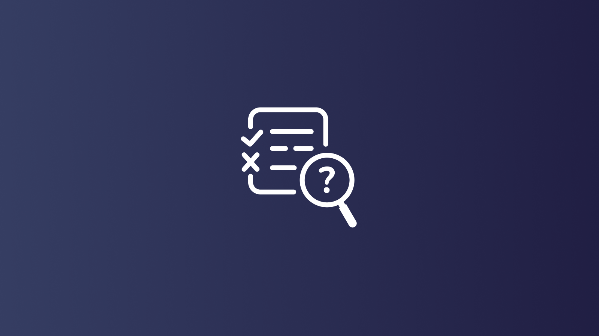

# Vulnerability management: advantages of Fleet to support government agencies

In today's digital age, government agencies face increasing cybersecurity threats. To safeguard sensitive information and ensure the smooth functioning of operations, it is crucial to adopt effective vulnerability management solutions. Among the various options available, Fleet emerges as a superior choice for government agencies due to its comprehensive features, centralized control, and cost-effectiveness. 

## Why Fleet for government agencies: 

Fleet is an open-source platform for IT and security teams managing thousands of computers. IT and security need a clear view of their enterprise. They need something simple and stable: low-level and easy to understand, with paved roads, unbloated, untainted by the sprawl. Something compatible that can be rolled out gradually yet solves real problems fast enough to matter.  Something that can be customized and automated thoroughly but still foolproof enough that all team members can be trained to use it.  This essay explores the reasons why government agencies should prioritize Fleet over other vulnerability management products. By examining its advantages, starting with extreme openness and including enhanced security, streamlined operations, and reduced costs, it becomes evident that Fleet is the optimal choice for government agencies seeking to protect their digital infrastructure. 

## Key benefits of Fleet: 

1. **Enhanced security:** Government agencies handle vast amounts of sensitive data, making them prime targets for cyberattacks. Fleet offers robust security features that help mitigate vulnerabilities and protect against potential threats. These solutions provide real-time monitoring, threat detection, and immediate response capabilities, ensuring that security breaches are promptly addressed. By implementing Fleet, government agencies can significantly reduce the risk of data breaches and unauthorized access. 

> Example: The U.S. Department of Defense utilizes device management to secure its vast network of devices, ensuring the protection of classified information and preventing potential cyber threats. 

2. **Centralized control:** Government agencies often operate across multiple locations, making efficiently managing and monitoring devices challenging.  Fleet provides a centralized platform that allows administrators to oversee and control all devices from a single interface. This centralized control enables swift deployment of security updates, software patches, and policy enforcement, ensuring consistent security measures across the entire enterprise. 

3. **Cost-effectiveness:** Compared to other vulnerability management products, Fleet offers a cost-effective solution that supports multiple operating systems, Linux (all distros), macOS, Windows, Chromebooks, Amazon Web Services (AWS), Google Cloud (GCP), Azure (Microsoft cloud), Data centers, Containers (Kubernetes, etc), Linux-based IoT devices. By consolidating various security features into a single platform, Fleet eliminates the need for multiple standalone products, reducing licensing and maintenance costs. Additionally, Fleet's centralized control and automation capabilities minimize the need for manual intervention, saving valuable time and resources. 

## Explore the potential of Fleet for your agency: 

In conclusion, government agencies should prioritize Fleet as their vulnerability management solution due to its numerous advantages. Enhanced security measures, centralized control, and cost-effectiveness make Fleet the ideal choice for protecting sensitive information and ensuring the smooth functioning of operations. By implementing Fleet, government agencies can effectively safeguard their digital infrastructure, mitigate vulnerabilities, and stay one step ahead of potential cyber threats.

Interested in enhancing your agency's cybersecurity infrastructure with a solution that combines enhanced security, centralized control, and cost-effectiveness? We invite you to delve deeper into what Fleet can offer. Discover how this platform can be tailored to meet the unique needs of your government agency. For more information or to schedule a demo, please contact us. Together, let's fortify your digital defenses and ensure your essential services' secure and efficient operation.
 

<meta name="category" value="security">
<meta name="authorFullName" value="Keith Barnes">
<meta name="authorGitHubUsername" value="KAB703">
<meta name="publishedOn" value="2023-12-26">
<meta name="articleTitle" value="Vulnerability management: advantages of Fleet to support government agencies">
<meta name="articleImageUrl" value="../website/assets/images/articles/vulnerability-management-advantages-of-fleet-to-support-government-agencies-1600x900@2x.png">
