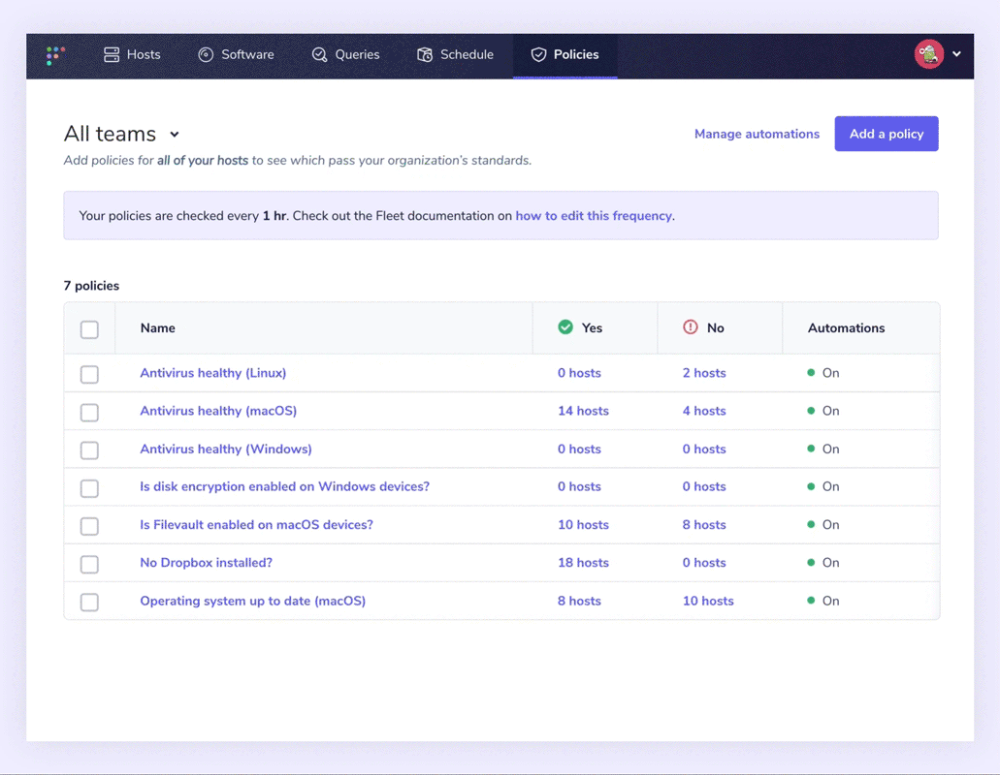

# Policies

Fleet policies are a great way to quickly monitor your devices by asking yes or no questions about them. Policies are also an easy way to make sure you maintain data integrity, confidentiality, and security. Whether you’re checking in on a small set of devices, or a fleet of thousands, policies give quick insight into their status and IT compliance. For example, suppose one of your defined controls makes sure that all of your macOS devices have Gatekeeper enabled. In that case, the Security team can create a policy to quickly and easily return a yes or no response from all of your enrolled devices.

Read more about [getting and staying compliant across your fleet.](https://fleetdm.com/use-cases/get-and-stay-compliant-across-your-devices-with-fleet)

## Add policies

To reduce the barrier of entry with Fleet, we’ve introduced our [standard templates](https://fleetdm.com/queries) that allow users to choose from a library of pre-made policies. Those handy with [osquery](https://osquery.io/) and SQL can still create custom policies to their heart’s content: 

1. In the top navigation, select **Policies**.

2. Select **Add policy** to navigate to the policy selection dialog. Either choose an existing policy or select **create your own policy**.

3. In the **Query** field, enter your query. When creating a policy, keep in mind that a policy will return a "yes" result if one or more results are returned and will return "No" if no results are returned. Because of this, most policies will begin with a "SELECT 1 FROM..." statement. 

4. Select **Save**, enter a name, description, and resolution for your policy and then select **Save policy**.

5. By default, policies are evaluated on an hourly interval, which is controlled by this [server setting](https://fleetdm.com/docs/configuration/fleet-server-configuration#osquery-policy-update-interval). Please see [this article](https://fleetdm.com/guides/understanding-the-intricacies-of-fleet-policies) for more information.

## Identifying out-of-policy devices

The policies page makes it easy to see which devices on each team are passing and failing with distinct “yes” or “no” responses. Although checking devices manually is relatively easy, we’ve made it even easier for endpoint detection and response security. We now have automation.

Fleet adds the ability to automate failing host policies with [webhook automations](https://fleetdm.com/docs/using-fleet/automations#policy-automations) to identify out-of-policy devices more easily. Users can specify a webhook URL to send alerts that include all devices that answered “No” to a policy. This makes it easier to create a support ticket and resolve each device.

Alongside policies, detected [vulnerabilities can be automated](https://fleetdm.com/docs/using-fleet/automations#vulnerability-automations) when enabled. Fleet can then reach out when a common vulnerability and exposure (CVE) is detected. We only send notifications for new vulnerabilities published within the last two days. This reduces signal noise.

## How Fleet uses policies:

We believe that a good user experience empowers contributors. Policies are a great way to do this, and Fleet follows the guiding principles below to secure our company-owned devices:

- Our devices should give contributors the freedom to work from anywhere.
- To allow maximum freedom in where and how we work, we assume that "Safe" networks do not exist. Contributors should be able to work on a coffee shop's Wi-Fi as if it were their home or work network.
- To limit the impact on user experience, we do not dictate security configurations unless the benefit is significant. We apply them only if it dramatically reduces the risk for the company, customers, or open source users.
- By using techniques such as Two-Factor Authentication (2FA), code reviews, and more, we can further empower contributors to work comfortably from any location - on any network.

These principles helped us create policies for our own devices to track:

- Is antivirus healthy?
- Is automatic login disabled?
- Is Firefox not present or up to date (macOS)?
- Is full disk encryption enabled?
- Is Gatekeeper enabled (macOS)?
- Are guest users disabled (macOS)?
- Is Google Chrome up to date (macOS)?
- Is MDM enrolled?
- Are no 1Password recovery kits stored (macOS)?
- Are all SSH keys encrypted?
- Is secure keyboard entry for Terminal.app enabled (macOS)
- Is the operating system up to date (macOS)
- Is system Integrity Protection enabled (macOS)

Policies and automation help your security and IT teams feel confident that devices are passing your organization’s standards. Fleet is building an open, transparent, and simple future for device management and is the [most widely deployed osquery fleet manager.](https://fleetdm.com/) 

## Further reading

- [Understanding the intricacies of Fleet policies](https://fleetdm.com/guides/understanding-the-intricacies-of-fleet-policies)

<meta name="category" value="security">
<meta name="authorGitHubUsername" value="Drew-P-drawers">
<meta name="authorFullName" value="Andrew Baker">
<meta name="publishedOn" value="2022-05-20">
<meta name="articleTitle" value="What are Fleet policies?">
<meta name="articleImageUrl" value="../website/assets/images/articles/what-are-fleet-policies-cover-1600x900@2x.jpg">
