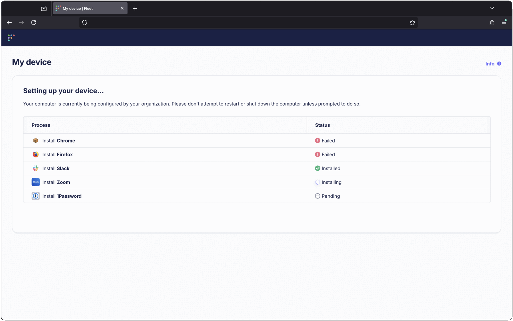

# Install software during new Linux setup

_Available in Fleet Premium_

In Fleet, you can customize the software that's installed when a new Windows or Linux workstation enrolls to Fleet. This feature is similar to the setup experience [available on macOS](https://fleetdm.com/guides/macos-setup-experience) during ADE enrollment.

Fleet automatically opens the default web browser to show end users software install progress:

The browser can be closed, and the installation will continue in the background. End users can return to the setup experience page by clicking **My Device** from Fleet Desktop.  Once all steps have completed, the **My Device** page will show the host information as usual.

If software installs fail, Fleet automatically retries. Learn more in the [macOS setup experience guide](https://fleetdm.com/guides/macos-setup-experience#install-software).

To replace the Fleet logo with your organization's logo:

1. Go to **Settings** > **Organization settings** > **Organization info**
2. Add URLs to your logos in the **Organization avatar URL (for dark backgrounds)** and **Organization avatar URL (for light backgrounds)** fields
3. Press **Save**

> See [configuration documentation](https://fleetdm.com/docs/configuration/yaml-files#org-info) for recommended logo sizes.

> Software installations during setup experience are automatically attempted up to 3 times (1 initial attempt + 2 retries) to handle intermittent network issues or temporary failures. This ensures a more reliable setup process for end users. 

## Choose software

To pick which software is installed during the setup experience:

1. Click on the **Controls** tab in the main navigation bar,  then **Setup experience** > **3. Install software**.
2. Click on the tab corresponding to the operating system you're configuring, either **macOS**, **Windows** or **Linux**.
3. Click **Add software**, then select or search for the software you want installed during the setup experience.
4. Press **Save** to save your selection.

Fleet also provides a API endpoints for managing setup experience software programmatically. Learn more in Fleet's [API reference](https://fleetdm.com/docs/rest-api/rest-api#update-software-setup-experience).

<meta name="category" value="guides">
<meta name="authorGitHubUsername" value="dantecatalfamo">
<meta name="authorFullName" value="Dante Catalfamo">
<meta name="publishedOn" value="2025-09-24">
<meta name="articleTitle" value="Installing software during new Linux setup">
<meta name="description" value="Customize your macOS setup experience with Fleet Premium by managing user authentication, Setup Assistant panes, and installing bootstrap packages.">
