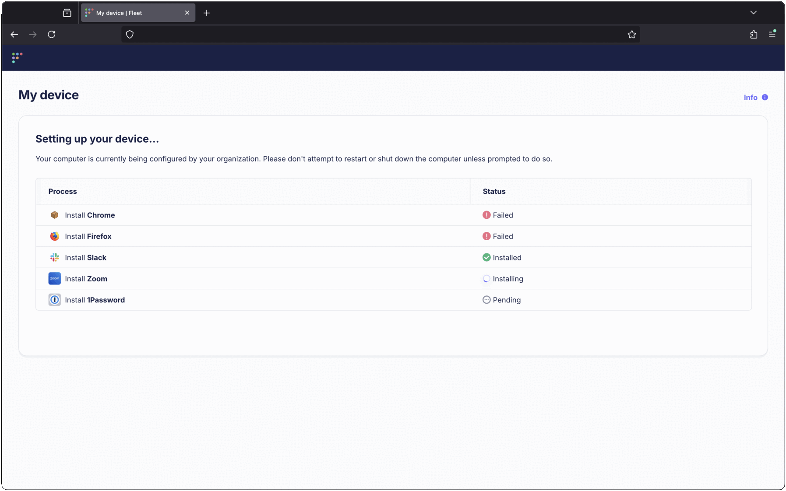

# Installing software during setup on Linux

_Available in Fleet Premium_

In Fleet, you can customize the software that's installed while enrolling new users on Linux. This feature is similar to the setup experience [available on macOS](https://fleetdm.com/guides/macos-setup-experience) during ADE enrollment. Windows support is coming soon.

The installers can come either from your custom packages, or the list of Fleet-maintained apps.

If you configure software for setup experience, users will see a web browser pop open after their device enrolls in Fleet:

This page shows the status of the software installations. The browser can be closed, and the installation will continue in the background. Users can return to the setup experience page by clicking **My Device** from Fleet Desktop.  Once all steps have completed, the **My Device** page will show the host information as usual.

To replace the Fleet logo with your organization's logo:

1. Go to **Settings** > **Organization settings** > **Organization info**
2. Add URLs to your logos in the **Organization avatar URL (for dark backgrounds)** and **Organization avatar URL (for light backgrounds)** fields
3. Press **Save**

> See [configuration documentation](https://fleetdm.com/docs/configuration/yaml-files#org-info) for recommended logo sizes.

> Software installations during setup experience are automatically attempted up to 3 times (1 initial attempt + 2 retries) to handle intermittent network issues or temporary failures. This ensures a more reliable setup process for end users. 

## Selecting installers

To configure software to be installed during setup experience:

1. Click on the **Controls** tab in the main navigation bar,  then **Setup experience** > **3. Install software**.
2. Click on the tab corresponding to the operating system you're configuring, either **macOS**, or **Linux**.
3. Click **Add software**, then select or search for the software you want installed during the setup experience.
4. Press **Save** to save your selection.

## Configuring via REST API

Fleet also provides a REST API for managing setup experience software programmatically. Learn more about Fleet's [REST API](https://fleetdm.com/docs/rest-api/rest-api).

<meta name="category" value="guides">
<meta name="authorGitHubUsername" value="dantecatalfamo">
<meta name="authorFullName" value="Dante Catalfamo">
<meta name="publishedOn" value="2025-09-24">
<meta name="articleTitle" value="Installing software during setup">
<meta name="description" value="Customize your macOS setup experience with Fleet Premium by managing user authentication, Setup Assistant panes, and installing bootstrap packages.">
