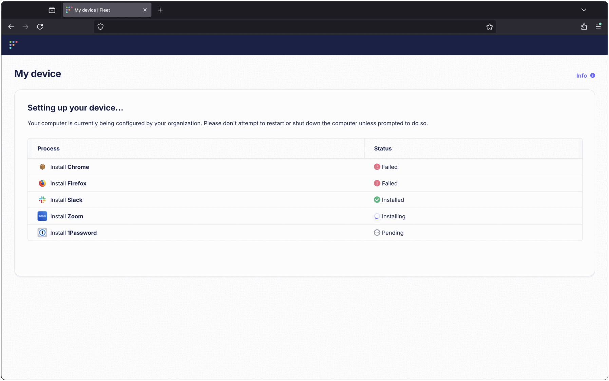

# Windows & Linux setup experience

_Available in Fleet Premium_

In Fleet, you can customize the out-of-the-box Windows and Linux setup.

Windows setup experience is supported for [manual enrollment](https://fleetdm.com/guides/windows-mdm-setup#manual-enrollment), [automatic enrollment](https://fleetdm.com/guides/windows-mdm-setup#automatic-enrollment), and [Autopilot](https://fleetdm.com/guides/windows-mdm-setup#windows-autopilot). On Autopilot and Entra-join-during-OOBE enrollments, Fleet holds the device at the Enrollment Status Page while setup experience runs, so software and profiles can apply before the end user reaches the desktop.

Currently, Linux setup experience is only supported for Ubuntu, Debian, Fedora, Amazon Linux, CentOS, openSUSE, and Red Hat Enterprise Linux (RHEL).

Here's what you can configure, and in what order each happen, to your Windows and Linux hosts during setup:

1. Require [end users to authenticate](#end-user-authentication) with your identity provider (IdP).

2. [Install software](#install-software) including [app store apps](https://fleetdm.com/guides/install-app-store-apps), [custom packages](https://fleetdm.com/guides/deploy-software-packages) (e.g. a bootstrap package), and [Fleet-maintained apps](https://fleetdm.com/guides/fleet-maintained-apps).

Below is the end user experience for Linux. Check out the separate video for [Windows](https://www.youtube.com/watch?v=SHqT29NP-nk).

<div purpose="embedded-content">
   <iframe src="https://www.youtube.com/embed/UZAqw4pg9xE?si=rMhbfImonY4Avb06" frameborder="0" allowfullscreen></iframe>
</div>

## End user authentication

### End user experience

Fleet automatically opens the default web browser and directs the end user to log in before the setup process can continue. 

If the end user enrolls through **Settings > Access work or school**, Fleet's authentication window will be skipped because the user already authenticated.

Learn how to enforce authentication in the [setup experience guide](https://fleetdm.com/guides/setup-experience#end-user-authentication).

When wiping and re-enrolling a host, delete the host from Fleet as well. Otherwise, end user authentication won’t be enforced when it re-enrolls.

> If the Fleet agent (fleetd) installed on the host is older than version 1.50.0, end user authentication won't be enforced.

## Install software

### End user experience

Fleet automatically opens the default web browser to show end users software install progress:



The browser can be closed, and the installation will continue in the background. End users can return to the setup experience page by clicking **My Device** from Fleet Desktop.  Once all steps have completed, the **My Device** page will show the host information as usual.

For Linux, Fleet automatically installs on compatible platforms. This means `.deb` packages are only installed on Ubuntu and Debian hosts. `.rpm` packages are only installed on Fedora, CentOS, Amazon Linux, and Red Hat Enterprise Linux (RHEL).

If software installs fail, Fleet automatically retries. Learn more in the [setup experience guide](https://fleetdm.com/guides/setup-experience#end-user-authentication).

To replace the Fleet logo with your organization's logo:

1. Go to **Settings** > **Organization settings** > **Organization info**
2. Add URLs to your logos in the **Organization avatar URL (for dark backgrounds)** and **Organization avatar URL (for light backgrounds)** fields
3. Press **Save**

> See [configuration documentation](https://fleetdm.com/docs/configuration/yaml-files#org-info) for recommended logo sizes.

> Software installations during setup experience are automatically attempted up to 3 times (1 initial attempt + 2 retries) to handle intermittent network issues or temporary failures. This ensures a more reliable setup process for end users.

### Cancel setup if software fails (Windows)

For Windows hosts enrolling through Autopilot or Entra OOBE, you can configure Fleet to stop setup and show a failure screen on the device when a setup-experience software install fails. Without this setting, Fleet lets the device continue past the Enrollment Status Page even if some installs fail, and the end user reaches the desktop with the failed install marked **Failed** in **My device**.

To enable for a team:

1. Select the team you're configuring (or **No team**) from the team dropdown.
2. Go to **Controls** > **Setup experience** > **Install software**.
3. Click the **Windows** tab.
4. Switch on **Cancel setup if software fails**.
5. Press **Save**.

The setting only applies to Autopilot and Entra-join-during-OOBE enrollments. On those paths, when a setup-experience software install fails, Fleet does the following:

- Cancels remaining setup-experience steps for that host.
- Posts a `canceled_setup_experience` activity to the activity feed, referencing the first failed install. The activity reads: "Fleet canceled setup experience on \<host\> because \<software\> failed to install. End user was asked to restart."
- Sends the Enrollment Status Page failure screen described below.

On BYOD enrollments (**Settings** > **Accounts** > **Access work or school** > **Connect**), the Enrollment Status Page is never shown, and the **Cancel setup if software fails** setting is ignored. A failing install just shows as **Failed** in **My device** and host details; other queued installs and scripts run independently. No `canceled_setup_experience` activity is emitted. Because the end user is not notified on the device, plan to surface the failure through host details or the activity feed.

Profile failures alone do not trigger cancellation, even when **Cancel setup if software fails** is on. Only software install failures (including a 3-hour setup-experience timeout) cause the device to block.

#### What end users see when setup is cancelled

On Autopilot or Entra-OOBE, the device shows "Working on it..." for roughly a minute after the failing install reports back to Fleet, then transitions to a failure screen with the configured error text and a **Reset device** button. A **Collect logs** button may also appear, but Windows does not always render it. **Reset device** wipes the device and re-enters OOBE; if the failing software is still configured for the team, the device will hit the same failure again on the next enrollment. Use the recovery procedure below to log into the device without wiping it.

### Add software

Add setup experience software setup experience:

1. Click on the **Controls** tab in the main navigation bar,  then **Setup experience** > **3. Install software**.
2. Click on the tab corresponding to the operating system (e.g. Linux).
3. Click **Add software**, then select or search for the software you want installed during the setup experience.
4. Press **Save** to save your selection.

Fleet also provides a API endpoints for managing setup experience software programmatically. Learn more in Fleet's [API reference](https://fleetdm.com/docs/rest-api/rest-api#update-software-setup-experience).

## Recover a Windows host from the setup failure screen

When a Windows host is parked at the Enrollment Status Page failure screen, the on-screen options are limited to **Reset device** (which wipes the host) and a **Collect logs** button that may or may not appear. The procedures below let you log in to the device and reach a desktop without wiping anything.

### End user recovery from the device

An end user sitting in front of the failure screen has two useful keyboard shortcuts:

- **Shift+F10** opens a Command Prompt. From the prompt, run `powershell.exe` to switch to PowerShell and execute the recovery script described below.
- **Ctrl+Shift+D** opens the Windows Autopilot diagnostics page when diagnostics are enabled in the Autopilot deployment profile. Select **Export Logs** to save diagnostic logs to a USB drive. This is the documented Microsoft alternative when the on-screen **Collect logs** button doesn't appear, but it doesn't recover the device on its own.

If Shift+F10 produces a blank screen with no console (we've seen this on some hypervisors, including Proxmox), ask an administrator to push the recovery script remotely (next section).

### Administrator recovery through Fleet

An administrator can push a PowerShell script to the locked-out host through Fleet. The host's Fleet agent (orbit) installs early in setup experience, so it is running in the background even while the device is parked at the failure screen. The script creates a local administrator account, clears the registry values that pin the Enrollment Status Page block, and reboots the device.

```powershell
$Username = "IT admin"
$Password = ConvertTo-SecureString "StrongPassword123!" -AsPlainText -Force

# Create the local user account
New-LocalUser -Name $Username -Password $Password -FullName "Fleet IT admin" -Description "Fleet breakglass admin" -AccountNeverExpires -ErrorAction Stop

# Add the user to the Administrators group
Add-LocalGroupMember -Group "Administrators" -Member $Username -ErrorAction Stop

# Clear the Enrollment Status Page block at the registry layer
$key = Get-ChildItem "HKLM:\Software\Microsoft\Provisioning\OMADM\Accounts\*\Protected\*\FirstSyncStatus" -ErrorAction SilentlyContinue
if ($key) {
    Set-ItemProperty -Path $key.PSPath -Name "ServerHasFinishedProvisioning" -Value 1 -Type DWord
    Set-ItemProperty -Path $key.PSPath -Name "BlockInStatusPage" -Value 0 -Type DWord
}
Restart-Computer -Force
```

To run it:

1. Change `StrongPassword123!` to a password your organization controls.
2. Go to **Controls** > **Scripts** and upload the script, or open the host's detail page and select **Actions** > **Run script** to paste it inline.
3. Run the script against the locked-out host.
4. The host's orbit agent picks up the script within a few seconds and runs it as SYSTEM. The host reboots automatically as the last step.

After the reboot, the device leaves the failure screen on its own and arrives at a Windows sign-in screen.

### Sign in as the recovery account

After the reboot, the Windows sign-in screen defaults to a work or school (Entra) account. The `IT admin` account created above is a local account, so the sign-in must be told to authenticate against this computer rather than Entra. In the username field, type:

```
.\IT admin
```

The leading `.\` tells Windows to look for the account on this computer. If the sign-in screen does not accept `.\IT admin`, try `<computer-name>\IT admin` (for example `DESKTOP-ABC123\IT admin`), or look for a **Sign-in options** link under the password field and pick a local-account option.

## Windows updates during Autopilot

While a Windows device is in Autopilot OOBE, Windows itself may present a "We've got an update for you" screen and offer to restart immediately to install a pending Windows update. Fleet does not trigger this prompt; Windows shows it based on its own update checks, independent of any Fleet OS update profile you may have configured.

Best practice: select **Another time** so the setup experience can complete before the device reboots. The pending Windows update will install on a later reboot, including any reboot scheduled by a Fleet OS update profile if you have one configured.

If you select **Restart now**, Windows installs the update and resumes OOBE on the next boot. Setup experience commands that hadn't completed before the restart will resume after the device finishes updating. This works, but it adds time to the user's first-boot wait and makes the OOBE timeline harder to reason about when troubleshooting.

<meta name="category" value="guides">
<meta name="authorGitHubUsername" value="dantecatalfamo">
<meta name="authorFullName" value="Dante Catalfamo">
<meta name="publishedOn" value="2025-09-24">
<meta name="articleTitle" value="Windows & Linux setup experience">
<meta name="description" value="Install software when Linux and Windows workstations enroll to Fleet">
