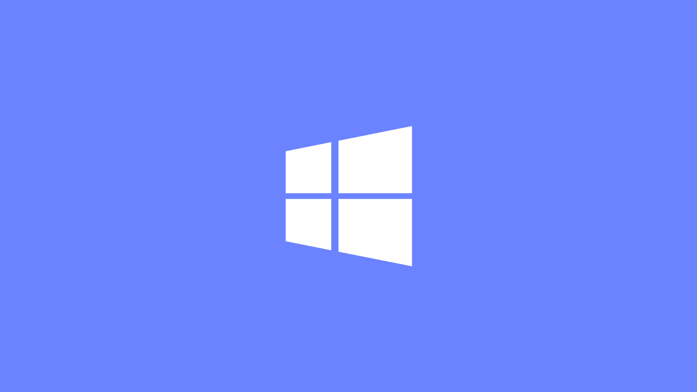

# Windows MDM setup



To control OS settings, updates, and more on Windows hosts, follow the manual enrollment instructions.

To use automatic enrollment (aka zero-touch) features on Windows, follow the instructions to connect Fleet to Microsoft Entra ID. You can further customize zero-touch with Windows Autopilot.

To migrate Windows hosts from your current MDM solution to Fleet, follow the [Automatic Windows MDM migration](#automatic-windows-mdm-migration) instructions.

> Fleet supports two ways to enroll Windows hosts: installing Fleet's agent (fleetd), and enrolling through Microsoft Entra ID. End users authenticate through Entra during enrollment, so you can use a third-party identity provider (IdP) if it's federated with Entra. Enrolling against an IdP that isn't federated with Entra isn't currently supported.

## Turn on Windows MDM

### Step 1: Generate your certificate and key

Fleet uses a certificate and key pair to authenticate and manage interactions between the Fleet server and a Windows host.

How to generate a certificate and key:

1. With [OpenSSL](https://www.openssl.org/) installed, open your Terminal (macOS) or PowerShell (Windows) and run the following command to create a key: `openssl genrsa --traditional -out fleet-mdm-win-wstep.key 4096`.

2. Create a certificate: `openssl req -x509 -new -nodes -key fleet-mdm-win-wstep.key -sha256 -days 3652 -out fleet-mdm-win-wstep.crt -subj '/CN=Fleet Root CA/C=US/O=Fleet.'`.

> Note: The default `openssl` binary installed on macOS is actually `LibreSSL`, which doesn't support the `--traditional` flag. To successfully generate these files, make sure you're using `OpenSSL` and not `LibreSSL`. You can check what your `openssl` command points to by running `openssl version`.

### Step 2: Configure Fleet with your certificate and key

In your Fleet server configuration, set the contents of the certificate and key in the following environment variables:

> Note: Any environment variable that ends in `_BYTES` expects the file's actual content to be passed in, not a path to the file. If you want to pass in a file path, remove the `_BYTES` suffix from the environment variable.

- [FLEET_MDM_WINDOWS_WSTEP_IDENTITY_CERT_BYTES](https://fleetdm.com/docs/deploying/configuration#mdm-windows-wstep-identity-cert-bytes)
- [FLEET_MDM_WINDOWS_WSTEP_IDENTITY_KEY_BYTES](https://fleetdm.com/docs/deploying/configuration#mdm-windows-wstep-identity-key-bytes)

Restart the Fleet server.

### Step 3: Turn on Windows MDM

1. Head to the **Settings > Integrations > Mobile device management (MDM)** page.

2. Next to **Turn on Windows MDM** select **Turn on** to navigate to the **Manage Windows MDM** page.

3. Toggle Windows MDM on. The best practice is to leave the end user experience set to **Automatic**. If you want end users to have to take action to turn MDM on, choose **Manual**.

## Manual enrollment

With Windows MDM turned on, enroll a Windows host to Fleet by installing [Fleet's agent (fleetd)](https://fleetdm.com/docs/using-fleet/enroll-hosts).

Windows MDM turns on after an end user signs in to the host. Windows completes MDM enrollment in the context of a signed-in user, so a host with no interactive user session (for example, a freshly imaged, kiosk, or shared device waiting at the lock screen) reports MDM as "Off", and any pending commands, configuration profiles, and disk encryption stay queued. Fleet retries enrollment automatically and finishes within about 30 seconds of the next sign-in.

> Windows [tamper protection](https://learn.microsoft.com/en-us/defender-endpoint/prevent-changes-to-security-settings-with-tamper-protection) is disabled on a host when MDM is turned on.

### Where Windows stores the MDM certificate

Fleet's MDM identity certificate isn't in `LocalMachine\My`. Windows chooses the certificate store based on the enrollment type. Enrollment through fleetd happens in a user context, so Windows files the certificate in the SYSTEM account's personal store:

`C:\Windows\System32\config\systemprofile\AppData\Roaming\Microsoft\SystemCertificates\My`

A copy also appears in the personal store of the user who was signed in during enrollment. That copy has no private key. Both locations are expected. The private key is stored machine-wide, so removing a user profile doesn't affect MDM.

Hosts that enroll through Microsoft Entra ID or Autopilot use a device enrollment instead. Windows files their certificate in `LocalMachine\My`.

### Migrating from another MDM solution

When migrating Windows hosts from another MDM, devices may fail to report MDM as "On." You might see enrollment errors (e.g., 400 or 0x8018000a) in [fleetd logs](https://fleetdm.com/guides/enroll-hosts#debugging). Local accounts can also become locked.

These issues are usually caused by leftover enrollment data or third-party management agents from the previous MDM.

To fix this:

1. Run the [fix-windows-mdm-migration.ps1](https://github.com/fleetdm/fleet/blob/main/docs/solutions/windows/scripts/fix-windows-mdm-migration.ps1) script on affected hosts.

2. Reboot the device.

3. In Fleet, open the host and select **Refetch** on the **Host details** page.

Learn how to [run scripts in Fleet](https://fleetdm.com/guides/scripts#manually-run-scripts).


**Conflicting RMM or management agents:** Third-party RMM agents (such as N-able/SolarWinds, ConnectWise, or Kaseya) installed alongside the previous MDM solution can interfere with Fleet's MDM enrollment and may cause Windows Update to stop functioning. Check for and remove any RMM agents that are no longer needed before or after migrating to Fleet.

## Automatic enrollment

_Available in Fleet Premium_

To automatically enroll Windows workstations when they’re first unboxed and set up by your end users, we will connect Fleet to Microsoft Entra ID.

Connecting Fleet to Entra also enables end users to manually turn on MDM via the [Settings > Access work or school workflow](https://support.microsoft.com/en-us/account-billing/join-your-work-device-to-your-work-or-school-network-ef4d6adb-5095-4e51-829e-5457430f3973#:~:text=If%20you%27ve%20had%20your%20device%20for%20a%20while%20and%20it%27s%20already%20been%20set%20up%2C%20you%20can%20follow%20these%20steps%20to%20join%20your%20device%20to%20the%20network.). Fleet will collect the email and store it as the IdP [username](https://fleetdm.com/guides/foreign-vitals-map-idp-users-to-hosts).

During enrollment, end users are prompted to set up Windows Hello and add a PIN. To see the end user experience, watch [this video](https://www.youtube.com/watch?v=vJ9ciRLfVY8).

After you connect Fleet to Entra, you can customize the Windows setup experience with [Windows Autopilot](https://learn.microsoft.com/en-us/autopilot/windows-autopilot).

### Microsoft licenses you need

Connecting Fleet to Entra has two licensing requirements. One is a subscription for your tenant. The other is a license you assign to each end user. They aren't the same license, and you don't buy the tenant subscription per seat.

| Who | What they need | How many |
| --- | --- | --- |
| Your tenant | A subscription that provides Microsoft Entra ID and automatic MDM enrollment | One for the whole organization. This is a tenant-level subscription, not a per-seat purchase. |
| Each end user who enrolls a host | A Microsoft Entra ID P1 license, assigned to the user | One per end user who automatically enrolls or manually turns on MDM. |
| The admin doing this setup | Nothing | Intune allows unlicensed admin access. |

End users need [Entra ID P1](https://www.microsoft.com/en-us/security/business/microsoft-entra-pricing) only. Don't assign them an Intune license or an EMS E3 license as well. If your end users already have [Microsoft 365 E3 or E5](https://www.microsoft.com/en-us/microsoft-365/enterprise/microsoft365-plans-and-pricing), that includes Entra ID P1, so you're good to go.

Microsoft's [Autopilot licensing requirements](https://learn.microsoft.com/en-us/autopilot/requirements?tabs=licensing) list the subscriptions that qualify:

- Microsoft 365 Business Premium
- Microsoft 365 F1 or F3
- Microsoft 365 Academic A1, A3, or A5
- Microsoft 365 Enterprise E3 or E5
- Enterprise Mobility + Security E3 or E5
- Intune for Education
- Microsoft Entra ID P1 or P2, plus a Microsoft Intune subscription or an alternative MDM service

Any one of these meets Microsoft's requirement, and Fleet is the alternative MDM service in the last option. Step 1a below walks through Enterprise Mobility + Security E3, which is the combination these steps were written against. The Windows Autopilot section later in this guide authors deployment profiles in the Microsoft Intune admin center, so choose a subscription that includes Intune if you plan to use Autopilot.

> **Note:** [Unlicensed admin access](https://learn.microsoft.com/en-us/intune/fundamentals/licensing#unlicensed-admin-access) is on by default for tenants created after July 2021. On an older tenant, your admin account needs an Intune license until someone turns on **Allow access to unlicensed admins** in **Tenant administration > Roles > Administrator Licensing**. That setting can't be undone.

### Step 1: Buy and assign Microsoft licenses

Step 1a is a one-time purchase for your organization. Step 1b is repeated for each end user.

#### Step 1a: Buy one subscription for your tenant

Do this once. You're buying a subscription for the organization, not a seat for each end user. These steps buy Enterprise Mobility + Security E3. Any subscription from the list above works, so substitute the one you want.

1. Sign in to [Microsoft 365 admin center](https://admin.microsoft.com/).

2. In the left-side bar, select **Marketplace**.

3. On the **Marketplace** page, select **All products** and in the search bar below **All products** enter "Enterprise Mobility + Security E3".

4. Find **Enterprise Mobility + Security E3** and select **Details**.

5. On the **Enterprise Mobility + Security E3** page, select **Buy** and follow instructions to purchase the subscription.

> **Note:** Buy a single subscription. Don't buy one per end user, and don't assign it to your own admin account. Skip this step if your tenant already has a qualifying subscription, such as Microsoft 365 E3 or E5.

#### Step 1b: Assign Microsoft Entra ID P1 to each end user

Repeat this for every end user who will enroll a host. For now, do it for one test user so you can complete Step 3.

1. Sign in to [Microsoft Entra admin center](https://entra.microsoft.com).

2. At the top of the page, search "Users" and select **Users**.

3. Select or create a test user and select **Licenses**.

4. Select **+ Assignments** and assign the user a **Microsoft Entra ID P1** license.

> **Note:** Assign Entra ID P1 and nothing else. End users don't need an Intune license or an EMS E3 license to enroll in Fleet. If the user already has Microsoft 365 E3 or E5, they already have Entra ID P1 and you can skip this step.

### Step 2: Connect Fleet to Microsoft Entra ID

The end user will see Microsoft's default initial setup. You can further simplify the initial device setup with Autopilot, which is similar to Apple's Automated Device Enrollment (DEP).

Some Intune/Entra deployments enable automatic enrollment into Intune. Turn that off first, or your devices will enroll into Intune instead of Fleet and won't appear in Fleet.

In Intune, select **Devices**, and under **Device onboarding**, open the **Enrollment** submenu. Select **Automatic Enrollment**, then select the **Microsoft Intune** application. Set both **MDM user scope** and **Windows Information Protection (WIP) user scope** to **None**.

> **Note:** This sets the scope on Microsoft Intune's own MDM application. In step 10 below, you set **MDM user scope** on the separate **Fleet** application you create, and there it must be **All**. Both applications appear on the same **Mobility (MDM and WIP)** page. Check which one you have open before you change the scope.

1. [Sign in to Microsoft Entra](https://fleetdm.com/sign-in-to/microsoft-automatic-enrollment-tool).

2. On the home page, find and copy the **Tenant ID**.

3. In Fleet, navigate to **Settings** > **Integrations** > **MDM**. Under **Windows Enrollment**, select **Connect**.

4. Under **Entra tenants**, select **Add**, paste tenant ID, and select **Add**.  If you don't add the Entra Tenant ID, end users will see the "Device management could not be enabled" error, and won't be able to enroll their host.

5. Head to Entra, and on the top of the page, search "Domain names" and select **Domain names**. Select **+ Add custom domain**, type your Fleet URL (e.g. fleet.acme.com), and select **Add domain**.

6. Use the information presented in Entra to create a new TXT/MX record with your domain registrar, then select **Verify**. If you're a managed-cloud customer, please reach out to Fleet to create a TXT/MX record for you.

7. At the top of the page, search for "Mobility" and select **Mobility (MDM and WIP)**.

8. Select **+ Add application**, then select **+ Create your own application**.

9. Enter "Fleet" as the name of your application and select **Create**.

10. Set MDM user scope to **All**, then in Fleet head to **Settings** > **Integrations** > **MDM** > **Windows Enrollment > Edit** and copy the **MDM URLs**. Paste them in Entra, and select **Save**.

11. While on this same page, select the **Custom MDM application settings** link.

12. Click on the **Application ID URI**, which will bring you to the **Expose an API** submenu with an edit button next to the text box.

13. Replace with your Fleet URL (e.g., fleet.acme.com) and select **Save**.

14. On the same application, select **Overview** and copy the **Application (client) ID**.

15. In Fleet, head to **Settings** > **Integrations** > **MDM** > **Windows Enrollment > Edit**. Under **Entra application client IDs**, select **Add**, paste the client ID, and select **Add**. Microsoft Entra issues v2 access tokens whose audience is the application's client ID, so the client ID is required. If you don't add it, end users will see the "Device management could not be enabled" error, and won't be able to enroll their host.

16. Select **API permissions** from the sidebar, then select **+ Add a permission**.

17. Select **Microsoft Graph**, then select **Delegated permissions**, and select **Group > Group.Read.All** and **Group > Group.ReadWrite.All** and **Add permissions**.

18. Again select **+ Add a permission** and then **Microsoft Graph** and **Application permissions**, select the following:
    + Device > Device.Read.All
    + Device > Device.ReadWrite.All
    + Directory > Directory.Read.All
    + Group > Group.Read.All
    + User > User.Read.All

19. Select **Add permissions**.

20. Select **Grant admin consent for [your tenant name]**, and confirm.

Now you're ready to automatically enroll Windows hosts to Fleet.

### Step 3: Test automatic enrollment

Testing automatic enrollment requires a Microsoft Entra ID test user with a Microsoft Entra ID P1 license assigned, and a freshly wiped or new Windows workstation.

If you created and licensed a test user in Step 1b, skip to step 6.

1. Sign in to [Microsoft Entra admin center](https://entra.microsoft.com).

2. At the top of the page, search "Users" and select **Users**.

3. Select **+ New user > Create new user**, fill out the details for your test user, and select **Review + Create > Create**.

4. Go back to **Users** and refresh the page to confirm that your test user was created.

5. Select your test user, select **Licenses > + Assignments**, and assign a **Microsoft Entra ID P1** license.

> **Note:** Enrollment fails silently for an unlicensed user. The MDM URL is empty in `dsregcmd /status` and Fleet logs report an empty `binarySecurityToken`.

6. Open your Windows workstation and follow the setup steps. When you reach the **How would you like to set up?** screen, select **Set up for an organization**. If your workstations have Windows 11, select **Set up for work or school**.

7. Sign in with your test user's credentials and finish the setup steps.

8. When you reach the desktop on your Windows workstation, confirm that your workstation was automatically enrolled to Fleet by selecting the caret (^) in your taskbar and then selecting the Fleet icon. This will navigate you to this workstation's **My device** page.

9. On the **My device** page, below **My device** confirm that your workstation has a **Status** of "Online."

## Windows Autopilot

### Step 1: Create an Autopilot profile

1. Sign in to [Microsoft Intune](https://intune.microsoft.com/).

2. In the left-side bar, select **Devices > Windows** (under **By platform**). Then select **Enrollment** under **Device onboarding**. Under **Windows Autopilot** select **Deployment Profiles** to navigate to the **Windows Autopilot deployment profiles** page.

3. Select **+ Create profile > Windows PC** and follow steps to create an Autopilot profile. On the **Out-of-box experience (OOBE)** page, set **User account type** to **Standard** if you don't want the first end user to be a local administrator. See [Force a standard user account](#force-a-standard-user-account) below. On the **Assignments** step, select **+ Add all devices**.

### Step 2: Register a test workstation

1. Open your test workstation and follow these [Microsoft instructions](https://learn.microsoft.com/en-us/autopilot/add-devices#desktop-hash-export) to export your workstation's device hash as a CSV. The CSV should look something like `DeviceHash_DESKTOP-2V08FUI.csv`

2. In Intune, in the left-side bar, select **Devices > Windows** (under **By platform**). Then select **Enrollment** under **Device onboarding**. Under **Windows Autopilot** select **Devices** to navigate to the **Windows Autopilot devices** page.

3. Select **Import** and import your CSV.

4. After Intune finishes the import, refresh the **Windows Autopilot devices** page several times to confirm that your workstation is registered with Autopilot.

### Step 3: Upload your organization's logo

1. Navigate to [Microsoft Entra admin center](https://entra.microsoft.com).

2. At the top of the page, search for "Microsoft Entra ID", select **Microsoft Entra ID**, and then select **Company branding** in the sidebar.

3. On the **Company Branding** page, select **Configure** or **Edit** under **Default sign-in experience**.

4. Select the **Sign-in form** tab and upload your logo to the **Square logo (light theme)** and **Square logo (dark theme)** fields.

5. In the bottom bar, select **Review + Save** and then **Save**.

### Step 4: Test Autopilot

1. Wipe your test workstation.

2. After it's been wiped, open your workstation and follow the setup steps. On the screen in which you're asked to sign in, you should see the title "Welcome to [your organization]!" next to the logo you uploaded in Step 3.

### Force a standard user account

By default, Windows makes the first person who signs in to a new device a local administrator. A standard user account limits what someone can install, change, or disable, which reduces the blast radius of a compromised account.

For Autopilot enrollments, Windows sets the first account's privilege level during the out-of-box experience (OOBE), before the device enrolls in any MDM.

Autopilot and MDM enrollment are separate steps. The device contacts the Windows Autopilot deployment service during OOBE and gets its deployment profile, which sets the account type. It then joins Microsoft Entra ID and enrolls in whichever MDM you configured. Autopilot is an Entra ID feature. Intune is only the console for authoring the profile.

#### Force a standard account in your Autopilot profile

1. Sign in to the [Microsoft Intune admin center](https://intune.microsoft.com/) and open the deployment profile you created in Step 1 above.

2. On the **Out-of-box experience (OOBE)** page, set **User account type** to **Standard**. Leave **Deployment mode** set to **User-driven** and **Join to Microsoft Entra ID as** set to **Microsoft Entra joined**.

3. Save the profile.

Microsoft documents every setting on that page in [Configure Autopilot profiles](https://learn.microsoft.com/en-us/autopilot/profiles).

Use user-driven mode. Self-deploying mode and pre-provisioning enroll the device without a user signing in, which Fleet doesn't support.

Edit your existing profile rather than creating a second one. Where a device group is assigned more than one profile, Autopilot applies the oldest profile, which is difficult to troubleshoot.

Standard users can't install software or change protected settings. Use the [Windows setup experience](https://fleetdm.com/guides/windows-linux-setup-experience) to install what end users need at enrollment, and offer other apps as [self-service software](https://fleetdm.com/guides/software-self-service).

> **Note:** Autopilot profile settings apply during OOBE, so changing the profile doesn't demote accounts on devices that are already enrolled. To demote accounts on already enrolled Windows hosts, [run this script](https://github.com/fleetdm/fleet/blob/main/docs/solutions/windows/scripts/demote-admin-to-standard-user.ps1) or reset and re-enroll the host.

### Set a default fleet for new hosts

_Available in Fleet Premium_

By default, Windows hosts enrolled via Autopilot are added to "Unassigned". You can configure a default fleet so that new hosts enrolled into MDM are automatically assigned to a specific fleet, similar to how [Apple Business default fleets](https://fleetdm.com/guides/apple-mdm-setup#set-a-default-fleet-for-hosts-that-automatically-enroll) work.

> **Note:** The default fleet applies only to hosts that enroll through end user-driven enrollment (Microsoft Entra). Hosts that install Fleet's agent before enrolling in MDM keep the fleet from their enroll secret instead.

#### In the UI

1. Head to **Settings > Integrations > MDM > Windows MDM** and select **Edit**.

2. Under **User driven enrollment**, use the **Default fleet** dropdown to select the fleet that new hosts enrolled into MDM should be assigned to.

> **Note:** The **Default fleet** dropdown is disabled until Fleet is connected to Microsoft Entra. Connect Entra first using the steps above.

3. Select **Save**.

#### Via GitOps (YAML)

Add the `windows_enrollment` key under `mdm` in your global (org) settings YAML file:

```yaml
  mdm:
    windows_enrollment:
      default_fleet: "💻 Workstations"
```

To clear the default and send new hosts to "Unassigned", set `default_fleet` to an empty string (`""`).

#### How hosts are assigned

A host is assigned to the default fleet only when it enrolls in MDM before Fleet's agent is installed. That's the order Autopilot uses. Fleet applies the default at the moment it links the MDM enrollment to the host record, so:

- Changing the default fleet affects only hosts that enroll after the change. Hosts already in Fleet stay where they are.
- Hosts that already exist in Fleet keep their current fleet when they re-enroll, including hosts you deliberately left in "Unassigned".
- Hosts you moved to another fleet manually aren't moved back to the default.
- Deleting the fleet you set as the default clears the setting, and new hosts go to "Unassigned" until you set a new one.

> **Warning:** Some virtual machines report a placeholder hardware serial such as `System Serial Number` instead of a unique one. Fleet matches a new host to its MDM enrollment by serial number. If two or more unmatched enrollments share a serial, Fleet leaves the host in "Unassigned". This affects Windows MDM enrollment generally, not only default fleets. Configure unique serial numbers on your virtual machines.

## Automatic Windows MDM migration

Fleet can automatically migrate your Windows hosts from another MDM solution to Fleet without end user interaction.

### Step 1: Set up Windows MDM in Fleet

Follow the [steps above](#turn-on-windows-mdm) to turn on Windows MDM in Fleet.

### Step 2: Install Fleet's agent on the hosts

1. [Enroll](https://fleetdm.com/docs/using-fleet/enroll-hosts) the Windows hosts you want to migrate to Fleet.

2. Navigate to the **Hosts** tab in the main navigation bar and wait until your hosts are visible in the hosts list.

### Step 3: Enable automatic migration

1. Head back to the **Settings > Integrations > Mobile device management (MDM)** page.

2. Next to **Windows MDM turned on (servers excluded)** select **Edit** to navigate to the **Manage Windows MDM** page.

3. On the **Manage Windows MDM** page, select **Automatically migrate hosts connected to another MDM solution**. Click **Save** to save the change.

### Step 4: Monitor your hosts as they migrate to Fleet MDM

Once the automatic migration is enabled, Fleet sends a notification to each host to tell it to migrate. This process usually takes a few minutes at most.

You can [track migration progress in Fleet](https://fleetdm.com/guides/mdm-migration#check-migration-progress).

## Repurposing or re-enrolling a Windows device via Autopilot

When resetting a device that was previously enrolled in Fleet via Autopilot, follow these steps to avoid enrollment conflicts:

1. In **Fleet > Host details > Actions**, select **Delete** to delete the host record for the device.

2. In **Entra ID > Devices > All devices**, find and delete the stale device object.

3. In **Intune > Devices > Enrollment > Windows Autopilot > Devices**, confirm the hardware hash is still registered, and the correct profile is assigned. Do NOT delete the Autopilot registration.

4. Click **Sync** on the Autopilot devices page and wait for the sync to complete.

5. Reset the device (**Settings > System > Recovery > Reset this PC**, or **wipe/reimage**).

6. Boot into OOBE. The device should display company branding and begin the Autopilot enrollment flow.

If the device skips Autopilot on the first boot, restart it and try again. 
The Autopilot service may need a few minutes to sync after the device record cleanup.

## Turn off Windows MDM

1. Turn off MDM for each host by running [this script](https://github.com/fleetdm/fleet/blob/main/docs/solutions/windows/scripts/uninstall-fleetd-windows.ps1) from Fleet on all your Windows hosts. Note that this script will also remove fleetd from the hosts.

2. Head to **Settings > Integrations > MDM**.

3. In the **Mobile device management (MDM)** section, select **Edit** next to "Windows MDM turned on."

4. Switch **Windows MDM on** to **Windows MDM off** and select **Save**.

<meta name="articleTitle" value="Windows MDM setup">
<meta name="authorFullName" value="Noah Talerman">
<meta name="authorGitHubUsername" value="noahtalerman">
<meta name="category" value="guides">
<meta name="publishedOn" value="2026-08-17">
<meta name="articleImageUrl" value="../website/assets/images/articles/windows-mdm-fleet-1600x900@2x.png">
<meta name="description" value="Configuring Windows MDM in Fleet.">
