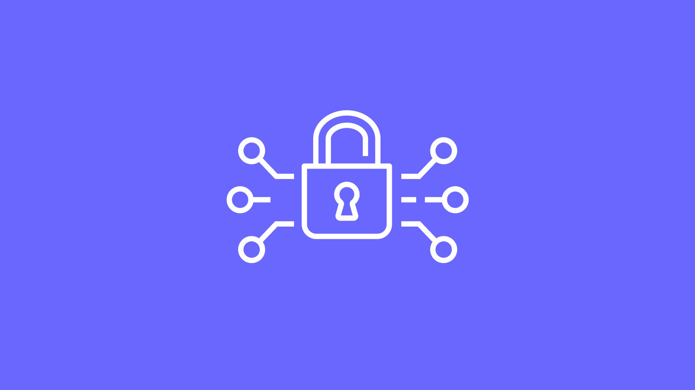
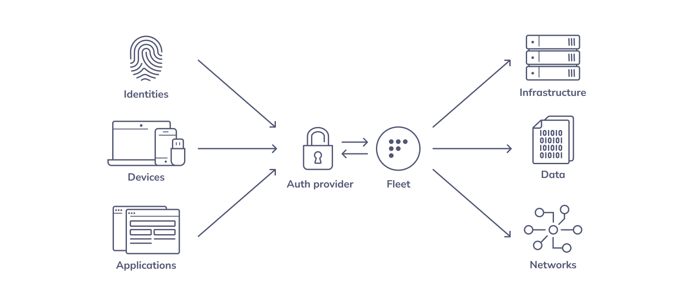
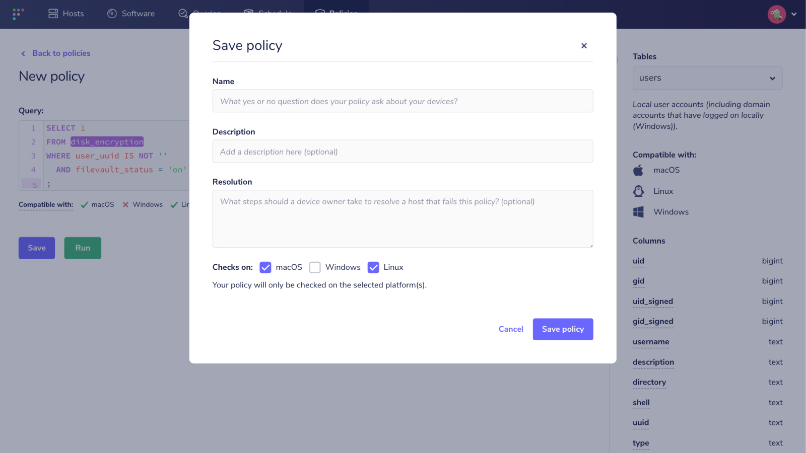

# How to use Fleet for zero trust attestation



### In this article

- [What is zero trust?](#what-is-zero-trust)
- [How does Fleet fit into a zero trust system?](#how-does-fleet-fit-into-a-zero-trust-system)
- [Considerations for zero trust](#considerations-for-zero-trust)

## What is zero trust?
Zero trust is a cybersecurity approach that encourages end users to meet configuration and posture guidelines. If end users don’t meet these guidelines, then they can’t access certain applications and data.

An organization's security team will specify policies that a user's device must meet. Every time an end user tries to log in to a company-owned resource (e.g., the company email), the system checks whether the device complies with the policies. If the device does not comply, then the system denies the user access to the resource. When the user addresses the policy violation(s), then they may try again.



## How does Fleet fit into a zero trust system?
Fleet provides two pieces of the zero trust puzzle: the policy engine and self-remediation instructions for the user. These integrate with an authentication system to create a full zero trust system.

### The policy engine
Fleet allows security teams to write policies that reflect the company's access requirements. Under the hood, osquery regularly checks these policies and sends results to the Fleet server.



For example, many organizations need to encrypt their devices’ hard disks. In Fleet, you can verify that FileVault is enabled with the following policy:

```
SELECT 1 
FROM disk_encryption 
WHERE user_uuid IS NOT '' 
  AND filevault_status = 'on'
;
```

The Fleet server will save the results of this policy. Then the system can check whether or not a user’s device is in compliance and will grant or deny access to protected resources accordingly.

The relevant Fleet API endpoint is [`GET /api/v1/fleet/hosts/{id}`](https://fleetdm.com/docs/using-fleet/rest-api#get-host). This endpoint will respond with all of the policies for the supplied device ID and whether it passed or failed.

### Self-remediation communication with Fleet Desktop
What happens if a user is blocked? A complete zero trust device posture implementation has to let users know why they were blocked and what they can do to address it. 

When writing a policy, Fleet includes a field called "remediation." This is where security and IT teams should include simple steps to resolve the issue. End users can find these remediation instructions in Fleet Desktop.

[Fleet Desktop](https://fleetdm.com/announcements/fleet-desktop-says-hello-world) lives in the computer’s menu bar. Clicking the Fleet logo lets users access the My Device page, which provides timely data about their computer. For our purposes, we’ll focus on policies.

In the Policies tab, users who have been denied access can see which policies have failed. They can select any failed policy to view remediation instructions.

By providing easy access to simple instructions, IT and security teams can help users regain access to company resources. Plus, this self-remediation first approach reduces the volume of help requests.

Learn more about [installing Fleet Desktop](https://fleetdm.com/docs/using-fleet/fleet-desktop).

<div class="video-container" style="position: relative; width: 100%; padding-bottom: 56.25%; margin-top: 24px; margin-bottom: 40px;">
  <iframe class="video" style="position: absolute; top: 0; left: 0; width: 100%; height: 100%; border: 0;" src="https://www.youtube.com/embed/hik4YnCLU58" allowfullscreen></iframe>
</div>

### Bring your own authentication provider
One piece of the puzzle that you should bring, however, is your authentication provider. When your users request access, your authentication system should make a request to the Fleet API to check for policy compliance and make authorization decisions based on the results. 

Remember to point users to the My Device page from the access denied page so they can find self-remediation instructions.

## Considerations for zero trust

### Scalability and latency of the policy engine
Policy requests occur every time a user tries to access company resources. That means there will be a lot of requests. The Fleet policies endpoint has been optimized for high request volume. But this may require tuning and upscaling servers depending on the size of your organization.

### Osquery policy recalculation period
Osquery itself has a delay between recalculating policies. By default, it will report updated policy compliance information every hour. This means that the user could be out of compliance for up to an hour before the zero trust system blocks their access. 

Depending on your requirements, you may need to make this more frequent. This update interval can be overridden using the [`policy_update_interval` setting](https://fleetdm.com/docs/deploying/configuration#osquery-policy-update-interval). However, a more frequent refresh period may cause a greater performance impact on the host. 

When a user remediates their policy compliance issues, they do not need to wait a full hour. Users can manually trigger a refresh using Fleet Desktop.

### Caching to reduce latency and load
Instead of requesting policy compliance information from the server every time a request is made, you could cache the policy results with a time to live (TTL). Say, every 5 minutes, the request would be allowed to pass through to the server to fetch the latest policy results — reducing server load while providing a low-latency response. 

Caching, however, comes at the cost of additional time to recognize policy non-compliance on top of the default 60 minutes. During the TTL period, a device may have transitioned to having policy failures, but can still access your system because the cache hasn’t been updated yet.

This might be true for the opposite situation as well: needing to wait for cache refresh in order to grant access to a recently remediated user.

We recommend that the cache allows requests from failing users to pass through to the server. This way the user will be able to get on with their day without delay.

### "Break the glass" emergency access
You could also improve your zero trust strategy by granting end users access to company resources during emergencies. Sometimes users have legitimate reasons to request access, but they can’t wait to remediate first.

Security teams can ask users to record a reason for the emergency and provide a period of access. This usage can then be regularly audited.

## Set up zero trust with Fleet
Fleet provides the core building blocks for enabling zero trust systems: the policy engine and self-remediation communication.  When implementing zero trust, IT and security teams should consider the scalability, latency, and end user experience. 

For any questions about setting up zero trust at your organization, you can [talk to one of our telemetry experts](https://calendly.com/fleetdm/demo?utm_source=article+demo+top) or [join our Slack channel](https://fleetdm.com/slack). 

<meta name="articleTitle" value="How to use Fleet for zero trust attestation">
<meta name="authorFullName" value="Mo Zhu">
<meta name="authorGitHubUsername" value="zhumo">
<meta name="category" value="guides">
<meta name="publishedOn" value="2022-10-14">
<meta name="articleImageUrl" value="../website/assets/images/articles/fleet-for-zero-trust-attestation-800x450@2x.jpg">
