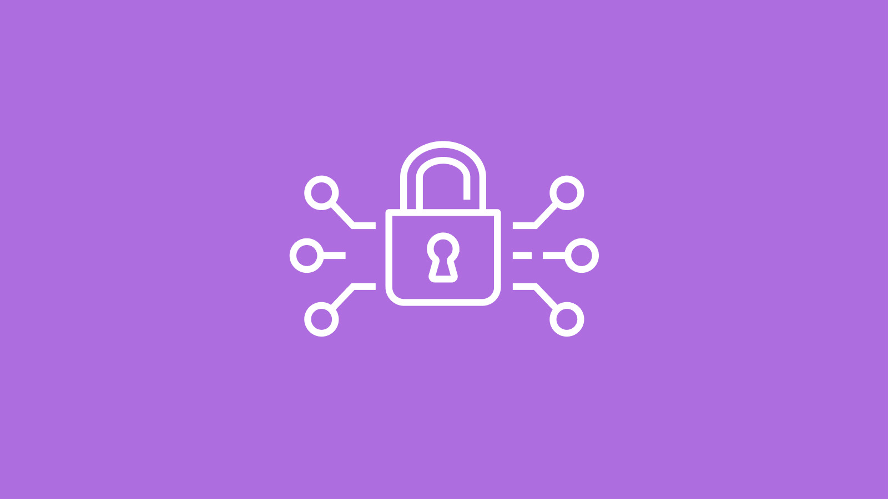
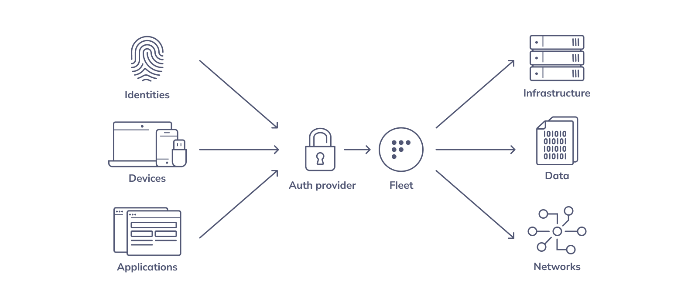

# Zero trust attestation with Fleet



### In this article

- [What is zero trust?](#what-is-zero-trust)
- [How does Fleet fit into a zero trust system?](#how-does-fleet-fit-into-a-zero-trust-system)
- [Considerations for zero trust](#considerations-for-zero-trust)

## What is zero trust?
Zero trust is an approach to cybersecurity whereby an organization requires all users to be continuously authorized for access to applications and data with authorization contingent on the user's security configuration and posture.



An organization's security team will specify policies that a user's device must meet. Every time an end user attempts to log into a company-owned resource (for example, the company email service), the system checks whether the device is in compliance with the policies. If the device is not, then the system denies the user access to the resource. When the user addresses the policy violation(s), then they may re-attempt and be granted access. 

## How does Fleet fit into a zero trust system?
Fleet provides two pieces of the zero trust puzzle: the policy engine and the self-remediation communication to the user. These integrate with an authentication system to create a full zero trust system. 

### The policy engine
Fleet allows security teams to write policies which reflect the company's access requirements. Under the hood, osquery regularly checks these policies and sends the results to the Fleet server. 


For example, a basic policy at nearly all organizations is that the device hard disk is encrypted. In Fleet, this can be accomplished with the following policy:
```
SELECT 1 
FROM disk_encryption 
WHERE user_uuid IS NOT '' 
  AND filevault_status = 'on'
;
```

Once the policy results are saved in the Fleet server, each time a user attempts to access a protected resource, the system can check whether the device is in compliance and deny access where appropriate. Specifically, the relevant Fleet API endpoint is [`GET /api/v1/fleet/hosts/{id}`](https://fleetdm.com/docs/using-fleet/rest-api#get-host). This endpoint will respond with all of the policies for the supplied device ID and whether it passed or failed.

### Self-remediation communication via Fleet Desktop
If a user is blocked from access, what then? A complete zero trust must also provide information to users about why they were blocked and what they can do to address it. 

When writing a policy, Fleet includes a field called "remediation." This is where security and IT teams should include plain-language end-user-facing steps to resolve the issue. 

Fleet provides a desktop application called Fleet Desktop, which lives in the menubar. Fleet Desktop gives the user access to a Fleet webpage called "My Device," which, among others, features policy information. A user who has been denied access can visit this page to see the remediation instructions. This way, IT and security teams are partners of users in regaining access to company-owned resources. This self-remediation first approach reduces also the volume of help requests. 

To learn more about installing Fleet Desktop, visit [here](https://fleetdm.com/docs/using-fleet/fleet-desktop).

<div class="video-container" style="position: relative; width: 100%; padding-bottom: 56.25%; margin-top: 24px; margin-bottom: 40px;">
  <iframe class="video" style="position: absolute; top: 0; left: 0; width: 100%; height: 100%; border: 0;" src="https://www.youtube.com/embed/hik4YnCLU58" allowfullscreen></iframe>
</div>

### Bring-your-own authentication provider
One piece of the puzzle that you should bring, however, is your authentication provider. When your users request access, your authentication system should ping the Fleet API to check for policy compliance and make decisions about blocking based on the results. When presenting the access denied page, be sure to point users to Fleet Desktop's "My Device" page to help them find remediation instructions. 

## Considerations for zero trust

### Scalability and latency of the policy engine
Since the request for policies will happen every time the user attempts to access company resources, this will generate a lot of requests. The Fleet policies endpoint has been optimized for quick pings. However, depending on the size of your organization, this will require tuning and upscaling the servers   to meet your organization's situation. 

### Caching to reduce latency and load
Instead of hitting the server every time an authentication request is made, one approach is to cache the policy results with a time to live (TTL). Say, every 5 minutes, the request would result in a recalculation of the policy results. This would reduce the load on the server and provide a low-latency response. 

Caching, however, comes at two costs. First, it increases the amount of time it takes to recognize a policy failure (by at worst 5 minutes). During the TTL period, a device may have policy failures, but is still able to access your system, because the cache has not yet updated. Second, it would require your end user to wait at most 5 minutes after they've remediated the issue to regain access. The longer the TTL period, the less strain on your system, but the longer it takes for your zero trust system to reflect the facts on the ground.

### Osquery policy recalculation period
Furthermore, osquery itself has a delay between recalculating policies. By default, it will report new policy information every hour, but can be overridden using the `asdfasdasdf` setting. Depending on the strictness of your requirements, you may need to make this more frequent. However, note that a more frequent refresh period would cause a greater performance hit on the host. 

### "Break the glass" emergency access
Another potential element of a good zero trust end user experience is providing the ability to access company resources on an emergency basis. Users sometimes do have legitimate reasons to need access now and are unable to wait to remediate first. 

One good practice is for security teams can ask users to record a reason for the emergency and then provide some period of access. Security teams can then regularly audit the usage of the emergency access and follow up where necessary. 

## Conclusion
Fleet provides the core building blocks (policy engine and self-remediation communication) for security teams to enable a zero trust system. When implementing zero trust, IT and security teams should consider the scalability, latency, and end user experience. 

For any questions about setting up zero trust at your organization at Fleet, reach out to us at... 

<meta name="articleTitle" value="Zero trust attestation with Fleet">
<meta name="authorFullName" value="Mo Zhu">
<meta name="authorGitHubUsername" value="zhumo">
<meta name="category" value="guides">
<meta name="publishedOn" value="2022-09-20">
