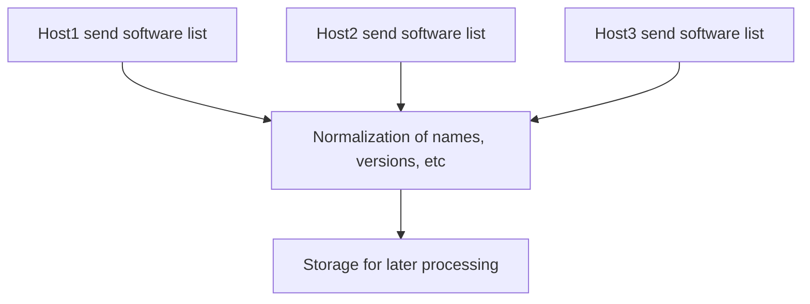
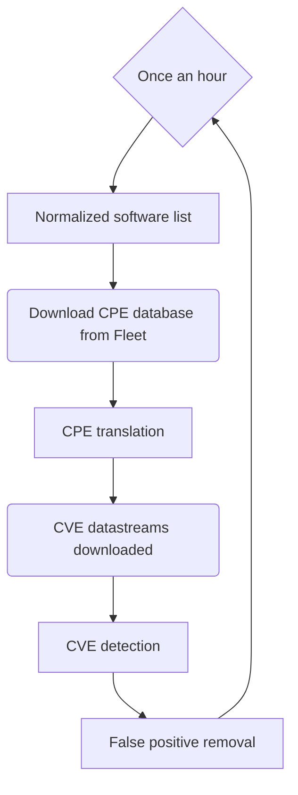

# Vulnerability processing
- [What to expect](#what-to-expect)
- [Configuration](#configuration)
- [Performance](#performance)
- [Detection pipeline](#detection-pipeline)

## What to expect

Vulnerability processing is enabled by default for new installations.

Fleet checks for vulnerabilities using the National Vulnerability Database (NVD). 

First, Fleet retrieves the installed software for each host using osquery queries. Then, Fleet
translates each installed software into [Common Platform Enumeration (CPE)](https://en.wikipedia.org/wiki/Common_Platform_Enumeration) names.

Then, using the CPEs, Fleet searches the list of [Common Vulnerabilities and Exposure
(CVE)](https://en.wikipedia.org/wiki/Common_Vulnerabilities_and_Exposures) identifiers listed in the NVD
to detect the CVEs that match the defined CPEs. 

If matches are found, they are exposed on each host's
**Host details** page and on the **Home** page in the Fleet UI. The CVEs are also exposed in the
`fleetctl get software` command and the `GET api/v1/fleet/hosts/{id}` and `GET
api/v1/fleet/software` API routes.

Vulnerability processing happens on the Fleet instance and not on the host machine. Because of this,
detected vulnerabilities cannot be used in the same way you would use an osquery query (e.g. you wouldn't
be able write a query to retrieve all CVEs).

## Configuration

When upgrading to Fleet 4.7.0 or later, vulnerability processing is automatically enabled if
vulnerability processing and software inventory are not explicitly disabled.

If you explicitly disabled vulnerability processing, and now would like to enable this feature, first enable the software inventory feature by setting the following app config:

```
---
apiVersion: v1
kind: config
spec:
  host_settings:
    enable_software_inventory: true
```

Then, enable vulnerability processing by specifying a path where Fleet will download the different
data feeds. This can be done by setting the following app config:

```
---
apiVersion: v1
kind: config
spec:
  vulnerability_settings:
    databases_path: /some/path
```

Or through environment variables:

```
FLEET_VULNERABILITIES_DATABASES_PATH=/some/path
```

The path specified needs to exist and Fleet needs to be able to read and write to and from it. This is the only mandatory
configuration needed for vulnerability processing to work. Additional options, like vulnerability check frequency, can be
found in the [configuration documentation](../02-Deploying/03-Configuration.md#vulnerabilities).

You'll need to restart the Fleet instances after changing these settings.

## Performance

Vulnerability processing is performed in one Fleet instance. If your Fleet deployment uses multiple
instances, only one will be doing the work.

In order to conduct vulnerability processing, Fleet downloads the following files:

1. A preprocessed CPE database generated by FleetDM to speed up the translation process: https://github.com/fleetdm/nvd/releases
2. The historical data for all CVEs and how to match to a CPE: from https://nvd.nist.gov/vuln/data-feeds

The database generated in step 1 is processed from the original official CPE dictionary
https://nvd.nist.gov/products/cpe. This CPE dictionary is typically updated once a day.

The matching occurs server-side to make the processing as fast as possible, but the whole process is both CPU and memory intensive.

For example, when running a development instance of Fleet on an Apple Macbook Pro with 16 cores, matching 200,000 CPEs against the CVE database will take around 10 seconds and consume about 3GBs of RAM. 

The CPU and memory usages are in burst once every hour (or the configured periodicity) on the instance that does the processing. RAM spikes are expected to not exceed the 2GBs.

## Detection pipeline

There are several steps that go into the vulnerability detection process. In this section we'll dive into what they are and how it works.

The process has different parts that are more error-prone than others. Each OS and each application developer and maintainer can (and do) have their own way of defining each part of their app. Some Linux distributions are very strict, but each distribution handles things differently.

The whole pipeline exists to compensate for these differences, and it can be divided in two sections:

1. Collection:



2. Processing

Processing happens in a loop. The default interval is 1hr.




### Ingesting software lists from hosts

The ingestion of software varies per platform. We run a `UNION` of several queries in each:

- [macOS](https://github.com/fleetdm/fleet/blob/main/server/service/osquery_utils/queries.go#L315)
- [Windows](https://github.com/fleetdm/fleet/blob/main/server/service/osquery_utils/queries.go#L478)
- [Linux](https://github.com/fleetdm/fleet/blob/main/server/service/osquery_utils/queries.go#L391)

This is the first step into normalizing data across platforms, as we try to get all the same data for all different types of software we detect vulnerabilities on.

Ingestion can be resource hungry, both on the hosts and the Fleet server. A lot of work has gone into reducing the resources needed, and it's still ongoing.

### Translating to CPE

With a somewhat normalized list of software, in order to search CVEs for it, we need to derive a [CPE](https://en.wikipedia.org/wiki/Common_Platform_Enumeration) from the vendor, name, version, and OS.

As described briefly above, we do this by translating the NVD database of CPEs into a [sqlite database that helps Fleet do the lookup of CPEs very quickly](https://github.com/fleetdm/nvd).

#### How accurate is this translation process?

This is the most error prone part of the process. The CPE can have some vagueness. This means that parts of it can be a `*`, which means when you match that CPE to a CVE it can match any of that part of the CPE.

If the CPE is too vague, the extreme case being all parts are `*`, all CVEs will match. You want a very specific CPE, but not too specific that a small error would make it not match a CVE (false negative).

Let's look into some examples of this stage.

#### tmux

tmux is a Unix terminal utility to multiplex ttys. It appears listed like this in macOS:  

```
osquery> select * from homebrew_packages where name='tmux';
+------+----------------------------+---------+
| name | path                       | version |
+------+----------------------------+---------+
| tmux | /opt/homebrew/Cellar/tmux/ | 3.2a    |
+------+----------------------------+---------+
```

If we look at the [official releases](https://github.com/tmux/tmux/releases/tag/3.2a) the version we get is the same as the one listed. This means that it'll be easy to map it to a CPE that will accurately represent the software.

Now let's look at Chrome on macOS:

```
osquery> select name, bundle_version from apps where name like '%Chrome%';
+-------------------+----------------+
| name              | bundle_version |
+-------------------+----------------+
| Google Chrome.app | 4758.102       |
+-------------------+----------------+
```

Now things start to get slightly more tricky. We have to remove the `.app` suffix from the name, then derive the first word as the vendor and the second as the app name. We could use `bundle_name` for the app name, but nothing stops the app developer of adding the vendor to `bundle_name`, so a similar parsing would have to happen.

These are two illustrative examples. The reality is that there is no map or list of all the software available and how it's presented in each platform, so the "software to CPE" translation process is going to be evolving constantly.

### Matching a CPE to a CVE

Once we have a good CPE, we can match it against the CVE database. We download the data streams locally and match each CPE to the whole list. The matching is done using the [nvdtools implementation](https://github.com/facebookincubator/nvdtools).

### Discarding false positives

In some cases, the developers for a piece of software are also the packagers and distributors for that software. In most cases, the developers offer a set of options to install the software, but particularly in the case of Linux distributions, the package maintainers tend to be a set of different people altogether.

This is great for developers, because they don't have to be versed in all the intricacies of each package manager, but for a platform such as Fleet, trying to understand what's installed in a host, this adds an extra layer of complexity.

Linux distributions do security patches. These patches sometimes are old versions of software that is in the list of a long term maintenance distribution versions (sometimes abbreviated as LTS) with a vulnerability fix from a newer version.

In this case, the software developer might release version, say, 2.5, but in Ubuntu version 2.3-ubuntu2 is what's available. This version is not the vulnerable 2.3, but 2.3 with the patch that fixes that security vulnerability. That same fix might be version `2.4-1` in CentOS because that's what happened to be in the LTS version. 

So Fleet with a pipeline up until the section above would see `some_app-2.4` and mark it as vulnerable. In reality, this is a false positive that needs to be discarded based on the data we parse for the changelogs for each distribution.

The list of potential false positives is collected in the same process as the CPE list: for each Linux distribution we support, we go through each package for that version, parse the changelogs for occurrences of CVEs mentioned. If there are any, we mark it as a potential version that Fleet might've flagged in previous steps.

If there's a match, we remove the false positive from the list.

#### Supported Linux distributions and versions

- CentOS 6, 7 and 8.