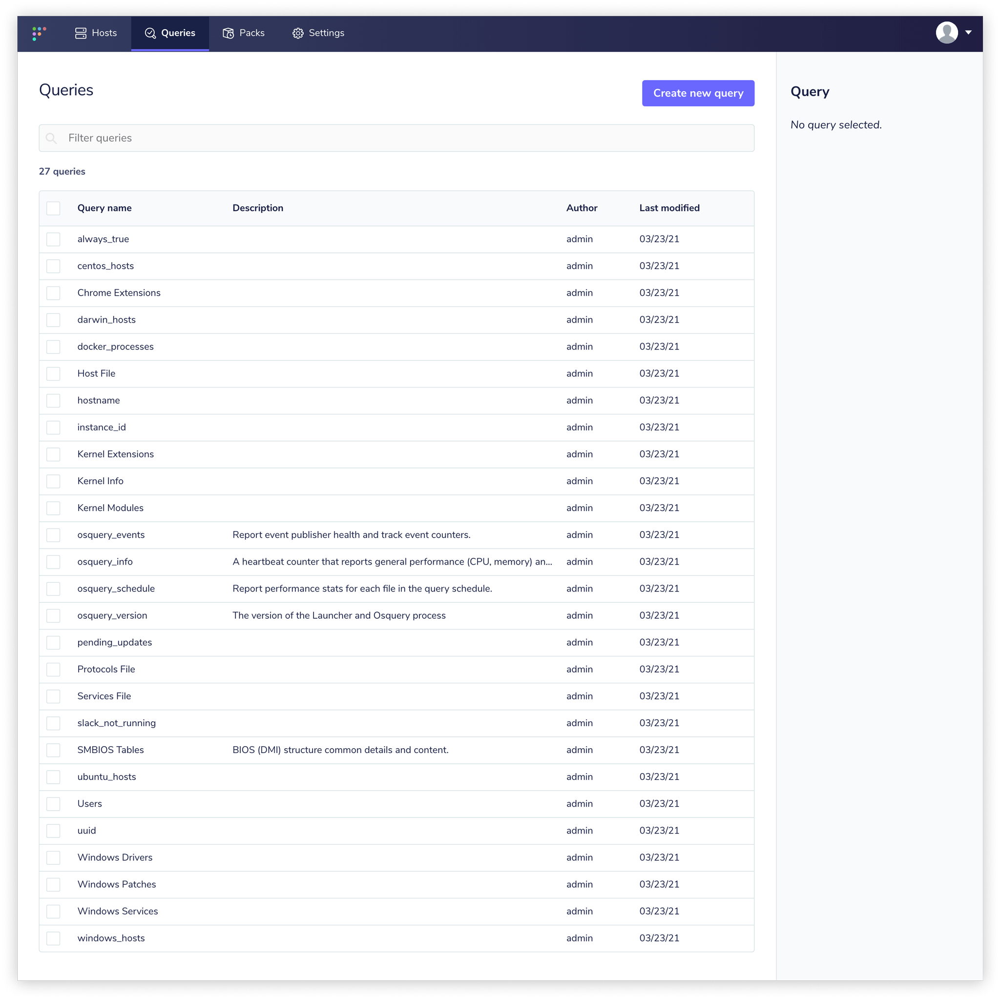

# Fleet UI
- [Running queries](#running-queries)
- [Scheduling queries](#scheduling-queries)

## Running queries

The Fleet application allows you to query hosts that you have installed osquery on. To run a new query, navigate to "Queries" from the top nav, and then hit the "Create new query" button from the Queries page. From here, you can compose your query, view SQL table documentation via the sidebar, select arbitrary hosts (or groups of hosts), and execute your query. As results are returned, they will populate the interface in real time. You can use the integrated filtering tool to perform useful initial analytics and easily export the entire dataset for offline analysis.

After you've composed a query that returns the information you were looking for, you may choose to save the query. You can still continue to execute the query on whatever set of hosts you would like after you have saved the query.

Saved queries can be accessed from the "Query" section of the top nav. Here, you will find all of the queries you've ever saved. You can filter the queries by query name, so name your queries something memorable!

To learn more about scheduling queries so that they run on an on-going basis, see the scheduling queries guide below.

## Scheduling queries

As discussed in the running queries documentation, you can use the Fleet application to create, execute, and save osquery queries. You can organize these queries into "Query Packs". To view all saved packs and perhaps create a new pack, select "Packs" from the top nav. Packs are usually organized by the general class of instrumentation that you're trying to perform.

If you select a pack from the list, you can quickly enable and disable the entire pack, or you can configure it further.

When you edit a pack, you can decide which targets you would like to execute the pack. This is a similar selection experience to the target selection process that you use to execute a new query.

To add queries to a pack, use the right-hand sidebar. You can take an existing scheduled query and add it to the pack. You must also define a few key details such as:

- interval: how often should the query be executed?
- logging: which osquery logging format would you like to use?
- platform: which operating system platforms should execute this query?
- minimum osquery version: if the table was introduced in a newer version of osquery, you may want to ensure that only sufficiently recent version of osquery execute the query.
- shard: from 0 to 100, what percent of hosts should execute this query?

Once you've scheduled queries and curated your packs, you can read our guide to [Working With Osquery Logs](../1-Using-Fleet/4-Osquery-logs.md).

