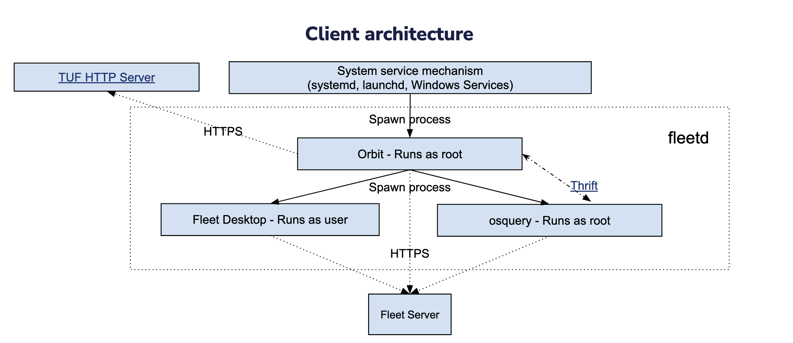

# Architecture deep dive

## Fleet

### Code structure

Here at Fleet, we've embraced a DI (dependency injection) approach to structuring our code. This
approach has several advantages, but there are two that we leverage consistently:

- Easily mockable components that we can use in testing;
- Datastore interfaces that are implemented by several different datastores (MySQL, S3, Redis, etc)

#### Service

#### Datastore

### External APIs

#### Website/fleetctl

#### Fleet Desktop

#### Orbit

#### Osquery

### Cron jobs

## fleetd
[fleetd](https://fleetdm.com/docs/get-started/anatomy#fleetd) is the bundle of agent executables that Fleet installs on host machines. fleetd is composed
of Orbit, Fleet Desktop, Osquery, and the Fleet Chrome extension. 

