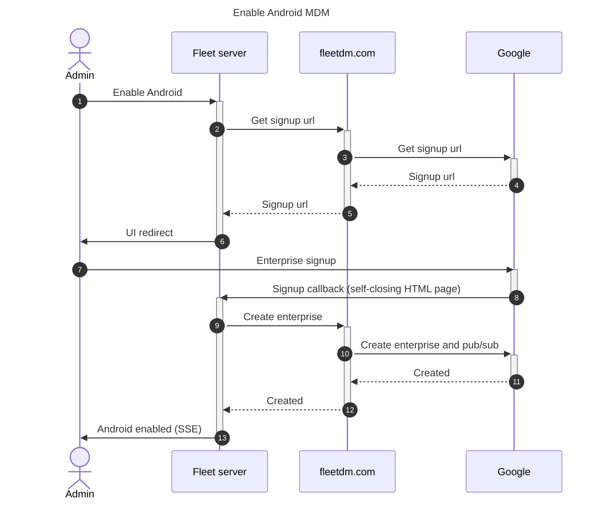
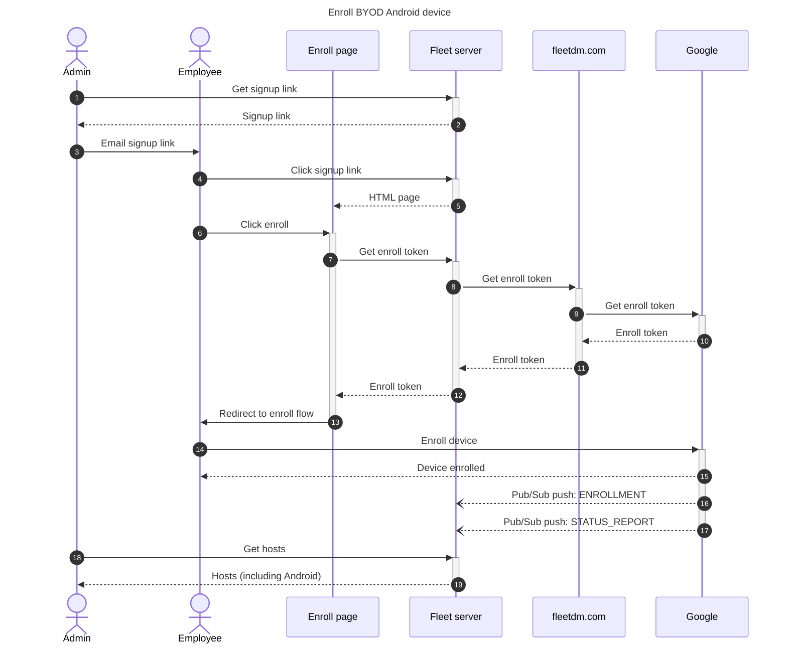

# Android

## Reference links
- [Android Management API](https://developers.google.com/android/management/reference/rest)
- [Google Cloud Pub/Sub API](https://cloud.google.com/pubsub/docs/reference/rest)
- [Google Cloud console pub/sub topics](https://console.cloud.google.com/cloudpubsub/topic/list)

## Configure dev environment

Create a Google service account with the following Roles
- Android Management User
- Pub/Sub Admin

Using the `credentials.json` of the above account:
```bash
export FLEET_DEV_ANDROID_SERVICE_CREDENTIALS=$(cat credentials.json)
```

Set the feature flag:
```bash
export FLEET_DEV_ANDROID_ENABLED=1
```

Note: The Fleet server URL must be public for pub/sub to work properly.

## Architecture diagrams





## Security and authentication

Android enterprise signup callback is authenticated by a token in the callback URL. The token is created by Fleet server.

Getting the Android device enrollment token is authenticated with the Fleet enroll secret.

Pub/sub push callback is authenticated by a `token` query parameter. This token is created by Fleet server. As of March 2025, this token cannot be easily rotated. We could add another level of authentication where the Fleet server would need to check with Google to authenticate the pub/sub message:
- [Authentication for push subscriptions](https://cloud.google.com/pubsub/docs/authenticate-push-subscriptions)
