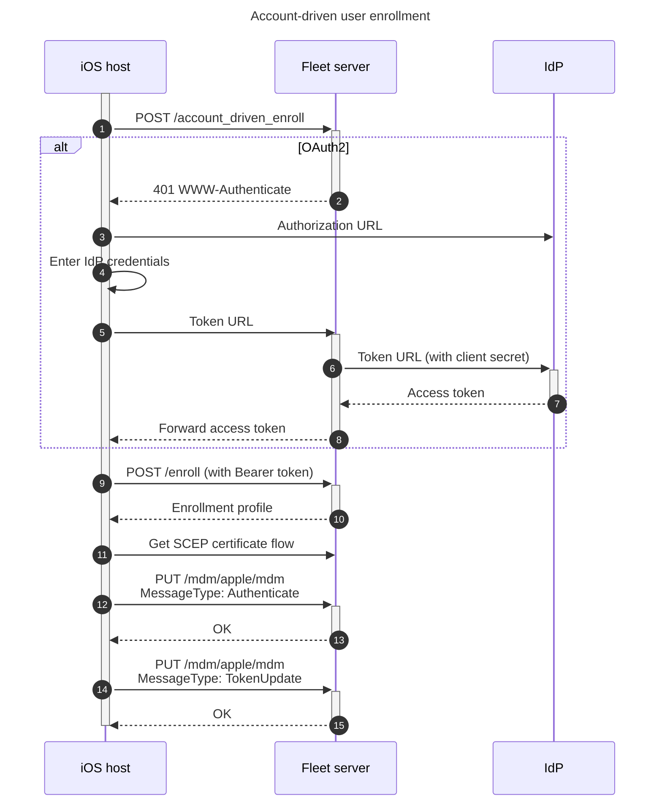

```mermaid
---
title: Account-driven user enrollment
---
sequenceDiagram
    autonumber
    participant ios as iOS host
    participant fleet as Fleet server
    participant IdP
    activate ios
    ios->>+fleet: POST /account_driven_enroll
    alt OAuth2
        fleet-->>-ios: 401 WWW-Authenticate
        ios->>IdP: Authorization URL
        ios->>ios: Enter IdP credentials
        ios->>fleet: Token URL
        activate fleet
        fleet->>+IdP: Token URL (with client secret)
        IdP-->>-fleet: Access token
        fleet-->>ios: Forward access token
        deactivate fleet
    end
    ios->>+fleet: POST /enroll (with Bearer token)
    fleet-->>-ios: Enrollment profile
    ios->>fleet: Get SCEP certificate flow
    ios->>+fleet: PUT /mdm/apple/mdm<br/>MessageType: Authenticate
    fleet-->>-ios: OK
    ios->>+fleet: PUT /mdm/apple/mdm<br/>MessageType: TokenUpdate
    fleet-->>-ios: OK
    deactivate ios
```
