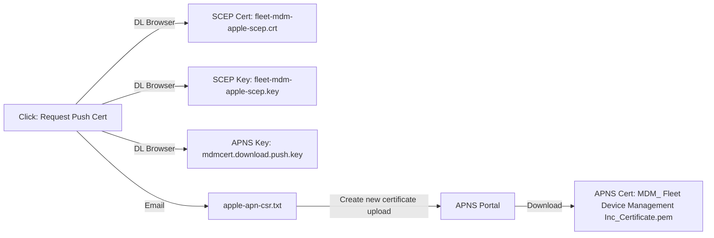
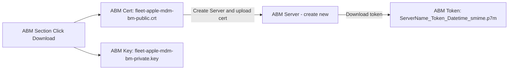
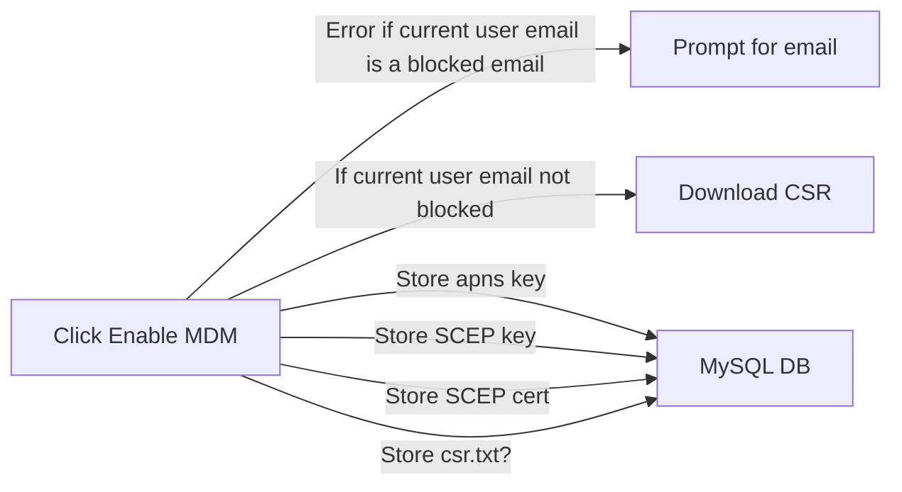
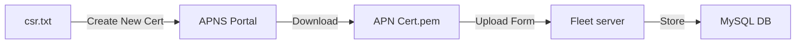
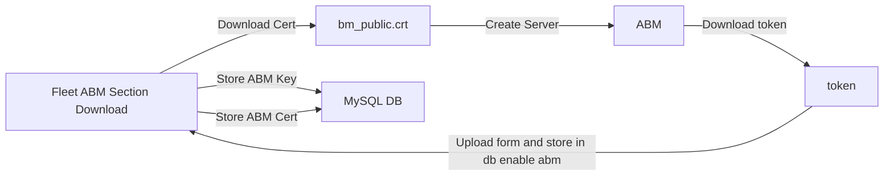

# MDM Cert Setup

At the end of this process you will have 8 files, 1 only needed temporarily and will be using them
to set 10 environment variables to enable both Apple and Windows MDM capabilities.



> Rename .pem file to mdmcert.download.push.pem (for your sanity to know it's linked to the APNS Key
> you got in the first step)

Relaunch Fleet with these variables configured (you can change scepchallenge to another word or
phrase if you'd like)
```
FLEET_MDM_APPLE_SCEP_CHALLENGE: scepchallenge
FLEET_MDM_APPLE_APNS_CERT: path_to/mdmcert.download.push.pem
FLEET_MDM_APPLE_APNS_KEY: path_to/mdmcert.download.push.key
FLEET_MDM_APPLE_SCEP_CERT: path_to/fleet-mdm-apple-scep.crt
FLEET_MDM_APPLE_SCEP_KEY: path_to/fleet-mdm-apple-scep.key
# You are allowed to reuse scep cert/key for Windows
FLEET_MDM_WINDOWS_WSTEP_IDENTITY_CERT: path_to/fleet-mdm-apple-scep.crt
FLEET_MDM_WINDOWS_WSTEP_IDENTITY_KEY: path_to/fleet-mdm-apple-scep.key
```



> Rename .p7m file to downloadtoken.p7m (again for your sanity)
Restart Server with new env vars

```
FLEET_MDM_APPLE_BM_SERVER_TOKEN: path_to/downloadtoken.p7m
FLEET_MDM_APPLE_BM_CERT: path_to/fleet-apple-mdm-bm-public-key.crt
FLEET_MDM_APPLE_BM_KEY: path_to/fleet-apple-mdm-bm-private.key
```

### Start the process

* Navigate to the Settings > Integrations > Mobile device management (MDM) page.
* Under Apple Push Certificates Portal, select Request, then fill out the form. This should generate
  three files and send an email to you with an attached CSR file.

...

## Theoretical Revision

Navigate to Settings > Integrations > MDM




Fleet should now be able to dynamically check all certs and "enable MDM" as if we restarted w/ the
env vars set



new flow would:
* click download csr and open modal waiting for file upload of apns cert with a link to portal
* User in new tab create cert in apns portal create / download
* return to modal and upload apns cert
* Fleet dynamically reloads MDM (ABM section shows now)
* Click download abm cert opens modal waiting for download token with link to abm
* Create server with cert and download token
* return to modal and upload token and save

DONE