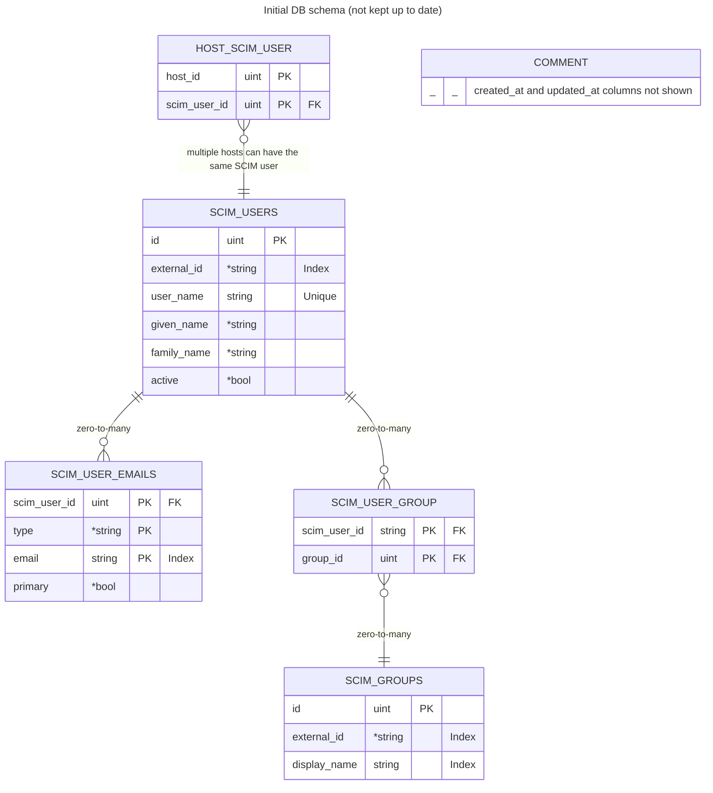

# SCIM (System for Cross-domain Identity Management) integration

## Reference docs

- [scim.cloud](https://scim.cloud/)
- [SCIM: Core Schema (RFC7643)](https://datatracker.ietf.org/doc/html/rfc7643)
- [SCIM: Protocol (RFC7644)](https://datatracker.ietf.org/doc/html/rfc7644)
- [scim Go library](https://github.com/elimity-com/scim)

### Okta integration

- https://developer.okta.com/docs/guides/scim-provisioning-integration-prepare/main/

### Entra ID integration
- [SCIM guide](https://learn.microsoft.com/en-us/entra/identity/app-provisioning/use-scim-to-provision-users-and-groups)
- [SCIM validator](https://scimvalidator.microsoft.com/)
  - Only test attributes that we implemented

## Authentication

We use same authentication as API. HTTP header: `Authorization: Bearer xyz`

## Diagrams

## Notes

- Okta and Entra ID do not support nested groups
