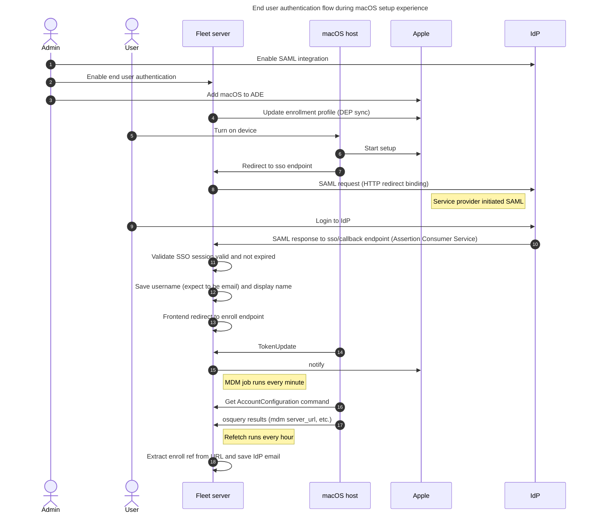

# End user authentication

- [Fleet's guide for setting up end user authentication during macOS setup experience](https://fleetdm.com/guides/macos-setup-experience#end-user-authentication-and-end-user-license-agreement-eula)
- On Fleet's [pricing page](https://fleetdm.com/pricing), this feature is called `User account sync` (as of 2025/03/31)

## Set up dev environment

Create a SAML app in an IdP.

### Instructions for Okta

- Create a SAML app in your Okta developer account following this guide: https://fleetdm.com/docs/deploy/single-sign-on-sso#okta
  - We found that Audience URI needed to be the Fleet app URL
- Create user(s) at `Directory > People`
- Assign user(s) to your app at `Applications > Applications > Assign Users to App`
- (Optional) Remove 2FA requirement for you app in `Security > Authentication Policies > Any two factors > Applications > Switch policy`

## Notes

`end_user_authentication` setting is global, but `enable_end_user_authentication` is a team setting.

The Fleet SSO endpoint is `<fleet_url>/api/v1/fleet/mdm/sso`. It is set as `configuration_web_url` in Apple's [enrollment profile](https://developer.apple.com/documentation/devicemanagement/profile).

## Issues and limitations

- Fleet does not support OpenID Connect (OIDC) integration. Fleet only supports SAML.
- Fleet expects the SAML username to be an email.
- After initial enrollment, Fleet does not sync local macOS account with IdP: [#27695](https://github.com/fleetdm/fleet/issues/27695).

## Diagrams

