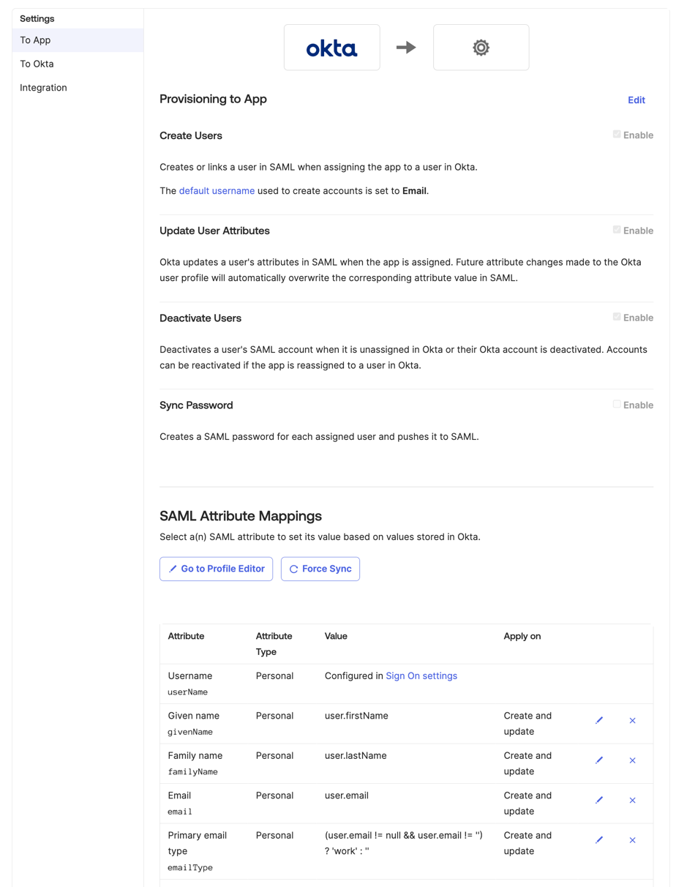
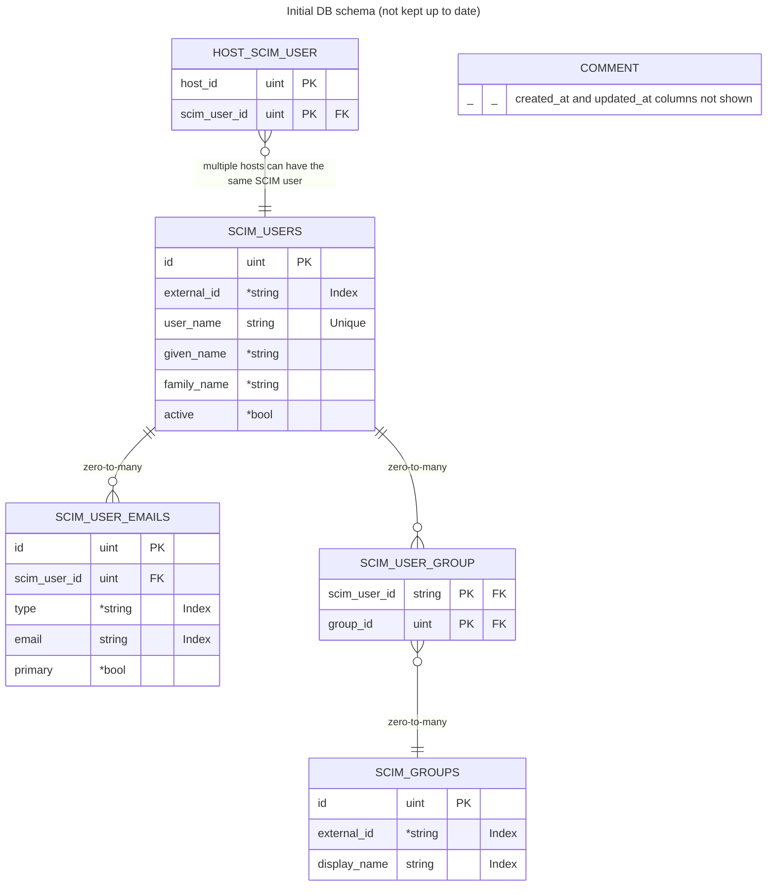

# SCIM (System for Cross-domain Identity Management) integration

## Reference docs

- [scim.cloud](https://scim.cloud/)
- [SCIM: Core Schema (RFC7643)](https://datatracker.ietf.org/doc/html/rfc7643)
- [SCIM: Protocol (RFC7644)](https://datatracker.ietf.org/doc/html/rfc7644)
- [scim Go library](https://github.com/elimity-com/scim)

## Okta integration

- https://developer.okta.com/docs/guides/scim-provisioning-integration-prepare/main/

Sample provisioning settings that work. Capabilities can be disabled and attributes can be removed as needed.



From our testing with Okta, we see the following behavior that is worth noting:
- Okta does not use PATCH endpoint
- Okta does not DELETE users; if a new user needs to be created with the same username as a "deleted" user, then it overwrites the old user

### Automated test for Okta integration

First, create at least one SCIM user:

```
POST https://localhost:8080/api/latest/fleet/scim/Users
Authorization: Bearer <API key>
{
    "schemas": ["urn:ietf:params:scim:schemas:core:2.0:User"],
    "userName": "test.user@okta.local",
    "name": {
        "givenName": "Test",
        "familyName": "User"
    },
    "emails": [{
        "primary": true,
        "value": "test.user@okta.local",
        "type": "work"
    }],
    "active": true
}
```

Run test using [Runscope](https://www.runscope.com/). See [instructions](https://developer.okta.com/docs/guides/scim-provisioning-integration-prepare/main/#test-your-scim-api).

## Entra ID integration
- [SCIM guide](https://learn.microsoft.com/en-us/entra/identity/app-provisioning/use-scim-to-provision-users-and-groups)
- [SCIM validator](https://scimvalidator.microsoft.com/)
  - Only test attributes that we implemented

### Testing Entra ID integration

Use [scimvalidator.microsoft.com](https://scimvalidator.microsoft.com/). Only test the attributes that we have implemented. To see our supported attributes, check the schema:

```
GET https://localhost:8080/api/latest/fleet/scim/Schemas
```

## Authentication

We use same authentication as API. HTTP header: `Authorization: Bearer xyz`

## Diagrams



## Notes

- Okta and Entra ID do not support nested groups
