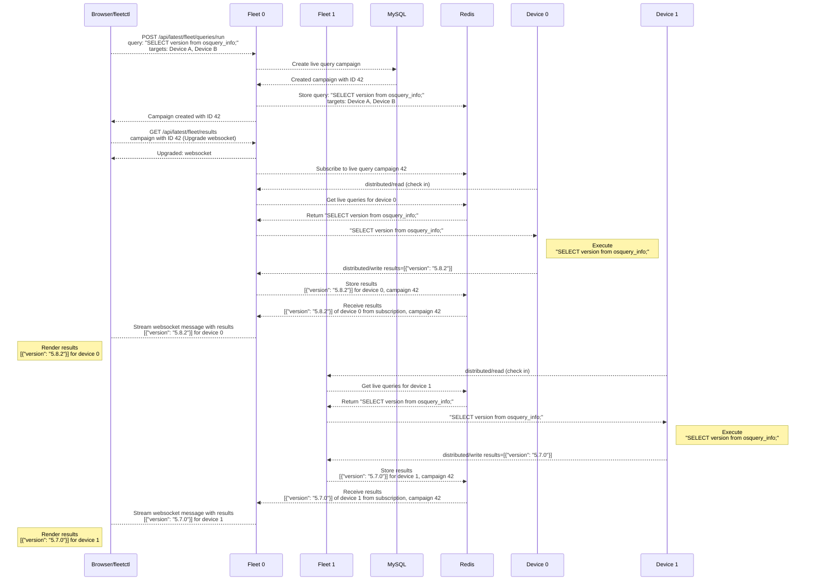

# Troubleshooting live queries

## How do live queries work?

Following is the lifecycle of a live query in Fleet. (For simplicity we'll assume two Fleet instances (0 and 1) and two devices (0 and 1).



Notes:
- Multiple fleet instances collect results from devices and store them in Redis, but when retrieving results via websockets, the browser or fleetctl is connected to one Fleet instance.

## Troubleshooting

From diagram above we can see that live queries have a lot of moving parts.
Below we'll look at things that can fail when attempting to run live queries on thousands of devices.

## 1. Redis

Redis is used to store the results of live queries, thus if live queries are not working as expected, the first thing to check is Redis.

1. Check CPU and memory of the Redis instances during a live query campaign.
2. Fleet connects to Redis as a pubsub client to retrieve query results. The results are buffered in Redis up to a limit, default value for such limit is `client-output-buffer-limit pubsub 32mb 8mb 60`.
Change that setting in Redis to `client-output-buffer-limit pubsub 0 0 0` to remove the limits (see https://redis.io/docs/management/config-file/).
PD: AWS Elasticache Redis has a different name for these settings: `client-output-buffer-limit-pubsub-hard-limit`, `client-output-buffer-limit-pubsub-soft-limit` and `client-output-buffer-limit-pubsub-soft-seconds`.

## 2. Fleet

Check CPU and memory of the Fleet instances during a live query campaign.
You might need to scale Fleet vertically or horizontally if your device count is high.

## 3. Network

When it comes to live queries, there are multiple network connections to check:
- Target devices connecting to Fleet.
- Fleet connection to Redis.
- Fleet connection to MySQL.
- Browser websocket connection to Fleet.

A way to verify all these connections are working as expected, run the following dummy query:
```sql
SELECT 1 WHERE 1 = 0;
```

Such query will return no results but if you see "(100% responded)" then that confirms that all connections seem to be working nominally.

### 3.1 Websockets

Live queries use websockets to stream results back to the browser.
If the dummy query above didn't work, then your infrastructure may not be allowing websocket connections.
A way to rule this out is to use the synchronous live query API.
The synchronous API a simplified implementation of live queries that does not use websockets. (It's not designed to run live queries on thousands of devices.)
```sh
curl \
    -X GET \
    -H "Authorization: Bearer $API_TOKEN" \
    https://fleet.example.com/api/latest/fleet/queries/run \
    -d '{"query_ids": [340], "host_ids": [375]}'
```
This API will wait for ~100 seconds by default and collect results for the hosts that checked in and successfully ran the query.

## 4. Problematic query

If the infrastructure is working correctly but the query is hanging or crashing osquery in devices, then results may never reach Fleet.

To rule this out, you should also try out the dummy query `SELECT 1 WHERE 1 = 0;`.
If you see "(100% responded)" with the dummy query but not with your query, then the issue might be:
  - The query is crashing osquery on some devices (e.g., watchdog is killing the osquery process).
  - The query is hanging or taking too long to run on some or all devices.
  - The query is returning too many results which can overwhelm network throughput limits. Try reducing the number of results by using `LIMIT N;` on the query.

To troubleshoot hangs or crashes, take a look at Fleetd/osquery logs on the devices.

## 5. Settings

An important setting when it comes to live query campaign duration is the `distributed_interval`. This value indicates how often devices check in to Fleet to run queries.
If this value is too high, then your live query might time out before getting all results.

PS: At Fleet we recommend this setting to be between 10 and 30 seconds (It's a sweet spot to allow for quick live query responses and not overload the infrastructure.)

## 6. Try fleetctl or another browser

Try running the same live query with fleetctl (from the same device):
```sh
fleetctl query \
    --query "SELECT version from osquery_info;" \
    --hosts "device0,device1" \
    --exit
```
If this works and the browser is not working then it might be a rendering issue on the browser.
You should also try running the live query on different browsers.

<meta name="pageOrderInSection" value="1800">

