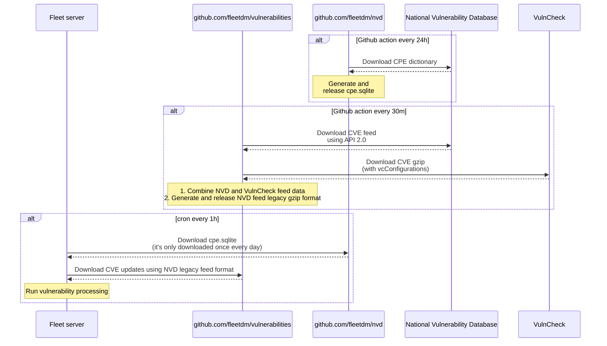

# Vulnerability processing

- [How it works?](#how-it-works?)
- [Performance](#performance)
- [Detection pipeline](#detection-pipeline)

## How it works?

For Fleet Premium users, each CVE includes its Common Vulnerability Scoring System (CVSS) base score (reported by the [National Vulnerability Database](https://nvd.nist.gov/)), probability of exploit (reported by [FIRST](https://www.first.org/epss/)), and whether or not there is a known exploit in the wild (reported by the [Cybersecurity & Infrastructure Security Agency](https://www.cisa.gov/known-exploited-vulnerabilities-catalog)).

Fleet's strategy for detecting vulnerabilities (CVEs) varies according to the host's platform and
the software in question.

### macOS, Windows, and Linux hosts using NVD

First, Fleet retrieves the installed software for each host using osquery queries. Then, Fleet
translates each installed software into [Common Platform Enumeration (CPE)](https://en.wikipedia.org/wiki/Common_Platform_Enumeration) names.

Then, using the CPEs, Fleet searches the list of [Common Vulnerabilities and Exposure
(CVE)](https://en.wikipedia.org/wiki/Common_Vulnerabilities_and_Exposures) identifiers listed in the NVD
to detect the CVEs that match the defined CPEs.

If matches are found, they are exposed on each host's
**Host details** page and on the **Home** page in the Fleet UI. The CVEs are also exposed in the
`fleetctl get software` command and the `GET api/v1/fleet/hosts/{id}` and `GET
api/v1/fleet/software` API routes.

Vulnerability processing happens on the Fleet instance and not on the host machine. Because of this,
detected vulnerabilities cannot be used in the same way you would use an osquery query (e.g. you wouldn't
be able write a query to retrieve all CVEs).

#### CPE and CVE data generation workflow

- Fleet uses the [National Vulnerability Database CPE Dictionary](https://nvd.nist.gov/products/cpe) to get CPE information (this information maps software names/titles to CPEs)
- Fleet combines two sources to get accurate and up-to-date CVE information:
  - [National Vulnerability Database](https://nvd.nist.gov/developers/vulnerabilities)'s CVE feeds.
  - [VulnCheck](https://vulncheck.com/)
- To reduce the load and complexity of processing these datasets, Fleet uses two Github repositories (https://github.com/fleetdm/nvd and https://github.com/fleetdm/vulnerabilities) that fetch, pre-process and expose the resulting dataset as Github releases.
- The Fleet servers then download these Github releases and run vulnerability processing using the downloaded datasets and the software information fetched from hosts.



### Mac Office release notes

We periodically parse the Mac Office release notes posted at
<https://learn.microsoft.com/en-us/officeupdates/release-notes-office-for-mac> and for each release
note we extract the version
information and what vulnerabilities were patched with the release, we then examine all installed
macOS apps and if an Office app is found we compare its version with the release notes metadata
and report back any vulnerabilities to which the software is susceptible.

### Linux hosts (via OVAL)

First, we determine what Linux distributions are part of your fleet (keep in mind that there will
be a small delay between the time a new Linux host is added and the time the host is "detected"). We then
use that information to determine what OVAL definitions need to be downloaded and parsed - you can find
a list of all the OVAL definitions we use [here](https://github.com/fleetdm/nvd/blob/master/oval_sources.json). OVAL definitions will be
refreshed on a daily basis.

*NOTE:* Amazon Linux 2 is included in the OVAL mapping but vulnerabilities are no longer pulled via that file
as of 4.56.0 due to false positives (Amazon backports fixes and releases updates independent of RHEL).

Finally, we look at the software inventory of each host and execute the assertions contained in the
corresponding OVAL file - any match is reported using the same channels as with Windows/Mac OS vulnerabilities

#### Ubuntu kernel vulnerabilities

For Ubuntu Linux, kernel vulnerabilities are detected against any installed kernel, even if it is not the actively running kernel.  

Vulnerabilities are matched against software matching `linux-image.*` 
(ie.`linux-image-5.4.0-163-generic`).

The Canonical OVAL feed is opinionated on the linux
variant (ie. `-generic`) when matching against vulnerabilities, so when Fleet detects a kernel variant not
available in the OVAL feed, it uses the NVD feed to look for vulnerabilities matching the following
CPE pattern:
`cpe:2.3:o:linux:linux_kernel:*;*:*:*:*:*:*:*:*`

### Amazon Linux hosts (via goval-dictionary)

Amazon Linux uses [ALAS](https://alas.aws.amazon.com/) rather than OVAL files to provide vulnerability info. The
[goval-dictionary](https://github.com/vulsio/goval-dictionary) tool supports fetching those bulletins into database
formats including sqlite. The database contains mappings of CVEs to package releases where that CVE was fixed. We run
this tool for each Amazon Linux version as part of the release process in https://github.com/fleetdm/vulnerabilities.

As part of the (default hourly) vulnerabilities check run, we download the sqlite files for relevant OS versions (keep in
mind that there will be a small delay between the time a new Linux host is added and the time the host is "detected"),
then for each host check if each package on that host is mentioned in the database. For each package found, we report
a vulnerability when the installed version of the package is older than the version where the vulnerability was fixed.

ALAS does *not* use CPE lookups.

## Performance

### Windows/Mac OS

Vulnerability processing is performed in one Fleet instance. If your Fleet deployment uses multiple
instances, only one will be doing the work.

In order to conduct vulnerability processing, Fleet downloads the following files:

1. A preprocessed CPE database generated by FleetDM to speed up the translation process: <https://github.com/fleetdm/nvd/releases>
2. The historical data for all CVEs and how to match to a CPE: from
   <https://nvd.nist.gov/vuln/data-feeds>

The database generated in step 1 is processed from the original official CPE dictionary
<https://nvd.nist.gov/products/cpe>. This CPE dictionary is typically updated once a day.

The matching occurs server-side to make the processing as fast as possible, but the whole process is both CPU and memory intensive.

For example, when running a development instance of Fleet on an Apple Macbook Pro with 16 cores, matching 200,000 CPEs against the CVE database will take around 10 seconds and consume about 3GBs of RAM.

The CPU and memory usages are in burst once every hour (or the configured periodicity) on the
instance that does the processing. RAM spikes are expected to not exceed the 2GBs.

### Linux (OVAL)

As with Windows/Mac OS, vulnerability detection for Linux is performed on a single Fleet server. The
files downloaded will vary depending on what distributions are on your fleet. The list of all the
OVAL files we use can be found [here](https://github.com/fleetdm/nvd/blob/master/oval_sources.json).

When determining what specific file(s) to download we use the reported OS version and map that to an
entry in the `oval_sources.json` dictionary. The mapping rules we use are fairly simple, depending on the
distribution, we either use the major and minor versions and the platform name (for example `Ubuntu
22.4.0` -> `ubuntu_2204`) or just the major version (for example `Red Hat Enterprise Linux
9.0.0` -> `rhel_09`).

To reduce memory footprint during the evaluation phase and because of performance reasons, all downloaded OVAL files are
parsed, and the result is stored in a file following the following naming convention: `fleet_oval_platform_date.json`.

The performance will be a function of three variables:

- The size of the OVAL file
- The amount of hosts to scan
- The amount of installed software

That said, the performance characteristic should be linear (if scanning 200 hosts take
~20 seconds, then scanning 2000 hosts should take ~200 seconds).

### Linux (goval-dictionary)

As with OVAL, vulnerability detection for Linux via goval-dictionary is performed on a single Fleet server.
Fleet will download one xz'd sqlite file per supported (see oval_platform.go -> IsGovalDictionarySupported) OS/version
combination every time vulnerability scanning is run. OS version identifiers are constructed the same way
as for OVAL, so Amazon Linux 2 becomes `amzn_02` and Amazon Linux 2023 becomes `amzn_2023`. sqlite databases are
preprocessed as part of our vulnerabilities feed build, so are used as-is after download/extraction; the largest
database is currently for Amazon Linux 2, at ~10 MiB. Filename format on disk is
`fleet_goval_dictionary_platform.sqlite3`, corresponding to `platform.sqlite3` in the `vulnerabilities` repo releases.

Like OVAL, execution time currently scales with the size of the database, the number of hosts to scan, and the number
of packages installed. Scanning 2000 hosts will take about 10x longer than scanning 200 hosts.

## Detection pipeline

There are several steps that go into the vulnerability detection process. In this section we'll dive into what they are and how it works.

The process has different parts that are more error-prone than others. Each OS and each application developer and maintainer can (and do) have their own way of defining each part of their app. Some Linux distributions are very strict, but each distribution handles things differently.

The whole pipeline exists to compensate for these differences, and it can be divided in two sections:

1. Collection:

    ```mermaid
    graph TD;
        host1[Host1 send software list]-->normalize[Normalization of names, versions, etc]
        host2[Host2 send software list]-->normalize
        host3[Host3 send software list]-->normalize
        normalize-->store[Storage for later processing]
    ```

2. Processing

    Processing happens in a loop and varies depending on the platform - first Windows/Mac OS hosts
    will be processed, then we look at Linux hosts. The default interval is 1hr.

### General process

  ```mermaid
  graph TD;
      interval{Once an hour}-->normalize[Normalized software list]
      normalize-->process1[Process Windows/Mac OS hosts]
      process1-->process2[Process Linux hosts]
      process2-->interval
  ```

### Windows/Mac OS

  ```mermaid
  graph TD;
    process[Process Windows/Mac OS hosts] -->downloadCPE(Download CPE database from Fleet)
    downloadCPE-->cpeTranslate[CPE translation]
    cpeTranslate-->cveDownload(CVE datastreams downloaded)
    cveDownload-->cveMap[CVE detection]
  ```

### Linux (OVAL)

  ```mermaid
  graph TD;
    process[Process Linux hosts] --> fresh{OVAL defs older than one day?}
    fresh --no--> execute(Analyze hosts using OVAL definitions)
    fresh --yes--> remove(Remove old OVAL definitions)
    remove --> download(Download new OVAL definitions)
    download --> parse(Parse OVAL definitions)
    parse --> execute
  ```

### Linux (goval-dictionary)

  ```mermaid
  graph TD;
    process[Process Linux hosts] --> download(Download vulnerability databases from Fleet)
    download --> execute(Match vulnerabilities to software older than fixed versions)
  ```

### Ingesting software lists from hosts

The ingestion of software varies per platform. We run a `UNION` of several queries in each:

- [macOS](https://github.com/fleetdm/fleet/blob/main/server/service/osquery_utils/queries.go#L315)
- [Windows](https://github.com/fleetdm/fleet/blob/main/server/service/osquery_utils/queries.go#L478)
- [Linux](https://github.com/fleetdm/fleet/blob/main/server/service/osquery_utils/queries.go#L391)

This is the first step into normalizing data across platforms, as we try to get all the same data for all different types of software we detect vulnerabilities on.

Ingestion can be resource hungry, both on the hosts and the Fleet server. A lot of work has gone into reducing the resources needed, and it's still ongoing.

### Translating to CPE

With a somewhat normalized list of software, in order to search CVEs for it, we need to derive a [CPE](https://en.wikipedia.org/wiki/Common_Platform_Enumeration) from the vendor, name, version, and OS.

As described briefly above, we do this by translating the NVD database of CPEs into a [sqlite database that helps Fleet do the lookup of CPEs very quickly](https://github.com/fleetdm/nvd).

NOTE: Software that was ingested with an empty `version` field will be ignored by the NVD vulnerability processing.

#### How accurate is this translation process?

This is the most error prone part of the process.
The CPE can have some vagueness.
This means that parts of it can be a `*`, which means when you match that CPE to a CVE it can match any of that part of the CPE.

If the CPE is too vague, the extreme case being all parts are `*`, all CVEs will match. You want a very specific CPE, but not too specific that a small error would make it not match a CVE (false negative).

Let's look into some examples of this stage.

##### Example: tmux

tmux is a Unix terminal utility to multiplex ttys. It appears listed like this in macOS:

```text
osquery> SELECT * FROM homebrew_packages WHERE name='tmux';
+------+----------------------------+---------+
| name | path                       | version |
+------+----------------------------+---------+
| tmux | /opt/homebrew/Cellar/tmux/ | 3.2a    |
+------+----------------------------+---------+
```

If we look at the [official releases](https://github.com/tmux/tmux/releases/tag/3.2a) the version we get is the same as the one listed. This means that it'll be easy to map it to a CPE that will accurately represent the software.

Now let's look at Chrome on macOS:

```text
osquery> select name, bundle_version from apps where name like '%Chrome%';
+-------------------+----------------+
| name              | bundle_version |
+-------------------+----------------+
| Google Chrome.app | 4758.102       |
+-------------------+----------------+
```

Now things start to get slightly more tricky. We have to remove the `.app` suffix from the name, then derive the first word as the vendor and the second as the app name. We could use `bundle_name` for the app name, but nothing stops the app developer of adding the vendor to `bundle_name`, so a similar parsing would have to happen.

These are two illustrative examples. The reality is that there is no map or list of all the software available and how it's presented in each platform, so the "software to CPE" translation process is going to be evolving constantly.

#### Improving accuracy

In order to improve the accuracy of matching software to CPEs, CPE translations rules are added for known cases where matching fails.
`server/vulnerabilities/cpe_translations.json` contains these rules and is included in the [NVD release](https://github.com/fleetdm/nvd/releases/latest).

##### Example: `ruby@2.7` installed via `homebrew`

The following CPE translation rule is used to reduce false positives when ruby is installed via homebrew.
This is needed because ruby is commonly included in the title in the CPE database.
This rule matches the software name `ruby` matching a regular expression pattern and installed on
the host using `homebrew`.
When searching for [CPEs](https://en.wikipedia.org/wiki/Common_Platform_Enumeration), the specifed `product` and `vendor` will be added to the filter criteria.

```json
[
  {
    "software": {
      "name": ["/^ruby(@.*)?$/"],
      "source": ["homebrew_packages"]
    },
    "translation": {
      "product": ["ruby"],
      "vendor": ["ruby-lang"]
    }
  }
]
```

This translation rule maps installed homebrew packages with a name containing `ruby` with a matching.
CPE using `product == "ruby" AND vendor == "ruby-lang"`

Take this CPE for example:

```text
cpe:2.3:a:ruby-lang:ruby:1.8.2:*:*:*:*:*:*:*
```

If we do not include this translation rule, CVEs will not map correctly because Homebrew uses
version numbers in this recipe name, and does not provide a `product`:

```text
cpe:2.3:a:ruby@1.8.2:*:1.8.2:*:*:*:*:*:*:*
```

##### Excluding software

If software is mapped to the wrong CPE and it is known that there are no entries for it in the
NVD dataset, you can specify an exclusion rule by using the `skip` field. If the rule matches, the
software will be excluded from the NVD vulnerability scanning process and, **no NVD vulnerabilities**
will be reported.

```json
{
    "software": {
      "name": ["Docs"],
      "source": ["chrome_extensions"]
    },
    "filter": {
      "skip": true
    }
  }
```

##### CPE Translations (array[CPE Translation Entry])

##### CPE Translation Entry (object)

The CPE translation rule.

| Name          | Type                            | Description                                  |
| ---           | ---                             | ---                                          |
| `software`    | array[CPE Translation Software] | The CPE translation software match criteria. |
| `translation` | array[CPE Translation]          | The CPE translation.                         |

##### CPE Translation Software (object)

The CPE translation software match criteria. Used to match software collected from hosts. Fields are are AND'd together. Values inside each field are OR'd together.

| Name               | Type          | Description                                                                                                            |
| ---                | ---           | ---                                                                                                                    |
| `name`             | array[string] | The software name to match. Enclose within `/` to specify a regular expression pattern.                                |
| `bundle_identifer` | array[string] | The software bundle identifier (MacOS apps only) to match. Enclose within `/` to specify a regular expression pattern. |
| `source`           | array[string] | The software source to match. Enclose within `/` to specify a regular expression pattern.                              |

##### CPE Translation (object)

The CPE translation. Used to match CPEs in the CPE database. Fields are are AND'd together. Values inside each field are OR'd together.

| Name        | Type          | Description              |
| ---         | ---           | ---                      |
| `product`   | array[string] | The CPE product.        |
| `vendor`    | array[string] | The CPE vendor.          |
| `target_sw` | array[string] | The CPE target software. |
| `skip`      | bool          | If true, matched software will be skipped from the NVD vulnerability scanning process |

### Matching a CPE to a CVE

Once we have a good CPE, we can match it against the CVE database. We download the data streams
locally and match each CPE to the whole list. The matching is done using the [nvdtools
implementation](https://github.com/facebookincubator/nvdtools).

### False positive cleanup

False positive entries are removed during vulnerability processing if the span of time since the entry was updated is greater than 2x the [configured periodicity](https://fleetdm.com/docs/configuration/fleet-server-configuration#periodicity).

<meta name="pageOrderInSection" value="2800">
