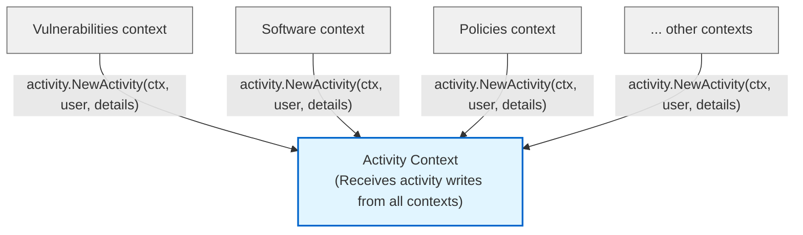

# ADR-0007: Pilot activity bounded context

## Status

Proposed

## Date

2025-11-08

## Context

Fleet's Go codebase has grown to over 680,000 lines of code across over 2,300 Go files (across ee/, orbit/, server/, cmd/, and pkg/ directories). We are continuing the transition to a modular monolith architecture by extracting bounded contexts, taking learnings from [ADR-0001 (Android service layer pilot)](0001-pilot-service-layer-packages.md) and evolving the approach.

### Industry examples of modular monolith architecture

**GitLab** (Ruby on Rails, 2.2M+ LOC): Successfully transitioned from monolith to modular architecture. Their [modular monolith documentation](https://handbook.gitlab.com/handbook/engineering/architecture/design-documents/modular_monolith) outlines key motivations: avoiding microservices complexity, maintaining code approachability, and enabling better feature boundaries through DDD. As [GitLab CEO stated](https://about.gitlab.com/blog/why-were-sticking-with-ruby-on-rails/#monorails): "A well-structured, well-architected, highly modular program that runs as a single process."

**Kubernetes** (Go, 500K+ LOC): The kube-controller-manager bundles [30+ independent controllers](https://github.com/kubernetes/kubernetes/tree/master/pkg/controller) (deployment, replicaset, job, namespace, etc.) into a [single binary "to reduce complexity"](https://kubernetes.io/docs/concepts/architecture/) while maintaining logical separation. Controllers communicate only through the API server, not directly.

### Fleet's activities

The activity system is a cross-cutting concern that records all significant user and system actions across the Fleet platform, and manages the queue of activities to be executed (unified queue). Currently, this functionality is scattered across the service layer with no clear boundaries.

**Important: This pilot extracts ONLY the audit portion** (past activities/audit log), not the complete activity system. This is intentionally a small, focused extraction designed to gather learnings about the modularization approach and identify architectural issues before tackling larger contexts. This limited scope comes with a recognized trade-off: audit activities alone may be too small to justify a separate bounded context and could introduce more overhead than benefit to business and engineering velocity. We accept this risk in exchange for validating the extraction process itself and establishing patterns for future, larger bounded context extractions.

**Bounded context naming:** We chose `activity` following **Domain-Driven Design principles** and the **ubiquitous language** used in the business domain. In Fleet's domain language, both past activities (audit log) and upcoming activities (unified queue) are referred to as "activities", just at different points in their lifecycle. This naming allows the bounded context to naturally own both concerns, with this pilot focusing on past activities first, and future expansion to include the unified queue.

**Key learnings from ADR-0001:** The Android MDM pilot (ADR-0001) kept the datastore layer shared, which limited the benefits of bounded context isolation. This pilot evolves that approach by extracting the **full vertical stack** including data access, following GitLab's proven pattern where each bounded context owns its complete implementation from handlers to database queries. Additionally, we're addressing the lack of clear ownership and architectural enforcement that ADR-0001 didn't fully establish.

### Bounded context design guidelines

**Database transactions:**
- ✅ **Exclusive write ownership**: Each bounded context owns writing to its tables exclusively (no other context writes to them)
- ✅ **Reads allowed across contexts**: Other contexts can read via joins for queries, but this indicates coupling
- ❌ **DB transactions DO NOT cross bounded context boundaries**: Each transaction must be scoped to a single context's tables to avoid distributed transaction complexity
- ⚠️ **Multi-context writes**: If a use case requires writes to multiple contexts, orchestrate separate transactions via the service layer of the context that owns the API endpoint. Use compensating transactions (Saga pattern) only as a last resort for critical consistency requirements.

**Database schema:**
- ✅ **Single shared database**: All contexts share one MySQL database for operational simplicity (no separate databases per context)
- ⚠️ **Cross-context joins allowed but scrutinized**: Joins across bounded context tables are permitted for read operations (queries, reports, dashboards), but indicate coupling and should receive extra scrutiny during code review

**Bounded context communication:**
- ✅ **Public service APIs only**: Bounded contexts expose public service layer methods (e.g., `ListActivities()`); internal implementation details and datastore methods remain private to the context
- ❌ **No direct datastore calls**: Contexts must not call each other's datastore methods directly; always use the public service interface
- ⚠️ **Async communication pattern**: To be defined in a future ADR (for event or message-driven communication between contexts)

## Glossary

To avoid confusion, we define key terms used throughout this document:

**Modularization**: The process of organizing code into cohesive, loosely-coupled groups with clear boundaries. This is a generic architectural term and does **not** refer to Go modules (the dependency management system). We are not modifying Go modules or creating new Go modules in this work.

**Package**: A Go package. A directory containing `.go` files that share the same package declaration (e.g., `package activity`). This is Go's fundamental unit of code organization.

**Bounded context**: A Domain-Driven Design concept representing a cohesive domain with clear boundaries. In our implementation, a bounded context is a **group of Go packages** organized under a common directory that owns a complete vertical slice of functionality. Example: The Activity bounded context is the directory `server/activity/` containing multiple Go packages.

**Cross-cutting concern**: Functionality that affects multiple parts of the system (e.g., activity logging, authentication). The Activity bounded context is a cross-cutting concern because all other contexts write activities to it.

**Vertical slice**: The complete implementation stack for a feature, from HTTP handlers → service logic → data access → database. Bounded contexts own their full vertical slice.

**Ubiquitous language**: A DDD principle where the same terminology is used consistently across code and business domains. We use "activity" because that's what the business calls both past activities (audit) and upcoming activities (queue).

**Table prefix**: The bounded context name prepended to database table names for clear namespace ownership (e.g., `activity_past`, `activity_upcoming`). Follows GitLab's pattern of `ci_pipelines`, `merge_requests`.

## Decision

We will extract an **Activity** bounded context as a pilot for Fleet's modular monolith transition. This context will be responsible for:

**API endpoints:**
- `GET /api/_version_/fleet/activities` - List all activities (organization-wide audit log)
- `GET /api/_version_/fleet/hosts/{id}/activities` - List past activities for a specific host

**Database tables:**
- `activity_past` (renamed from `activities`) - Past activities (audit log)
- `activity_host_past` (renamed from `host_activities`) - Join table linking past activities to hosts

**Core responsibilities:**
- Recording all audit events from across the system (`NewActivity`)
- Querying historical activity logs (`ListActivities`, `ListHostPastActivities`)
- Filtering and pagination of audit trails
- Activity streaming for external logging destination (`newActivitiesStreamingSchedule`)
- Webhook integration for activity events
- Activity cleanup and retention (`CleanupActivitiesAndAssociatedData`)

**Potential future expansion:**
- Upcoming activities queue (unified queue)
- Queue management, activation, cancellation

**Explicitly excluded from this context:**
- Batch activities (`batch_activities`, `batch_activity_host_results`) because this belongs to the Scripts bounded context
- The actual triggering of activities (each context creates its own activity instances and passes them to Activity context)

**What Activity context owns:**
- The `ActivityDetails` interface that all activity types must implement
- Storage and retrieval of all past activities

**Activity type definitions (pragmatic approach for this pilot):**
- **Current state**: All 200+ activity type definitions remain in `server/fleet/activities.go` as a shared package
- **Future direction**: As we extract new bounded contexts (Software, Policies, etc.), those contexts should define their own activity types following GitLab's pattern (e.g., `server/software/activities.go` owns `ActivityTypeInstalledSoftware`)

### Folder structure

Following GitLab's bounded context pattern, each context owns its full stack including data access:

```
server/
└── activity/
    ├── activity.go             # ActivityDetails interface, Activity/UpcomingActivity structs
    ├── datastore.go            # Datastore interface
    ├── service.go              # Service interface
    ├── service/
    │   ├── service.go          # Business logic implementation
    │   ├── handler.go          # HTTP handlers
    │   └── service_test.go     # Unit tests
    ├── mysql/
    │   └── activity.go         # MySQL datastore implementation
    └── tests/
        └── integration_test.go # Service + MySQL integration tests
```

**Structure rationale:**

1. **Separation of concerns:**
   - **Root `activity/`**: Shared types, interfaces (service, datastore), contracts that other contexts depend on
   - **`activity/service/`**: Implementation details (business logic, handlers, unit tests); internal to the context
   - **`activity/mysql/`**: Database implementation; internal to the context
   - **`activity/tests/`**: Integration tests requiring full stack (server + database)

2. **Clear dependency boundaries:**
   - Other contexts can import `server/activity` for types and interfaces
   - Other contexts **cannot** import `server/activity/service` or `server/activity/mysql` (private implementation)
   - Enables architectural checks to enforce that only public interfaces are used

3. **Testability:**
   - Unit tests live alongside implementation (`service/service_test.go`)
   - Integration tests in separate `tests/` directory to avoid circular dependencies
   - Clear distinction between unit tests (fast, isolated) and integration tests (slower, full stack)

### Database table prefixes and naming

Following GitLab's approach and industry best practices, database tables will use the bounded context as a prefix. We use **descriptive suffixes** to distinguish between past and upcoming activities:

**Past activities (this pilot):**
- `activity_past` (renamed from `activities`) - Past activities audit log
- `activity_host_past` (renamed from `host_activities`) - Host-activity join table

**Upcoming activities (future expansion):**
- `activity_upcoming` - Unified queue of upcoming activities
- `activity_host_upcoming` - Host join for upcoming activities

**Rationale for table naming:**

1. **Context prefix (`activity_`)**: Provides clear namespace following GitLab's pattern (e.g., `ci_pipelines`, `merge_requests`)

2. **Descriptive suffixes (`_past`, `_upcoming`)**:
   - Avoids redundancy (`activity_activities` would be awkward)
   - Makes lifecycle stage explicit
   - Clear ownership in schema diagrams

3. **DDD alignment**: Names reflect the ubiquitous language; both "past" and "upcoming" are lifecycle states of activities in the domain

4. **Go package naming**: The Go package `activity` is short, idiomatic (no underscores), and extensible to future queue functionality

### Architecture checks

We will implement architectural boundary enforcement using Go tooling:

**Architecture tests** (`server/activity/arch_test.go` - recommended for pilot)
- Uses `server/archtest` package, following the same pattern as Android MDM (`server/mdm/android/arch_test.go`)
- Validates import restrictions:
  - Root `activity` package should not depend on other Fleet packages (only types and interfaces)
  - `activity/service` can import other bounded contexts' public interfaces (e.g., `users`, `hosts`), but not their implementation packages (e.g., `users/service`, `hosts/mysql`)
  - `activity/mysql` cannot import other bounded contexts
  - Other contexts cannot import `activity/service` or `activity/mysql` (only public `activity` package)
- Runs as part of regular test suite in CI

**[arch-go](https://github.com/arch-go/arch-go)** (for future consideration)
- More sophisticated rule enforcement and reporting
- Evaluate after pilot completes

### Communication pattern

Activity is a **write-only cross-cutting concern** for other bounded contexts:



**Key principle:** Other contexts publish activity events, Activity context consumes and stores them. This is a form of event sourcing for audit trails.

### Dependencies

**Activity context depends on (reads from):**
- **Users** - to populate actor information (name, email, gravatar) for activities
- **Hosts** - to verify authorization when querying host-specific activities
- **Authorization** - to check permissions for reading activities

**Other contexts depend on Activity context (writes to):**
- All contexts call `activity.NewActivity()` to record audit events

## Consequences

### Benefits ✅

**Validates modularization approach:**
- Small, well-defined scope makes it a good pilot
- Clear boundaries (write-only cross-cutting concern)
- Minimal dependencies on other contexts
- Quick to implement

**Improves activity management clarity:**
- All activity audit-related code in one place
- Easier to ensure compliance requirements
- Simpler testing of activity functionality
- Clear ownership and accountability

**Demonstrates patterns for future contexts:**
- Folder structure template
- Interface design patterns
- Database table prefixing approach
- Architectural boundary enforcement

**Low risk:**
- Read-only API endpoints (no complex mutations)
- No circular dependencies identified
- Can be implemented incrementally
- Easy to roll back if issues arise

### Drawbacks / technical debt ⚠️

**Pilot scope limitation:**
- **This pilot extracts ONLY the audit portion**, not the complete activity system
- Audit activities alone may be too small to justify a separate bounded context
- Could introduce more overhead than benefit to engineering velocity
- Accepted trade-off: we prioritize learning from a small extraction over perfect scope sizing

**Additional indirection:**
- More packages to navigate
- May initially slow development until patterns are familiar
- Need to update imports across codebase

**Cross-cutting nature:**
- Activity context receives writes from all other contexts (cross-cutting concern)
- This is a valid bounded context pattern, just different from more typical self-contained contexts
- Validates that bounded contexts don't all need to be vertically isolated

### Impact 💫

**Minimal disruption:**
- Changes isolated to activity-related code
- No impact on other features
- Can be done alongside regular feature work

**Sets precedent:**
- First bounded context with database table prefixing
- Template for future context extractions
- Establishes governance patterns (arch checks)

### Future considerations 🔮

**After pilot completes:**
1. Evaluate success criteria:
   - Were architectural boundaries respected?
   - Did table prefixing cause issues?
   - Was the migration process smooth?
   - Do developers find the new structure helpful?

2. Document lessons learned:
   - What worked well?
   - What would we do differently?
   - Update this ADR with findings

3. Decide next context to extract:
   - Larger, more complex context based on learnings
   - Candidates: scripts, policies, software management, vulnerabilities

4. Refine tooling:
   - Improve architectural checks
   - Better code generation for new contexts

## Alternatives considered

### Alternative 1: Do nothing (stick with the status quo)

**Description:** Keep activities code in current locations (`server/service/activities.go`, `server/datastore/mysql/activities.go`) with no bounded context extraction, table renaming, or architectural boundaries.

**Pros:**
- No effort
- Team familiar with current structure

**Cons:**
- **Codebase continues to grow in monolithic service layer
- **Technical debt accumulates:** Problem gets harder to solve as codebase grows
- **Misses opportunity to validate modularization approach:** No learning for future bounded context extractions

**Reason not chosen:** While the status quo has short-term benefits (no migration cost, no risk), Fleet's codebase has grown to over 680,000 lines of Go code and continuing without modularization will make the codebase increasingly difficult to maintain, test, and understand. This pilot provides low-risk validation of the bounded context approach with a small, well-defined scope. The learnings will inform future, larger bounded context extractions.

### Alternative 2: Extract a different bounded context (e.g., vulnerabilities)

**Description:** Extract a different, larger bounded context such as vulnerabilities instead of activity as the pilot.

**Pros:**
- **Higher business value:** Vulnerabilities is a core Fleet feature with significant customer impact
- **Larger engineering benefits:** More code organization, clearer ownership, better testability for a complex domain
- **More thorough validation:** Would test bounded context approach with a larger, more complex domain than Activity
- **Proven business domain:** Vulnerabilities is well-understood with clear boundaries

**Cons:**
- **Much larger scope:** Vulnerabilities bounded context would take longer to extract and validate
- **Higher risk for pilot:** More complex domain with many dependencies increases chance of issues
- **Requires more planning:** Vulnerabilities touches multiple systems (software inventory, host details, APIs, webhooks)
- **Blocks faster learning:** Delays validation of modularization approach and patterns

**Reason not chosen:** While extracting vulnerabilities (or another major bounded context) would provide greater business and engineering value, activity is intentionally chosen as a small, focused pilot to validate the extraction process itself with minimal risk. The learnings from this pilot (folder structure, architectural checks, table prefixing, migration strategy) will directly inform a larger vulnerabilities extraction. Vulnerabilities is a good candidate for the next bounded context extraction.

### Alternative 3: Keep shared datastore layer (ADR-0001 pattern)

**Description:** Keep datastore implementation in `server/datastore/mysql/activities.go` shared across all contexts, only extracting the service layer like ADR-0001 did.

**Pros:**
- Consistent with ADR-0001 Android MDM pilot
- Less code movement initially
- Simpler migration
- All MySQL code in one place

**Cons:**
- **Breaks bounded context isolation:** Any context can call any other context's datastore methods
- **Violates GitLab's pattern:** GitLab includes DB models within each bounded context (`app/models/ci`)
- **No clear ownership:** Who owns the datastore code if multiple contexts use it?
- **Can't enforce boundaries:** Architectural checks can't prevent direct datastore access across contexts
- **Shared package grows:** All contexts contribute to the same `datastore/mysql` package, recreating the monolith problem

**Reason not chosen:** While ADR-0001 kept the shared datastore as a partial extraction focused on service layer separation, this pilot aims to establish true bounded contexts with full vertical isolation. GitLab's success with modular monolith comes from each context owning its complete stack, including data access. Keeping a shared datastore layer defeats the purpose of bounded contexts and prevents proper boundary enforcement.

## References

**Fleet ADRs:**
- [ADR-0001: Pilot service layer packages](0001-pilot-service-layer-packages.md) - Established folder pattern (`server/mdm/android/`), but kept shared datastore layer (this ADR goes further)

**GitLab (Ruby on Rails - modular monolith transition):**
- [GitLab Modular Monolith](https://handbook.gitlab.com/handbook/engineering/architecture/design-documents/modular_monolith) - Main design document outlining approach and motivations
- [GitLab Hexagonal Monolith](https://handbook.gitlab.com/handbook/engineering/architecture/design-documents/modular_monolith/hexagonal_monolith/) - Detailed hexagonal architecture pattern with bounded contexts
- [GitLab Bounded Contexts Working Group](https://handbook.gitlab.com/handbook/company/working-groups/bounded-contexts/) - Cross-team alignment for context definition

**Go-based examples:**
- [Kubernetes kube-controller-manager](https://kubernetes.io/docs/concepts/architecture/) - Bundles 30+ independent controllers into single binary "to reduce complexity"
- [Kubernetes Controller Packages](https://github.com/kubernetes/kubernetes/tree/master/pkg/controller) - Shows controllers organized in separate Go packages

## Success criteria

The pilot will be considered successful if:

1. **Boundaries respected:** No violations of import restrictions detected by architectural checks
2. **Migration completed:** All past activity code moved to `server/activity/` without breaking existing functionality
3. **Table naming works:** Database migration successful (`activity_past`, `activity_host_past`), no performance degradation
4. **Developer experience:** Team finds new structure easier to understand and navigate
5. **No regressions:** All existing activity tests pass, audit trail remains complete
6. **Documentation clear:** Future contexts can follow this pattern without significant guidance
7. **Pattern established:** Clear path for future bounded contexts to own their activity types (documented but not implemented in this pilot)

We will evaluate these criteria 2 weeks after completion and update this ADR with findings.
