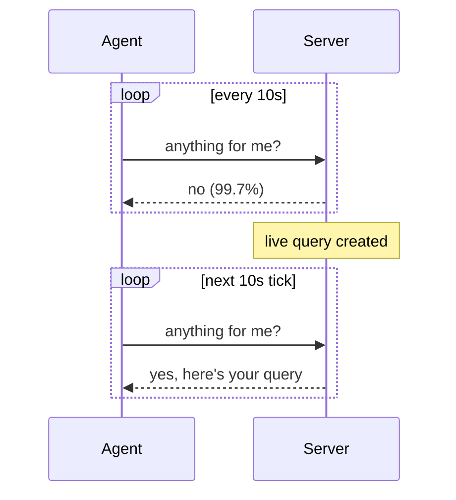
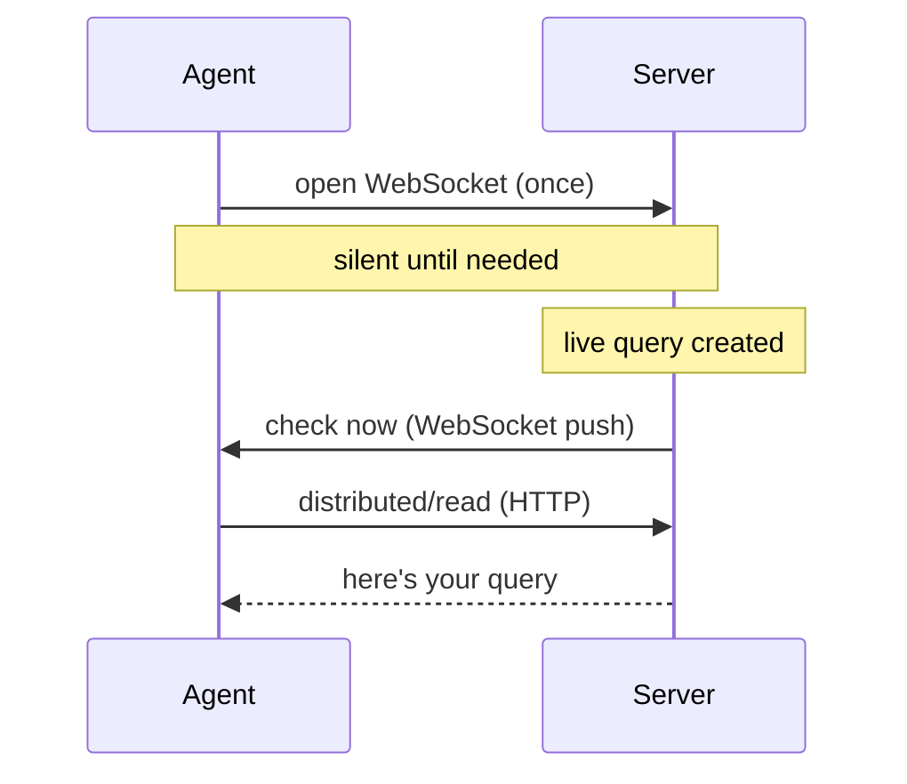

# ADR-0011: Agent WebSocket Transport

## Status

Proposed

## Authors

- Luke Heath
- Sharon Katz
- Lucas Rodriguez

## Date

2026-08-04

## Table of Contents

1. [What & Why](#1-what--why)
2. [Thundering Herd Mitigation](#2-thundering-herd-mitigation)
3. [Security Analysis](#3-security-analysis)
4. [Deployment & Rollout](#4-deployment--rollout)
5. [Consequences](#consequences)
6. [Alternatives Considered](#alternatives-considered)
7. [References](#references)

---

## 1. What & Why

### The problem

Today, every Fleet agent polls the server on fixed timers. The biggest offender is `distributed/read` (live query check-in): every host asks "anything for me?" every 10 seconds, and 99.7% of the time the answer is "no."

At 50k hosts this produces ~1.2 billion requests/day. 96.7% carry no useful payload.

| Metric (50k hosts) | Value |
|---|---|
| Daily requests | ~1.2B |
| Empty responses | 99.7% of distributed/read |
| Infra cost/day | $122 |

### The solution

Replace polling with a persistent WebSocket connection per agent. The server pushes a "check now" nudge only when there is actual work. The agent then makes one normal HTTP request to fetch it.

### How it works today (polling)

### How it works with WebSockets (push)

### Key design choices

- **Nudge, not full push.** The WebSocket says "check now," then the agent does a normal HTTP call. The existing ingest pipeline stays untouched.
- **fleetd becomes osquery's distributed plugin.** osquery's 10s poll becomes a local call answered from memory. Nothing leaves the host in steady state.
- **One socket, many uses.** The same connection can eventually carry config updates, Desktop check-ins, and more, replacing multiple polling loops.

---

## 2. Thundering Herd Mitigation

_TODO_

---

## 3. Security Analysis

_TODO_

---

## 4. Deployment & Rollout

_TODO_

---

## Consequences

_TODO_

---

## Alternatives Considered

_TODO_

---

## References

- Confidential issue #17019: Agent transport phase 1
- Load test cost data (July baseline)
