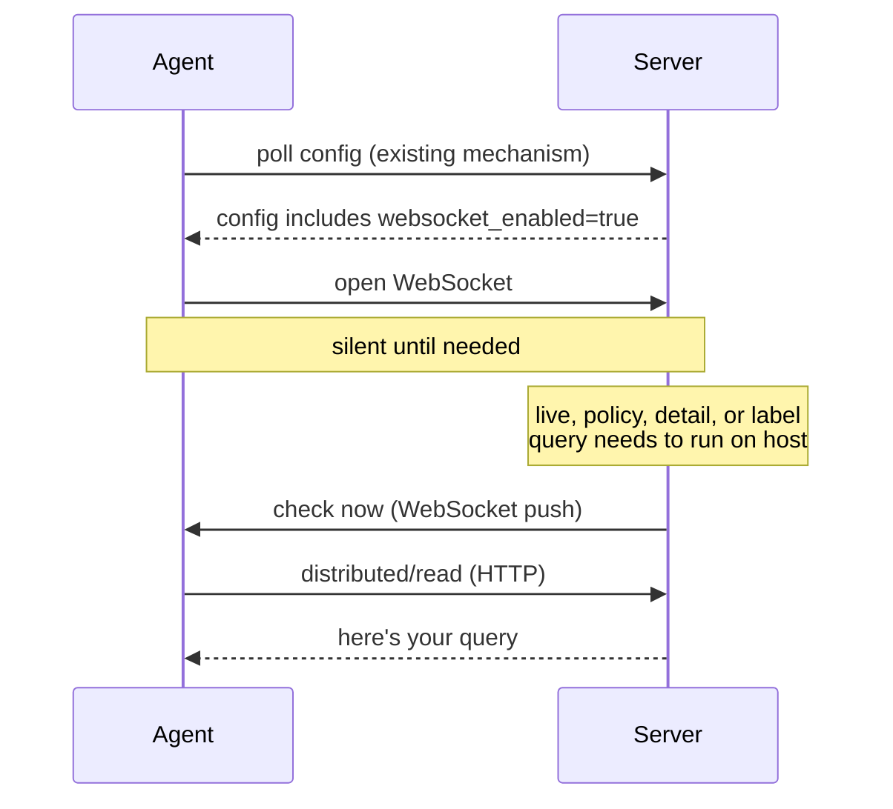
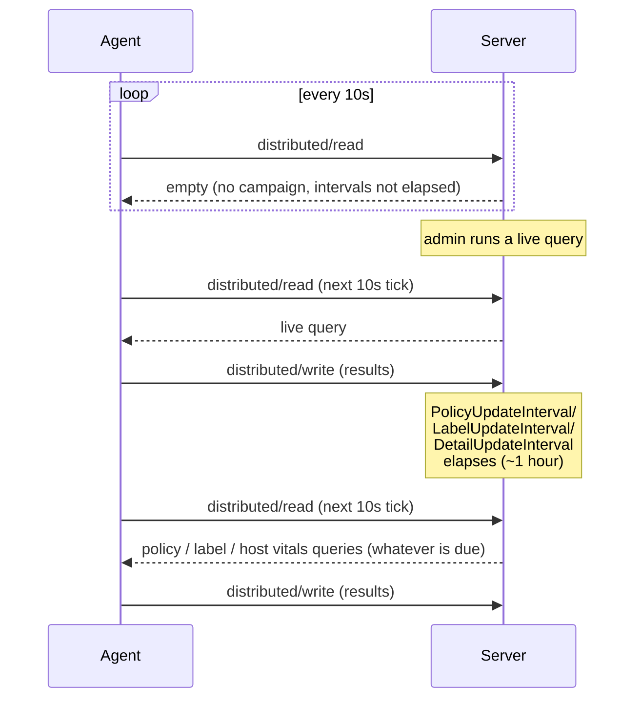
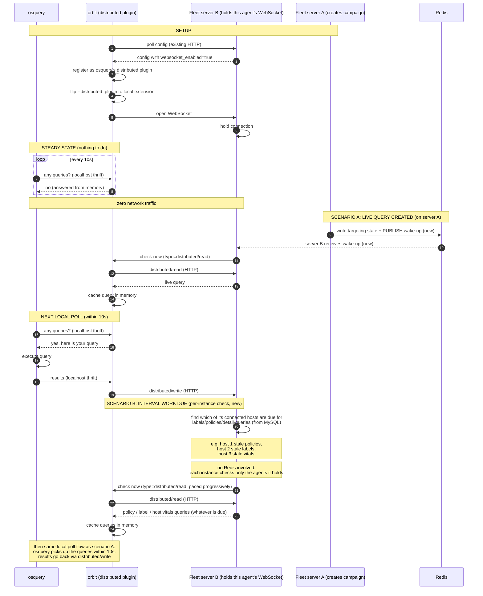

# ADR-0011: Agent WebSocket transport

## Status

Approved

## Date

2026-08-13

## 1. What & why

### The problem

Today, every Fleet agent polls the server on fixed timers. The biggest offender is `distributed/read` (query check-in): every host asks "anything for me?" every 10 seconds, and 99.7% of the time the answer is "no."

At 50k hosts this produces ~1.2 billion requests/day. 96.7% carry no useful payload.

| Metric (50k hosts) | Value |
|---|---|
| Daily requests | ~1.2B |
| Empty responses | 99.7% of distributed/read |
| Infra cost/day | $122 |

### The solution

Replace polling with a persistent WebSocket connection per agent. The server pushes a "check now" nudge only when there is actual work. The agent then makes one normal HTTP request to fetch it.

### How it would work with WebSockets (push)

> *The diagram below is simplified for illustration. See the full sequence diagrams in sections below.*

### Who decides and who connects

The **server** decides whether WebSocket transport is active, not the agent. When the feature flag is enabled on the server, it includes a WebSocket directive in the agent's configuration response (delivered through the existing config polling mechanism). On the next config poll:

- **New agent (supports WebSockets):** reads the directive and opens a WebSocket connection to the server. Connection attempts arrive naturally staggered because each agent discovers the directive on its own config poll schedule (see [Thundering herd mitigation](#thundering-herd-mitigation)).
- **Old agent (no WebSocket support):** ignores the unknown directive and continues polling as before. No harm done.

> **The server is always in control.** Disabling the feature flag immediately stops new WebSocket connections on the next config cycle. Every agent falls back to polling. No agent action required, no rollback needed, no downtime.
> TBD during implementation:
>   - Whether the detection of websocket ON/OFF triggers an orbit restart to start with the new mode of operation (or can be optimized to not require an orbit restart, mostly due to the `--distributed_plugin` mode of operation).
>   - Instead of having a orbit/config setting, just have orbit perform a websocket connection attempt, if it succeeds it means two things: websocket is configured in the server AND orbit can connect to it (no network issues with websockets).

### What travels over `distributed/read` today

The `distributed/read` endpoint is not just for live queries. Four distinct features share it, each with its own server-side interval:

| Feature | How it gets to the agent | Server includes it when... |
|---|---|---|
| **Live queries** | `distributed/read` | A campaign targets the host |
| **Policies** | `distributed/read` | PolicyUpdateInterval has elapsed (~1 hour) |
| **Labels** | `distributed/read` | LabelUpdateInterval has elapsed (~1 hour) |
| **Host vitals** (detail queries, which include software) | `distributed/read` | DetailUpdateInterval has elapsed (~1 hour) |

The agent polls `distributed/read` every 10 seconds. The server decides what to include based on these intervals. In steady state, most polls return empty because no live query is active and the hourly intervals have not elapsed. See [Understanding host vitals](../product-groups/orchestration/understanding-host-vitals.md) for the full list of queries delivered this way.

> **Scheduled queries (reports)** use a different channel: they are delivered via `/api/osquery/config` as part of the osquery pack configuration.

### How this works today (polling)

> The diagram below is simplified for illustration.

Live queries, policies, labels, and host vitals (which include software) all travel over the same `distributed/read` poll. The only difference is what makes the server include work in the response: a live query campaign targeting the host, or one of the hourly intervals elapsing.

### The WebSocket is a notification channel only

The WebSocket does **not** replace any existing functionality. It acts purely as a notification channel: the server sends a short "check now" signal, and the agent then performs the same HTTP calls it always has. No query data, no config payloads, no results travel over the WebSocket. Everything that works today continues to work exactly the same way. The only difference is that the agent no longer asks on a blind timer; it asks when told to.

Each "check now" signal carries a `type` field indicating which channel the agent should check. In Phase 1 the only value is `type=distributed/read`; future phases add values such as `type=orbit/config` on the same connection. It also carries a `reason` field saying what triggered it — `live-<campaign ID>`, `label`, `policy`, `detail`, or `refetch` — which is informational only, for debugging/troubleshooting (when several kinds of work are due at once, the server picks one).

Because live queries, policies, labels, and host vitals (e.g. software) ingestion all share `distributed/read`, a single WebSocket nudge type covers all four. The agent does not need to know which feature triggered the nudge; it just calls `distributed/read` and the server returns whatever is due.

**Phase 1 (POC):** The notification channel covers `distributed/read` only (live queries, labels, policies, host vitals). This is the biggest offender (38.2% of all traffic, 99.7% empty) and proves the mechanism end to end.

**Future phases:** The same WebSocket carries notifications for additional channels:

| Phase | Nudge `type` | Current polling | What the nudge means |
|---|---|---|---|
| 1 (POC) | `distributed/read` | every 10s | "there is work for you" (live queries, policies, labels, or host vitals) |
| Future | `orbit/config` | every 30s | "your config changed" |
| Future | `desktop` | every 5m | "there is something to show the user" |
| Future | `osquery/config` | every 60s | "your osquery config changed" |

### Keepalive and agent liveness

The server sends a WebSocket ping every **5 minutes**. This serves two purposes: confirming the agent is still alive, and preventing the load balancer (e.g. AWS ALB) from killing the connection due to idle timeout. The ALB idle timeout should be configured to a value longer than the ping interval (e.g. 10 minutes). If a pong is not received within 30 seconds, the server considers the connection dead and closes it. The agent's normal reconnection logic (with jitter) handles recovery.

> **Open question for infrastructure (@rfairburn):** 5 minutes may be too long in practice. Proxies, NATs, and other middle layers between the agent and the server often drop connections that are idle for less than 5 minutes. The ping interval should be validated against real infrastructure and made configurable, with the ALB idle timeout adjusted accordingly.

### Feature flag and activation

The WebSocket transport is controlled by a server-side command-line flag (e.g. `--enable_websocket_transport`). It is not exposed in the UI, not documented, and not available through any API or GitOps configuration. The only way to enable it is to start the Fleet server with this flag. When disabled (the default), the directive is absent and all agents poll as usual.

If `--enable_websocket_transport=false` then the server will reject any websocket connections (this could be the signal for agents to know if the setting is enabled or not, and at the same time check if a websocket connection can be established, i.e. no network issues).

**Fallback requirement (fleetd):** If the agent cannot establish the WebSocket connection (blocked by a middlebox, repeated upgrade failures, etc.), or an established connection drops and cannot be re-established, fleetd must fall back to the existing polling protocol. WebSocket transport is an optimization; polling remains the guaranteed baseline, so no functionality is ever lost.

The agent treats the WebSocket as **stable** (and stops polling) once a connection has stayed up for 1 full minute, and as **unavailable** (and resumes polling, while still retrying with backoff) after 1 minute without a successful connection — e.g. N consecutive failed attempts. Both thresholds are initial guesses to be validated during implementation.

Before downgrading, the agent should check that plain HTTP still works: if both the WebSocket and normal HTTP requests are failing, the server (or the network path to it) is probably down, not the WebSocket transport. In that case the agent should not downgrade to polling; it keeps retrying both as usual.

### Thundering herd mitigation

**Initial connections.** When the feature flag is first enabled, each agent receives the WebSocket directive on its next config poll. Because config polls are already spread across the poll interval, connection attempts arrive naturally staggered; no client-side jitter is needed for the initial wave.

**Reconnections.** When the server restarts, every held connection drops and all agents try to reconnect at once. Each agent applies a random jitter delay (0 to 30 seconds) before reconnecting. If the connection fails, the agent retries with exponential backoff (starting at 5s, capped at 5 minutes) plus a small random jitter on each retry, falling back to polling in the meantime so no functionality is lost.

**Server-side protection.** Each instance rate-limits new WebSocket upgrades (e.g. 200/second) and enforces a max connection cap. Excess attempts receive `503 Retry-After`, and the agent retries with its backoff logic.

**Nudge pacing (new capability).** With push, the Fleet server gains real thundering herd control that polling never allowed: it decides when agents check in. For example, after several minutes of downtime, instead of sending "check now" to all agents at once, the server can send the nudges progressively (in batches), spreading the resulting HTTP load however it chooses.

### Connection balancing across server instances

Unlike HTTP polling (where the ALB routes each request independently), WebSocket connections are sticky. Imbalances accumulate when instances are added, restarted, or scaled.

Three layers handle this:

1. **ALB least-connections routing** sends new WebSocket upgrades to the least-loaded instance.
2. **Per-instance max connection cap.** At the limit, new upgrades get `503 Retry-After` and the ALB reroutes them. No inter-instance coordination needed.
3. **Graceful rebalancing.** Instances report connection counts to Redis. If one holds more than ~120% of the cluster average, it sends "please reconnect" to excess agents. They reconnect with jitter and the ALB redistributes them.

> **Example:** 100k agents on 2 instances. A third is added. A and B each shed ~17k connections; agents reconnect with jitter across all three.

## 2. How Orbit proxies osquery

osquery core is unaware of this change. Orbit acts as a local proxy using osquery's existing extension plugin system.

Today, osquery talks directly to the Fleet server over HTTP for `distributed/read` and `distributed/write`. With WebSocket transport enabled, orbit registers itself as osquery's `distributed` plugin via the osquery-go extension manager (the same mechanism orbit already uses for custom tables in `orbit/pkg/table/extension.go`). The server configures orbit to flip osquery's `--distributed_plugin` flag so osquery's 10-second poll becomes a localhost thrift call to orbit instead of an HTTP call to the Fleet server.

osquery does not know the difference. It keeps its 10-second loop, but the call never leaves the machine.

**Note on wake-up triggers (new mechanisms):** A "check now" nudge has two triggers:

1. **Live query created.** Today, campaign targeting is written to Redis keys and each server instance discovers it independently when a host polls. There is no inter-instance notification. With WebSockets, the server instance holding an agent's connection may not be the one that created the campaign. To solve this, campaign creation adds a Redis `PUBLISH` on a wake-up channel. All server instances subscribe to this channel and nudge the relevant agents they hold. Redis pub/sub already exists in Fleet for streaming query results back; this extends the same pattern for the wake-up signal. The pub/sub nudge is a latency optimization, not the delivery guarantee: it is fire-and-forget, so a campaign created while a host was mid-reconnect, or whose message was lost (pub/sub, send-buffer overflow, failed write), is recovered by the interval check job, which also nudges held hosts targeted by an active campaign they have not answered yet.
2. **Interval-based work due (per-instance check, new).** Policies, labels, and host vitals refresh on server-side intervals. Today the agent's blind 10-second poll is what picks up that work once an interval elapses; with nudge-driven `distributed/read`, a per-instance check job takes over that role — see [The interval check job](#the-interval-check-job) below.

**Phase 1 scope: `distributed/read` and `distributed/write` only.** In this first phase, orbit registers only as osquery's `distributed` plugin. All other osquery traffic is unchanged: osquery keeps sending scheduled query result logs (`/api/osquery/log`) and fetching config (`/api/osquery/config`) directly from the server, exactly as it does today.

In a future phase, orbit could also register as osquery's logger and config plugins. At that point orbit becomes the single point of contact between the host and the server: osquery communicates only with orbit on localhost, and orbit handles all external network communication.

**Why the extension plugin approach (not an HTTP proxy):**

- Orbit already runs an osquery extension manager for custom tables. Registering a `distributed` plugin is the same mechanism.
- No HTTP proxying, no TLS interception, no URL rewriting needed.
- The localhost thrift call has zero network overhead.
- osquery requires zero code changes and has zero awareness of the WebSocket.

### The interval check job

Each server instance runs a lightweight periodic job (every 30 seconds by default, configurable) that determines which of **its own open WebSocket connections** need a "check now" signal:

1. Collect the host IDs of the connections the instance currently holds.
2. Query MySQL for those hosts' last-updated timestamps: `policy_updated_at`, `label_updated_at`, and `detail_updated_at` (detail queries cover host vitals, including software).
3. Any host with a timestamp older than the corresponding interval (PolicyUpdateInterval, LabelUpdateInterval, DetailUpdateInterval) is due: send it a `type=distributed/read` nudge.
4. For held hosts with no interval work due, check the live query store for active campaigns targeting them that they have not answered yet; any match is nudged too. With no active campaigns — the common case, gated by a single in-memory-cached lookup — this step is skipped entirely, and hosts already due for interval work are never checked because their nudge triggers a full `distributed/read` that serves any live query anyway.
5. Pace the nudges progressively (in batches) so a large due-set does not produce a thundering herd of `distributed/read` calls.

Design notes:

- **Batch scan, not per-connection checks.** The job checks all held connections in one pass with a single chunked MySQL query, rather than querying per connection (10k+ queries per tick) or keeping a per-host next-due schedule (state that goes stale when intervals change or timestamps advance via another instance). Steady state is self-staggering: hosts' timestamps are naturally spread out, so each tick finds only a small slice due (~170 hosts/minute at 10k connections and a 1-hour interval). The one case where everything looks due at once — after downtime — is handled by the progressive pacing step.
- **The live query check is per-host, against Redis.** Unlike interval due-ness, campaign targeting lives in per-campaign Redis bitfields (and per-host sets for small-target campaigns), so each candidate host costs one pipelined Redis lookup per tick while any campaign is active. This is the same lookup every host's blind 10-second poll performs today, at a third of the frequency — strictly cheaper than the polling baseline it replaces — and it costs nothing when no campaign is active. If the per-tick fan-out ever matters at scale, the lookups can be batched across hosts (one pipeline per chunk instead of per host).
- **Not a cluster-wide cron.** The job intentionally does not use Fleet's cron/schedule infrastructure (where a single instance takes a lock and runs the job): only the instance holding a WebSocket can deliver the nudge, so each instance checks exactly the agents it holds. The work is naturally sharded across instances and no Redis coordination is needed.
- **Staleness comes from MySQL, not instance memory.** The agent's `distributed/read`/`distributed/write` HTTP calls go through the load balancer and may be served by any instance, so the connection-holding instance cannot know locally when the host last reported. The timestamps in the `hosts` table are the source of truth.
- **Re-nudge every tick; the agent coalesces.** A due host stays due until its results are ingested and the timestamp advances, so the job nudges it on every tick until then — the MySQL timestamps are the single source of truth, with no server-side grace period suppressing nudges (an earlier design used one, but it delayed *new* work — e.g. a manual refetch requested right after a live query — by the full grace window). The agent bounds the cost instead: orbit runs at most one read → osquery pickup → write iteration at a time and coalesces any nudges (or poll ticks) arriving mid-iteration into a single queued follow-up read. Because ingestion happens synchronously within `distributed/write`, that follow-up read observes the freshly advanced timestamps and returns no work unless something new is genuinely due — expensive queries never run twice for one due-cycle. A pass that dies between query pickup and write (osquery crash; the osquery runner restarts it) is closed by osquery's next local distributed poll, which doubles as the recovery signal, and the per-tick re-nudge re-delivers the work itself.

## 3. Security analysis

### Transport encryption

WebSocket connections use `wss://` (WebSocket Secure), which runs over TLS. The WebSocket upgrade starts as a standard HTTPS request and then upgrades the connection in place. It inherits the same TLS certificate, cipher suites, and certificate validation as all other Fleet HTTPS traffic. No additional encryption configuration is needed. Unencrypted `ws://` connections must be rejected by the server.

### Authentication

The WebSocket upgrade request is authenticated using the **orbit node key**, the same credential orbit already uses for all its HTTP calls to the Fleet server. The server validates the node key during the HTTP upgrade handshake, before the connection is promoted to a WebSocket. If the key is invalid or revoked, the upgrade is rejected with a `401` and no WebSocket is established.

Once connected, no further authentication is needed per message because the WebSocket is a persistent, authenticated session. If the node key is revoked while a connection is open, the server should close that connection on the next keepalive cycle.

### Connection exhaustion (DoS)

Holding 100k-200k open WebSocket connections increases the server's attack surface for resource exhaustion:

| Resource | Risk | Mitigation |
|---|---|---|
| File descriptors | Each WebSocket consumes one fd per server instance | Set OS-level fd limits (`ulimit`) appropriately; enforce per-instance max connection cap |
| Memory | Each connection holds a small buffer (~4-8 KB) | At 200k connections across a cluster, this is ~800 MB total, distributed across instances |
| CPU | Idle connections consume near-zero CPU; pings every 5 min are negligible | No special mitigation needed |
| Unauthenticated connection attempts | An attacker could flood the upgrade endpoint | Rate-limit WebSocket upgrades per source IP; reject upgrades that fail authentication immediately before allocating resources |

**Key mitigation:** The WebSocket upgrade endpoint must authenticate the node key **before** allocating connection resources. A failed auth check should return `401` and close the TCP connection immediately, not hold it open.

### Attack surface comparison

The WebSocket does not introduce new data flows or new trust boundaries:

| Concern | Today (polling) | With WebSocket |
|---|---|---|
| Encryption | TLS (HTTPS) | TLS (WSS), same certs |
| Authentication | Orbit node key per request | Orbit node key at upgrade, then persistent |
| Data on the wire | Full query payloads, config, results | Only "check now" nudges (a few bytes); all payloads still go over HTTP |
| Server-to-agent channel | None (pull only) | Yes, but carries no sensitive data |
| Spoofing risk | Attacker needs valid node key | Same, node key required at upgrade |

The new server-to-agent channel (the nudge) carries no sensitive information. The worst an attacker could do if they compromised the WebSocket channel is send a false "check now" signal, which would cause the agent to make one extra HTTP `distributed/read` call. This is equivalent to what already happens every 10 seconds today.

### Redis pub/sub

Redis pub/sub is used only for live query wake-ups: the campaign is created on whatever instance served the API request, so it must notify the instances holding the targeted agents' connections. (Interval-based nudges never transit Redis; each instance checks and nudges its own connected agents directly.) Redis should be deployed on a private network with authentication enabled (Fleet's existing Redis configuration). The pub/sub message contains only the nudge type, target host identifiers, and the campaign ID — not query content or results.

---

## 4. Deployment & rollout

The feature flag gives us full control over when and where WebSocket transport is enabled. The proposed rollout is incremental, with validation at each stage before moving to the next.

### Load testing (osquery-perf)

`osquery-perf` (`cmd/osquery-perf`), Fleet's host-simulation tool, only speaks the HTTP polling protocol today. Before any rollout stage, it must be extended to simulate the new transport:

- Open and hold a WebSocket per simulated host, including the reconnection behavior (jitter, exponential backoff, fallback to polling).
- Respond to server pings so keepalive and liveness handling can be exercised.
- Act on "check now" nudges by issuing the corresponding `distributed/read` (and `distributed/write`) calls.
- Support mixed fleets (a percentage of old polling agents alongside WebSocket agents) to simulate partial upgrades.

This is what lets us validate the numbers in this ADR at scale before Dogfood: connection density per instance, thundering herd behavior on restart, nudge pacing, the interval check job, and the projected cost savings.

### Proposed rollout order

**Stage 1: Dogfood.** Enable the feature flag on Fleet's internal Dogfood server. Validate stability, connection behavior, keepalive, reconnection, and fallback. This is a low-risk environment where we can observe the feature under real (but internal) usage.

**Stage 2: Volunteer customer.** Identify a customer willing to opt in early. Coordinate with Customer Success on whether to offer an incentive (e.g. reduced hosting cost) in exchange for being an early adopter. Run with the feature enabled, monitor closely, and gather feedback.

**Stage 3: Broader managed cloud rollout.** Expand to additional customers. Volunteers first, then progressively enable on more deployments as confidence grows. At each step, validate cost savings match expectations and no regressions occur.

**Stage 4: Document and publish.** Once the feature is proven at scale across managed cloud, document the feature flag and make it available to self-hosted customers who want to enable it on their own infrastructure.

> **Open question for @lukeheath:** What do you think of this rollout order? Any concerns or suggestions?

## Consequences

### Where the cost savings come from

With ECS Fargate, we pay per container (vCPU + memory allocation), not per CPU cycle. Keeping 15 instances idle saves nothing on compute. The savings come from three areas:

1. **Fewer/smaller server instances.** With 1.2B fewer HTTP requests/day, the cluster needs far less compute capacity. The instance count can be reduced (e.g. 15 to 8) or instances can be downsized.
2. **Reduced ALB costs.** ALB pricing is based on LCUs (new connections, active connections, bandwidth). Eliminating most HTTP requests dramatically reduces LCU usage.
3. **Reduced data transfer.** Fewer HTTP responses means less egress.

| | Today | With WebSockets |
|---|---|---|
| Server instances | 15 | Fewer (right-sized to actual load) |
| HTTP requests/day | ~1.2B | Near zero in steady state |
| Infra cost/day | $122 | ~$52 (measured in load test) |
| What drives the savings | -- | Fewer instances + lower ALB/transfer costs |

### The tension: fewer instances vs. WebSocket headroom

Reducing instance count increases WebSocket density per instance. Each instance must still handle HTTP bursts when nudges fire (agents do `distributed/read` and `distributed/write` over HTTP). The connection budget per instance must account for both.

Because this is a new mode of communication, we cannot fully predict the instance count needed for a given host count up front; we will learn it as we deploy progressively (see [Deployment & rollout](#4-deployment--rollout)). The worked example below is an estimate to show that connection limits are not the bottleneck.

**Worked example at 50k hosts:**

The OS file descriptor limit is typically 65,536. AWS ALB supports up to 100,000 concurrent connections per target. Neither is the bottleneck, but we must budget within them.

Worst case: a query targets all 50k hosts. Every agent is nudged and makes an HTTP `distributed/read` call. The ALB distributes these across all instances evenly.

| | Today (15 instances) | WebSocket option A (8 instances) | WebSocket option B (5 instances) |
|---|---|---|---|
| WebSocket connections/instance | 0 | ~6,250 | ~10,000 |
| Peak concurrent HTTP (worst case: all 50k nudged) | ~3,333 (50k/15) | ~6,250 (50k/8) | ~10,000 (50k/5) |
| Other (Redis, MySQL, internal) | ~200 | ~200 | ~200 |
| **Total connections/instance** | **~3,533** | **~12,700** | **~20,200** |
| Headroom (vs 65k fd limit) | 62k free | 53k free | 45k free |
| Memory for WebSockets/instance | 0 | ~50 MB | ~80 MB |

In the worst case, with 5 instances each instance handles ~10k WebSockets + ~10k concurrent HTTP requests simultaneously. Total ~20k connections is still well under both the OS fd limit (65k) and ALB target limit (100k). However, the HTTP burst is short-lived (each request completes in milliseconds), so the actual concurrent HTTP count at any instant will be lower than the total 10k.

> **Key takeaway:** The number of connections is not the limiting factor. We can safely reduce instance count to save money. The right sizing is driven by how much HTTP burst capacity each instance needs when nudges fire, not by connection limits.

The exact instance count and sizing should be determined by load testing with WebSockets enabled, measuring both steady-state resource usage and burst HTTP capacity under nudge scenarios.

## Alternatives considered

### Long polling

Each agent holds an open HTTP request to the server. The server responds only when there is work, or after a timeout (e.g. 2 minutes), at which point the agent immediately opens a new request.

- **Pros:** Simpler than WebSockets. No upgrade handshake, no new protocol. Works through any HTTP proxy.
- **Cons:** One parked request per channel. Cannot multiplex: adding config, Desktop, and orbit notifications would require separate long-poll connections per agent. Each timeout-and-reconnect cycle creates a new TLS connection (vs. WebSocket which holds one). At 50k hosts with a 2-minute timeout, that is 25k new TLS connections/minute just from timeouts.
- **Why not chosen:** WebSockets support multiplexing multiple notification types on a single connection, which is critical for future phases. Long polling forfeits this and adds connection churn.

### Server-Sent Events (SSE)

The server pushes events to the agent over a long-lived HTTP response using the `text/event-stream` content type. The agent opens one GET request and the server streams events as they occur.

- **Pros:** Simpler than WebSockets. Built on standard HTTP, works through most proxies. Native reconnection with `Last-Event-ID`. One connection can carry multiple event types.
- **Cons:** Unidirectional (server to agent only). The agent cannot send data back over the same connection, so all agent-to-server communication still requires separate HTTP calls (which is also true of our WebSocket design). More critically, SSE requires HTTP/1.1 chunked transfer or HTTP/2. ALB-to-target communication in Fleet's topology is HTTP/1.1, which limits concurrent SSE streams per browser/client. Enterprise middleboxes (TLS-inspecting proxies) often buffer chunked responses, breaking the real-time delivery that SSE depends on.
- **Why not chosen:** The middlebox buffering problem is the same class of issue that led Kolide to add an HTTP fallback for gRPC. WebSockets have a cleaner upgrade mechanism that middleboxes handle better in practice. Fleet already runs WebSockets in production (live query results in the UI), so operational experience exists.

Some additional notes on WebSockets vs SSE:

- Fleet already uses SSE in production for the Android enterprise signup flow, where @getvictor solved response buffering with anti-buffering headers. That flow runs from the admin's browser to the server through infrastructure the deployer controls, so it doesn't tell us whether SSE survives the TLS-inspecting middleboxes on end-user networks that agents sit behind — but it does mean SSE is not new surface for Fleet.
- @lukeheath and @mikermcneil have prior experience deploying WebSockets at scale. We will ship WebSockets first, and treat SSE as the next-best option if WebSockets prove problematic on Fleet's production infrastructure. Because the channel is strictly server→agent notifications, switching to SSE later would not change the design — only the transport. The main capability lost would be pong-based liveness (the server could no longer confirm within seconds that a held connection is alive).

### gRPC streaming

Replace the HTTP API with gRPC bidirectional streaming. The agent holds a persistent gRPC stream to the server.

- **Pros:** Strong typing via protobuf. Bidirectional streaming. Efficient binary protocol.
- **Cons:** Requires HTTP/2 end-to-end. Fleet's ALB terminates TLS and forwards HTTP/1.1 to backend tasks, making gRPC unreachable without infrastructure changes (h2c or network load balancer). Enterprise middleboxes break HTTP/2 far more often than plain HTTPS. Kolide launcher shipped gRPC first and had to add a plain-HTTPS fallback for exactly this reason.
- **Why not chosen:** Blocked by Fleet's deployed ALB topology and unreliable through enterprise network gear.

### ETag / conditional requests (ADR-0012)

Reduce response size by having agents send an ETag with each request. The server returns a minimal "not modified" response when the config hasn't changed. See [ADR-0012](0012-osquery-config-conditional-requests.md).

- **Pros:** Small, self-contained change. Benefits every deployment including self-hosted without WebSockets. No infrastructure changes needed.
- **Cons:** Does not eliminate the requests themselves, only shrinks responses. The agent still polls on a fixed timer. Requires an upstream osquery change.
- **Why not chosen (as a replacement):** The two are complementary, not exclusive. ETag makes the polling fallback path cheap. WebSockets eliminate the polling entirely. Together they cover both managed cloud (WebSocket-enabled) and self-hosted (polling with ETag) deployments.