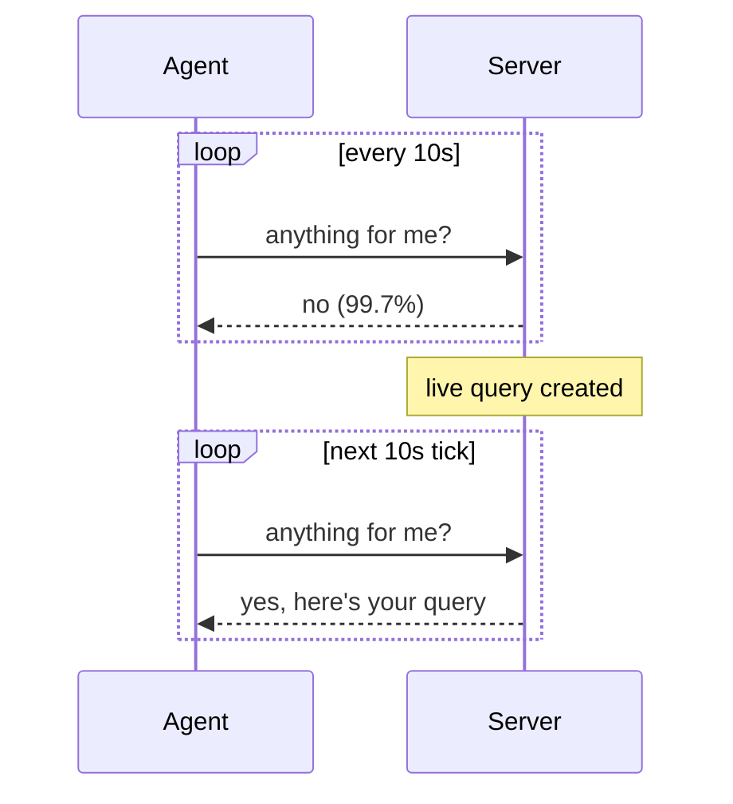
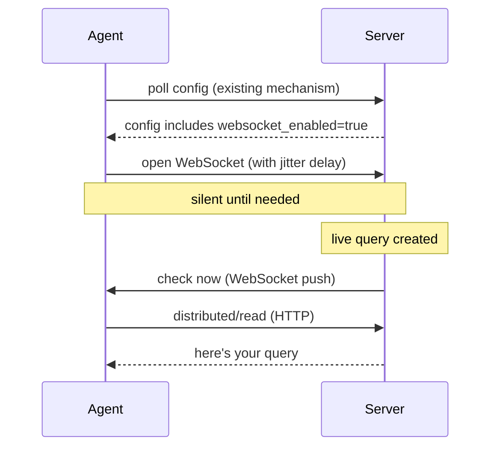
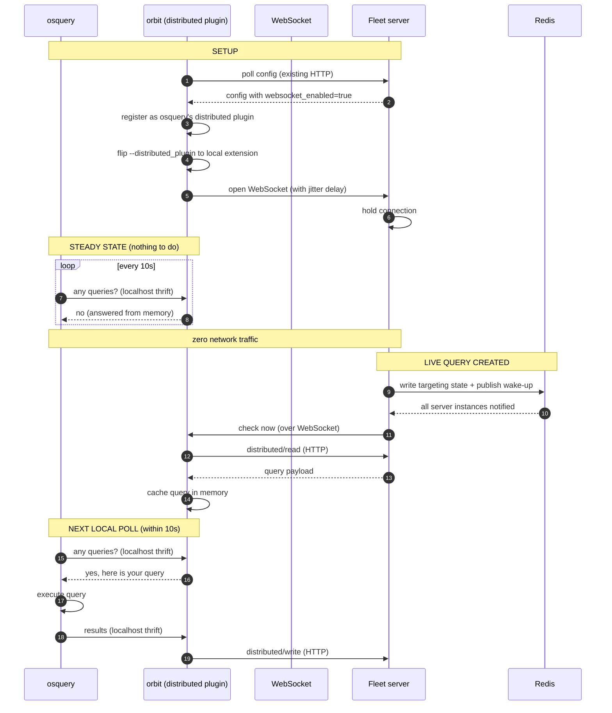

# ADR-0011: Agent WebSocket Transport

## Status

Proposed

## Authors

- @lucasmrod
- @lukeheath
- @sharon-fdm

## Date

2026-08-04

## Table of Contents

1. [What & Why](#1-what--why)
2. [Thundering Herd Mitigation](#2-thundering-herd-mitigation)
3. [Security Analysis](#3-security-analysis)
4. [Deployment & Rollout](#4-deployment--rollout)
5. [Consequences](#consequences)
6. [Alternatives Considered](#alternatives-considered)
7. [References](#references)

---

## 1. What & Why

### The problem

Today, every Fleet agent polls the server on fixed timers. The biggest offender is `distributed/read` (live query check-in): every host asks "anything for me?" every 10 seconds, and 99.7% of the time the answer is "no."

At 50k hosts this produces ~1.2 billion requests/day. 96.7% carry no useful payload.

| Metric (50k hosts) | Value |
|---|---|
| Daily requests | ~1.2B |
| Empty responses | 99.7% of distributed/read |
| Infra cost/day | $122 |

### The solution

Replace polling with a persistent WebSocket connection per agent. The server pushes a "check now" nudge only when there is actual work. The agent then makes one normal HTTP request to fetch it.

### How it works today (polling)

> The diagrams below are simplified for illustration. See the full sequence diagrams in confidential #17019.

### How it works with WebSockets (push)

### Who decides and who connects

The **server** decides whether WebSocket transport is active, not the agent. When the feature flag is enabled on the server, it includes a WebSocket directive in the agent's configuration response (delivered through the existing config polling mechanism). On the next config poll:

- **New agent (supports WebSockets):** reads the directive and opens a WebSocket connection to the server. To avoid a thundering herd when the feature is first enabled, each agent applies a random jitter delay before connecting (see [Section 2](#2-thundering-herd-mitigation)).
- **Old agent (no WebSocket support):** ignores the unknown directive and continues polling as before. No harm done.

This means the server is always in control. Disabling the feature flag immediately stops new WebSocket connections on the next config cycle, and agents fall back to polling.

### The WebSocket is a notification channel only

The WebSocket does **not** replace any existing functionality. It acts purely as a notification channel: the server sends a short "check now" signal, and the agent then performs the same HTTP calls it always has (`distributed/read`, `distributed/write`, etc.). No query data, no config payloads, no results travel over the WebSocket.

Everything that works today continues to work exactly the same way. The only difference is that the agent no longer asks on a blind timer; it asks when told to.

### How orbit proxies osquery (detailed flow)

osquery core is unaware of this change. Orbit acts as a local proxy using osquery's existing extension plugin system.

Today, osquery talks directly to the Fleet server over HTTP for `distributed/read` and `distributed/write`. With WebSocket transport enabled, orbit registers itself as osquery's `distributed` plugin via the osquery-go extension manager (the same mechanism orbit already uses for custom tables in `orbit/pkg/table/extension.go`). The server configures orbit to flip osquery's `--distributed_plugin` flag so osquery's 10-second poll becomes a localhost thrift call to orbit instead of an HTTP call to the Fleet server.

osquery does not know the difference. It keeps its 10-second loop, but the call never leaves the machine.

**Why the extension plugin approach (not an HTTP proxy):**

- Orbit already runs an osquery extension manager for custom tables. Registering a `distributed` plugin is the same mechanism.
- No HTTP proxying, no TLS interception, no URL rewriting needed.
- The localhost thrift call has zero network overhead.
- osquery requires zero code changes and has zero awareness of the WebSocket.

### Key design choices

- **Nudge, not full push.** The WebSocket says "check now," then the agent does a normal HTTP call. The existing ingest pipeline stays untouched.
- **Server-driven activation.** The server controls whether agents use WebSockets via configuration. Agents never decide on their own.
- **fleetd becomes osquery's distributed plugin.** osquery's 10s poll becomes a local call answered from memory. Nothing leaves the host in steady state.
- **One socket, many uses.** The same connection can eventually carry config updates, Desktop check-ins, and more, replacing multiple polling loops.
- **Fully backward compatible.** Old agents ignore the directive. New agents with an old server never receive it. Both keep polling.

---

## 2. Thundering Herd Mitigation

_TODO_

---

## 3. Security Analysis

_TODO_

---

## 4. Deployment & Rollout

_TODO_

---

## Consequences

_TODO_

---

## Alternatives Considered

_TODO_

---

## References

- Confidential issue #17019: Agent transport phase 1
- Load test cost data (July baseline)
