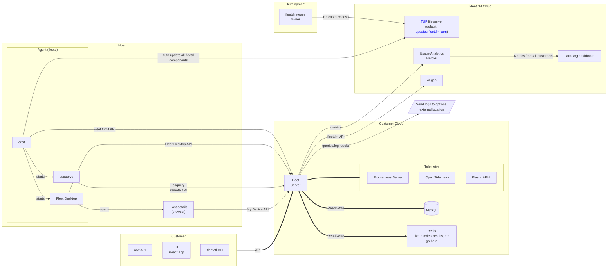
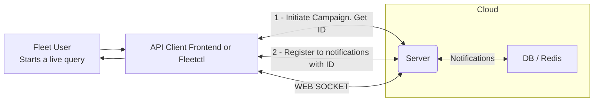
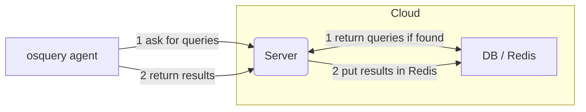
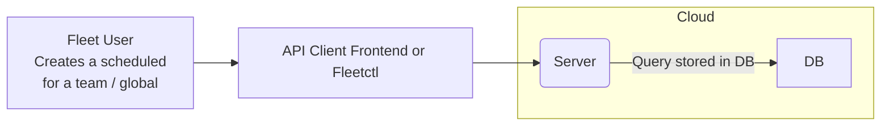
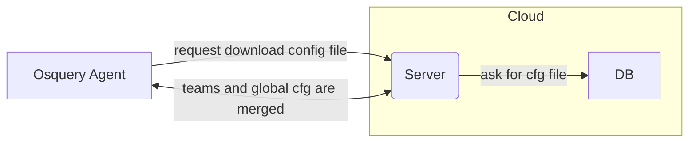
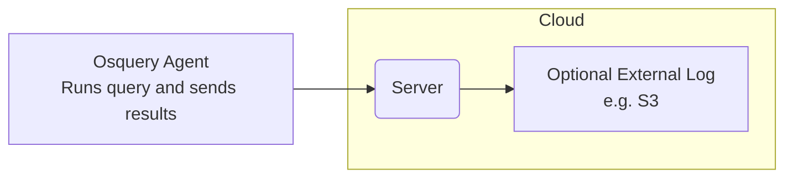
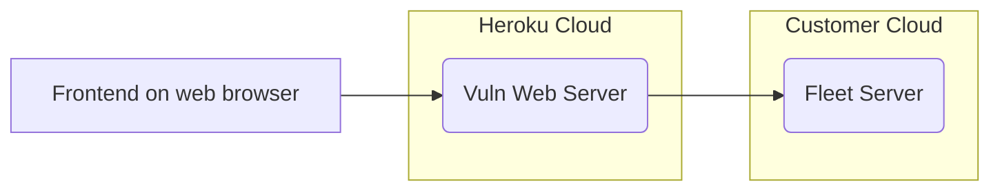

# High level architecture

- [Overview](#overview)
- [Main system components](#main-system-components)

## Overview

Fleet's architecture follows a client-server model designed for scalability, security, and flexibility. The system consists of several key components that work together to provide device management, orchestration, and software management capabilities.

At a high level, Fleet consists of:

1. **Fleet Server**: The central component that handles API requests, manages the database, processes queries, and coordinates communication between all parts of the system. It provides both REST and GraphQL APIs for clients to interact with.

2. **Agent (fleetd)**: A lightweight agent installed on managed devices that includes:
   - **orbit**: The core agent component that manages communication with the Fleet server
   - **osqueryd**: The osquery daemon that executes queries and returns results
   - **Fleet Desktop**: An optional component that provides a local UI for end users

3. **Clients**: Various ways to interact with Fleet:
   - **Web UI**: A React-based frontend for administrators
   - **fleetctl CLI**: Command-line interface for automation and scripting
   - **Raw API**: Direct API access for custom integrations

4. **Storage**:
   - **MySQL**: Primary database for storing configuration, device information, and query results
   - **Redis**: Used for caching and managing live query results

5. **External Services**:
   - **TUF Server**: Provides secure updates for the agent components
   - **Telemetry**: Optional monitoring via Prometheus, OpenTelemetry, or Elastic APM
   - **External Logging**: Optional integration with external logging systems

The diagrams below illustrate how these components interact and the data flow for different operations like live queries, scheduled queries, and vulnerability management.

## Main system components

## The path of live query

### 1 - Fleet User initiates the query

### 2 - Agent returns results

## The path of a scheduled query

### 1 - Fleet User initiates the query

### 2 - Agent gets config file (with the scheduled query)

### 3 - Agent returns results to be (optionally) logged

## Agent  config options
1 - Config TLS refresh 
(Typical period 10 secs) OSQuery pulls down a config file that includes instructions for Scheduled Queries. 
If both GLOBAL and TEAM is configured, there will be a config merge done on the Server side. 

2 - Logger TLS
(Typical period10 secs) Frequency of sending the results. (different than the frequency of running the queries)
To be improved: Currently the config file gets downloaded every time even if no change was done.

3 - Distributed (Typical interval 10 sec)
(Typical period10 secs) OSQuery asks for any Live query to run.

## Vulnerability dashboard
Typically hosted on our Heroku servers.
Could be hosted on customer servers.
Uses the Fleet server Token to access specific APIs that give information about vulnerability
status.

### Vuln dashboard hosted by FleetDM

<meta name="pageOrderInSection" value="1201">