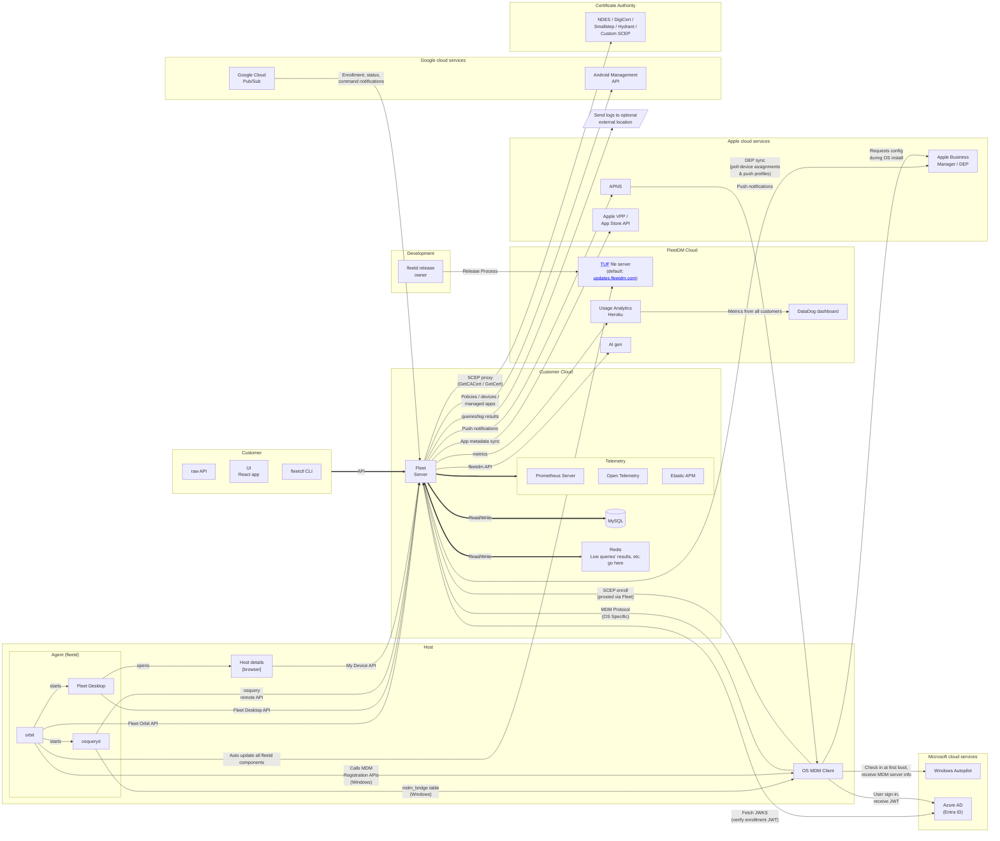
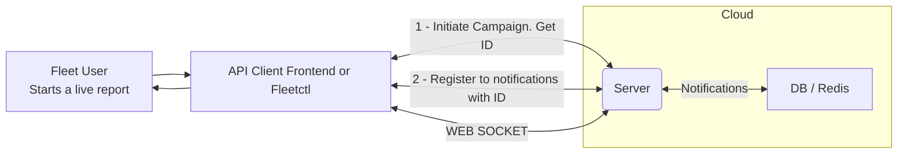
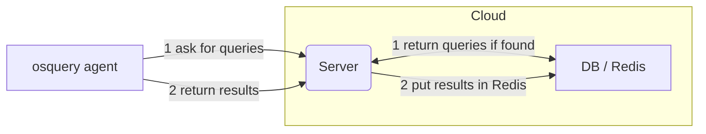
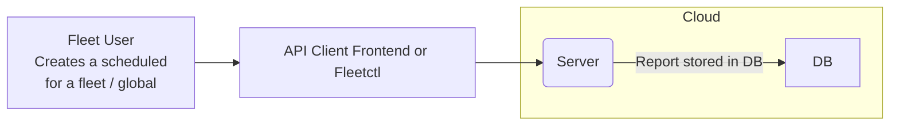
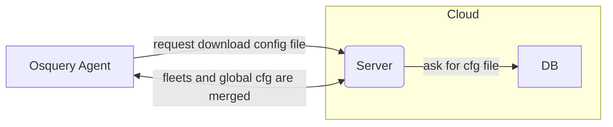
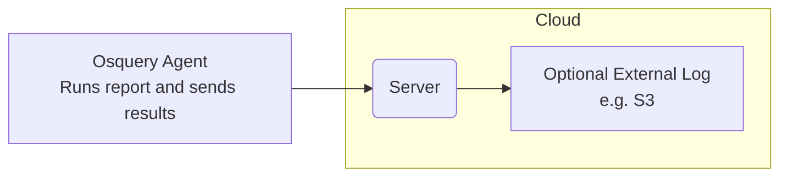
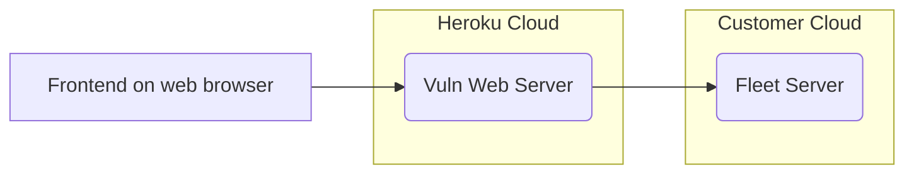

# High level architecture

- [Overview](#overview)
- [Main system components](#main-system-components)

## Overview

Fleet's architecture follows a client-server model designed for scalability, security, and flexibility. The system consists of several key components that work together to provide device management, orchestration, and software management capabilities.

At a high level, Fleet consists of:

1. **Fleet Server**: The central component that handles API requests, manages the database, processes queries, and coordinates communication between all parts of the system. It provides both REST and GraphQL APIs for clients to interact with.

2. **Agent (fleetd)**: A lightweight agent installed on managed devices that includes:
   - **orbit**: The core agent component that manages communication with the Fleet server
   - **osqueryd**: The osquery daemon that executes queries and returns results
   - **Fleet Desktop**: An optional component that provides a local UI for end users

3. **Clients**: Various ways to interact with Fleet:
   - **Web UI**: A React-based frontend for administrators
   - **fleetctl CLI**: Command-line interface for automation and scripting
   - **Raw API**: Direct API access for custom integrations

4. **Storage**:
   - **MySQL**: Primary database for storing configuration, device information, and report results
   - **Redis**: Used for caching and managing live report results
   - **S3/object storage**: Used for storing software installers and file carve results

5. **External Services**:
   - **TUF Server**: Provides secure updates for the agent components
   - **Telemetry**: Optional monitoring via Prometheus, OpenTelemetry, or Elastic APM
   - **External Logging**: Optional integration with external logging systems
   - **MDM Clients**: Consume APIs exposed by Fleet server to configure and control MDM (Mobile Device Management)-enrolled host devices. Generally provided by vendors like Apple, Microsoft, and Google as a component of the Operating System
   - **Apple Business (AB) / DEP**: Apple cloud service Fleet syncs with to retrieve device assignments and deliver automatic enrollment profiles before first boot (i.e. before Fleet can directly interact with the device)
   - **Windows Autopilot**: Microsoft cloud service Windows devices check in with at first boot to retrieve their MDM server info (Fleet's URL). Fleet does not communicate with Autopilot directly — the device is redirected to Fleet by Autopilot
   - **Google Android Management API**: Google cloud service Fleet uses to manage Android Enterprise devices, policies, and managed apps. Device-originated notifications (enrollment, status, commands) are delivered back to Fleet via Google Cloud Pub/Sub
   - **APNS (Apple Push Notification Service)**: Used by Fleet to wake Apple MDM clients so they check in for pending commands
   - **Certificate Authority / SCEP proxy**: Fleet acts as a SCEP proxy to external CAs — NDES, DigiCert, Smallstep, Hydrant, or a custom SCEP server — so that MDM-enrolled hosts can obtain identity/Wi-Fi/VPN certificates
   - **Azure AD (Entra ID)**: Issues JWTs to Windows devices during Autopilot sign-in; the device then presents that JWT as part of its enrollment request to Fleet. Fleet fetches Entra's JWKS to verify the token signature — it does not otherwise communicate with Entra
   - **Apple VPP (Volume Purchase Program)**: App Store API Fleet syncs with to discover and manage licensed apps for MDM-enrolled Apple devices

The diagrams below illustrate how these components interact and the data flow for different operations like live queries, scheduled queries, MDM and vulnerability management.

## Main system components

```mermaid
graph LR;
    
    subgraph Development
        fleet_release_owner[fleetd release<br>owner];
    end

    subgraph Host
        subgraph "Agent (fleetd)"
            orbit[orbit];
            osqueryd[osqueryd];
            desktop[Fleet Desktop];
        end
        desktop_browser["Host details<br>[browser]"];
        mdm_client["OS MDM Client"]
    end

    subgraph Customer Cloud
        fleet_server[Fleet<br>Server];
        db[(MySQL)];
        redis[Redis<br>Live queries' results, etc. <br>go here];
        subgraph Telemetry
            prometheus[Prometheus Server];
            opentel[Open Telemetry]
            apm[Elastic APM]
        end
    end

    subgraph FleetDM Cloud
        tuf["<a href=https://theupdateframework.io/>TUF</a> file server<br>(default: <a href=https://updates.fleetdm.com>updates.fleetdm.com</a>)"];
        datadog[DataDog dashboard]
        heroku[Usage Analytics<br>Heroku]
        fleetdm[AI gen]
    end

    log[/Send logs to optional<br> external location/]

    subgraph Customer
        api[raw API]
        frontend["UI<br>React app"]
        fleetctl[fleetctl CLI]
    end

    subgraph "Apple cloud services"
        abm["Apple Business<br>Manager / DEP"]
        APNS["APNS"]
        vpp["Apple VPP /<br>App Store API"]
    end

    subgraph "Microsoft cloud services"
        autopilot["Windows Autopilot"]
        azure_ad["Azure AD<br>(Entra ID)"]
    end

    subgraph "Google cloud services"
        android_mgmt["Android Management<br>API"]
        google_pubsub["Google Cloud<br>Pub/Sub"]
    end

    subgraph "Certificate Authority"
        scep_ca["NDES / DigiCert /<br>Smallstep / Hydrant /<br>Custom SCEP"]
    end


    fleet_release_owner -- "Release Process" --> tuf;

    orbit -- "Fleet Orbit API" --> fleet_server;
    orbit -- "Auto update all fleetd components" --> tuf;
    desktop -- "Fleet Desktop API" --> fleet_server;
    osqueryd -- "osquery<br>remote API" --> fleet_server;
    orbit -- "starts" --> desktop
    orbit -- "starts" --> osqueryd
    desktop -- "opens" -->desktop_browser
    desktop_browser -- "My Device API" --> fleet_server;
    mdm_client -- "MDM Protocol<br>(OS Specific)" --> fleet_server;
    osqueryd -- "mdm_bridge table<br>(Windows)" --> mdm_client
    orbit -- "Calls MDM<br>Registration APIs<br>(Windows)"-->mdm_client

    heroku -- "Metrics from all customers" --> datadog;

    fleet_server == "Read/Write" ==> db;
    fleet_server == "Read/Write" ==> redis;

    fleet_server ==> Telemetry;
    fleet_server -- "metrics" --> heroku;
    fleet_server -- "fleetdm API" --> fleetdm
    fleet_server -- "queries/log results" --> log;

    fleet_server -- "DEP sync<br>(poll device assignments<br>&amp; push profiles)" --> abm
    fleet_server -- "Push notifications" --> APNS
    fleet_server -- "App metadata sync" --> vpp
    fleet_server -- "Policies / devices /<br>managed apps" --> android_mgmt
    google_pubsub -- "Enrollment, status,<br>command notifications" --> fleet_server
    fleet_server -- "SCEP proxy<br>(GetCACert / GetCert)" --> scep_ca
    fleet_server -- "Fetch JWKS<br>(verify enrollment JWT)" --> azure_ad

    mdm_client -- "Check in at first boot,<br>receive MDM server info" --> autopilot
    mdm_client -- "User sign-in,<br>receive JWT" --> azure_ad
    mdm_client -- "Requests config<br>during OS install" --> abm
    APNS -- "Push notifications" --> mdm_client
    mdm_client -- "SCEP enroll<br>(proxied via Fleet)" --> fleet_server

    Customer == "API" ==> fleet_server;

```

## The path of live report

### 1 - Fleet User initiates the report

```mermaid
graph LR;
    it_person[Fleet User<br>Starts a live report];
    api[API Client Frontend or Fleetctl];

    subgraph Cloud
        server(Server);
        dbredis[DB / Redis];
    end

    it_person --> api;
    api --> it_person;

    api <-- "1 - Initiate Campaign. Get ID" --> server;
    api <-- "2 - Register to notifications with ID" --> server;
    api <-- "WEB SOCKET" --> server;
    server <-- Notifications --> dbredis;

```

### 2 - Agent returns results

```mermaid
graph LR;
    osquery[osquery agent];

    subgraph Cloud
        server(Server);
        dbredis[DB / Redis];
    end

    osquery -- 1 ask for queries --> server;
    osquery -- 2 return results --> server;

    server <-- 1 return queries if found --> dbredis;
    server -- 2 put results in Redis --> dbredis;

```

## The path of a scheduled report

### 1 - Fleet User initiates the report

```mermaid
graph LR;
    it_person[Fleet User<br>Creates a scheduled<br>for a fleet / global];
    api[API Client Frontend or Fleetctl];

    subgraph Cloud
        server(Server);
        db[DB];
    end

    it_person --> api;
    api --> server;
    server -- Report stored in DB--> db;
```
### 2 - Agent gets config file (with the scheduled report)

```mermaid
graph LR;
    agent[Osquery Agent];

    subgraph Cloud
        server(Server);
        db[DB];
    end

    agent -- request download config file --> server;
    agent <-- fleets and global cfg are merged --> server;
    server -- ask for cfg file--> db;
```

### 3 - Agent returns results to be (optionally) logged

```mermaid
graph LR;
    agent[Osquery Agent<br>Runs report and sends results];

    subgraph Cloud
        server(Server);
        log[Optional External Log<br>e.g. S3];
    end

    agent --> server;
    server --> log;
```

## Agent  config options
1 - Config TLS refresh 
(Typical period 10 secs) OSQuery pulls down a config file that includes instructions for Scheduled Queries. 
If agent options for both global and a fleet is configured, there will be a config merge done on the Server side. 

2 - Logger TLS
(Typical period10 secs) Frequency of sending the results. (different than the frequency of running the queries)
To be improved: Currently the config file gets downloaded every time even if no change was done.

3 - Distributed (Typical interval 10 sec)
(Typical period10 secs) OSQuery asks for any live report to run.

## Vulnerability dashboard
Typically hosted on our Heroku servers.
Could be hosted on customer servers.
Uses the Fleet server Token to access specific APIs that give information about vulnerability
status.

### Vuln dashboard hosted by FleetDM

```mermaid
graph LR;
    frontend[Frontend on web browser];

    subgraph Customer Cloud
        fleetServer(Fleet Server);
    end

    subgraph Heroku Cloud
        vulnServer(Vuln Web Server);
    end

    frontend --> vulnServer;
    vulnServer --> fleetServer;
```

<meta name="pageOrderInSection" value="1201">